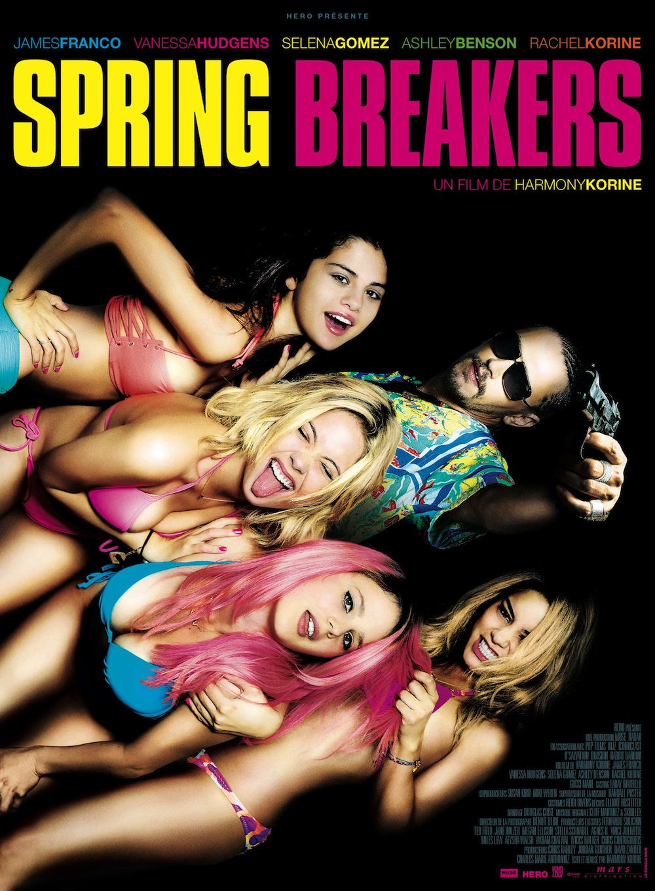
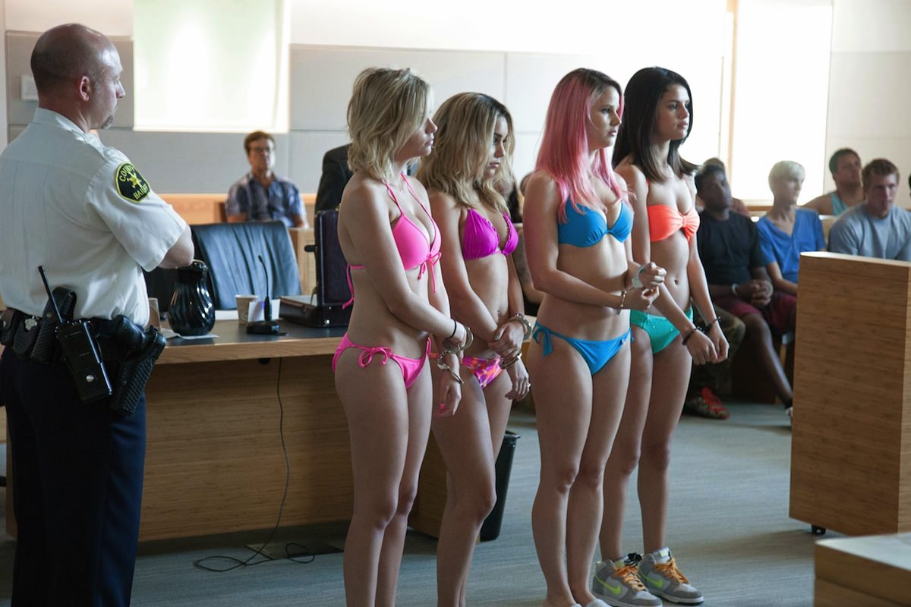

+++
type = "post"
titre = "<em>Spring Breakers</em>, Harmony Korine"
title = "Spring Breakers, Harmony Korine"
url = "/spring-breakers-korine"
date = "2013-03-11T09:23:10"
Lastmod = "2013-07-12T17:17:57"
cover = "spring-breakers-james-franco-harmony-korine.jpg"
categorie = [ "À voir" ]
tag = [ "Adolescence", "Drame", "Drogue", "Mafia", "Sexe", "Teen Movie", "Violence", "Vite oublié" ]
createur = [ "Harmony Korine" ]
acteur = [ "Ashley Benson", "James Franco", "Rachel Korine", "Selena Gomez", "Vanessa Hudgens" ]
annee = [ "2013" ]
weight = 2013
pays = [ "États-Unis" ]

+++

Le « <a href="http://en.wikipedia.org/wiki/Spring_break"><em>Spring break</em></a> », c&rsquo;est cette semaine de congés accordée aux étudiants américains au printemps et qui donne lieu à tous les excès imaginables. Une semaine de beuverie où l&rsquo;alcool coule à flots, où la drogue circule librement et où les corps se mêlent et se rencontrent. Cette semaine de tous les possibles qui fait la frayeur des parents offre au dernier long-métrage de Harmony Korine son cadre général. Comme son titre l&rsquo;indique bien, <em>Spring Breakers</em> suit quatre étudiants, des étudiantes en l&rsquo;occurrence, qui vont faire la fête à Miami. Un film sur l&rsquo;excès et un film excessif, plein de musique techno et d&rsquo;images tournées comme un clip MTV. Harmony Korine dénonce les excès de cette jeunesse qui le fascine aussi, pour un résultat assez lourd, vulgaire et plutôt pénible…

Sans plus de cérémonie, Harmony Korine ouvre son film en nous balançant en pleine fête. <em>Spring Breakers</em> ouvre sur des paires de seins et des fesses, toujours féminines. Des mecs totalement excités font couler de la bière sur ces corps féminins filmés au ralenti, avec de la techno bien lourde de circonstances pour de telles fêtes. Le spectateur est prévenu : bienvenu au <em>spring break</em>. Loin de ces fêtes folles, Candy, Faith, Brit et Cotty s&rsquo;ennuient sur leur campus universitaire déserté. Les quatre filles, meilleures amies depuis toujours, veulent elles aussi profiter, mais elles n&rsquo;ont pas assez d&rsquo;argent pour rejoindre la fête. Hors de question de demander aux parents bien évidemment, elles n&rsquo;auraient jamais leur autorisation, encore moins leur argent. Bien décidées à quitter ce lieu qui leur semble déprimant, trois d&rsquo;entre elles vont braquer le café du coin. Armées d&rsquo;un marteau et d&rsquo;un pistolet à eau, elles font leur petit effet et empochent largement de quoi partir. Ni une, ni deux, les quatre adolescentes partent pour la fête et <em>Spring Breakers</em> nous montre ensuite pendant quelques minutes ce que peut être un tel évènement. Des milliers de jeunes excités par l&rsquo;alcool et la drogue qui font la fête sur la plage et dans des hôtels, détruisant absolument tout sur leur passage. La musique extrêmement forte est omniprésente dans les fêtes, comme chez Harmony Korine qui se contente par moment de baisser un peu le volume sonore. On ingurgite des litres de bière avec des entonnoirs, on en fait couler encore plus sur deux jeunes femmes en train de s&rsquo;embrasser goulument devant une rangée de mâles en chaleur, on sniffe la drogue à même la poitrine d&rsquo;une autre participante… Dans cette société américaine si normée par ailleurs, cette semaine est vraiment celle de la liberté absolue et <em>Spring Breakers</em> rend bien cet esprit, même si le long-métrage s&rsquo;avère vite pesant. Il faut toutefois reconnaître le talent des quatre jeunes actrices, surtout quand on sait que Selena Gomez et Vanessa Hudgens viennent de chez Disney : elles sont ici troublantes de réalité. Les centaines de seins et fesses motiveront certainement les jeunes hétéros<a href="#footnote_0_8807" id="identifier_0_8807" class="footnote-link footnote-identifier-link" title="Bizarrement, si le sexe est constamment &eacute;voqu&eacute;, il n&rsquo;est jamais pr&eacute;sent explicitement &agrave; l&rsquo;&eacute;cran. Le r&eacute;sultat est sans doute pire encore, un peu comme dans la saga Twilight qui est pass&eacute;e ma&icirc;tre dans l&rsquo;art de sugg&eacute;rer le sexe sans le montrer&hellip;">1</a>, mais l&rsquo;ensemble reste assez vulgaire et surtout très répétitif. 

Heureusement, <em>Spring Breakers</em> est en fait composé de deux parties bien distinctes. Après cette présentation de la fête totalement folle, Harmony Korine impose à ses quatre personnages principaux un dur retour à la réalité. La police intervient sur les lieux de la fête qui rassemble trop visiblement de la drogue — c&rsquo;est interdit — et embarque tout le monde au poste. Les quatre héroïnes se retrouvent en bikini devant le juge et elles n&rsquo;ont pas l&rsquo;argent nécessaire pour payer leur caution. Elles sont toutefois sauvées par Alien, un rappeur local qui est aussi un gangster fantasque. Avec ses tresses et ses dents en métal, il est assez impressionnant et Faith, l&rsquo;une des quatre, se méfie de ce geste qui semble trop bon pour avoir été effectué sans arrière-pensée. De fait, Alien espère bien enrôler ces quatre femmes pour l&rsquo;aider dans son business illégal et contre toute attente, toutes sont plus que partantes, à l&rsquo;exception de Faith qui préfère repartir et qui est ainsi complètement effacée par Harmony Korine. <em>Spring Breakers</em> quitte alors l&rsquo;ambiance des fêtes estudiantines au profit d&rsquo;une autre fête, beaucoup plus dangereuse, celle de la petite mafia de Miami. Alien est dans le trafic de drogue et il s&rsquo;oppose à son ancien mentor qui fait office de parrain local. Le conflit est inévitable et Alien le mènera avec ses filles, devenues ses protégées, en quelque sorte. Cette seconde partie surprend, tant elle est différente de la première : Harmony Korine a choisi le mode de la rupture et joue sur d&rsquo;autres clichés. Après les excès du <em>spring break</em>, place à ceux des mafieux, bling-bling avec leurs grandes maisons pleines d&rsquo;argent et d&rsquo;armes en tout genre. Difficile à dire vrai de comprendre le lien entre les deux et <em>Spring Breakers</em> n&rsquo;en est pas moins constamment sur le mode de l&rsquo;exagération. Le film est ponctué de coups de feu comme autant de menace planante, une bonne idée, mais l&rsquo;ensemble peine à convaincre malgré tout. James Franco est certes étonnant dans son rôle de petit mafieux qui ne prend son pied qu&rsquo;en étant dominé par les filles, mais il ne suffit pas à renverser la tendance. 

<em>Spring Breakers</em> ne dénonce pas les excès des étudiants américains pendant les <em>spring break</em>, ce n&rsquo;est pas ce qui intéresse Harmony Korine contrairement à ce que l&rsquo;on aurait pu croire. Certains voient de la poésie dans cette plongée au cœur du sexe, de l&rsquo;alcool et de la drogue, mais on peut aussi n&rsquo;y voir qu&rsquo;un clip avec tous ses passages obligés et ses caricatures destinées d&rsquo;abord à un public masculin. Et un clip qui dure 1h30, c&rsquo;est long et ce n&rsquo;est pas très intéressant… 

<h3>Vous voulez m&rsquo;aider ?<a href="#footnote_1_8807" id="identifier_1_8807" class="footnote-link footnote-identifier-link" title="&Agrave; propos de la publicit&eacute;&hellip;">2</a></h3>
<ul>
<li><a href="http://www.amazon.fr/gp/product/B002L6YQOC/ref=as_li_ss_tl?ie=UTF8&#038;tag=leblogdenic07-21&#038;linkCode=as2&#038;camp=1642&#038;creative=19458&#038;creativeASIN=B002L6YQOC">Acheter le film en Blu-Ray sur Amazon</a></li>
<li><a href="http://www.amazon.fr/gp/product/B002KDQ1D0/ref=as_li_ss_tl?ie=UTF8&#038;tag=leblogdenic07-21&#038;linkCode=as2&#038;camp=1642&#038;creative=19458&#038;creativeASIN=B002KDQ1D0">Acheter le film en DVD sur Amazon</a></li>
<li><a href="https://itunes.apple.com/fr/album/spring-breakers-music-from/id609821695">Acheter la bande originale du film sur l&rsquo;iTunes Store</a></li>
</ul>

<ol class="footnotes"><li id="footnote_0_8807" class="footnote">Bizarrement, si le sexe est constamment évoqué, il n&rsquo;est jamais présent explicitement à l&rsquo;écran. Le résultat est sans doute pire encore, un peu comme dans la saga <em>Twilight</em> qui est passée maître dans l&rsquo;art de suggérer le sexe sans le montrer… [<a href="#identifier_0_8807" class="footnote-link footnote-back-link">&#8617;</a>]</li><li id="footnote_1_8807" class="footnote"><a href="http://voiretmanger.fr/soutien/">À propos de la publicité…</a> [<a href="#identifier_1_8807" class="footnote-link footnote-back-link">&#8617;</a>]</li></ol>
