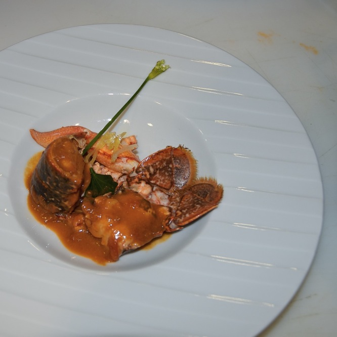
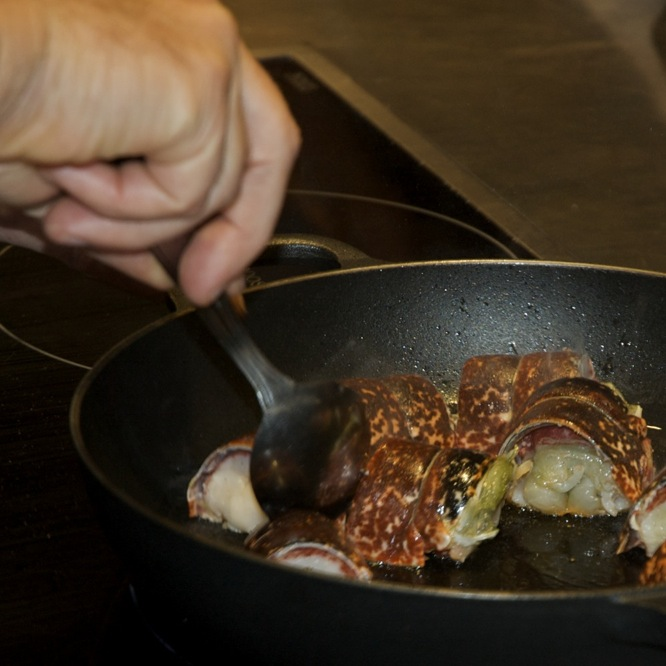
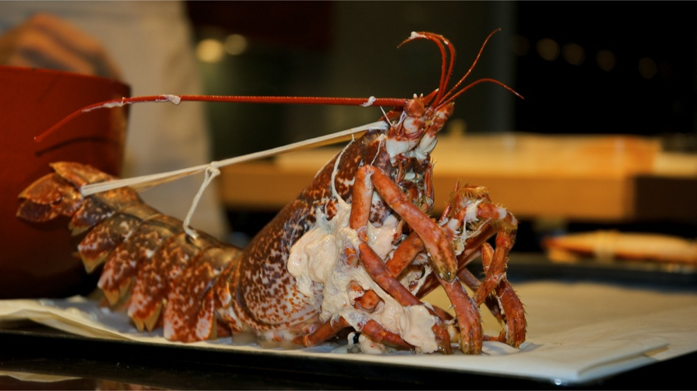
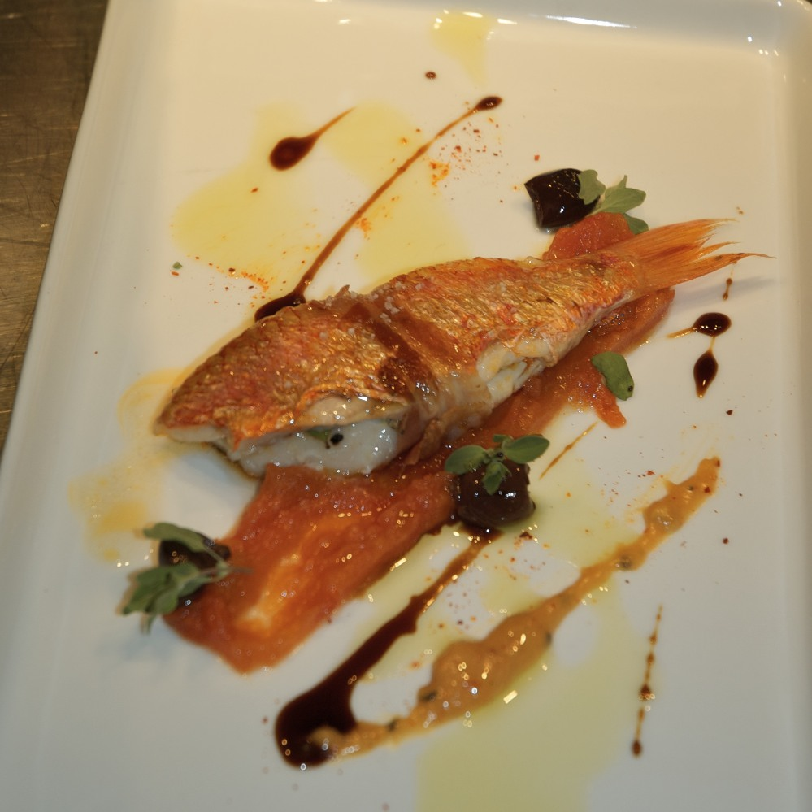
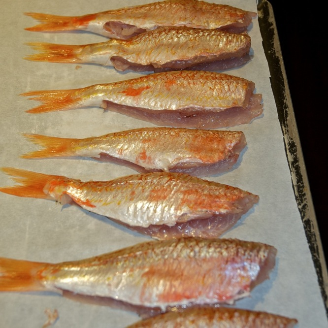

+++
titre = "En stage chez Ducasse : partie 2"
title = "En stage chez Ducasse : partie 2"
url = "/stage-ducasse-2"
date = "2008-10-28T20:23:09"
Lastmod = "2013-09-08T00:23:39"
cover = "stage-ducasse-homard.jpg"
tag = [ "Entree", "Plat", "Poisson", "Stage Ducasse" ]

+++

<h2 id="870_tout-ce-que-vous-ave_1"><strong>Tout ce que vous avez jamais voulu savoir sur le homard sans jamais oser le demander&#8230;</strong></h2>

Le homard est de deux types, breton ou américain. Notre chef, sur ce sujet, fut très clair. L&rsquo;américain est tout juste bon à faire un fumé de crustacé, et encore&#8230; Sans faire de l&rsquo;anti-américanisme primaire, il semble que, effectivement, il y ait un monde<a href="#footnote_0_870" id="identifier_0_870" class="footnote-link footnote-identifier-link" title="Si j&rsquo;avais l&rsquo;esprit fac&eacute;tieux, je dirais un oc&eacute;an&hellip;">1</a> entre les deux. Il y a aussi une belle différence en terme de budget : si un homard américain peut se négocier autour de 20/30 euros le kilo, son cousin breton se négocie plutôt autour de 50 à 60 euros du kilo. Chez Ducasse, on ne tergiverse pas et on ne s&rsquo;occupe même pas de la version américaine, le prix n&rsquo;étant qu&rsquo;un argument tellement secondaire par rapport à la qualité. Il est assez logique cependant qu&rsquo;il y ait discussion si vous devez acheter un homard&#8230;

Autre question importante au sujet du homard : mâle ou femelle ? La réponse ne dépend pas des goûts de chacun, mais du corail. En effet, les mâles sont plus petits et n&rsquo;ont pas de corail. Mais, me direz-vous, qu&rsquo;est-ce qu&rsquo;on en a à f&#8230; du corail ? Eh bien sachez que c&rsquo;est un élément très important qui entre dans la composition de recettes. Dans notre cas, pour réaliser un &laquo;&nbsp;homard breton, sucs tomate, ail et gingembre&nbsp;&raquo; (sic) il nous a fallu mettre de côté le corail ainsi que toutes les parties molles (re-sic) présentes dans la tête de ces charmantes bestioles pour ensuite en extraire non pas la substantifique moelle mais le liquide qui en est sorti après écrasement sur un chinois. Tout cela se présente alors sous une forme verdâtre et gluante vraiment peu ragoûtante si vous voulez tout savoir (je suis bien au courant, j&rsquo;ai eu à m&rsquo;en occuper. Ce mélange a ensuite été mêlé à du beurre pour faire une sorte de beurre de corail qui ressemblait fort à du beurre d&rsquo;escargot. Ce beurre a enfin été ajouté à la sauce qui accompagnait le homard, juste avant de servir. Voilà en tout cas pourquoi la recette est censée n&rsquo;utiliser que des homards femelle. Comme nous l&rsquo;a indiqué le chef néanmoins, c&rsquo;est rare de n&rsquo;avoir que ça, alors on fait avec ce qu&rsquo;il y a.

Comment cuire un homard ? La question semble peut-être idiote, mais a son importance. Les beaux jours revenus, vous pourrez très bien envisager une cuisson au barbecue. Il vous faudra alors découper en deux ces charmantes bêtes dans le sens de la longueur. Avis aux âmes sensibles : un homard mis au congélateur est rapidement assommé, ce qui évite de le découper vivant ou en tout cas conscient. Sans barbecue, le homard se cuit en général à l&rsquo;eau. Attention, il ne faut surtout pas faire bouillir le homard, mais juste frémir ! De l&rsquo;eau simplement salée peut convenir, mais pourquoi ne pas envisager une &laquo;&nbsp;nage&nbsp;&raquo; comme on dit, c&rsquo;est-à-dire de l&rsquo;eau avec des épices, du sel et autres substances<a href="#footnote_1_870" id="identifier_1_870" class="footnote-link footnote-identifier-link" title="Dans la recette originale, la nage &eacute;tait compos&eacute;e de 4 litres d&rsquo;eau, deux poign&eacute;es de gros sel, cinq branches de fenouil sec, et le zeste d&rsquo;un et le jus de deux citrons par exemple.">2</a>.

Le must est de les faire cuire dans une nage comme celle-ci puis, à la dernière minute, faire revenir la chair dans une casserole simplement huilée (à l&rsquo;huile d&rsquo;olive bien sûr&#8230; <a href="http://voiretmanger.fr/2008/10/26/stage-ducasse-1/" title="En stage chez Ducasse : partie 1">voir la partie 1</a>). Un conseil : n&rsquo;enlevez pas entièrement la carapace de la queue, n&rsquo;enlevez que la partie inférieure. Pour ce faire, découpez avec des ciseaux à crustacés (les mêmes qu&rsquo;à volaille, sauf que ce sont des ciseaux à crustacés&#8230; je ne fais que répéter hein !) les &laquo;&nbsp;triangles&nbsp;&raquo; qui dépassent, puis la partie transparente qui recouvre la chair. Avec la partie supérieure encore en place, non seulement ce sera plus joli dans l&rsquo;assiette (cf ci-dessus), mais surtout ça se tiendra mieux.

Le problème du homard, c&rsquo;est que sa queue se plie. Au fond de l&rsquo;océan, c&rsquo;est sans doute très utile, mais en cuisine, c&rsquo;est vraiment ch&#8230; parce que le homard cuit la queue pliée et donc il cuit mal. Pour éviter ce désagrément, il faut donc le faire tenir droit pendant toute la cuisson. Plusieurs écoles pour arriver à ce résultat, mais voici la méthode Ducasse ©. Utilisez un bon bout de ficelle et attachez les queues de homard en utilisant le petit rochet qu&rsquo;un homard possède au-dessus des yeux et le fait que la queue se divise en trois parties. N&rsquo;hésitez pas à serrer, il faut que ça tienne. Le homard va râler un peu mais ne vous laissez pas impressionner<a href="#footnote_2_870" id="identifier_2_870" class="footnote-link footnote-identifier-link" title="Note pour les inconscients : &eacute;videmment, cela ne vaut que si ses deux pinces sont solidement maintenues par un &eacute;lastique dont vous v&eacute;rifierez pr&eacute;alablement la solidit&eacute;. Car quand homard pas content, homard toujours faire &ccedil;a&hellip; clac !">3</a>. Il faut que vous puissiez tenir le homard en l&rsquo;air par la poignée ainsi formée par la ficelle donc il faut serrer. Une image valant toujours mieux qu&rsquo;un beau discours, voici un exemple une fois le homard bien cuit (il râle moins à ce stade). Il est pas mignon ce homard ?

Pour en finir avec nos amis les homard et comme dit le diction populaire (ou pas) : tout est bon dans le homard. En d&rsquo;autres termes, ne jetez rien, surtout pas ! La tête se récupère à condition d&rsquo;en ôter les branchies et surtout une poche de sable qui se trouve dans la partie supérieure de la tête et qui ferait crisser les sensibles dents de vos clients. La carcasse entière se récupère pour faire la sauce après l&rsquo;avoir découpée et concassée. Évidemment, les pinces sont aussi réutilisées, après avoir mis de côté les chairs. Bref, vous payez tout le homard, donc à ce prix là, autant ne rien gâcher !

<h2 id="870_preparer-les-poisson_1"><strong>Préparer les poissons comme un chef</strong></h2>

Maintenant que vous savez tout du homard, passons au poisson. Nous n&rsquo;avons étudié que la préparation du rouget, poisson qui avait l&rsquo;avantage d&rsquo;être petit et l&rsquo;inconvénient double d&rsquo;être fragile et plein d&rsquo;arêtes ! Or un poisson ne se prépare pas n&rsquo;importe comment, surtout pas chez Ducasse. Vous imaginez retrouver une arrête dans votre poisson payé une fortune vous ?

Mais un poisson, c&rsquo;est d&rsquo;abord un produit très fragile, plus encore que la viande. Un poisson doit donc se consommer le plus frais possible. C&rsquo;est plus facile à dire qu&rsquo;à faire à moins d&rsquo;habiter au-dessus d&rsquo;une criée. Un restaurateur comme Ducasse a ses propres réseaux d&rsquo;approvisionnement qui lui permettent d&rsquo;avoir du poisson très frais. Votre supermarché local ne peut pas en dire autant. Et malheureusement pour le poisson, il ne tient qu&rsquo;au consommateur de faire attention sur la fraîcheur du produit qu&rsquo;on veut lui vendre. Je ne vais pas, ici, détailler la méthode pour savoir si un poisson est frais ou pas<a href="#footnote_3_870" id="identifier_3_870" class="footnote-link footnote-identifier-link" title="Je recommande &agrave; ce propos l&rsquo;excellent film We feed the world o&ugrave;, entre autres choses, on a une brillante d&eacute;monstration de ce qu&rsquo;est un poisson frais o&ugrave; vous apprendrez qu&rsquo;en fait, &agrave; moins de le p&ecirc;cher vous m&ecirc;me ou de conna&icirc;tre le p&eacute;cheur, vous n&rsquo;aurez jamais de poisson vraiment frais&hellip;">4</a>, mais s&rsquo;il a des yeux aussi mats que nos écrans d&rsquo;ordinateur sont brillants, voire, pire, s&rsquo;il n&rsquo;a plus ses yeux, s&rsquo;il tombe comme une serpillière quand vous le prenez par un bout, et surtout s&rsquo;il sent fort, méfiez-vous. Et dans le doute, mieux vaut s&rsquo;abstenir.

Vous avez votre poisson, vous voulez le préparer comme un chef. En voilà une bonne idée ! Mais autant prévenir d&rsquo;emblée les déceptions : quand un chef vous montre la méthode, tout paraît aussi simple que bonjour, aussi naturel qu&rsquo;une gaffe pour une porte<a href="#footnote_4_870" id="identifier_4_870" class="footnote-link footnote-identifier-link" title="N&rsquo;importe quoi&hellip; &Ccedil;a doit &ecirc;tre les stats&hellip; c&rsquo;est pas bon pour la sant&eacute;, les stats&hellip;">5</a>. Mais quand vous vous y mettez, brusquement, tout ce qui était clair devient totalement obscur et vous ne vous souvenez plus de rien, et surtout pas de ce qu&rsquo;il ne fallait surtout pas faire ! D&rsquo;ailleurs, en règle générale, vous commencez immédiatement par faire ce que vous ne deviez surtout pas faire. Bref, voici le principe, si je me souviens bien. Premièrement, il vous faudra passer par la désagréable mais nécessaire étape de l&rsquo;écaillage : avec un coup, et en utilisant la partie non-tranchante, grattez le poisson de la queue vers la tête jusqu&rsquo;à ce qu&rsquo;il n&rsquo;y ait plus une écaille. Puis il faut enlever la tête en la taillant juste derrière les branchies et de biais, dans le sens des branchies. Vous pouvez vider tout ce qui sort et a une mauvaise tête (ouh ouh) L&rsquo;arrête centrale est coupée au ciseau pour ne pas faire de la bouillie. Ensuite, commencez à doucement dégager les chairs de l&rsquo;arête centrale juste au-dessus de celle-ci, sur la partie dorsale du poisson, et des deux côtés de l&rsquo;arête, avec un couteau qui coupe très bien (c&rsquo;est le moment de sortir un aiguiseur). Allez-y doucement, ça se casse facilement. Puis utilisez le même couteau pour &laquo;&nbsp;traverser&nbsp;&raquo; le poisson le long de l&rsquo;arrête centrale, du dos vers le ventre. À l&rsquo;aide de ciseaux, découpez maintenant toutes les arêtes qui partent de l&rsquo;arête centrale de manière à dégager les filets de celle ci. <strong>ATTENTION</strong>, il faut absolument que les deux filets restent maintenus par la queue du poisson, donc n&rsquo;allez surtout pas au bout. Vous découpez ensuite l&rsquo;arrête de la queue de manière à ne conserver les filets. Je vous rassure tout de suite, ni le plus long ni le plus ch&#8230; n&rsquo;a encore été fait. En effet, vient ensuite la pénible étape du désarêtage des filets à la pince à épiler. Sans doute trouvai-je cela très désagréable à cause de mon inexpérience de l&rsquo;outil, mais même la gent féminine en bava ce jour-là car il y a plein d&rsquo;arêtes dans si peu de chair !

Une fois ceci fait, une fois les filets égalisés pour faire plus joli, vous obtenez de magnifiques poissons comme ceux-ci (ci-dessus). Vous n&rsquo;avez rien compris au paragraphe précédent ? C&rsquo;est normal, sans l&rsquo;image, c&rsquo;est même pas pensable de comprendre. Et même avec l&rsquo;image en tête, je suis pas sûr de réussir à nouveau&#8230;

Maintenant que vos poissons sont prêts, il faut les cuire. Si les méthodes varient, un point reste : ne jamais trop faire cuire les poissons ! Le poisson se mange toujours cru (cf la cuisine japonaise) et un poisson trop cuit perd de sa saveur et devient sec. Pour les rougets, ce poisson étant vraiment fragile, notre recette consistait à entourer les filets d&rsquo;un morceau de lard pour les tenir ensemble. Non seulement ils ne sont pas désolidarisés, mais en plus c&rsquo;était vraiment pas mauvais. Toujours parce qu&rsquo;il s&rsquo;agit d&rsquo;un poisson fragile, les rougets n&rsquo;ont été retournés qu&rsquo;une fois au cours de la cuisson. Astuce du chef pas bête : mettez au fond de la poêle de l&rsquo;huile, puis une feuille de papier sulfurisé et à nouveau de l&rsquo;huile. En opérant ainsi, l&rsquo;étape du retournement en sera grandement simplifiée&#8230;

Voilà, ce sera tout pour les poissons et crustacés ! Prochaine étape, le <a href="http://voiretmanger.fr/2008/11/01/stage-chez-ducasse-3/" title="En stage chez Ducasse : partie 3">moelleux au chocolat</a>&#8230;

<ol class="footnotes"><li id="footnote_0_870" class="footnote">Si j&rsquo;avais l&rsquo;esprit facétieux, je dirais un océan&#8230; [<a href="#identifier_0_870" class="footnote-link footnote-back-link">&#8617;</a>]</li><li id="footnote_1_870" class="footnote">Dans la recette originale, la nage était composée de 4 litres d&rsquo;eau, deux poignées de gros sel, cinq branches de fenouil sec, et le zeste d&rsquo;un et le jus de deux citrons par exemple. [<a href="#identifier_1_870" class="footnote-link footnote-back-link">&#8617;</a>]</li><li id="footnote_2_870" class="footnote">Note pour les inconscients : évidemment, cela ne vaut que si ses deux pinces sont solidement maintenues par un élastique dont vous vérifierez préalablement la solidité. Car quand homard pas content, homard toujours faire ça&#8230; clac ! [<a href="#identifier_2_870" class="footnote-link footnote-back-link">&#8617;</a>]</li><li id="footnote_3_870" class="footnote">Je recommande à ce propos l&rsquo;excellent film <em>We feed the world</em> où, entre autres choses, on a une brillante démonstration de ce qu&rsquo;est un poisson frais où vous apprendrez qu&rsquo;en fait, à moins de le pêcher vous même ou de connaître le pécheur, vous n&rsquo;aurez jamais de poisson vraiment frais&#8230; [<a href="#identifier_3_870" class="footnote-link footnote-back-link">&#8617;</a>]</li><li id="footnote_4_870" class="footnote">N&rsquo;importe quoi&#8230; Ça doit être les stats&#8230; c&rsquo;est pas bon pour la santé, les stats&#8230; [<a href="#identifier_4_870" class="footnote-link footnote-back-link">&#8617;</a>]</li></ol>
