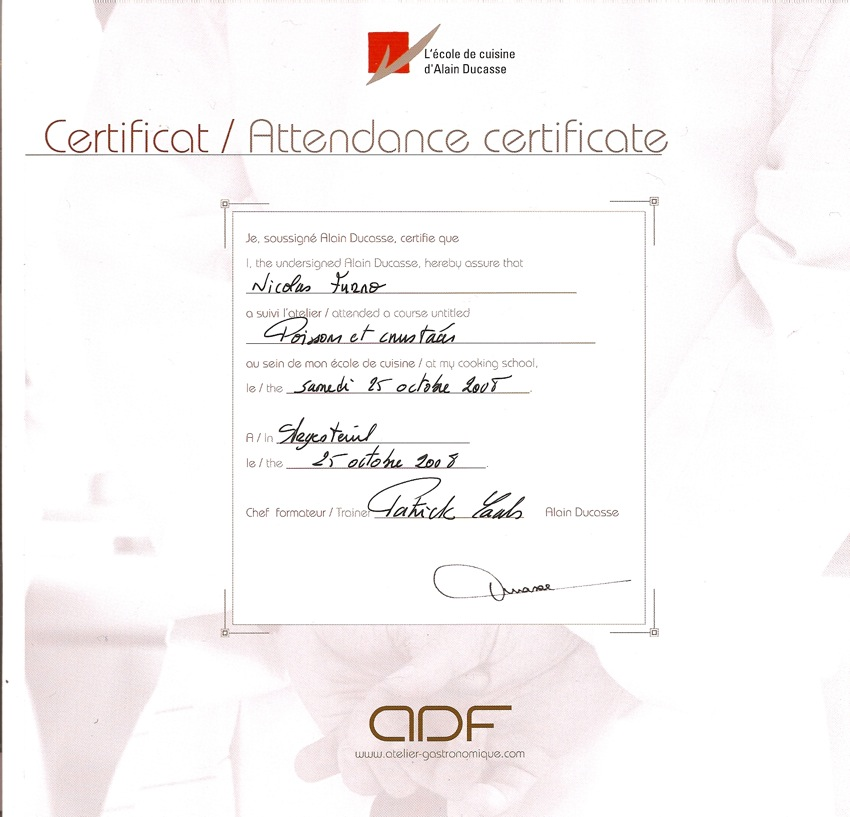

+++
type = "post"
titre = "En stage chez Ducasse : introduction"
title = "En stage chez Ducasse : introduction"
url = "/stage-ducasse-introduction"
date = "2008-10-25T20:37:34"
Lastmod = "2013-09-08T00:23:47"
cover = "stage-ducasse.jpg"
tag = [ "Stage Ducasse" ]

+++

Voici (ci-dessous) mon certificat de participation à un stage &laquo;&nbsp;chez Ducasse&nbsp;&raquo; !

Si j&rsquo;ai mis des guillemets dans la phrase précédente, c&rsquo;est que je n&rsquo;ai pas fait un stage avec Alain Ducasse, chef étoilé français, mais dans son école de cuisine, sise à Argenteuil. Alain Ducasse n&rsquo;était pas présent pour nous faire le stage bien entendu, mais notre chef, Patrick, nous a fait totalement oublié &laquo;&nbsp;le chef&nbsp;&raquo; comme on dit respectueusement chez Ducasse.

Avant d&rsquo;aller plus loin, je tiens ici à remercier à nouveau tous ceux sans qui je n&rsquo;aurais jamais fait ce stage. En effet, il m&rsquo;a été offert par l&rsquo;ensemble de mes camarades de khâgne de l&rsquo;an dernier ainsi que mes professeurs. Merci encore à tous pour votre merveilleuse idée !

À moi, maintenant, de vous rendre la pareille avec, sur ce blog, une série de billets concernant ce stage. Vous y trouverez des éléments généraux sur la grande cuisine, des conseils pratiques sur les poissons et crustacés puisque c&rsquo;était mon thème de stage, mais aussi une recette de moelleux au chocolat dont vous me direz des nouvelles ! J&rsquo;essaierai de montrer, avec cette série de billets, que si la grande cuisine est difficilement adaptable à un contexte ménager standard, elle n&rsquo;en reste pas moins un point de repère essentiel pour quiconque aime cuisiner. Ayant pris quelques photos (malheureusement assez peu par rapport à ce qu&rsquo;il y avait, mais nous avons eu les mains très occupées et les appareils photos n&rsquo;aiment pas tellement l&rsquo;environnement hostile que constitue une cuisine), j&rsquo;essaierai d&rsquo;illustrer le plus possible les différents billets. Je vais essayer aussi de glisser une recette ou deux, même si souvent, l&rsquo;exemple par le chef est indispensable&#8230;

Mais avant de commencer la série de billets, j&rsquo;aimerais poser le décor&#8230;

<h2 id="839_preambule-un-stage-c_1">Préambule : un stage chez Ducasse, pour quoi, pour qui ?</h2>

L&rsquo;école de cuisine Alain Ducasse propose, depuis quelques années déjà, des stages de cuisine d&rsquo;une journée ou d&rsquo;une demi-journée à tous ceux qui souhaitent découvrir la grande cuisine. Mais à la différence d&rsquo;autres chefs, Alain Ducasse n&rsquo;invite pas des gens dans ses cuisines : déjà parce qu&rsquo;il n&rsquo;y a pas &laquo;&nbsp;une cuisine Ducasse&nbsp;&raquo; mais des dizaines de cuisines Ducasse tant il gère un grand nombre de restaurants, à Paris mais aussi à Monaco, à Londres&#8230; Des centaines de personnes travaillent en fait sous l&rsquo;appellation Ducasse. À chaque fois, il s&rsquo;agit de grands restaurants, aux cartes pleines de prix laissant rêveur.

Son école de cuisine est basée, pour le moment à Argenteuil, mais devrait être &laquo;&nbsp;rapatriée&nbsp;&raquo; à Paris, XVIe arrondissement. Comme nous l&rsquo;a avoué notre chef cuisinier, Ducasse suit le mouvement général en cherchant à rentabiliser cette activité qui n&rsquo;est, pour l&rsquo;heure, pas rentable, la faute à des cours trop petits (7 personnes maximum) mais aussi à la localisation géographique de l&rsquo;école, et ce malgré la navette mise en place entre Argenteuil et le huitième arrondissement parisien. En attendant, l&rsquo;école est située en plein Argenteuil, perdue au milieu d&rsquo;une zone pavillonnaire…

Le cours commence à neuf heures. La navette part de Paris à 8h30 et c&rsquo;est donc un lever matinal qui attend le stagiaire. La navette, belle mercedes aux vitres teintées et sièges en cuir, m&rsquo;attend avec déjà deux passagers à l&rsquo;intérieur. Passé le bonjour initial, le silence s&rsquo;instaure, tout le monde dort un peu. Deux autres personnes nous rejoignent, et nous partons, direction la banlieue Ouest. Le voyage est rapide en ce samedi matin, et nous arrivons vers 9 heures devant l&rsquo;école qui semble endormie. À force de sonner, on vient nous ouvrir. Nous descendons des marches, et arrivons dans une vaste salle en sous-sol, avec une belle cuisine, et une table dressée de sept couverts au fond. Un petit café et une viennoiserie nous attend. Le café pour se réveiller, la viennoiserie pour tenir le coup. Car, comme on nous l&rsquo;apprend à ce moment, on ne mangera pas avant 15 heures et il faut tenir les six heures de cuisine à venir&#8230;

Il est temps ensuite d&rsquo;entrer dans la cuisine. Une belle et grande cuisine comme on rêverait d&rsquo;avoir chez soi. Elle doit faire dans les vingt mètres carrés avec huit plaques à induction au centre, un évier et deux machines à laver au fond, un long plan de travail sur un mur, avec notamment quatre fours dont un à vapeur. Tout est sponsorisé par Miele comme le signale le chef d&rsquo;emblée&#8230; Deux plans de travail mobiles complètent la scène et offrent à la fois une grande place pour travailler et la modularité nécessaire. Bref, si l&rsquo;idée est de rester sur une cuisine quasiment grand public, pas grand monde ne pourrait s&rsquo;offrir un tel équipement et une telle taille chez lui&#8230;

Le chef se présente : Patrick, grand, souriant et très accueillant, il sait nous mettre en confiance. Puis c&rsquo;est au tour des élèves. Je suis le plus jeune, mais la moyenne d&rsquo;âge est beaucoup plus basse que je ne pensais : le plus vieux doit avoir la cinquantaine, les autres ont tous entre trente et quarante ans. Un couple est présent, les autres sont venus seuls mais tout le monde est marié et a des enfants. Un prof, trois dans la finance, un étudiant&#8230; le public n&rsquo;est pas si varié que cela. Sur les six élèves, trois sont venus parce qu&rsquo;un stage leur avait été offert. Tous aiment cuisiner et collectionnent les bouquins de cuisine à défaut de pouvoir les appliquer : la finance, même en crise, ne laisse pas tellement de temps, même si l&rsquo;une d&rsquo;entre nous réussit à combiner une vie professionnelle prenante et une vie de famille tout aussi pleine avec cuisine uniquement à partir de produits frais (même les pizzas par exemple !). Globalement, on est entre-soi, façon WASP si on était aux États-Unis, mais pas entre parisiens : la moitié seulement est parisienne, et encore je ne suis qu&rsquo;un faux parisien&#8230; Étonnamment, il y n&rsquo;y a que deux femmes pour quatre hommes : mais est-ce si étonnant quand on sait que la grande cuisine est un univers très masculin, contrairement à la cuisine de tous les jours ?

Les motivations des uns des autres semblent diverses. Je crois qu&rsquo;au départ, chacun espérait finir la journée avec un tas de recettes applicables immédiatement. Le repas consommé, les choses étaient plus complexes : l&rsquo;assiette offrait des plats exquis, mais le temps nécessaire à leur réalisation, sans compter un savoir-faire et du matériel que l&rsquo;on n&rsquo;a pas à la maison, en a découragé plus d&rsquo;un. Si l&rsquo;on peut envisager reproduire les recettes de la journée pour une grande occasion (les fêtes de fin d&rsquo;année par exemple), on peut difficilement concevoir de faire ces plats pour un repas habituel, même pour un repas du dimanche !

Cette journée fut, pour ma part, passionnante. En effet, c&rsquo;est un véritable rêve d&rsquo;enfance que la grande cuisine : j&rsquo;ai toujours eu envie de voir l&rsquo;envers du décor, à savoir les cuisines des grands restaurants. Le côté fourmilière, où chacun à un rôle bien particulier et où la conjonction de tous ces rôles produit des plats excellents, m&rsquo;a ainsi fasciné très tôt je crois. Et puis j&rsquo;ai été très vite intéressé par les produits et comment on pouvait les transformer et même les sublimer. Quand on me demandait, plus jeune, comme on demande à tous les enfants, ce que je voulais faire quand je serai grand, j&rsquo;ai longtemps répondu cuisinier. Pompier, policier, aviateur&#8230; tous ces métiers traditionnels m&rsquo;intéressaient beaucoup moins. Depuis, j&rsquo;ai compris les contraintes du métier et la cuisine n&rsquo;est plus qu&rsquo;un plaisir et ne sera pas un métier. Mais faire &laquo;&nbsp;comme si&nbsp;&raquo;, le temps d&rsquo;une journée, fut une expérience enthousiasmante !

Encore merci donc, et j&rsquo;espère que je réussirai à vous intéresser avec ce petit programme !

<h2 id="839_plan-ou-lon-voit-les_1">Plan<a href="#footnote_0_839" id="identifier_0_839" class="footnote-link footnote-identifier-link" title="O&ugrave; l&rsquo;on voit les ravages de la kh&acirc;gne&hellip;">1</a></h2>
<ul>
<li><a href="http://voiretmanger.fr/2008/10/26/stage-ducasse-1/" title="En stage chez Ducasse : partie 1">Partie 1 : qu&rsquo;est-ce que la grande cuisine ?</a></li>
<li><a href="http://voiretmanger.fr/2008/10/28/stage-ducasse-2/" title="En stage chez Ducasse : partie 2">Partie 2 : poissons et crustacés de chef !</a></li>
<li><a href="http://voiretmanger.fr/2008/11/01/stage-chez-ducasse-3/" title="En stage chez Ducasse : partie 3">Partie 3 : un dessert de chef</a></li>
</ul>
<ol class="footnotes"><li id="footnote_0_839" class="footnote">Où l&rsquo;on voit les ravages de la khâgne&#8230; [<a href="#identifier_0_839" class="footnote-link footnote-back-link">&#8617;</a>]</li></ol>
