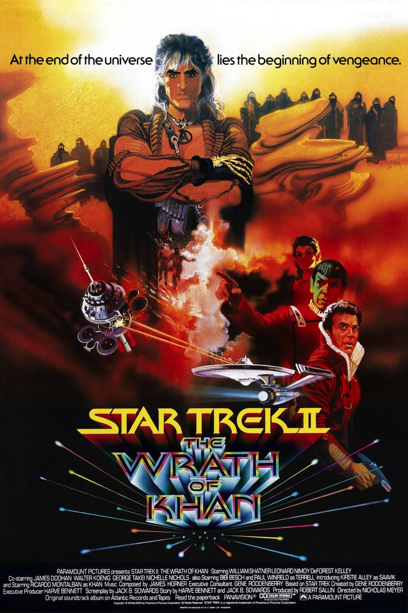
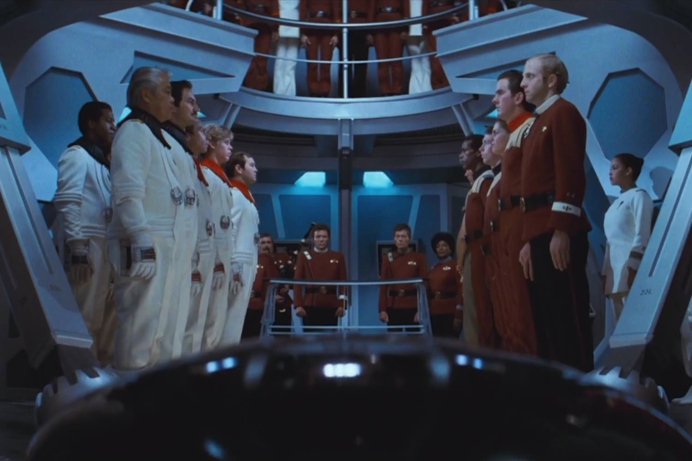

+++
type = "post"
titre = "<em>Star Trek II : La Colère de Khan</em>, Nicholas Meyer"
title = "Star Trek II : La Colère de Khan, Nicholas Meyer"
url = "/star-trek-2-la-colere-de-khan-meyer"
date = "2013-05-20T08:22:49"
Lastmod = "2013-05-29T22:38:58"
cover = "star-trek-2-la-colere-de-khan-meyer-ricardo-montalban.jpg"
categorie = [ "À voir" ]
tag = [ "Aventure", "Blockbuster", "Science-Fiction", "Star Trek", "Vite oublié" ]
createur = [ "Nicholas Meyer" ]
acteur = [ "DeForest Kelley", "James Doohan", "Leonard Nimoy", "Ricardo Montalban", "William Shatner" ]
annee = [ "1982" ]
weight = 1982
saga = [ "Star Trek" ]
pays = [ "États-Unis" ]
original = "Star Trek II: The Wrath of Khan"

+++

En 1980, <a href="/star-trek-le-film-wise/" title="Star Trek : Le Film, Robert Wise"><em>Star Trek : Le Film</em></a> introduisait la série télévisée <em>Star Trek</em> au cinéma pour la première fois, après une longue hésitation de la part des producteurs entre une nouvelle série et un long-métrage. Cette hésitation se ressentait à l’écran et ce premier essai était loin d’être concluant, la faute à un scénario trop simple pour un film trop long. Le succès n’a pas été au rendez-vous et deux ans plus tard, les producteurs ont beaucoup moins confiance dans cette saga et ils octroient à la suite un budget ridicule, presque huit fois inférieur. <em>Star Trek II : La Colère de Khan</em> doit changer le ton et on offre la réalisation à Nicholas Meyer qui ne connaissait rien à l’univers <em>Star Trek</em>. Il sent malgré tout qu’il faut revenir à un esprit plus proche de la série originale et il construit ainsi ce deuxième opus autour de la confrontation entre le héros et un vrai méchant. Au total, un film plus intense que son prédécesseur, mais qui ne convainc pas beaucoup plus et ne parvient jamais à vraiment décoller. 

<em>Star Trek II : La Colère de Khan</em> n’a aucun rapport direct avec son prédécesseur, il s’agit d’un épisode à part, un nouveau départ en quelque sorte. Alors que cet opus aura deux suites directes, Nicholas Meyer filme une autre histoire pour repartir sur de meilleures bases. Quand le film commence, l’amiral Kirk est plus ou moins mis à la retraite. Il ne commande plus aucun vaisseau spatial, mais c’est une décision qu’il regrette amèrement. L’USS <em>Enterprise</em>, le vaisseau qu’il a dirigé pendant des années, est maintenant aux mains de son ami Spock qui l’utilise pour former les jeunes générations. De manière assez gonflée, le film ouvre d’ailleurs sur cette opposition générationnelle et met dos à dos les jeunes recrues forcément stupides et immatures et les anciens qui se moquent bien des premiers. Tout au long de <em>Star Trek II : La Colère de Khan</em>, cette opposition est balayée et même inversée, mais cette première phase est intéressante et parfois amusante. Quand l’amiral Kirk doit, pour lire, chausser des lunettes qu’il remise immédiatement dès que quelqu’un peut le voir, c’est une coquetterie inattendue et une incursion dans le second degré inattendue dans la saga. William Shatner interprète toujours l’amiral et il est assez convaincant dans ce rôle où il est souvent mal à l’aise — il paraît que l’acteur lui-même n’était pas vraiment à l’aise avec cette idée que son personnage vieillisse. Que l’on se rassure toutefois, cette incursion ne dure pas et Nicholas Meyer embraye vite sur l’histoire principale de ce nouvel épisode.

Comme son nom l’indique bien, <em>Star Trek II : La Colère de Khan</em> est centré autour du personnage de Khan et de sa colère qui l’amène à s’opposer à Kirk. Suite à une série de péripéties plutôt secondaires, l’amiral cloué au sol revient dans le vaisseau et il est amené à le commander à nouveau, exactement comme dans <em>Star Trek : Le Film</em>. Il s’aperçoit, mais un peu tard, que son vieil ennemi l’a piégé et l’USS <em>Enterprise</em> souffre de gros dommages dès la première attaque. Face à lui, Khan est un ancien commandant de la flotte et un collègue de Kirk, mais ce dernier l’a abandonné dans des circonstances qui restent obscures une quinzaine d’années avant le film. Il a été contraint de vivre sur une planète déserte et avec son équipage, Khan parvient à s’emparer d’un autre vaisseau, le <em>Reliant</em>, ce qui lui permet de s’en prendre au navire spatial de son rival sans difficulté. À partir de là, le combat à la mort se déroule autour d’une autre planète abandonnée où l’ancienne femme de Kirk mène des expériences scientifiques. La victoire est connue d’avance, mais dans les combats, Nicholas Meyer fait disparaître l’un des membres clés de l’équipage de l’USS <em>Enterprise</em>. Cette mort qui intervient à la fin de <em>Star Trek II : La Colère de Khan</em> est le climax du film, le moment que tous les fans attendaient et redoutaient à la fois. 

Nicholas Meyer dispose d’un matériau plus riche qu’avant et peut ainsi construire un film plus vivant et dans l’ensemble plus plaisant. Sorti en 1982, <em>Star Trek II : La Colère de Khan</em> n’a pas toujours bien vieilli avec des effets spéciaux qui sont parfois vraiment kitsch, un effet sans doute renforcé par le tout petit budget avec lequel le cinéaste doit composer. Les corps qui disparaissent comme par magie sous l’effet d’un pistolet laser, les attaques en forme de boules lumineuses, les flashs quand les corps ou les vaisseaux passent d’un endroit à l’autre… tous ces effets qui n’ont plus tellement l’air modernes font toutefois partie du plaisir de (re)voir ces vieux films et ils ne sont pas si gênants. Le problème de <em>Star Trek II : La Colère de Khan</em> réside plutôt dans ses personnages et ses acteurs : la colère de Khan annoncée dans le titre par exemple, n’est pas du tout crédible. Ricardo Montalban se contente de secouer la tête pour signifier sa colère, ce qui est assez léger et on n’est jamais impressionné. De la même manière, Nicholas Meyer est censé filmer une scène de retrouvailles familiales entre Kirk, son ancienne femme et le fils qu’il vient de découvrir, mais c’est fait avec un tel détachement que l’on n’y croit pas une seconde. Dommage, car il y avait de quoi faire autour de la filiation et même de l’opposition entre les deux personnages.

Après un épisode de série artificiellement allongé pour remplir un long-métrage, la saga <em>Star Trek</em> fait mieux avec ce nouvel opus qui reprend l’esprit de la série originale, mais avec suffisamment de matière pour tenir au cinéma. Malheureusement, <em>Star Trek II : La Colère de Khan</em> n’est pas vraiment meilleur, même s’il se regarde sans déplaisir. Nicholas Meyer n’a pas su exploiter son scénario et son film manque de crédibilité, entre autres. Dommage, mais ce deuxième opus a au moins l’intérêt de véritablement lancer la saga qui devient viable financièrement. Son avenir est assuré, place à <em>Star Trek III : À la recherche de Spock</em>.

<h3>Vous voulez m’aider ?<a href="#footnote_0_9518" id="identifier_0_9518" class="footnote-link footnote-identifier-link" title="&Agrave; propos de la publicit&eacute;&hellip;">1</a></h3>
<ul>
<li><a href="http://www.amazon.fr/gp/product/B002JP9WTO/ref=as_li_ss_tl?ie=UTF8&tag=leblogdenic07-21&linkCode=as2&camp=1642&creative=19458&creativeASIN=B002JP9WTO">Acheter le film en Blu-Ray sur Amazon</a></li>
<li><a href="http://www.amazon.fr/gp/product/B002JP9WS0/ref=as_li_ss_tl?ie=UTF8&tag=leblogdenic07-21&linkCode=as2&camp=1642&creative=19458&creativeASIN=B002JP9WS0">Acheter le film en DVD sur Amazon</a></li>
<li><a href="https://itunes.apple.com/fr/movie/star-trek-ii-the-wrath-of-khan/id208510932">Acheter ou louer le film sur l’iTunes Store</a></li>
</ul>

<ol class="footnotes"><li id="footnote_0_9518" class="footnote"><a href="/soutien/">À propos de la publicité…</a> [<a href="#identifier_0_9518" class="footnote-link footnote-back-link">&#8617;</a>]</li></ol>
