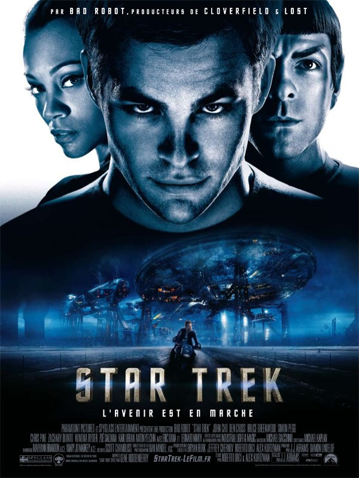
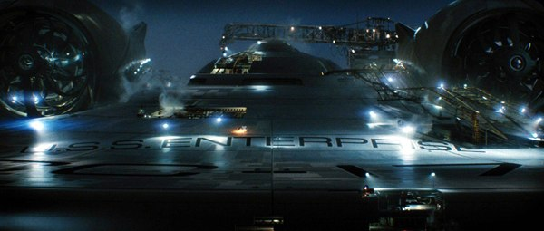

+++
type = "post"
titre = "Star Trek, J.J. Abrams"
title = "Star Trek, J.J. Abrams"
url = "/star-trek-abrams-2"
date = "2009-05-08T23:42:42"
Lastmod = "2013-07-19T16:37:17"
cover = "star-trek-abrams.jpg"
categorie = [ "Archives du blog" ]
tag = [ "Blockbuster", "Science-Fiction", "Star Trek", "Star Wars" ]

+++

<strong>Depuis cet article &laquo;&nbsp;historique&nbsp;&raquo;, j&rsquo;ai publié une nouvelle critique du film : <a href="http://voiretmanger.fr/star-trek-abrams/" title="Star Trek, J.J. Abrams"><em>Star Trek</em></a></strong>

Pouvais-je vraiment rater <em>Star Trek</em> ? L&rsquo;idée a quand même effleuré mon esprit : la science-fiction est un genre assez peu réussi au cinéma, les bons films se faisant rares dans cette catégorie, comme si les écrans pourtant très larges des cinémas ne suffisaient pas à représenter l&rsquo;imagination débordante que le genre implique souvent. Bref, j&rsquo;hésitais.

En même temps, combien de Space Opera un peu sérieux sortent chaque année ? M&rsquo;est avis qu&rsquo;on atteint rarement le film par an dans le genre&#8230; Or étant un fan absolu du genre, je ne pouvais rater cela. Et finalement, je n&rsquo;ai pas été déçu, mais il faut dire que je m&rsquo;attendais au pire.

Précisons d&rsquo;emblée que je suis loin d&rsquo;être un fan absolu de <em>Star Trek</em>. En fait, pour être précis, je n&rsquo;ai jamais regardé une seule série sur les cinq actuelles, et aucun des dix films qui existaient avant celui-ci (ou alors, ils ne m&rsquo;ont pas laissé un souvenir impérissable). J&rsquo;ai vu des extraits à de multiples reprises, et je crois que j&rsquo;ai regardé un ou deux épisodes en entier. Néanmoins, je connais l&rsquo;univers de <em>Star Trek</em>, je sais qu&rsquo;on lui doit beaucoup de choses dans l&rsquo;imaginaire collectif de la science-fiction, bref je ne suis pas un &laquo;&nbsp;trekkie&nbsp;&raquo;, mais je connais <em>Star Trek</em>.

Le film se situe avant les séries, lorsque Monsieur Spock n&rsquo;était pas encore Monsieur Spock, et le capitaine Kirk pas encore le capitaine Kirk. Par bien des aspects, et ce choix scénaristique en est le premier, ce film apparaît aux habitués de séries américaines comme un épisode pilote, rappelant par exemple celui de <em>Battlestar Galactica</em> qui avait aussi l&rsquo;ampleur d&rsquo;un vrai film. <em>Star Trek</em> commence donc par un exposé assez détaillé et pas forcément des mieux menés (car un peu trop systématique, ou visible, ce qui passe bien à la télévision, mais moins bien au cinéma), de la situation initiale, la mort du père, les problèmes de jeunesse, la rencontre avec l&rsquo;officier (figure paternelle par excellence) et le brillant — mais rebelle — apprentissage.

Le film s&rsquo;améliore quand les combats commencent, même s&rsquo;il devient alors très classique, dans l&rsquo;esprit des blockbusters habituels. Mais il a pour lui, et surtout pour moi, le Space Opera. De magnifiques vaisseaux — flambants neufs pour les gentils, très moches et avec des bouts de partout, un peu façon bestioles de Matrix, pour les méchants — d&rsquo;un coin à l&rsquo;autre de l&rsquo;espace, on se téléporte gentiment, comme si de rien n&rsquo;était, on découvre des créatures bizarres, des planètes étranges&#8230; La routine quoi, et cela énervera certainement tous ceux qui ne sont pas amateurs du genre.

 
<em>Oh, le beau vaisseau&#8230;</em>

Malheureusement, <em>Star Trek</em> ne va pas tellement au-delà du minimum syndical dans ce domaine. On voit des planètes par exemple, mais pas leurs habitants. Je trouve que de nombreux éléments sont évoqués trop rapidement, au point que l&rsquo;on a du mal à y croire, et que l&rsquo;on en arrive à les considérer comme caricaturaux. Il y a bien quelques bestioles ici ou là, mais j&rsquo;ai l&rsquo;impression qu&rsquo;il n&rsquo;y avait plus tellement de budget pour elles (exception faite de la grande bestiole sur la glace, très chouette). Le film est sans doute trop court, peut-être aurait-il fallu réduire le scénario (mais on voit mal comment) ou sortir le film en deux épisodes&#8230; En tout cas, ce qui faisait la nouveauté et la force de <a href="http://voiretmanger.fr/saga/star-wars/" title="Saga Star Wars - À voir et à manger"><em>Star Wars</em></a>, à savoir créer un univers réaliste, parce que visiblement marqué par l&rsquo;histoire (rappelons-nous des vaisseaux cabossés, une première dans la SF après des armées de vaisseaux brillants&#8230;), est ici absent.

<em>Star Wars</em>, le sujet qui fâche quand on connaît très bien les deux trilogies. Peut-être est-ce, justement, parce que je connais par cœur <em>Star Wars</em>, mais je trouve que le film emprunte un peu beaucoup, voire un peu trop, à cet autre univers. Je sais que celui de <em>Star Trek</em> est au moins aussi développé que pour la Guerre des Étoiles, mais là je n&rsquo;évoque que les films que je connais. Or je trouve que ce nouveau film pompe un peu trop allègrement dans l&rsquo;univers de Star Wars : le héros tombe sur une planète et hop, c&rsquo;est une planète glacée avec des espèces de bestioles qui ont même, pour l&rsquo;une d&rsquo;entre elles, des poils&#8230; De même, on passe à un moment dans un bar qui ressemble fort à celui de l&rsquo;Épisode IV, et les Vulcains ressemblent un peu trop aux Jedis. Malheureusement, la comparaison ne se fait pas vraiment à l&rsquo;avantage de <em>Star Trek</em> qui, sur de nombreux points, est beaucoup plus léger : par exemple les problèmes politiques qui prennent une place centrale dans les Épisodes I à III sont ici vaguement évoqués, mais jamais un tant soit peu creusés. C&rsquo;est dommage, car il y a manifestement de la matière à creuser. Ah, et si les opposions sont toujours monnaie courante en SF, on ne peut que regretter l&rsquo;opposition systématique et manichéenne entre gentils et méchants avec très nettement, la lumière et la propreté d&rsquo;un côté, l&rsquo;ombre et la saleté de l&rsquo;autre. Mais ces méchants tatoués sont vraiment grotesques, et c&rsquo;est bien dommage.

Le film souffre également de quelques poncifs, comme la musique par moment très pompier (ben oui, n&rsquo;est pas John Williams qui veut) et qui ne favorise pas toujours une très grande subtilité. Sur ce point, on peut regretter quelques éléments que je trouve un peu faciles, comme cette mystérieuse matière rouge jamais explicitée et qui ressemble vaguement à du caoutchouc, mais dont une simple goutte fait disparaître une planète entière, alors que des centaines de milliers de gouttes ne font pas disparaître un vaisseau. C&rsquo;est un peu léger comme logique interne. Bon et puis, mais c&rsquo;est purement personnel, je trouve vraiment que les oreilles pointues font vraiment SF fauchée à l&rsquo;ancienne (elles conviennent mieux sur des trolls, mais c&rsquo;est un autre univers dans ce cas). Ça manque de créatures non humanoïdes, mais je crois que c&rsquo;est toujours comme ça dans <em>Star Trek</em>.

 
<em>Le héros, amoché comme il faut&#8230;</em>

J&rsquo;ai peut-être donné de nombreuses critiques, mais in fine, je n&rsquo;ai pas détesté du tout Star Trek. Disons-le, j&rsquo;ai passé un très agréable moment, j&rsquo;ai souri/ri quand je devais, crains pour la survie du héros quand il était en danger, souffert avec les personnages quand il souffrait&#8230; Bref, j&rsquo;ai pris le film au premier degré, preuve de sa réussite dans son rôle de blockbuster hollywoodien.

Reste que le film aurait pu être tellement mieux ! On sent qu&rsquo;il a des ambitions, mais peut-être ne s&rsquo;en donne-t-il pas totalement les moyens. En tout cas, cela sent l&rsquo;introduction à une nouvelle série : j&rsquo;évoquais le pilote de <em>Battlestar Galactica</em>, et il est vrai que l&rsquo;on ne peut s&rsquo;empêcher de faire la comparaison, et de regretter, d&rsquo;ailleurs, que ce dernier n&rsquo;ait pas été diffusé au cinéma, où il aurait eu toute sa place, étant peut-être même meilleur que <em>Star Trek</em> version 2009.

Finalement, le plus étonnant se trouve dans la <a href="http://www.telerama.fr/cinema/films/star-trek,377940,critique.php">critique</a> de <em>Télérama</em> : &laquo;&nbsp;Tiens, c&rsquo;est bien la première fois qu&rsquo;on s&rsquo;intéresse à <em>Star Trek</em>&#8230;&nbsp;&raquo;, note ainsi Aurélien Ferenczi. La critique est étonnamment plutôt enthousiaste sur ce film, y compris donc chez Télérama qui consacre même la plus grosse critique à ce film. Jean-Marc Lalanne <a href="http://www.lesinrocks.com/cine/cinema-article/article/star-trek/">s&rsquo;enflamme</a> aussi dans les <em>Inrockuptibles</em>, insistant sur l&rsquo;esthétique et regrettant seulement le manichéisme du film. Fidèles à leurs habitudes, <strong><a href="http://www.critikat.com/Star-Trek.html">Critikat</a></strong> livre une lecture conceptualisée et problématisée du film, qui ne manque pas d&rsquo;intérêt, mais me semble un peu exagérée pour un tel film.

Dans un tout autre genre, ne ratez sous aucun prétexte la <a href="http://www.playlistsociety.fr/2009/05/star-trek-de-jj-abrams-210.html">brillante triple critique</a> de Benjamin sur <strong><a href="http://www.playlistsociety.fr/">Playlist Society</a></strong>. Sa comparaison avec <em>Star Wars</em> est vraiment très drôle et bien vue, dans les grandes lignes au moins.

<h3>Vous voulez m&rsquo;aider ?<a href="#footnote_0_1500" id="identifier_0_1500" class="footnote-link footnote-identifier-link" title="&Agrave; propos de la publicit&eacute;&hellip;">1</a></h3>
<ul>
<li><a href="http://www.amazon.fr/gp/product/B004IPWY3Y/ref=as_li_ss_tl?ie=UTF8&#038;tag=leblogdenic07-21&#038;linkCode=as2&#038;camp=1642&#038;creative=19458&#038;creativeASIN=B004IPWY3Y">Acheter le film en Blu-Ray sur Amazon</a></li>
<li><a href="http://www.amazon.fr/gp/product/B003AYPN7S/ref=as_li_ss_tl?ie=UTF8&#038;tag=leblogdenic07-21&#038;linkCode=as2&#038;camp=1642&#038;creative=19458&#038;creativeASIN=B003AYPN7S">Acheter le film en DVD sur Amazon</a></li>
<li><a href="https://itunes.apple.com/fr/movie/star-trek/id364196367">Acheter ou louer le film sur l&rsquo;iTunes Store</a></li>
</ul>

<ol class="footnotes"><li id="footnote_0_1500" class="footnote"><a href="http://voiretmanger.fr/soutien/">À propos de la publicité…</a> [<a href="#identifier_0_1500" class="footnote-link footnote-back-link">&#8617;</a>]</li></ol>
