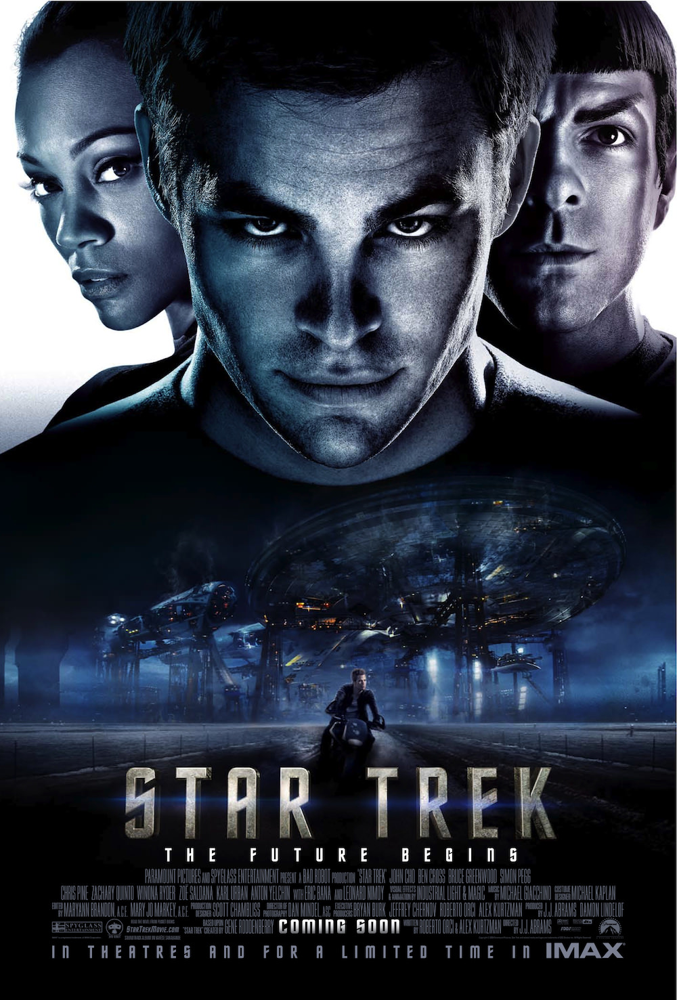
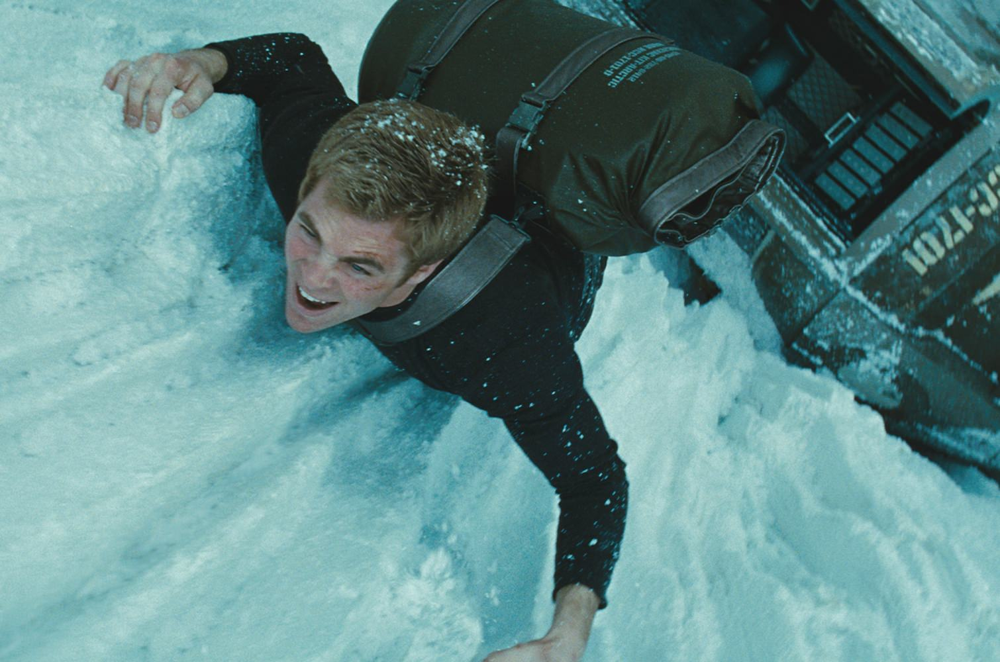

+++
type = "post"
titre = "<em>Star Trek</em>, J.J. Abrams"
title = "Star Trek, J.J. Abrams"
url = "/star-trek-abrams"
date = "2013-07-19T13:30:05"
Lastmod = "2013-07-19T13:42:24"
cover = "star-trek-j-j-abrams.jpg"
categorie = [ "À voir" ]
tag = [ "Action", "Blockbuster", "Reboot", "Saga", "Science-Fiction", "Star Trek", "Voyage temporel" ]
createur = [ "J.J. Abrams" ]
acteur = [ "Chris Pine", "Eric Bana", "Karl Urban", "Leonard Nimoy", "Simon Pegg", "Zachary Quinto" ]
annee = [ "2009" ]
weight = 2009
saga = [ "Star Trek" ]
pays = [ "États-Unis" ]

+++

Après dix films plus ou moins réussis, la saga <em>Star Trek</em> repart de plus belle à la fin des années 2000. Contrairement au nouveau départ opéré par le changement d’équipage dans <a href="/star-trek-generations-carson/" title="Star Trek Generations, de David Carson – À voir et à manger"><em>Star Trek Generations</em></a>, le onzième volet est un <em>reboot</em> : on reprend l’équipage original autour du capitaine James T. Kirk et on raconte une nouvelle histoire. <em>Star Trek</em> est une préquelle, un long-métrage fondé sur la découverte des personnages mythiques de la série originale, mais dans leur jeunesse, leurs premiers pas avant d’être placés à la tête de l’USS <em>Enterprise</em>. Une idée originale, mais qui n’était pas totalement nouvelle, puisque Gene Roddenberry qui a créé cet univers y pensait déjà à la fin des années 1970. Face au succès toujours plus faible de la saga, J.J. Abrams fait le ménage et débarrasse <em>Star Trek</em> de son côté kitsch, pour faire entrer la saga dans le XXIe siècle. Mission réussie pour cet épisode aussi époustouflant que passionnant. 

Quand <em>Star Trek</em> commence, il n’y a ni le capitaine Kirk ni son équipage, il n’y a pas même l’USS <em>Enterprise</em>. J.J. Abrams ouvre son film avant cela, avant les évènements décrits dans <a href="/star-trek-le-film-wise/" title="Star Trek : Le Film, Robert Wise - À voir et à manger"><em>Star Trek : Le Film</em></a> — le premier film de la saga — et même avant les premiers épisodes de la première série dans cet univers. Son film ouvre alors que le futur capitaine Kirk n’est même pas né, et alors que son père doit affronter un terrible ennemi et se sacrifier pour sauver le reste de l’équipage, dont sa femme qui est en train d’accoucher de leur enfant. Quelques années après, on retrouve le jeune James qui ne rêve que d’une chose, s’engager dans la Fédération et partir dans l’espace, mais qui n’arrive pas à passer les tests. Le film décrit ensuite de manière assez classique les étapes jusqu’à son arrivée sur le siège de capitaine du vaisseau, le tout étant entouré d’une lutte contre un ennemi, comme dans tous les films de la saga. Cette fois, <em>Star Trek</em> imagine des Romuliens venus du futur par un trou noir et qui entendent éviter la destruction de leur planète en détruisant la Fédération, tout simplement. Cette idée offre à J.J. Abrams de quoi construire son film, certes, mais elle va plus loin que ça. C’est aussi un moyen de justifier le reboot, sans renier les épisodes précédents. Contrairement à un <a href="/batman-begins-nolan/" title="Batman Begins, Christopher Nolan - À voir et à manger"><em>Batman Begins</em></a> ou <a href="/amazing-spider-man-webb/" title="The Amazing Spider-Man, Marc Webb - À voir et à manger"><em>The Amazing Spider-Man</em></a> qui ignorent tout des films avant eux pour repartir sur de nouvelles bases et construire une nouvelle saga, ce long-métrage est bien le onzième film d’une série au cinéma qui a commencé près de trente ans auparavant. En mettant au point cette idée de voyage temporel et surtout d’univers parallèle, <em>Star Trek</em> est une branche alternative qui n’est pas incompatible avec la branche originale et qui est même assez similaire. Dans les deux cas, Kirk, McCoy et Spock deviennent des amis, tandis que la galerie de personnages secondaires — Uhura, Scott, Checkov ou encore Sulu — est bien au rendez-vous. Dans la version J.J. Abrams toutefois, le personnage principal ne connaît pas son père, mort juste après sa naissance et Spock assiste à un évènement tragique pour les Vulcains. Au-delà de ces différences, <em>Star Trek</em> tisse un lien concret avec ses prédécesseurs par la présence du premier Spock, toujours interprété par Leonard Nimoy. Symboliquement, la passation de pouvoir est effectuée et la saga peut rebondir. 

J.J. Abrams ne se contente pas de reprendre les rênes d’un univers né à la télévision dans les années 1960 pour refaire la même chose. Le cinéaste qui n’a tourné qu’un seul film auparavant, mais qui est devenu célèbre avec la série <em>Lost</em> apporte son regard et donne un bon coup de plumeau à la saga qui avait mal vieilli, même si les derniers épisodes sont techniquement meilleurs. <em>Star Trek</em> abandonne le format d’une série pour adopter un scénario plus dense, mais aussi une mise en scène plus moderne. Symbole de cette modernité, paradoxalement, le côté vieilli et même abimé d’une bonne partie des décors et des vaisseaux. Ici, on ne se contente plus de quelques coups de lasers et de tâches sombres, les appareils explosent dans l’espace et laissent de nombreux débris. La guerre n’est pas une belle chose, qu’elle soit dans l’espace n’y change rien et le film le montre mieux qu’avant. Les vaisseaux se déplacent aussi facilement, mais ils ont beaucoup de mal à résister à un trou noir en formation. Les dommages ont un vrai impact sur les appareils et J.J. Abrams s’interdit quelques facilités que l’on pouvait trouver dans des épisodes précédents. Au total, le spectacle est beaucoup plus impressionnant, on en prend plein la vue et on découvre avec un autre regard des décors que l’on connaissait pourtant bien. La scène où James T. Kirk s’engage dans la Fédération en passant sous l’USS <em>Enterprise</em> en construction en est un bel exemple. Comme le personnage principal, le spectateur est écrasé par cette masse majestueuse énorme qui semble beaucoup plus impressionnante que l’approche un peu longue de <em>Star Trek : Le Film</em> qui souffrait en outre de problèmes de proportions. <em>Star Trek</em> n’est pas parfait pour autant, le cinéaste use et abuse de l’effet de lense-flare qu’il affectionne tant et sa mise en scène est parfois un peu clinquante, il faut bien le reconnaître. Ajoutons que l’action prend une part parfois trop importante, que le scénario évite certaines difficultés avec un peu trop de désinvolture et que Chris Pine, qui interprète le nouveau capitaine Kirk, n’est pas très bon. Heureusement, la <a href="http://www.amazon.fr/gp/product/B0021BUUTC/ref=as_li_ss_tl?ie=UTF8&tag=leblogdenic07-21&linkCode=as2&camp=1642&creative=19458&creativeASIN=B0021BUUTC">musique originale</a> composée par Michael Giacchino respecte l’esprit général de la saga sans la copier et Zachary Quinto est très bien dans le rôle de Spock.

<em>Star Trek</em> n’est pas sans défauts, mais J.J. Abrams s’en tire plutôt bien dans cet exercice de nouveau départ. Signer le reboot d’une saga aussi populaire et qui compte des fans particulièrement motivés n’était en rien évident et le cinéaste signe un blockbuster prenant et convaincant. On pourra toujours critiquer un point ou un autre, mais force est de constater que ce onzième épisode de la saga tient la route. On ne s’ennuie jamais pendant deux heures et l’idée du voyage temporel et des univers parallèles fonctionne, même si elle contient son lot d’incohérences. C’est un divertissement accessible à tous, mais plein de clins d’œil à destination des fans de la saga : <em>Star Trek</em> est un film de science-fiction efficace et réussi. 

<h3>Vous voulez m&rsquo;aider ?<a href="#footnote_0_9942" id="identifier_0_9942" class="footnote-link footnote-identifier-link" title="&Agrave; propos de la publicit&eacute;&hellip;">1</a></h3>
<ul>
<li><a href="http://www.amazon.fr/gp/product/B004IPWY3Y/ref=as_li_ss_tl?ie=UTF8&tag=leblogdenic07-21&linkCode=as2&camp=1642&creative=19458&creativeASIN=B004IPWY3Y">Acheter le film en Blu-Ray sur Amazon</a></li>
<li><a href="http://www.amazon.fr/gp/product/B003AYPN7S/ref=as_li_ss_tl?ie=UTF8&tag=leblogdenic07-21&linkCode=as2&camp=1642&creative=19458&creativeASIN=B003AYPN7S">Acheter le film en DVD sur Amazon</a></li>
<li><a href="https://itunes.apple.com/fr/movie/star-trek/id364196367">Acheter ou louer le film sur l&rsquo;iTunes Store</a></li>
</ul>

<ol class="footnotes"><li id="footnote_0_9942" class="footnote"><a href="/soutien/">À propos de la publicité…</a> [<a href="#identifier_0_9942" class="footnote-link footnote-back-link">&#8617;</a>]</li></ol>
