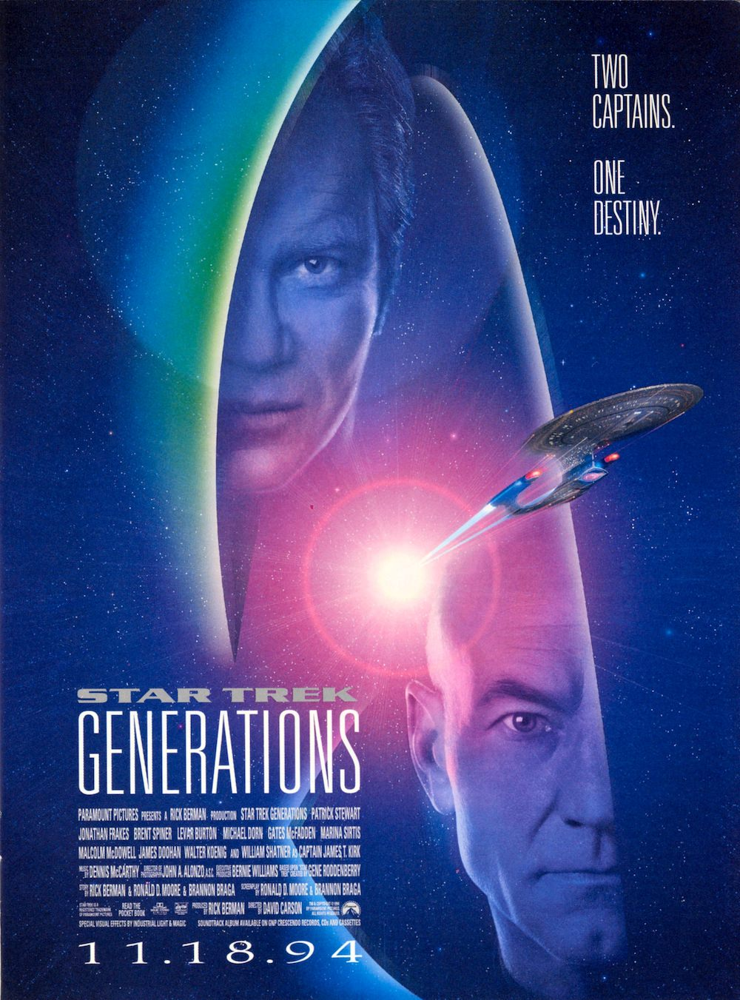
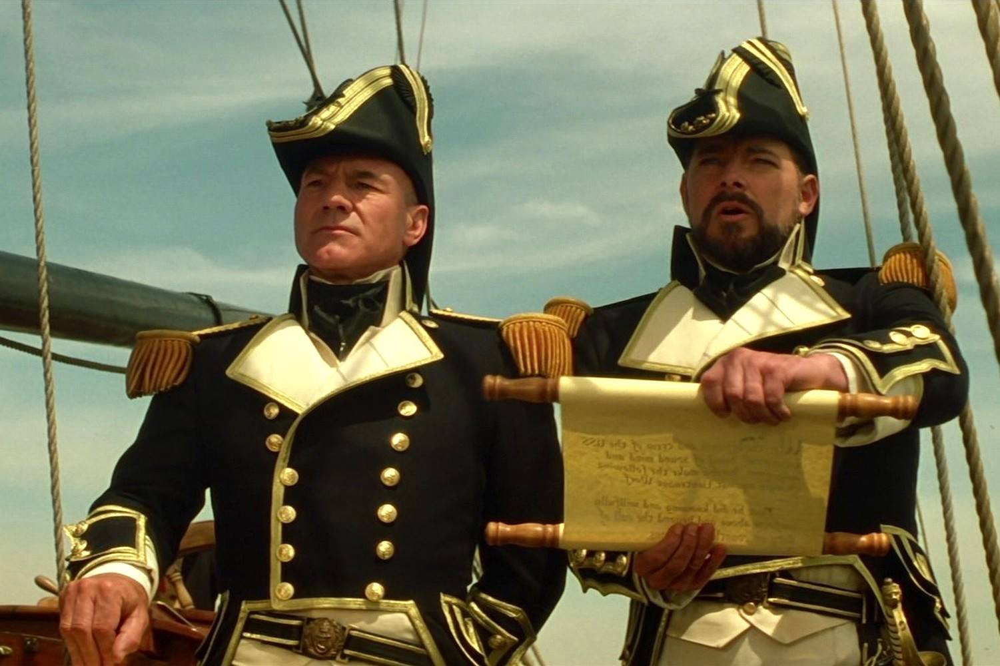

+++
type = "post"
titre = "<em>Star Trek Generations</em>, de David Carson"
title = "Star Trek Generations, de David Carson"
url = "/star-trek-generations-carson"
date = "2013-06-23T09:58:50"
Lastmod = "2013-06-23T13:31:30"
cover = "star-trek-generations-william-shatner-patrick-stewart.jpg"
categorie = [ "À voir" ]
tag = [ "Saga", "Science-Fiction", "Star Trek", "Vite oublié", "Voyage temporel" ]
createur = [ "David Carson" ]
acteur = [ "Brent Spiner", "Jonathan Frakes", "Patrick Stewart", "William Shatner" ]
annee = [ "1994" ]
weight = 1994
saga = [ "Star Trek" ]
pays = [ "États-Unis" ]

+++

L’univers de <em>Star Trek</em> est sans doute l’un des plus compliqués à résumer. Et pour cause, alors que la saga se développait au cinéma avec six longs-métrages, une nouvelle série était diffusée en parallèle à la télévision. <em>Star Trek : La Nouvelle Génération</em> exploite depuis 1987 de nouveaux personnages dans le même univers quand le septième film de la saga sort sur les écrans. Le nom de ce nouvel opus n’est pas innocent : <em>Star Trek Generations</em> absorbe la nouvelle série pour poursuivre la saga au cinéma. De fait, ce long-métrage réalisé par David Carson a la lourde charge de faire le lien entre le capitaine Kirk et son équipage, et le nouveau capitaine de l’USS <em>Enterprise</em>, le capitaine Picard. Un passage de flambeau qui est intéressant dans la saga, pour un film qui ne l’est pas totalement. La faute sans doute à un rythme un peu lent, surtout sur la fin, et à un scénario parfois un peu faible…

Les producteurs veulent faire évoluer <em>Star Trek</em> au cinéma en adoptant les personnages et les acteurs de la nouvelle série. Plutôt que de le faire brutalement, avec un casting complètement renouvelé, ils ont eu l’idée de faire intervenir l’ancienne équipe dans <em>Star Trek Generations</em> : on commence ainsi avec Kirk, Scott et Tchekov invités sur le nouveau modèle de l’USS <em>Enterprise</em> commandé par un nouveau capitaine. Le vol d’inauguration se passe sans encombre jusqu’à l’alerte qui les oblige à intervenir pour sauver des innocents d’une mort certaine. Dans l’opération, le vaisseau spatial est touché et Kirk disparaît. Quatre-vingts ans plus tard, on retrouve le nouvel équipage dans une nouvelle version du vaisseau… ou plutôt en pleine mer sur un étrange navire du XVIIIe siècle, où l’équipage joue à interpréter des marins de l’époque. Une séquence étonnante, qui n’est jamais vraiment justifiée par le scénario, mais que David Carson interrompt vite avec la mise en place de l’intrigue principale. Jouant sur les voyages temporels, <em>Star Trek Generations</em> fait intervenir l’un des personnages sauvés 80 ans plus tôt : on découvre vite qu’il veut retrouver le Nexus, un ruban d’énergie destructeur pour les vaisseaux, mais qui envoie les êtres vivants dans une dimension temporelle hors du temps. Dans cette dimension, il n’y a ni peines, ni malheurs, uniquement le bonheur éternel, la satisfaction permanente… une sorte de paradis en quelque sorte. On s’en doute dès le départ, le capitaine Kirk s’y retrouve et c’est là que les deux générations vont pouvoir faire la transition.

Épisode de transition, <em>Star Trek Generations</em> n’est pas inintéressant, sans être totalement réussi pour autant. Son scénario plus fouillé marque encore une évolution par rapport aux intrigues très simples des premiers films, accentuant ainsi ce qui avait déjà été commencé dans <a href="http://voiretmanger.fr/star-trek-vi-terre-inconnue-meyer/" title="Star Trek VI : Terre inconnue, Nicholas Meyer - À voir et à manger"><em>Star Trek VI : Terre inconnue</em></a>. Tout rapport avec l’actualité a toutefois été effacé ici, on retrouve une pure intrigue de science-fiction, même si le Nexus permet d’intégrer plusieurs séquences terrestres. L’espace n’est pas en reste avec des effets spéciaux en nets progrès : David Carson profite des améliorations techniques, notamment sur les effets numériques, et cela se voit. La séquence d’atterrissage du vaisseau spatial sur une planète reste parmi les grands moments du film, même si elle est évidemment un petit peu ridicule par rapport à ce que l’on sait faire aujourd’hui — <a href="http://voiretmanger.fr/star-trek-into-darkness-abrams/" title="Star Trek Into Darkness, J.J. Abrams - À voir et à manger"><em>Star Trek Into Darkness</em></a> en donne un bon exemple. Inutile toutefois de bouder notre plaisir, le film a plutôt bien vieilli et il gagne en réalisme, notamment parce que les vaisseaux spatiaux ne sont plus que des maquettes beaucoup trop rutilantes pour être crédibles. Les nouveaux acteurs sont eux aussi assez bons, Patrick Stewart notamment se débrouille très bien, on reste plus circonspect sur le rôle de Data, interprété par un Brent Spiner un peu trop excessif. David Carson ne peut plus jouer sur la camaraderie de ses personnages, mais <em>Star Trek Generations</em> fonctionnerait très bien, nonobstant son scénario étrange. Passons sur la séquence rétro au début du film, comment laisser passer d’énormes incohérences, comme lorsqu’après l’accident et la disparition de Kirk, les personnages se tiennent face à un trou béant dans l’espace, comme s’ils étaient sur le balcon d’un immeuble ? La fin est quant à elle marquée par un rythme ralenti qui, combiné à des dialogues souvent à voix basse, rend l’ensemble difficile à suivre sans une envie de somnoler. Dommage, car encore une fois, l’histoire générale est plus riche et intéressante que la moyenne.

« <em>Deux capitaines. Un destin.</em> » Soigner la transition est une bonne chose, d’autant que les fans s’étaient attachés au capitaine Kirk et son équipage et la relève était d’autant plus difficile à prendre. <em>Star Trek Generations</em> prend le temps de passer d’une époque à l’autre, d’un équipage à l’autre, mais le septième long-métrage de la saga passe ainsi à côté d’autres choses. À trop se concentrer sur le changement de génération, David Carson en a oublié de faire un bon film. Toujours est-il que <em>Star Trek</em> peut repartir sur ses nouvelles bases, tout est prêt pour un nouveau départ !

<h3>Vous voulez m&rsquo;aider ?<a href="#footnote_0_9778" id="identifier_0_9778" class="footnote-link footnote-identifier-link" title="&Agrave; propos de la publicit&eacute;&hellip;">1</a></h3>
<ul>
<li><a href="http://www.amazon.fr/gp/product/B002JP9WVC/ref=as_li_ss_tl?ie=UTF8&tag=leblogdenic07-21&linkCode=as2&camp=1642&creative=19458&creativeASIN=B002JP9WVC">Acheter le film en Blu-Ray sur Amazon</a></li>
<li><a href="http://www.amazon.fr/gp/product/B002JP9WV2/ref=as_li_ss_tl?ie=UTF8&tag=leblogdenic07-21&linkCode=as2&camp=1642&creative=19458&creativeASIN=B002JP9WV2">Acheter le film en DVD sur Amazon</a></li>
<li><a href="https://itunes.apple.com/fr/movie/star-trek-vii-generations/id377626560">Acheter ou louer le film sur l&rsquo;iTunes Store</a></li>
</ul>
<ul>
<li><a href="http://www.amazon.fr/gp/product/B00CU2ZFFG/ref=as_li_ss_tl?ie=UTF8&tag=leblogdenic07-21&linkCode=as2&camp=1642&creative=19458&creativeASIN=B00CU2ZFFG">Acheter les dix premiers <em>Star Trek</em> en Blu-Ray sur Amazon</a></li>
<li><a href="http://www.amazon.fr/gp/product/B00CU2ZFEW/ref=as_li_ss_tl?ie=UTF8&tag=leblogdenic07-21&linkCode=as2&camp=1642&creative=19458&creativeASIN=B00CU2ZFEW">Acheter les dix premiers <em>Star Trek</em> en DVD sur Amazon</a></li>
</ul>

<ol class="footnotes"><li id="footnote_0_9778" class="footnote"><a href="http://voiretmanger.fr/soutien/">À propos de la publicité…</a> [<a href="#identifier_0_9778" class="footnote-link footnote-back-link">&#8617;</a>]</li></ol>
