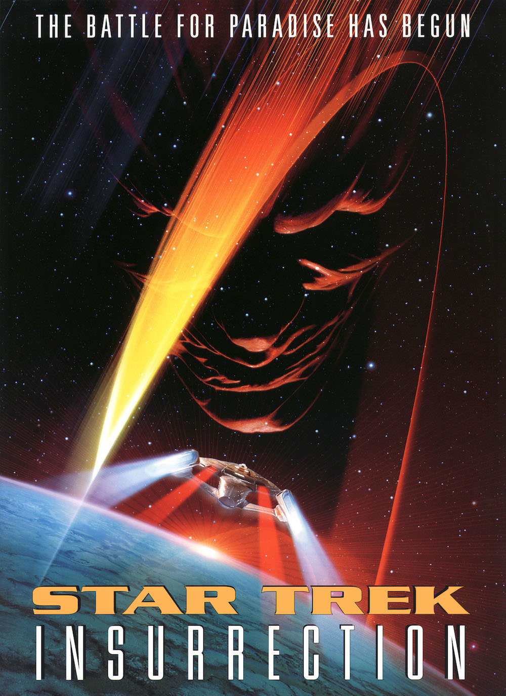
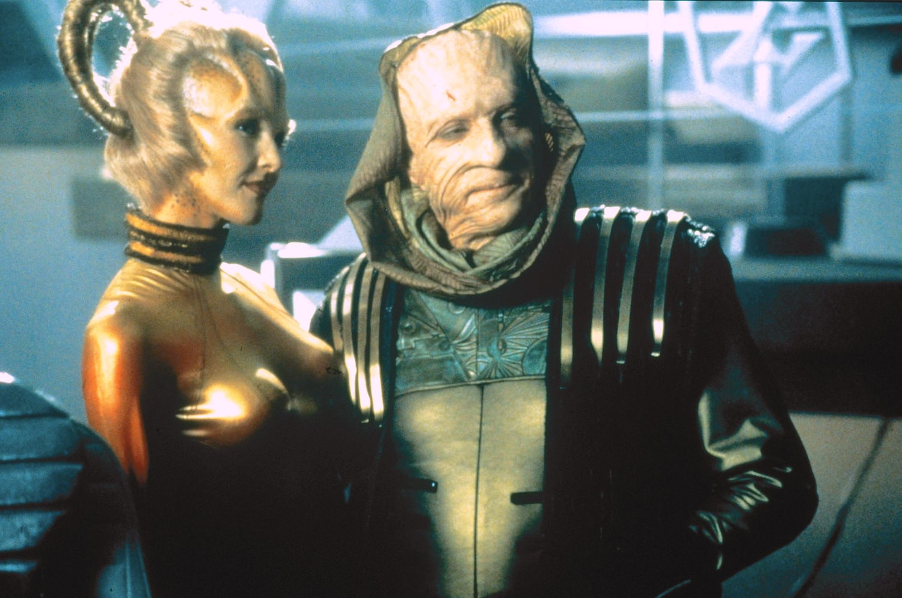

+++
type = "post"
titre = "<em>Star Trek : Insurrection</em>, Jonathan Frakes"
title = "Star Trek : Insurrection, Jonathan Frakes"
url = "/star-trek-insurrection-frakes"
date = "2013-07-03T23:13:37"
Lastmod = "2013-07-03T23:22:45"
cover = "star-trek-insurrection-patrick-stewart-brent-spinner.jpg"
categorie = [ "À voir" ]
tag = [ "Religion", "Saga", "Science-Fiction", "Société", "Star Trek" ]
createur = [ "Jonathan Frakes" ]
acteur = [ "Brent Spiner", "Donna Murphy", "F. Murray Abraham", "Jonathan Frakes", "Patrick Stewart" ]
annee = [ "1999" ]
weight = 1999
saga = [ "Star Trek" ]
pays = [ "États-Unis" ]
original = "Star Trek: Insurrection"

+++

Pour son neuvième film, la saga <em>Star Trak</em> attaque la bataille pour le paradis si l’on en croit son affiche, ou pour la vie éternelle selon la <a href="http://www.allocine.fr/film/fichefilm-12570/photos/detail/?cmediafile=29452">version française</a>. Un choix ambitieux, qui rappelle de mauvais souvenirs : <a href="/star-trek-v-ultime-frontiere-shatner/" title="Star Trek V : L'Ultime frontière, William Shatner - À voir et à manger"><em>Star Trek V : L’Ultime frontière</em></a> avait déjà tenté une approche de la divinité, et le scénario de cet épisode était particulièrement ridicule. Jonathan Frakes se pose à nouveau derrière les caméras pour cet ultime épisode sorti au XXe siècle et <em>Star Trek : Insurrection</em> n’est pas une réussite, même s’il n’est pas aussi mauvais que prévu. La place de la religion reste judicieusement limitée et on évite ainsi le pire en terme de scénario. Malheureusement, c’est du côté des décors et de l’aspect général que cet épisode dévoile, à nouveau, ses faiblesses : <em>Star Trek : Insurrection</em> est tantôt moche, tantôt ridicule et pour un film sorti en 1999, cela en devient gênant…

Sans lien particulier avec <a href="/star-trek-premier-contact-frakes/" title="Star Trek : Premier Contact, Jonathan Frakes - À voir et à manger"><em>Star Trek : Premier Contact</em></a> qui se déroulait dans le passé sur la terre, ce nouvel épisode envoie les personnages habituels au fin fond de l’univers. Cette fois, il s’agit d’aider un équipage de la Fédération pris en otage par les indigènes d’une planète qu’il devait surveiller, sans se faire voir. L’androïde Data qui participait aux opérations a perdu la tête et a cassé leur couverture, les dévoilant à cette civilisation en retard, ce qui est strictement interdit dans <em>Star Trek</em>. Le capitaine Picard et l’équipage de l’USS <em>Enterprise</em> se rend sur place toutes affaires cessantes : parce que c’est le capitaine Picard déjà — il ne saurait se passer quelque chose dans tout l’univers sans qu’il s’implique —, mais aussi parce que Data est « son » robot et qu’il veut le sauver de la destruction à laquelle il est promis. Ce mauvais fonctionnement d’une machine est une idée intéressante, mais <em>Star Trek : Insurrection</em> n’en fait rien, si ce n’est ouvrir le film avec quelques scènes d’action autour de la récupération du robot. Ce dernier est toutefois vite réparé et Jonathan Frakes s’attaque au gros morceau de son intrigue : la fameuse quête du paradis ou de la vie éternelle. Sur la planète en question, une petite communauté vit sans aucun moyen technologique, cultivant la terre manuellement et parfaitement en harmonie avec la nature. On pourrait croire à une civilisation ancienne, on pense à une vision caricaturale d’un temps disparu, mais on apprend qu’il s’agit en fait d’une civilisation encore plus avancée qui a fait le choix de se retirer de la technologie. Avant même les Terriens, ils ont exploré l’espace, mais telle une communauté amish revisitée à la sauce spatiale, ils ont décidé de vivre simplement, en autarcie et loin du reste de l’univers. Le sujet n’est pas inintéressant, mais <em>Star Trek : Insurrection</em> déçoit à nouveau en ne le traitant pas et en se concentrant à la place sur un conflit entre Picard et l’amiral de la Fédération en charge du secteur, conflit autour du secret de la vie éternelle que la population locale a découvert. 

L’ensemble ferait un film de science-fiction honorable, s’il n’était pas plombé par des choix visuels datés et ratés. C’est le premier épisode de la saga à abandonner totalement les maquettes physiques de vaisseaux spatiaux et à les générer entièrement avec un ordinateur. Au vu du résultat, ce n’était sûrement pas la meilleure idée et même si <em>Star Trek : Insurrection</em> respecte mieux les proportions grâce à cela, les vaisseaux filmés par Jonathan Frakes font encore moins vrais que dans les films précédents. On n’y croit jamais vraiment, d’autant que les fonds trop colorés ne sont pas plus crédibles. Tous les <em>Star Trek</em> sont marqués par cette caractéristique surprenante d’être trop en avance sur leur temps sur le plan technique et d’avoir trop rapidement vieillis à trop utiliser des technologies nouvelles. Celui-ci n’est pas différent de ses prédécesseurs à cet égard et on pourrait ne pas lui en tenir rigueur. Comment, en revanche, justifier le village sur la planète ? Créé en décor naturel, celui-ci n’est jamais crédible et évoque plus un parc d’attractions ou une maison de poupées qu’un village habité depuis 300 ans. Certes, <em>Star Trek : Insurrection</em> est un film de science-fiction où, par définition, tout est possible, mais ces maisonnettes trop blanches, l’herbe trop verte et parfaitement taillée ou encore ces enfants blonds qui sautillent dans les champs pendant que leurs parents récoltent joyeusement leur production… tout sonne faux, rien n’est crédible. Jonathan Frakes filme en outre l’ensemble avec un premier degré infaillible, si bien que l’on assiste à l’échec annoncé. Ce neuvième épisode ne fait rien pour se sortir de ce ridicule permanent, même s’il faut reconnaître que les méchants aux visages grippés sont réussis. Au milieu de tout cela, les acteurs font ce qu’ils peuvent et même s’ils ne font pas de miracle, ils sauvent peut-être <em>in extremis</em> le film par leur désinvolture

<em>Star Trek : Insurrection</em> est en effet marqué par le même sentiment que le cinquième épisode que l’on critiquait en préambule. Les deux films se rejoignent sur une quête de transcendance ridicule, mais aussi sur une ambiance particulière : dans les deux cas, les acteurs vieillissent et semblent ne plus se soucier de leurs personnages. Ici, Patrick Stewart semble, comme William Shatner en son temps, s’amuser de la situation et la prendre à la légère, d’où un second degré inattendu qui survient par moment. À défaut de sauver le film de Jonathan Frakes — le scénario, lui, reste vraiment trop sérieux —, cette désinvolture des acteurs évite de trouver le temps trop long. C’est déjà bien pour <em>Star Trek : Insurrection</em>, mais c’est tout de même bien peu…

<h3>Vous voulez m&rsquo;aider ?<a href="#footnote_0_9857" id="identifier_0_9857" class="footnote-link footnote-identifier-link" title="&Agrave; propos de la publicit&eacute;&hellip;">1</a></h3>
<ul>
<li><a href="http://www.amazon.fr/gp/product/B002JP9WWG/ref=as_li_ss_tl?ie=UTF8&tag=leblogdenic07-21&linkCode=as2&camp=1642&creative=19458&creativeASIN=B002JP9WWG">Acheter le film en Blu-Ray sur Amazon</a></li>
<li><a href="http://www.amazon.fr/gp/product/B002JP9WW6/ref=as_li_ss_tl?ie=UTF8&tag=leblogdenic07-21&linkCode=as2&camp=1642&creative=19458&creativeASIN=B002JP9WW6">Acheter le film en DVD sur Amazon</a></li>
<li><a href="https://itunes.apple.com/fr/movie/star-trek-insurrection/id369591865">Acheter ou louer le film sur l&rsquo;iTunes Store</a></li>
</ul>
<ul>
<li><a href="http://www.amazon.fr/gp/product/B00CU2ZFFG/ref=as_li_ss_tl?ie=UTF8&tag=leblogdenic07-21&linkCode=as2&camp=1642&creative=19458&creativeASIN=B00CU2ZFFG">Acheter les dix premiers <em>Star Trek</em> en Blu-Ray sur Amazon</a></li>
<li><a href="http://www.amazon.fr/gp/product/B00CU2ZFEW/ref=as_li_ss_tl?ie=UTF8&tag=leblogdenic07-21&linkCode=as2&camp=1642&creative=19458&creativeASIN=B00CU2ZFEW">Acheter les dix premiers <em>Star Trek</em> en DVD sur Amazon</a></li>
</ul>

<ol class="footnotes"><li id="footnote_0_9857" class="footnote"><a href="/soutien/">À propos de la publicité…</a> [<a href="#identifier_0_9857" class="footnote-link footnote-back-link">&#8617;</a>]</li></ol>
