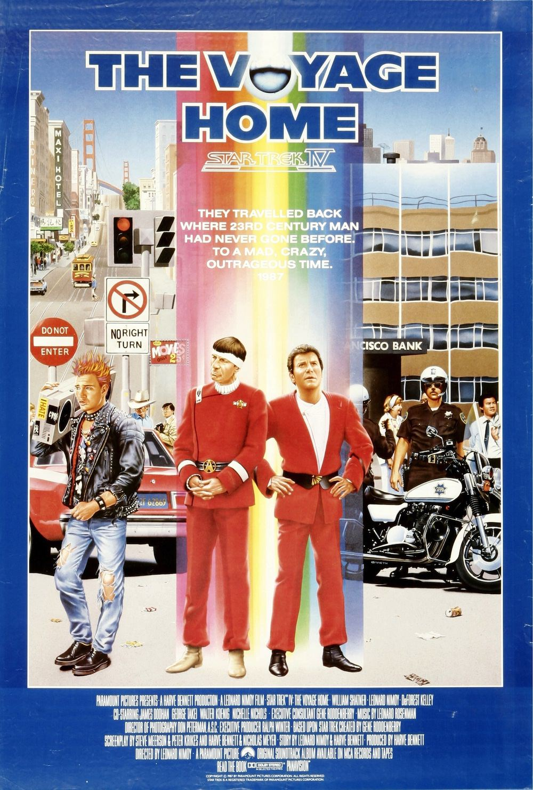
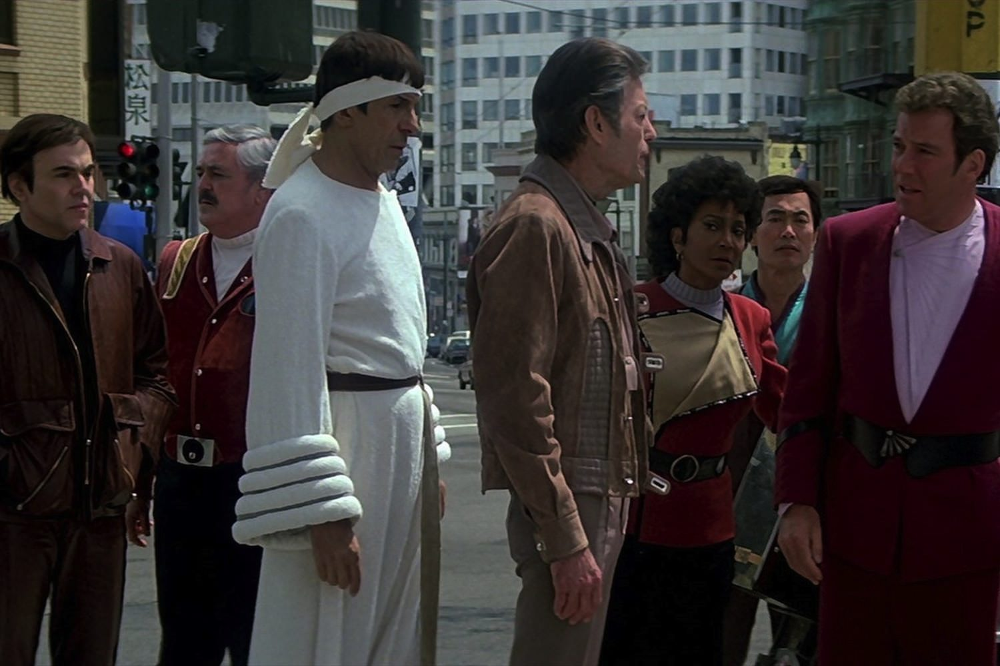

+++
type = "post"
titre = "<em>Star Trek IV : Retour sur Terre</em>, Leonard Nimoy"
title = "Star Trek IV : Retour sur Terre, Leonard Nimoy"
url = "/star-trek-iv-retour-sur-terre-nimoy"
date = "2013-06-07T00:27:13"
Lastmod = "2013-06-07T00:42:46"
cover = "star-trek-iv-retour-sur-la-terre-leonard-nimoy-william-shatner.jpg"
categorie = [ "À voir" ]
tag = [ "Animaux", "Écologie", "Humour", "Saga", "Science-Fiction", "Star Trek", "Voyage temporel" ]
createur = [ "Leonard Nimoy" ]
acteur = [ "Catherine Hicks", "DeForest Kelley", "James Doohan", "Leonard Nimoy", "William Shatner" ]
annee = [ "1986" ]
weight = 1986
saga = [ "Star Trek" ]
original = "Star Trek IV: The Voyage Home"

+++

En trois films, la saga <em>Star Trek</em> n’a jamais vraiment brillé. Trois cinéastes ont essayé de passer de la série au grand écran, mais ce changement de format n’a pas été facile à digérer. <a href="http://voiretmanger.fr/star-trek-iii-a-la-recherche-de-spock-nimoy/" title="Star Trek III : À la recherche de Spock, Leonard Nimoy"><em>Star Trek III : À la recherche de Spock</em></a> était décevant, parce qu’il ne dépassait pas son statut d’épisode artificiellement allongé. Pour le quatrième épisode pourtant, les producteurs renouvellent leur confiance à Leonard Nimoy : l’acteur emblématique de la saga qui interprétait Spock conserve ainsi son rôle de réalisateur et il se met même à imaginer l’histoire. <em>Star Trek IV : Retour sur Terre</em> aurait pu n’être qu’un film raté de plus dans la saga, mais il fonctionne plutôt bien. En envoyant les personnages sur Terre à l’époque contemporaine de sa sortie, ce quatrième long-métrage est une bonne surprise. Visuellement, le film n’a pas toujours bien vieilli, mais ses thématiques écologistes sont d’actualité et le décalage temporel génère des situations comiques qui font mouche. Un bon divertissement. 

Comme son prédécesseur, <em>Star Trek IV : Retour sur Terre</em> reprend très exactement à la fin du troisième épisode. Il reprend d’ailleurs comme tous les autres films de la saga : Kirk et son équipage retournent sur la Terre quand un objet mystérieux fait son apparition et menace de détruire la planète. Ils doivent détruire ou repousser cet ennemi et c’est l’enjeu du film tout entier. Le schéma classique de la série est toujours là, mais Leonard Nimoy ne commet pas à nouveau les mêmes erreurs. Dès le départ, ce quatrième film impose ses différences par rapport aux trois précédents, le ton n’est plus le même et surtout l’intrigue semble plus complexe dès les premières minutes. Une impression qui ne change pas jusqu’à la fin du film : <em>Star Trek IV : Retour sur Terre</em> bénéficie en effet d’un scénario beaucoup plus complet — pour ne pas dire complexe — et il fait toute la différence. On ne s’ennuie jamais dans cet épisode qui reste toujours assez lent, évidemment — c’est même la marque de fabrique de cet univers de science-fiction —, mais l’intrigue est suffisamment riche pour enchainer les évènements et ne jamais donner l’impression que le scénario de base a été étiré au maximum pour passer de 45 minutes à la durée d’un long-métrage. Leonard Nimoy enrichit l’univers de Star Trek au cinéma avec notamment une dimension politique bienvenue que l’on n’avait encore jamais eu l’occasion de voir au cinéma. <em>Star Trek IV : Retour sur Terre</em> accorde aussi un petit peu plus de temps aux personnages : le capitaine Kirk, par exemple, devient un peu moins monolithique grâce à sa relation amoureuse.

Si <em>Star Trek IV : Retour sur Terre</em> parvient à convaincre, c’est paradoxalement parce qu’il se passe en grande partie sur Terre et non dans l’espace, à l’époque contemporaine et non au XXIIIe siècle comme les trois films précédents. L’idée du retour dans le passé est extrêmement classique en science-fiction et elle est plutôt bien amenée ici et le voyage à toute vitesse autour du soleil qui symbolise le retour dans le temps est assez bon, même si ces séquences ont particulièrement mal vieilli. Une fois de retour sur Terre, les héros partent à la recherche de baleines, animaux qui ont disparu à leur époque et qui sont essentiels pour la survie de la planète trois siècles plus tard. Disons-le, la quête principale n’a pas vraiment d’intérêt, le voyage temporel n’est motivé que par l’envie de confronter les personnages du futur à l’époque contemporaine. Sorti en 1986, <em>Star Trek IV : Retour sur Terre</em> parlait nécessairement plus aux spectateurs qui l’ont vu en salles, mais ce n’est pas gênant si l’on ne comprend plus toutes les références. Au contraire même, ce décalage supplémentaire renforce un aspect inattendu dans la saga : ce quatrième épisode est drôle. Ce n’est pas une comédie, n’exagérons rien, mais Leonard Nimoy a su jouer du décalage temporel pour créer des situations amusantes où les personnages de Star Trek n’arrivent pas à se faire comprendre des humains de la fin des années 1980. Comme tout bon film de science-fiction, <em>Star Trek IV : Retour sur Terre</em> entend également dénoncer son époque et le film est très porté sur des questions écologiques, ou sur la défense des espèces. Ces problématiques sont toujours d’actualité et peut-être plus encore aujourd’hui qu’à la sortie du film et même si Leonard Nimoy ne les traite pas avec beaucoup de finesse, même si le film s’avère parfois d’une naïveté déconcertante, cette touche un petit peu plus moderne est bienvenue dans la saga. 

<em>Star Trek IV : Retour sur Terre</em> est enfin une bonne surprise. Le film semble en tout point identique à ses prédécesseurs, mais dans les faits, il s’en éloigne suffisamment pour être meilleur. Leonard Nimoy bénéficie d’une meilleure histoire et d’un scénario plus rempli, si bien que l’on ne s’ennuie jamais dans cet épisode. Paradoxalement, c’est aussi parce que l’on quitte l’espace et le futur que ce long-métrage est meilleur que ses prédécesseurs. Ce n’est peut-être pas très rassurant pour <em>Star Trek</em>, mais c’est au moins le signe que la saga peut donner de bons films. 

<h3>Vous voulez m&rsquo;aider ?<a href="#footnote_0_9690" id="identifier_0_9690" class="footnote-link footnote-identifier-link" title="&Agrave; propos de la publicit&eacute;&hellip;">1</a></h3>
<ul>
<li><a href="http://www.amazon.fr/gp/product/B002JP9WU8/ref=as_li_ss_tl?ie=UTF8&tag=leblogdenic07-21&linkCode=as2&camp=1642&creative=19458&creativeASIN=B002JP9WU8">Acheter le film en Blu-Ray sur Amazon</a></li>
<li><a href="http://www.amazon.fr/gp/product/B002JP9WSK/ref=as_li_ss_tl?ie=UTF8&tag=leblogdenic07-21&linkCode=as2&camp=1642&creative=19458&creativeASIN=B002JP9WSK">Acheter le film en DVD sur Amazon</a></li>
<li><a href="https://itunes.apple.com/fr/movie/star-trek-iv-retour-sur-terre/id615357193">Acheter ou louer le film sur l&rsquo;iTunes Store</a></li>
</ul>

<ol class="footnotes"><li id="footnote_0_9690" class="footnote"><a href="http://voiretmanger.fr/soutien/">À propos de la publicité…</a> [<a href="#identifier_0_9690" class="footnote-link footnote-back-link">&#8617;</a>]</li></ol>
