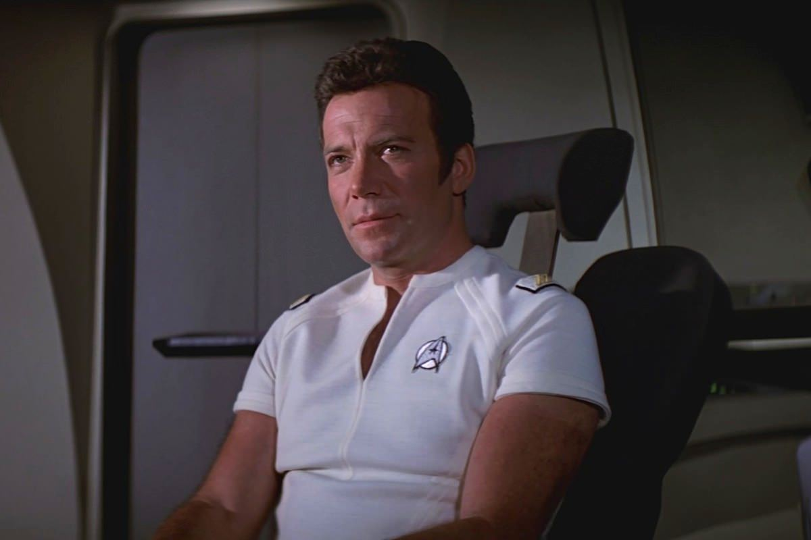
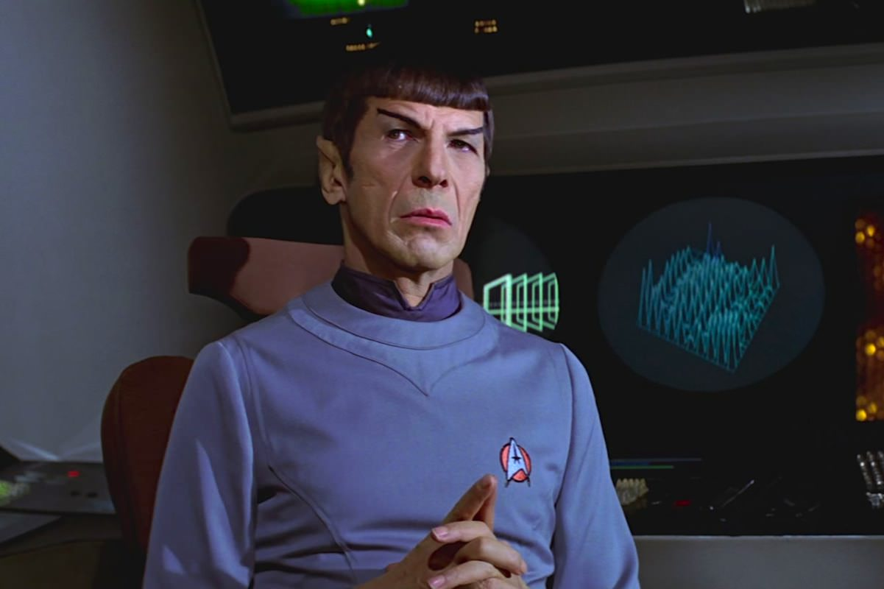

+++
type = "post"
titre = "<em>Star Trek : Le Film</em>, Robert Wise"
title = "Star Trek : Le Film, Robert Wise"
url = "/star-trek-le-film-wise"
date = "2013-05-08T19:38:00"
Lastmod = "2013-06-02T21:10:37"
cover = "star-trek-le-film-wise.jpg"
categorie = [ "À voir" ]
tag = [ "Blockbuster", "Saga", "Science-Fiction", "Star Trek" ]
createur = [ "Robert Wise" ]
acteur = [ "DeForest Kelley", "James Doohan", "Leonard Nimoy", "William Shatner" ]
annee = [ "1980" ]
weight = 1980
saga = [ "Star Trek" ]
pays = [ "États-Unis" ]
original = "Star Trek: The Motion Picture"

+++

L’univers de <em>Star Trek</em> fait partie des plus mythiques de la science-fiction, l’un des plus complet en tout cas. Créé pour une série télévisée dans les années 1960, il a migré vers le cinéma à la fin des années 1970 avec <em>Star Trek : Le Film</em>. Ce premier épisode d’une longue saga cinématographique qui n’est toujours pas terminée. Une première transposition au grand écran qui ne s’est pas fait sans difficulté, ce projet a nécessité plusieurs années de développement et le long-métrage tourné par Robert Wise prend quasiment la forme d’un pilote de série. Loin du scénario complexe d’un <a href="http://voiretmanger.fr/star-wars-episode-4-nouvel-espoir-lucas/" title="Star Wars, Épisode IV : Un nouvel espoir, George Lucas"><em>Star Wars, Épisode IV : Un nouvel espoir</em></a> auquel on le compare nécessairement, <em>Star Trek : Le Film</em> pose les bases d’une saga avec un scénario étrangement simple, voire vide. Un film culte, qui n’a pas très bien vieilli.

<em>Star Trek : Le Film</em> est une suite de la série originale, l’action se déroule donc après les évènements décrits pendant 79 épisodes. Inutile toutefois de la regarder pour comprendre ce nouvel épisode qui se suffit à lui-même et qui offre les bases pour un nouveau départ. Vous passerez sans doute à côté de quelques clins d’œil, mais le scénario mis en image par Robert Wise prend un grand soin à ne perdre aucun spectateur, et il le fait plutôt bien. Le film ouvre ainsi avec une attaque menée par un étrange nuage bleu contre trois vaisseaux spatiaux qui ne parviennent pas à se défendre et qui disparaissent en un instant, absorbés par une matière bleue d’origine inconnue. Ce nuage hostile se déplace en direction de la Terre et Starfleet — l’organisme chargé de surveiller l’espace et de défendre la planète — est mise en alerte. Elle charge James T. Kirk, l’un de ses meilleurs amiraux, d’aller à la rencontre du nuage pour éviter la destruction de la Terre et <em>Star Trek : Le Film</em> se consacre entièrement sur cette mission. On découvre qu’il va utiliser pour cela le seul vaisseau suffisamment puissant pour affronter cet ennemi inconnu, le fameux USS <em>Enterprise</em> qui fait la renommée de la saga à lui seul<a href="#footnote_0_9366" id="identifier_0_9366" class="footnote-link footnote-identifier-link" title="Ce n&rsquo;est pas le plus puissant dans l&rsquo;univers de Star Trek toutefois, comme le note un fan. L&rsquo;USS Excelsior est ainsi beaucoup plus puissant, m&ecirc;me s&rsquo;il n&rsquo;appara&icirc;t pas dans ce film.">1</a>. Ce vaisseau déjà utilisé dans la série originale vient justement d’être entièrement rénové et réparé et il est paré à reprendre du service quand <em>Star Trek : Le Film</em> commence. À son bord, on retrouve aussi les personnages clés de la série, dont le fameux Spock aux traits typiques, le mécanicien en chef Scott, le médecin McCoy et les autres membres clés de l’équipage. Robert Wise peut non seulement compter sur les personnages, mais aussi sur les acteurs qui ont tous repris leur rôle habituel, à commencer par William Shatner pour Kirk et Leonard Nimoy pour Spock. 

En plus de ce casting de rêve pour l’inscrire dans la suite de la série, <em>Star Trek : Le Film</em> bénéficie des mêmes décors. De fait, Robert Wise a réutilisé les décors qui avaient été créés pour la nouvelle série prévue avant d’être remplacée par son long-métrage. Comme dans la trilogie originale de <em>Star Wars</em>, les maquettes sont à l’honneur dans ce film et les plans généraux dans l’espace sont assez réussis, même si le rendu fait parfois plus cheap que chez George Lucas. Quand on aperçoit pour la première fois l’USS <em>Enterprise</em>, on est même gêné par un problème de proportion criant qui casse l’illusion et donne vraiment le sentiment de voir une maquette. Dommage, même s’il faut reconnaître que les décors de <em>Star Trek : Le Film</em> sont plutôt réussis, surtout ceux à l’intérieur du vaisseau spatial qui n’ont pas l’air totalement ridicules plus de trente ans après. Malgré ces points forts, Robert Wise ne parvient pas à réaliser un grand film et le problème est sans doute à chercher du côté de son origine de série télévisée. Ce premier long-métrage dure près de deux heures et quart, une durée ambitieuse qui pouvait permettre d’en dire beaucoup, mais son scénario est en fait très simple, pour ne pas dire simpliste. Une menace pèse sur la Terre, l’amiral Kirk reprend le commandement de son vaisseau, va à le rencontre de la menace et la règle : voici en gros un résumé de l’histoire de <em>Star Trek : Le Film</em>. L’intrigue tient sur quelques lignes, d’autant que le scénario ne s’intéresse pas au passé des personnages : on ne sait pas, par exemple, pourquoi Spock abandonne Vulcain. Ce n’est pas gênant pour comprendre le film, mais c’est symbolique du vide du scénario. Robert Wise prend son temps, notamment pour filmer longuement et toutes ses coutures les maquettes créées pour son film : la découverte de l’USS <em>Enterprise</em> dure plusieurs minutes et semble durer pendant une demi-heure. Plus tard, l’approche du nuage bleu prend à nouveau quelques minutes : c’est long, très long, et ce n’est pas vraiment utile. Certes, le cinéma moderne a tendance à enchainer sans aucune pause des séquences d’action, ce qui n’est pas beaucoup mieux, mais ce long-métrage est trop lent et il donne surtout le sentiment de n’être qu’un épisode de série allongé artificiellement pour tenir plus de deux heures. C’est d’autant plus gênant que, comme on l’a évoqué, les maquettes ne sont pas toujours parfaites et surtout <em>Star Trek : Le Film</em> abuse un petit peu des effets spéciaux. Sûrement réussis à l’époque, ils ont aujourd’hui mal vieilli et si le film rappelle parfois <a href="http://voiretmanger.fr/2001-odyssee-espace-kubrick/" title="2001 : l’odyssée de l’espace, Stanley Kubrick"><em>2001 : l’odyssée de l’espace</em></a>, on pense surtout à <a href="http://voiretmanger.fr/tron-lisberger/" title="Tron, Steven Lisberger"><em>Tron</em></a> sorti à la même époque et qui souffre lui aussi du poids des années à cause d’une utilisation intensive des effets spéciaux. 

Quand <em>Star Trek : Le Film</em> se termine, un message nous rappelle que ce n’est que le début, appel explicite pour un second film qui sortira d’ailleurs deux ans après. En attendant, le spectateur peut avoir le sentiment de s’être fait avoir par ce film artificiellement allongé. Robert Wise n’a pas réussi à faire oublier la série avec ce premier essai sur grand écran : le long-métrage souffre un peu d’une utilisation intensive des effets spéciaux, mais c’est surtout son scénario vide qui gêne. <em>Star Trek : Le Film</em> passionnera les fans de cet univers et ce premier film en offre d’ailleurs un aperçu prometteur, mais un aperçu seulement. La saga ne fait que commencer et ce long-métrage a au moins le mérite de poser les bases pour la suite…

<h3>Vous voulez m&rsquo;aider ?<a href="#footnote_1_9366" id="identifier_1_9366" class="footnote-link footnote-identifier-link" title="&Agrave; propos de la publicit&eacute;&hellip;">2</a></h3>
<ul>
<li><a href="http://www.amazon.fr/gp/product/B002JP9WTE/ref=as_li_ss_tl?ie=UTF8&tag=leblogdenic07-21&linkCode=as2&camp=1642&creative=19458&creativeASIN=B002JP9WTE">Acheter le film en Blu-Ray sur Amazon</a></li>
<li><a href="http://www.amazon.fr/gp/product/B002JP9WRQ/ref=as_li_ss_tl?ie=UTF8&tag=leblogdenic07-21&linkCode=as2&camp=1642&creative=19458&creativeASIN=B002JP9WRQ">Acheter le film en DVD sur Amazon</a></li>
</ul>

<ol class="footnotes"><li id="footnote_0_9366" class="footnote">Ce n&rsquo;est pas le plus puissant dans l&rsquo;univers de <em>Star Trek</em> toutefois, comme le note un fan. L&rsquo;USS <em>Excelsior</em> est ainsi beaucoup plus puissant, même s&rsquo;il n&rsquo;apparaît pas dans ce film. [<a href="#identifier_0_9366" class="footnote-link footnote-back-link">&#8617;</a>]</li><li id="footnote_1_9366" class="footnote"><a href="http://voiretmanger.fr/soutien/">À propos de la publicité…</a> [<a href="#identifier_1_9366" class="footnote-link footnote-back-link">&#8617;</a>]</li></ol>
