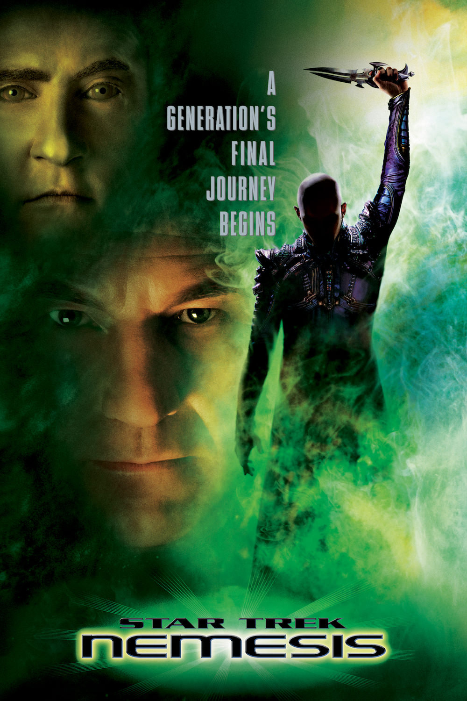
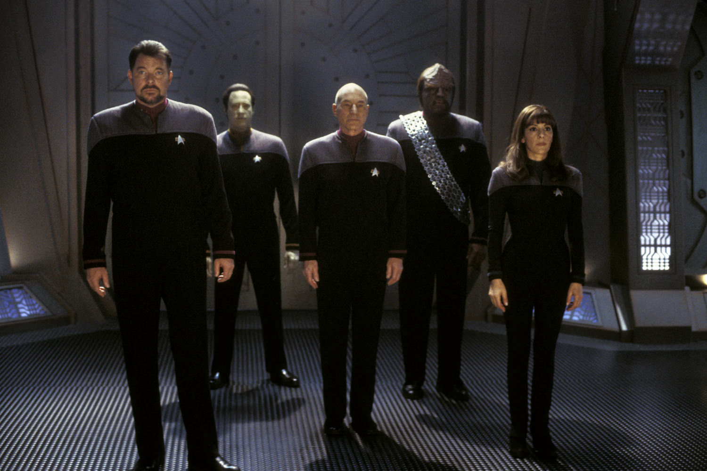
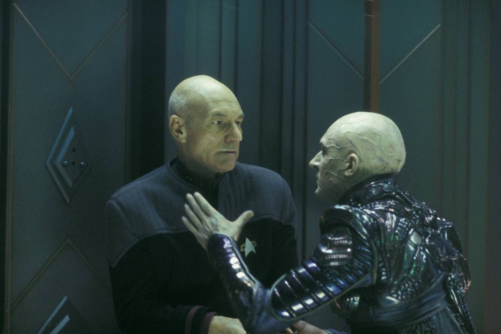

+++
titre = "<em>Star Trek : Nemesis</em>, Stuart Baird"
title = "Star Trek : Nemesis, Stuart Baird"
url = "/star-trek-nemesis-baird"
date = "2013-07-14T09:34:37"
Lastmod = "2013-07-14T09:46:36"
cover = "star-trek-nemesis-patrick-stewart-tom-hardy.jpg"
categorie = [ "À voir" ]
tag = [ "Guerre", "Science-Fiction", "Star Trek", "Vite oublié" ]
createur = [ "Stuart Baird" ]
acteur = [ "Brent Spiner", "Jonathan Frakes", "LeVar Burton", "Patrick Stewart", "Tom Hardy" ]
annee = [ "2003" ]
weight = 2003
saga = [ "Star Trek" ]
pays = [ "États-Unis" ]
original = "Star Trek: Nemesis"

+++

Dernier épisode de la saga <a href="http://voiretmanger.fr/saga/star-trek/"><em>Star Trek</em></a> avant le redémarrage mené par J.J. Abrams, <em>Star Trek : Nemesis</em> est aussi le dernier film avec l’équipe de la série <em>Star Trek : La Nouvelle Génération</em>. Une conclusion qui n’a pas été vraiment désirée, mais imposée par l’échec du long-métrage de Stuart Baird au box-office. Ce dixième film de la saga a été très mal accueilli par la critique, comme par le public et il marque bien les limites d’une saga alors aussi fatiguée que ses personnages principaux. Malgré quelques bonnes idées et une scène de combats dans l’espace comme la saga n’en avait jamais connu, <em>Star Trek : Nemesis</em> est effectivement un épisode très moyen et très oubliable. 

Pour une fois, <em>Star Trek : Nemesis</em> ne commence pas dans l’espace et dans l’USS <em>Enterprise</em>, mais sur une planète et même dans un sénat. Le film débute en effet sur un complot contre les sénateurs romuliens, l’un des peuples ennemis de la Fédération. Une bombe d’un genre nouveau tue d’un coup tous les sénateurs, c’est donc un coup d’État et une incursion brève de la politique dans la saga. Stuart Baird revient bien vite aux personnages phares de <em>Star Trek</em> toutefois, mais là encore, ce dixième épisode ne fait pas les choses comme d’habitude. On découvre ainsi un mariage — celui du second du vaisseau — mené par le capitaine Picard qui décide ensuite d’accompagner les jeunes mariés sur la planète de madame pour une lune de miel. On s’en doute, les choses ne se passeront pas aussi simplement et le capitaine reçoit l’ordre de se rendre à Romulus, où un nouveau dirigeant a pris le pouvoir. Au départ, il ne s’agit que d’une mission diplomatique, mais on s’en doute aussi, ce ne sera pas aussi simple et le capitaine Picard tombe dans un piège. Le nouveau dirigeant vient de Rémus, planète minière qui vit sous la coupe de Romulus, non loin de là. Comme on l’apprend par la suite, il s’agit d’un clone de Picard qui devait participer à un vaste complot rotulien contre la Fédération. Tout cela importe peu, il suffit de dire que <em>Star Trek : Nemesis</em> oppose le capitaine et cet homme nommé Shinzon, dans un conflit apparenté selon <a href="http://voiretmanger.fr/wp-content/2013/07/star-trek-nemesis-affiche.jpg">l’affiche française</a>. Une bonne idée en soi, mais qui est assez grossièrement exploitée par le scénario. On comprend très vite ce qui va se passer et la tentative du film de Stuart Baird pour nous faire croire que Shinzon pourrait être gentil ne fonctionne jamais. Il faut dire que le personnage est constamment du côté sombre, un symbole du mal un peu simpliste, mais qui est exploité comme tel dans le film malgré tout. 

<em>Star Trek : Nemesis</em> se concentre sur l’affrontement entre le capitaine Jean-Luc Picard et Shinzon et c’est l’occasion d’une scène de bataille spatiale particulièrement réussie. En fait, c’est peut-être la première bataille dans l’espace qui fonctionne vraiment bien depuis le début de la saga : au lieu de se contenter de quelques tirs, Stuart Baird étire cette scène et c’est une réussite. Il faut dire que le combat est pour une fois difficile : le vaisseau ennemi sait se cacher et tirer en même temps et il a des boucliers très puissants. Face à lui, l’USS <em>Enterprise</em> est petit et très mal équipé et le vaisseau culte de la saga est particulièrement maltraité. La scène est en tout cas très bien filmée, avec de l’action, du suspense et elle ne se termine pas trop rapidement comme c’est souvent le cas dans <em>Star Trek</em>. On sent bien l’influence de Stuart Baird, monteur de plusieurs films d’action. Malheureusement, pour cette séquence réussie, <em>Star Trek : Nemesis</em> enchaîne les fautes de goût jusqu’à offrir un spectacle dans l’ensemble assez moyen, même si ce n’est pas le pire de la saga. Le problème principal de ce film sorti en 2003, c’est son côté vieillot. Les effets spéciaux sont pourtant meilleurs qu’avant, la généralisation de l’informatique porte ses fruits et on apprécie les nouveaux effets. Le problème est ailleurs : les acteurs déjà ont vieilli et cela commence à se voir. Alors que ce n’était pas gênant avec l’équipe originale, on sent cette nouvelle équipe fatiguée, lassée peut-être. Patrick Stewart s’en sort plutôt bien dans son rôle de sage, on n’en dira pas autant de tous ceux qui sont autour de lui. Le pire est peut-être Brent Spiner, l’androïde qui souffre toujours d’un maquillage grossier et qui semble vieillir un peu vite pour un robot. Au-delà des acteurs, c’est l’esprit général de <em>Star Trek : Nemesis</em> qui donne ce sentiment de vieux : que dire du mariage avec violons et cuivres et fond kitch au possible ? Pourquoi diable imaginer un engin à roues sur une planète où Picard part en expédition ? Ajoutons que les maquillages des rémusiens sont, eux aussi, assez grossiers et que l’on compte encore sur quelques incohérences gênantes, comme cette ouverture de la coque du vaisseau qui ressemble simplement à une dépressurisation d’un avion…

Quand <em>Star Trek : Nemesis</em> sort, la saga a près de 40 ans d’existence et cela se voit, malheureusement. Sans être le plus mauvais <em>Star Trek</em>, cet épisode souffre d’une impression générale de lassitude assez troublante. Sont-ce les acteurs qui voulaient passer à autre chose ? Sans doute, mais le scénario y est certainement pour quelque chose aussi et on pourra penser ce que l’on veut du travail de J.J. Abrams, un reboot était certainement la meilleure chose qui puisse arriver à la saga. 

<h3>Vous voulez m&rsquo;aider ?<a href="#footnote_0_9920" id="identifier_0_9920" class="footnote-link footnote-identifier-link" title="&Agrave; propos de la publicit&eacute;&hellip;">1</a></h3>
<ul>
<li><a href=" http://www.amazon.fr/gp/product/B002JP9WX0/ref=as_li_ss_tl?ie=UTF8&#038;tag=leblogdenic07-21&#038;linkCode=as2&#038;camp=1642&#038;creative=19458&#038;creativeASIN=B002JP9WX0">Acheter le film en Blu-Ray sur Amazon</a></li>
<li><a href="http://www.amazon.fr/gp/product/B002JP9WWQ/ref=as_li_ss_tl?ie=UTF8&#038;tag=leblogdenic07-21&#038;linkCode=as2&#038;camp=1642&#038;creative=19458&#038;creativeASIN=B002JP9WWQ">Acheter le film en DVD sur Amazon</a></li>
<li><a href="https://itunes.apple.com/fr/movie/star-trek-nemesis/id610817723">Acheter ou louer le film sur l&rsquo;iTunes Store</a></li>
</ul>
<ul>
<li><a href="http://www.amazon.fr/gp/product/B00CU2ZFFG/ref=as_li_ss_tl?ie=UTF8&#038;tag=leblogdenic07-21&#038;linkCode=as2&#038;camp=1642&#038;creative=19458&#038;creativeASIN=B00CU2ZFFG">Acheter les dix premiers <em>Star Trek</em> en Blu-Ray sur Amazon</a></li>
<li><a href="http://www.amazon.fr/gp/product/B00CU2ZFEW/ref=as_li_ss_tl?ie=UTF8&#038;tag=leblogdenic07-21&#038;linkCode=as2&#038;camp=1642&#038;creative=19458&#038;creativeASIN=B00CU2ZFEW">Acheter les dix premiers <em>Star Trek</em> en DVD sur Amazon</a></li>
</ul>

<ol class="footnotes"><li id="footnote_0_9920" class="footnote"><a href="http://voiretmanger.fr/soutien/">À propos de la publicité…</a> [<a href="#identifier_0_9920" class="footnote-link footnote-back-link">&#8617;</a>]</li></ol>
