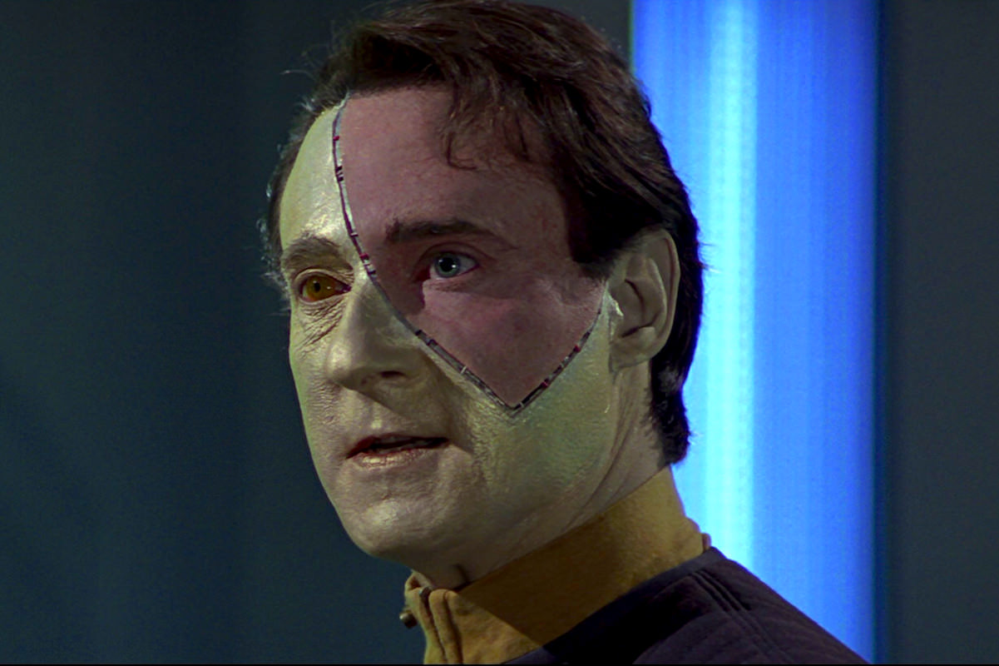
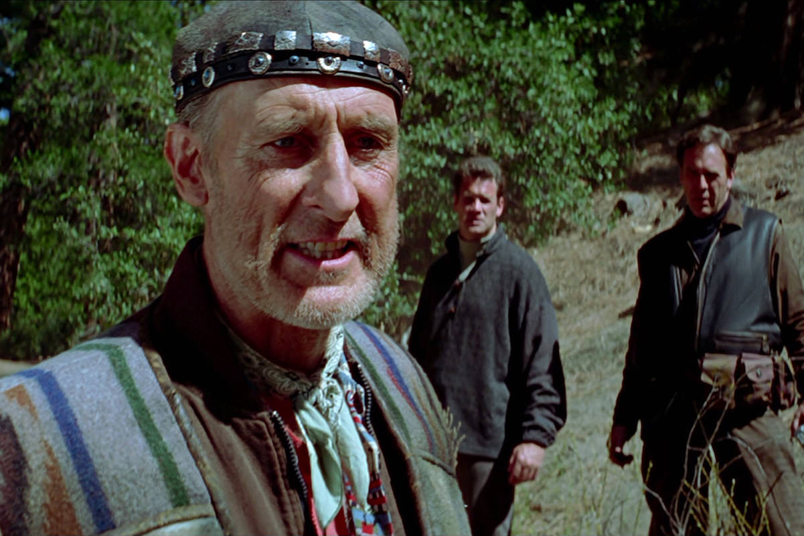

+++
type = "post"
titre = "<em>Star Trek : Premier contact</em>, Jonathan Frakes"
title = "Star Trek : Premier contact, Jonathan Frakes"
url = "/star-trek-premier-contact-frakes"
date = "2013-06-26T08:56:20"
Lastmod = "2013-06-26T09:07:45"
cover = "Star-trek-premier-contact-patrick-stewart-alica-krige.jpg"
categorie = [ "À voir" ]
tag = [ "Histoire", "Saga", "Science-Fiction", "Société", "Star Trek", "Voyage temporel" ]
createur = [ "Jonathan Frakes" ]
acteur = [ "Alfre Woodard", "Brent Spiner", "James Cromwell", "Jonathan Frakes", "Patrick Stewart" ]
annee = [ "1997" ]
weight = 1997
saga = [ "Star Trek" ]
pays = [ "États-Unis" ]
original = "Star Trek : First Contact"

+++

Après <a href="/star-trek-generations-carson/" title="Star Trek Generations, de David Carson – À voir et à manger"><em>Star Trek Generations</em></a>, un épisode de transition en demi-teinte, la saga <em>Star Trek</em> adopte enfin les nouveaux personnages de la nouvelle génération. Le capitaine Kirk et les siens sont désormais oubliés, le capitaine Picard et son équipage peuvent prendre le relais. Pour leur premier long-métrage seuls, ils doivent affronter une nouvelle menace, la plus terrible de tous les films sortis jusque-là. <em>Star Trek : Premier contact</em> fait intervenir les Borgs, une espèce en partie mécanique que l’on découvre si l’on n’a pas vu la série. Pour réaliser cet affrontement extrêmement dangereux, les producteurs font à nouveau appel à l’un des acteurs de la série et du film : Jonathan Frakes incarne aussi William Rilker, le second du capitaine Picard. Il n’a jamais réalisé de film, mais l’acteur se débrouille plutôt bien et <em>Star Trek : Premier contact</em> est un long-métrage intense et efficace, un bon film de science-fiction que l’on peut voir, même sans regarder le reste de la saga. 

Le tout premier plan de <em>Star Trek : Premier contact</em> marque la différence de ce huitième épisode avec les sept longs-métrages précédents. On découvre le capitaine Picard prisonnier dans une sorte de machine, le visage en partie recouvert de métal. L’image est sombre, le décor est sale : on est en présence d’une vision très noire que l’on n’avait pas l’habitude de voir dans la saga. De fait, il ne s’agit que d’un cauchemar, mais d’un cauchemar prémonitoire, comme le montre bien Jonathan Frakes. La Terre est menacée par les Borgs, sans doute l’espèce la plus redoutable dans l’univers <em>Star Trek</em>. Ses membres sont à moitié biologique et à moitié mécanique, ils n’ont aucune personnalité, mais sont tous reliés à une intelligence centralisée qui les commande. Bref, c’est une espèce redoutable et toute la flotte de Starfleet ne suffit pas à les arrêter. Pendant ce temps, l’USS <em>Entreprise</em> et son équipage ont pour mission de patrouiller loin des combats : comme on l’apprend petit à petit, le capitaine du vaisseau a été en contact avec ces Borgs quelques années auparavant et il est écarté par peur d’une mauvaise réaction de sa part. Dans la saga, le capitaine est souvent écarté, c’est un thème classique donc, mais que <em>Star Trek : Premier contact</em> exploite à nouveau de manière plutôt intelligente. Alors que les Borg sont en train de gagner, Picard décide d’enfreindre le règlement — autre point commun à tous les capitaines de cet univers — pour aider à défendre sa planète. Le combat a d’abord lieu dans l’espace, mais comme dans <a href="/star-trek-iv-retour-sur-terre-nimoy/" title="Star Trek IV : Retour sur Terre, Leonard Nimoy - À voir et à manger"><em>Star Trek IV : Retour sur Terre</em></a>, il se déplace vite dans le temps et on découvre alors la planète telle qu’elle était au milieu du XXIe siècle, puisque les Borg ont décidé de changer le cours de l’Histoire pour se simplifier la tâche dans le présent de la saga. 

<em>Star Trek : Premier contact</em> change de ton et de rythme et s’impose dès le départ comme un bon épisode dans la saga. Jonathan Frakes n’est certainement pas le meilleur réalisateur qui soit, mais il connaît bien cet univers dans lequel il joue depuis près de 10 ans et il a une idée assez précise de ce qu’il veut en faire. Il peut compter sur les acteurs habituels, mais aussi et surtout sur un bon scénario qui n’est pas, pour une fois, qu’un épisode dédié à la télévision et légèrement allongé. Il y a largement de quoi remplir le film et on ne s’ennuie jamais pendant près de deux heures, d’autant que le scénario est construit de manière plus subtile, mais aussi plus complexe. L’introduction sous forme de cauchemar est un bon exemple : on ne sait pas, au début, de quoi il s’agit et il faudra attendre loin dans le film pour comprendre son sens exact. <em>Star Trek : Premier contact</em> fait également intervenir une nouvelle race très travaillée, tandis que le voyage dans le temps fait toujours son effet. L’histoire ne manque pas d’idées, et de bonnes idées en plus. On apprécie le côté plus sombre de ce huitième épisode : même si les vaisseaux sont toujours trop rutilants, certains décors sont moins propres et donc plus réalistes. L’utilisation des armes rapproche le film des blockbusters et on a la meilleure scène de bataille spatiale de la saga au début du long-métrage. Tout n’est pas parfait, loin de là — on reste loin de l’intensité des combats de <a href="/saga/star-wars/"><em>Star Wars</em></a> et certains effets font toujours cheap —, mais il faut reconnaître les progrès de la saga sur cet épisode. De même, les Borg sont réussis et convaincants, avec une séquence de jeu de chat et de souris dans le vaisseau qui rappelle par moments la saga <a href="/saga/alien/"><em>Alien</em></a>. Ce sursaut de réalisme dans <em>Star Trek : Premier contact</em> est appréciable, on a enfin le sentiment de voir un vrai blockbuster et plus un film de série B totalement fauché. Même si certains effets spéciaux laissent à désirer, l’histoire est riche et passionnante, surtout avec le personnage de Zefram Cochrane, héros retenu par l’Histoire, mais qui n’est qu’un poivrot égoïste ici. Outre un scénario plus intense, on apprécie surtout le travail sur les personnages : c’est la première fois que l’on a le sentiment de voir des êtres humains réalistes. Jonathan Frakes ne filme pas des perfections et la très belle séquence entre Picard et la terrienne du XXIe siècle autour de <em>Moby Dick</em> en est une belle preuve.

La saga <em>Star Trek</em> voyage à nouveau dans le temps, vers le passé, et c’est à nouveau un épisode réussi. Étrange coïncidence pour cette saga spatiale qui n’est jamais aussi bonne que sur la surface d’une planète, même s’il serait injuste de ne pas reconnaître la qualité des séquences spatiales de <em>Star Trek : Premier contact</em>. Jonathan Frakes ne signe pas un sans-faute — si James Cromwell est excellent dans son rôle de docteur alcoolique et héros malgré lui, les autres acteurs sont souvent assez moyens —, mais son premier long-métrage est sans aucun doute parmi les meilleurs de la saga. Notons au passage que c’est aussi l’un des premiers films à expliciter tout ce qui pourrait poser problème et <em>Star Trek : Premier contact</em> se regarde sans peine, même si on n’a jamais regardé la série <em>Star Trek : La Nouvelle Génération</em>, voire si on n’a jamais regardé les épisodes précédents dans la saga. Avant d&rsquo;être un bon <em>Star Trek</em>, c’est un bon film de science-fiction tout court…

<h3>Vous voulez m’aider ?<a href="#footnote_0_9799" id="identifier_0_9799" class="footnote-link footnote-identifier-link" title="&Agrave; propos de la publicit&eacute;&hellip;">1</a></h3>
<ul>
<li><a href="http://www.amazon.fr/gp/product/B002JP9WVW/ref=as_li_ss_tl?ie=UTF8&tag=leblogdenic07-21&linkCode=as2&camp=1642&creative=19458&creativeASIN=B002JP9WVW">Acheter le film en Blu-Ray sur Amazon</a></li>
<li><a href="http://www.amazon.fr/gp/product/B002JP9WVM/ref=as_li_ss_tl?ie=UTF8&tag=leblogdenic07-21&linkCode=as2&camp=1642&creative=19458&creativeASIN=B002JP9WVM">Acheter le film en DVD sur Amazon</a></li>
<li><a href="https://itunes.apple.com/fr/movie/star-trek-premier-contact/id369841968">Acheter ou louer le film sur l’iTunes Store</a></li>
</ul>
<ul>
<li><a href="http://www.amazon.fr/gp/product/B00CU2ZFFG/ref=as_li_ss_tl?ie=UTF8&tag=leblogdenic07-21&linkCode=as2&camp=1642&creative=19458&creativeASIN=B00CU2ZFFG">Acheter les dix premiers <em>Star Trek</em> en Blu-Ray sur Amazon</a></li>
<li><a href="http://www.amazon.fr/gp/product/B00CU2ZFEW/ref=as_li_ss_tl?ie=UTF8&tag=leblogdenic07-21&linkCode=as2&camp=1642&creative=19458&creativeASIN=B00CU2ZFEW">Acheter les dix premiers <em>Star Trek</em> en DVD sur Amazon</a></li>
</ul>

<ol class="footnotes"><li id="footnote_0_9799" class="footnote"><a href="/soutien/">À propos de la publicité…</a> [<a href="#identifier_0_9799" class="footnote-link footnote-back-link">&#8617;</a>]</li></ol>
