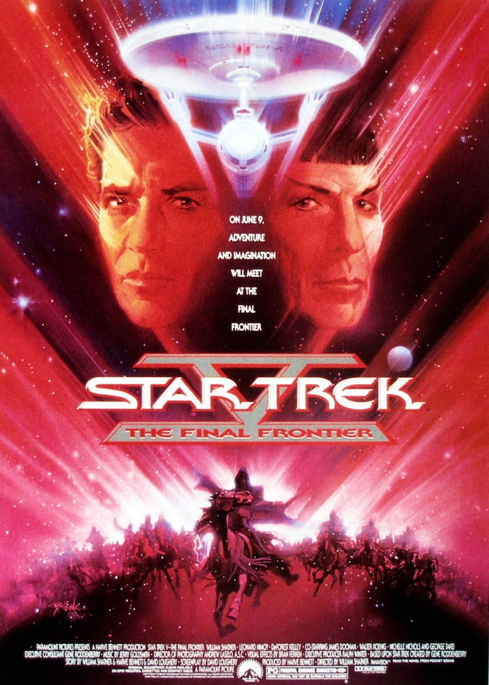
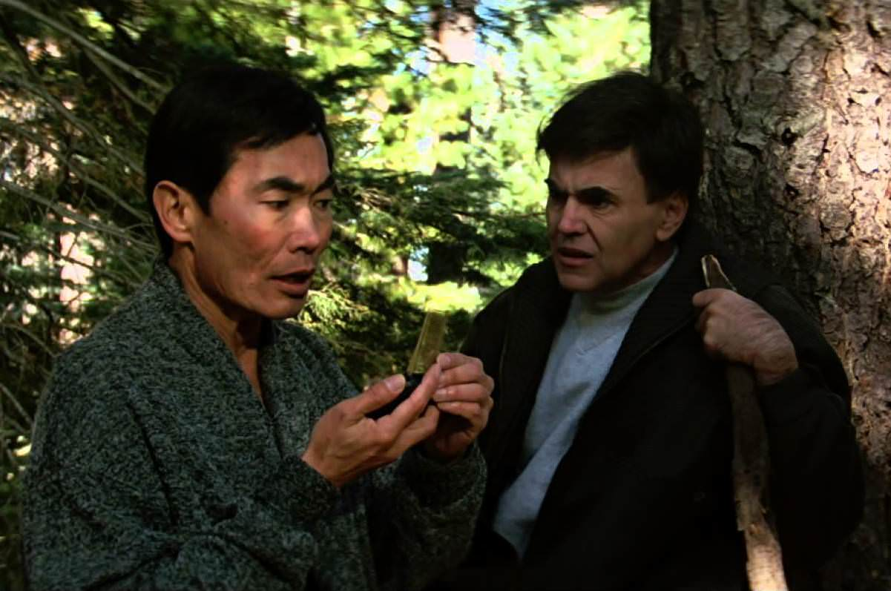

+++
type = "post"
titre = "<em>Star Trek V : L&rsquo;Ultime frontière</em>, William Shatner"
title = "Star Trek V : L'Ultime frontière, William Shatner"
url = "/star-trek-v-ultime-frontiere-shatner"
date = "2013-06-17T10:10:22"
Lastmod = "2013-06-15T11:51:56"
cover = "star-trek-V-ultime-frontiere-william-shatner-leonard-nimoy.jpg"
categorie = [ "À voir" ]
tag = [ "Humour", "Religion", "Saga", "Science-Fiction" ]
createur = [ "William Shatner" ]
acteur = [ "DeForest Kelley", "James Doohan", "Laurence Luckinbill", "Leonard Nimoy", "William Shatner" ]
annee = [ "1989" ]
weight = 1989
saga = [ "Star Trek" ]
pays = [ "États-Unis" ]
original = "Star Trek V: The Final Frontier"

+++

Depuis le second épisode, la saga <em>Star Trek</em> se suit de film en film, formant un tout cohérent. <em>Star Trek V : L’Ultime frontière</em> se déroule ainsi juste après les évènements de <a href="/star-trek-iv-retour-sur-terre-nimoy/" title="Star Trek IV : Retour sur Terre, Leonard Nimoy"><em>Star Trek IV : Retour sur Terre</em></a> qui, comme son nom l’indique bien, a lieu essentiellement sur la terre et loin de l’espace. Ce nouvel épisode se rapproche des précédents en retrouvant l’espace, mais le long-métrage dirigé à nouveau par un acteur de la saga — William Shatner qui incarne aussi James T. Kirk — est baigné dans une ambiance étrange. Plus proche du film de vieux potes que du <em>Space Opera</em>, cet épisode étonnant s’avère plutôt plaisant, même si son scénario est assez ridicule. 

<em>Star Trek V : L’Ultime frontière</em> reprend sur Terre et même… dans le parc de Yosemite. L’équipe de l’USS <em>Enterprise</em> y prend des vacances bien méritées après les aventures des épisodes précédents. On retrouve ainsi James T. Kirk, Spock et le docteur McCoy dans le parc, à se chamailler en permanence : le premier a des envies d’aventures extrêmes et il monte sur des falaises sans s’inquiéter du reste ; le second et le troisième ne peuvent pas se supporter. On a déjà vu ces personnages et leurs contentions, mais William Shatner réussit plutôt bien à exploiter ce trio qui tend toujours au comique et les voir se chamailler est assez amusant, à défaut d’être très original dans la saga. Bien vite, le devoir les rappelle toutefois et la permission est interrompue par une crise sur Nimbus III, une planète neutre où humains, Klingons et Romuliens sont censés vivre en paix. Les trois ambassadeurs ont été pris en otage et ce sont les héros habituels de <em>Star Trek</em> qui s’y collent et partent pour la planète. Sur place, ils mènent l’assaut uniquement pour s’apercevoir qu’il s’agissait d’un piège : Sybok qui était censé avoir pris les trois autres en otage était en fait de mèche avec eux pour voler le vaisseau spatial. Son objectif : rencontrer Dieu, rien que ça. <em>Star Trek V : L’Ultime frontière</em> porte bien son nom, puisqu’à partir de cet instant, le film est habité par des thèmes religieux. Disons-le, ce n’est pas le point fort de ce cinquième épisode et William Shatner a beau faire ce qu’il peut pour laisser planer le doute sur l’identité de l’être qu’il va filmer, le scénario reste très clair sur sa divinité. Sur le papier déjà, l’idée n’était pas très bonne, c’est encore pire à l’écran. 

Au-delà des effets spéciaux plus mauvais que d’habitude — ILM qui s’en chargeait jusque-là n’était pas disponible pour cet épisode, et cela se voit —, l’idée même de représenter Dieu est grotesque. La fin de <em>Star Trek V : L’Ultime frontière</em> est à cet égard très mauvaise et beaucoup trop sérieuse, ce qui est d’autant plus frustrant que la première partie, au contraire beaucoup plus légère et elle fonctionne bien mieux. C’est la particularité de ce cinquième film tourné, à nouveau, par un acteur : William Shatner semble prendre beaucoup de plaisir à ses filmer aux cotés de Leonard Nimoy et de DeForest Kelley et même si les trois acteurs ne sont pas particulièrement brillants, leur complicité fait mouche. <em>Star Trek V : L’Ultime frontière</em> exploite tout particulièrement le sentiment qui nait des longues sagas ou séries : on connait très bien les personnages que les voir peut suffire. Malheureusement, cela ne suffit pas et le film retombe vite dans les travers de la saga. On a déjà évoqué le grotesque du final divin, on pourrait aussi citer le rôle des Klingons, réduits ici à une bande de décérébrés tellement stupides et idiots qu’ils deviennent amusants alors qu’ils sont censés être un minimum impressionnants. Ce cinquième volet a été un échec si retentissant aux États-Unis qu’il a bien failli mettre un terme définitif à la saga : c’est peut-être un peu injuste pour ce <em>Star Trek V : L’Ultime frontière</em> qui n’est sans doute pas le pire de la saga. Il est vrai toutefois qu’il souffre de plusieurs défauts vraiment gênants : après un quatrième épisode assez bon, c’est dommage…

William Shatner réalise pour la première fois un film et c’est la deuxième fois qu’un acteur de la saga passe à la réalisation. Une spécificité de <em>Star Trek</em> qui n’a pas porté chance à celui qui a incarné pour la première fois le rôle de James T. Kirk. <em>Star Trek V : L’Ultime frontière</em> n’est pas aussi mauvais qu’on a pu le dire, mais cet épisode souffre principalement de son idée de quête divine. C’est une idée beaucoup trop sérieuse et c’est grotesque à l’écran, bref c’était la chose à ne pas faire. Reste une première partie légère et plutôt amusante, à défaut d’être très originale ou intéressante. Ce qui nous amène à la même conclusion que pour <em>Star Trek IV : Retour sur Terre</em> : la saga est meilleure sur la surface terrestre. Paradoxal pour une licence de science-fiction aussi fameuse…

<h3>Vous voulez m&rsquo;aider ?<a href="#footnote_0_9716" id="identifier_0_9716" class="footnote-link footnote-identifier-link" title="&Agrave; propos de la publicit&eacute;&hellip;">1</a></h3>
<ul>
<li><a href="http://www.amazon.fr/gp/product/B002JP9WUI/ref=as_li_ss_tl?ie=UTF8&tag=leblogdenic07-21&linkCode=as2&camp=1642&creative=19458&creativeASIN=B002JP9WUI">Acheter le film en Blu-Ray sur Amazon</a></li>
<li><a href="http://www.amazon.fr/gp/product/B002JP9WSU/ref=as_li_ss_tl?ie=UTF8&tag=leblogdenic07-21&linkCode=as2&camp=1642&creative=19458&creativeASIN=B002JP9WSU">Acheter le film en DVD sur Amazon</a></li>
<li><a href="https://itunes.apple.com/fr/movie/star-trek-v-lultime-frontier/id610074888">Acheter ou louer le film sur l&rsquo;iTunes Store</a></li>
</ul>
<ul>
<li><a href="http://www.amazon.fr/gp/product/B00CU2ZFFG/ref=as_li_ss_tl?ie=UTF8&tag=leblogdenic07-21&linkCode=as2&camp=1642&creative=19458&creativeASIN=B00CU2ZFFG">Acheter les dix premiers <em>Star Trek</em> en Blu-Ray sur Amazon</a></li>
<li><a href="http://www.amazon.fr/gp/product/B00CU2ZFEW/ref=as_li_ss_tl?ie=UTF8&tag=leblogdenic07-21&linkCode=as2&camp=1642&creative=19458&creativeASIN=B00CU2ZFEW">Acheter les dix premiers <em>Star Trek</em> en DVD sur Amazon</a></li>
</ul>

<ol class="footnotes"><li id="footnote_0_9716" class="footnote"><a href="/soutien/">À propos de la publicité…</a> [<a href="#identifier_0_9716" class="footnote-link footnote-back-link">&#8617;</a>]</li></ol>
