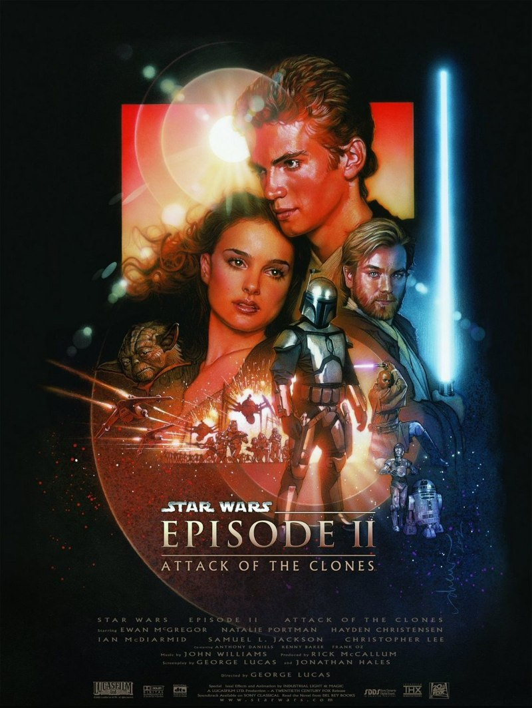
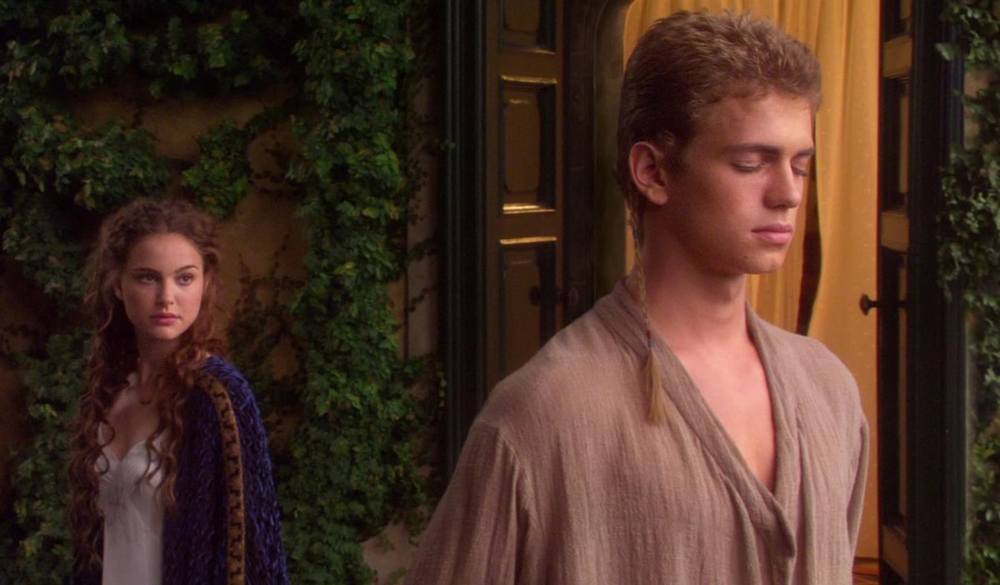
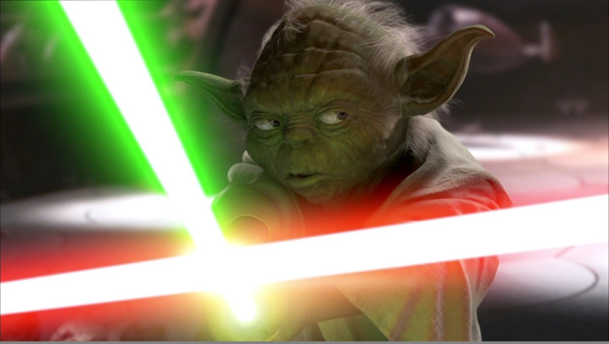

+++
type = "post"
titre = "<em>Star Wars, Épisode II : L&rsquo;Attaque des clones</em>, George Lucas"
title = "Star Wars, Épisode II : L'Attaque des clones, George Lucas"
url = "/star-wars-episode-2-attaque-clones-lucas"
date = "2012-05-26T00:44:06"
Lastmod = "2015-02-01T15:42:50"
cover = "star-wars-episode-II-attaque-clones-lucas-1.jpg"
categorie = [ "À voir" ]
tag = [ "Amour", "Blockbuster", "Guerre", "Politique", "Romance", "Saga", "Science-Fiction", "Star Wars" ]
createur = [ "George Lucas" ]
acteur = [ "Christopher Lee", "Ewan McGregor", "Hayden Christensen", "Natalie Portman", "Samuel L Jackson" ]
annee = [ "2002" ]
weight = 2002
saga = [ "Star Wars" ]
pays = [ "États-Unis" ]
original = "Star Wars: Episode II - Attack of the Clones"

+++

Avec <em><a href="http://voiretmanger.fr/2012/02/12/star-wars-1-menace-fantome-lucas/">Star Wars, Épisode I : La Menace fantôme</a></em>, George Lucas offrait à sa mythique saga une ouverture assez poussive, hésitant continuellement entre les ambiances et les genres. <em>Star Wars, Épisode II : L&rsquo;Attaque des clones</em> change de registre. Fini l&rsquo;humour pour enfants de l&rsquo;épisode précédent, l&rsquo;intrigue centrale de la saga se met en place avec un film placé sous le signe des transformations d&rsquo;Anakin Skywalker. Celui qui tombera bientôt du côté obscur de la force est alors un jeune homme qui peine à maîtriser ses émotions à une époque où les enjeux politiques prennent toute leur envergure. Au total, <em>Star Wars, Épisode II : L&rsquo;Attaque des clones</em> est un film partiellement réussi seulement, mais qui reste passionnant par sa position clé dans la saga.

La prélogie <em>Star Wars</em> suit le parcours d&rsquo;Anakin Skywalker. Le premier épisode était l&rsquo;occasion de le découvrir tout jeune, alors qu&rsquo;il n&rsquo;est encore qu&rsquo;un esclave sur la planète Naboo. On le quittait à la fin du film tout aussi jeune, mais en passe de commencer sa formation pour devenir Jedi. Dans <em>Star Wars, Épisode II : L&rsquo;Attaque des clones</em>, Anakin a grandi, il a un peu moins de vingt ans, mais il n&rsquo;est pas encore un Jedi. Ce Padawan est toujours sous la direction et l&rsquo;enseignement d&rsquo;Obi-Wan Kenobi et c&rsquo;est ensemble qu&rsquo;ils arrivent sur la planète Coruscant, le cœur de la République. La sénatrice Padmé Amidala vient de survivre à un attentat et le Jedi et son élève sont chargés d&rsquo;assurer sa sécurité. Anakin et Padmé ne se sont pas vus depuis une dizaine d&rsquo;années et on comprend vite que le jeune homme est fou amoureux de la sénatrice. Pour assurer sa protection, Anakin accompagne Padmé sur Tatooïne, puis sur d&rsquo;autres planètes tandis qu&rsquo;Obi-Wan Kenobi déjoue un complot contre la République. Désemparé et impuissant, ce régime démocratique qui tenait pourtant depuis plusieurs siècles vacille et donne alors les pleins pouvoirs à Palpatine. Une erreur tragique, comme on le comprend bien trop tard…

Contrairement à <em>Star Wars, Épisode I : La Menace fantôme</em> qui était assez resserré, le deuxième épisode de la saga propose une double intrigue avec d&rsquo;un côté la naissance de l&rsquo;amour entre Anakin et Padmé, et de l&rsquo;autre les intrigues politiques. Deux niveaux qui se déploient en parallèle, mais qui ne sont pas d&rsquo;un intérêt égal. <em>Star Wars, Épisode II : L&rsquo;Attaque des clones</em> reste d&rsquo;abord et avant tout un blockbuster d&rsquo;action et le spectacle est d&rsquo;ailleurs au rendez-vous, mais George Lucas y ménage une place importante pour les enjeux stratégico-politiques. Ces questions étaient globalement absentes de la trilogie initiale, mais elles sont assez présentes dans la prélogie où elles prennent d&rsquo;ailleurs de plus en plus d&rsquo;espace. Dans ce film de transition avant la conclusion déroulée dans <a href="http://voiretmanger.fr/2012/05/28/star-wars-episode-3-revanche-sith-lucas/" title="Star Wars, Épisode III : La Revanche des Sith, George Lucas"><em>Star Wars, Épisode III : La Revanche des Siths</em></a>, les différentes positions ne se sont pas encore dévoilées. Le spectateur découvre à la fin du film l&rsquo;identité de Dark Sidious, le maître de Dark Vador dans la trilogie, mais <em>Star Wars, Épisode II : L&rsquo;Attaque des clones</em> est plein de questions, plus que de réponses. On sait que les Siths, ennemis des Jedis, veulent prendre possession de la République pour mieux la détruire ; on découvre aussi l&rsquo;armée de clones que tous ceux qui ont vu la trilogie reconnaîtront comme étant les troupes ennemies, mais qui sont ici les alliés. Les positions sont encore floues, les Jedis sont encore une force extrêmement puissante, bref : le conflit ne fait que commencer.

Au cœur du conflit justement, le personnage d&rsquo;Anakin Skywalker est le personnage central qui peut tout changer. Dans l&rsquo;épisode précédent, les qualités exceptionnelles du petit garçon avaient été évoquées et on entendait parler pour la première fois d&rsquo;une prophétie. Anakin était appelé à réaliser de grandes choses, mais personne et pas même Yoda ne savait dire s&rsquo;il allait s&rsquo;agit de choses positives ou négatives. <em>Star Wars, Épisode II : L&rsquo;Attaque des clones</em> est à cet égard crucial, puisqu&rsquo;il est l&rsquo;épisode du basculement. Personnage positif au départ, il commence ici à dévoiler ses aspects sombres, tout en restant néanmoins positif jusqu&rsquo;au bout. George Lucas a la bonne intuition de ne pas donner de réponses trop rapidement et de ménager le suspense : c&rsquo;est dans le troisième épisode que l&rsquo;on aura des confirmations, même si les évènements relatés ici sont décisifs. Loin des enjeux politiques qui secouent l&rsquo;univers connu, le jeune Anakin est préoccupé par des problèmes bien plus terre à terre. Le jeune homme qui vient à peine de quitter l&rsquo;adolescence connait ses premiers émois et il veut séduire Padmé, la femme qu&rsquo;il a toujours aimé. Leur différence d&rsquo;âge, très sensible dans <em>Star Wars, Épisode I : La Menace fantôme</em> n&rsquo;est ici plus qu&rsquo;un mauvais souvenir et la cour du jeune homme peut commencer. Une partie importante du film est ainsi consacrée aux deux personnages et à leur amour naissant, avec un succès pour le moins mitigé.

George Lucas a inventé l&rsquo;un des univers de science-fiction les plus riches qui soient, mais il faut reconnaître qu&rsquo;il fait un piètre scénariste et surtout dialoguiste. Les dialogues sont de manière générale assez médiocres dans <em>Star Wars, Épisode II : L&rsquo;Attaque des clones</em>, ils deviennent même embarrassants dès qu&rsquo;ils sont censés évoquer l&rsquo;amour de Padmé et Anakin. La niaiserie des dialogues n&rsquo;a d&rsquo;égale que le kitsch des décors pour un résultat particulièrement ridicule. Fort heureusement, George Lucas se rattrape avec ce qu&rsquo;il sait faire de mieux : les combats spatiaux et sur les planètes. Certes, <em>Star Wars</em> n&rsquo;a pas révolutionné le genre, mais l&rsquo;univers visuel qu&rsquo;il déploie est extrêmement efficace et les batailles sont ici assez spectaculaires, surtout celles qui opposent à la fin droïdes et clones. Les combats de sabres restent également un classique de la saga et <em>Star Wars, Épisode II : L&rsquo;Attaque des clones</em> propose quelques combats d&rsquo;anthologie, dont un duel très efficace avec Yoda. On est loin des combats empesés de la trilogie initiale, la technologie a évolué et cela se voit. Ce qui se voit aussi, c&rsquo;est le poids des années : sorti en 2002, le deuxième opus de la saga fait partie des premiers films à utiliser abondamment les effets spéciaux et George Lucas a fait un travail remarquable pour l&rsquo;époque. Reste qu&rsquo;aujourd&rsquo;hui, les fonds numériques font vraiment toc. Le film n&rsquo;a pas moins bien vieilli que <em>Star Wars, Épisode I : La Menace fantôme</em>, mais la version parfaitement nette et sans 3D proposée par le Blu-Ray fait mieux ressentir encore la différence technologique.

Au-delà des effets spéciaux, <em>Star Wars, Épisode II : L&rsquo;Attaque des clones</em> met aussi en scène des personnages et donc des acteurs. Le film confirme le choix plutôt judicieux d&rsquo;Ewan McGregor, tandis que Natalie Portman est convaincante même avec ses costumes et coiffes excentriques. À côté, le jeune Hayden Christensen que le public — féminin essentiellement — a pu découvrir à cette occasion a été embauché d&rsquo;abord pour son joli minois. Son jeu en revanche n&rsquo;est pas des plus fins, ce qui est plutôt dommage pour un rôle aussi complexe que celui d&rsquo;Anakin. Heureusement, Christopher Lee et Samuel L. Jackson remontent un peu le niveau dans des prestations et des rôles toutefois assez convenus. Comme dans toute la saga <em>Star Wars</em>, la musique composée par John Williams joue un rôle à part entière. Ici, elle a notamment une fonction très précise : en faisant entendre les notes du thème de Dark Vador à plusieurs moments, la musique parvient à faire comprendre au spectateur ce qui n&rsquo;était pas encore explicite…

<em>Star Wars, Épisode II : L&rsquo;Attaque des clones</em> n&rsquo;est pas le meilleur épisode de la saga, la faute à une intrigue amoureuse bien trop ridicule pour être un tant soit peu intéressante. L&rsquo;avant-dernier film réalisé par George Lucas n&rsquo;est pas inintéressant pour autant dans l&rsquo;univers et dans la saga <em>Star Wars</em>. Cet épisode est en effet un moment clé dans le développement de l&rsquo;intrigue autour de Dark Vador. On peut regretter que la partie politique soit trop peu développée, mais il ne faut pas oublier que <em>Star Wars, Épisode II : L&rsquo;Attaque des clones</em> reste d&rsquo;abord un blockbuster censé offrir des sensations fortes et le spectacle est toujours au rendez-vous dix ans après.

<h3>Vous voulez m&rsquo;aider ?<a href="#footnote_0_6547" id="identifier_0_6547" class="footnote-link footnote-identifier-link" title="&Agrave; propos de la publicit&eacute;&hellip;">1</a></h3>
<ul>
<li><a href="http://www.amazon.fr/gp/product/B000067UZU/ref=as_li_ss_tl?ie=UTF8&amp;tag=leblogdenic07-21&amp;linkCode=as2&amp;camp=1642&amp;creative=19458&amp;creativeASIN=B000067UZU">Acheter le film en DVD sur Amazon</a></li>
<li><a href="http://www.amazon.fr/gp/product/B004HYGSXS/ref=as_li_ss_tl?ie=UTF8&amp;tag=leblogdenic07-21&amp;linkCode=as2&amp;camp=1642&amp;creative=19458&amp;creativeASIN=B004HYGSXS">Acheter la saga complète en Blu-Ray sur Amazon</a></li>
<li><a href="http://itunes.apple.com/fr/album/star-wars-episode-2-lattaque/id298180753">Acheter la bande originale du film l&rsquo;iTunes Store</a></li>
</ul>

<ol class="footnotes"><li id="footnote_0_6547" class="footnote"><a href="http://voiretmanger.fr/soutien/">À propos de la publicité…</a> [<a href="#identifier_0_6547" class="footnote-link footnote-back-link">&#8617;</a>]</li></ol>
