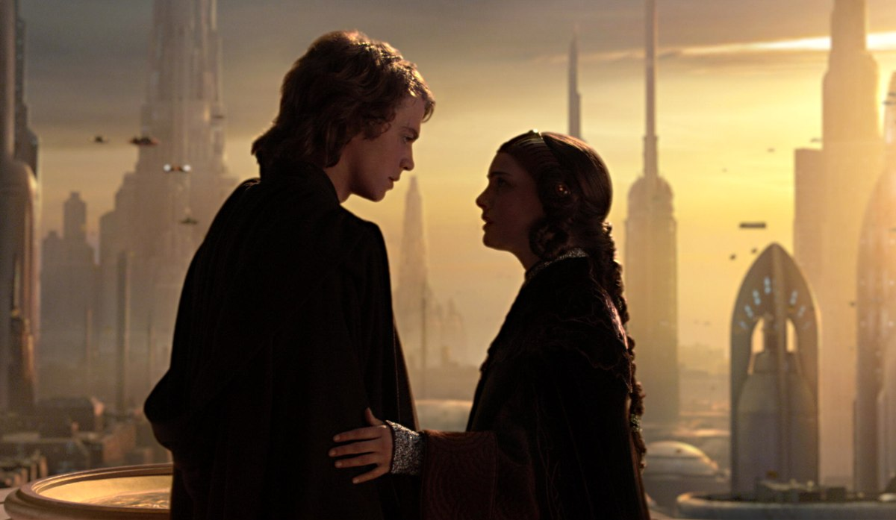
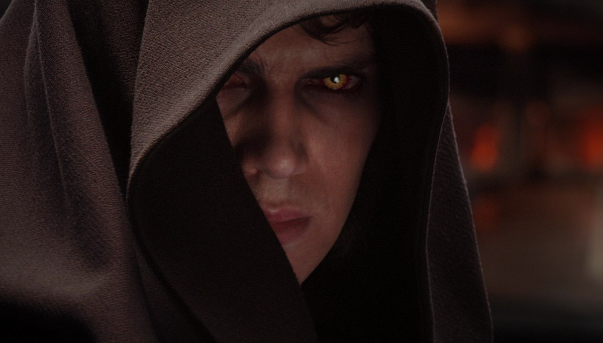

+++
type = "post"
titre = "<em>Star Wars, Épisode III : La Revanche des Sith</em>, George Lucas"
title = "Star Wars, Épisode III : La Revanche des Sith, George Lucas"
url = "/star-wars-episode-3-revanche-sith-lucas"
date = "2012-05-28T19:12:10"
Lastmod = "2014-11-28T17:46:13"
cover = "star-wars-episode-3-lucas-dark-vado.jpg"
categorie = [ "À voir" ]
tag = [ "Action", "Amour", "Guerre", "Politique", "Saga", "Science-Fiction", "Star Wars" ]
createur = [ "George Lucas" ]
acteur = [ "Ewan McGregor", "Hayden Christensen", "Ian McDiarmid", "Natalie Portman" ]
annee = [ "2005" ]
weight = 2005
saga = [ "Star Wars" ]
pays = [ "États-Unis" ]
original = "Star Wars Episode III : Revenge of the Sith"

+++

Le dernier épisode de la prélogie <em>Star Wars</em> a une lourde tâche. George Lucas ayant décidé de commencer son immense saga par la fin — enfin, le milieu à l&rsquo;origine —, il a commencé par tourner les épisodes IV à VI avant de se pencher sur les trois premiers. <em>Star Wars, Épisode III : La Revanche des Sith</em> a dès lors une place toute particulière puisque le film doit faire la transition entre une trilogie tournée dans les années 2000 et une autre trilogie filmée au tournant des années 1980. La cohérence scénaristique force le respect et montre bien que George Lucas avait tout prévu : voir ainsi toutes les pièces du puzzle se rassembler pour conduire à <a href="/2012/06/03/star-wars-episode-4-nouvel-espoir-lucas/" title="Star Wars, Épisode IV : Un nouvel espoir, George Lucas"><em>Star Wars, Épisode IV : Un nouvel espoir</em></a> est certainement la plus grande réussite de cet épisode par ailleurs assez ridicule dès lors qu&rsquo;il est question de sentiments.

Entièrement consacrée à Anakin Skywalker, la prélogie complète la formation du jeune homme avec ce troisième épisode. Remarqué pour la première fois par un Jedi dans <a href="/2012/02/12/star-wars-1-menace-fantome-lucas/"><em>Star Wars, Épisode I : La Menace fantôme</em></a>, il avait été formé par Obi Wan Kenobi dans <a href="/2012/05/26/star-wars-episode-2-attaque-clones-lucas/"><em>Star Wars, Épisode II : L&rsquo;Attaque des clones</em></a>, un épisode au cours duquel il avait aussi découvert l&rsquo;amour. Dans <em>Star Wars, Épisode III : La Revanche des Sith</em>, le jeune Padawan complète sa formation et tombe vers le côté obscur de la Force sous l&rsquo;emprise du redoutable Dark Sidious qui n&rsquo;est autre que le Seigneur Palpatine comme on le pressentait fortement précédemment. Ce fin stratège et machiavélique politique a créé la guerre qui secoue la République pour mieux assoir son pouvoir et les Jedis sont tombés dans le panneau. Leur dispersion aux quatre coins de l&rsquo;univers permet au vil Chancelier de prendre les pleins pouvoirs, tout en gardant au plus près de lui Anakin. Le jeune homme est comblé côté amour après avoir épousé Padmé et alors qu&rsquo;il s&rsquo;apprête à devenir papa. Son ambition est toutefois si forte qu&rsquo;il se désespère de devenir, un jour, maître Jedi et la méfiance de ses pairs le rend suspicieux. Un terrain idéal pour permettre à Palpatine de l&rsquo;attirer de son côté. Cet épisode porte bien son nom : avec le retour des Sith sur le devant de la scène, l&rsquo;heure est grave pour les Jedis qui sont vite forcés à l&rsquo;exil, en attendant le retour de l&rsquo;espoir…

Le deuxième épisode était déjà beaucoup plus sérieux, <em>Star Wars, Épisode III : La Revanche des Sith</em> perd vite toute trace d&rsquo;humour. Les premières minutes sont assez légères : comme dans tous les films de la saga, George Lucas ouvre sur une scène dans l&rsquo;espace, et en l&rsquo;occurrence au cœur d&rsquo;une bataille spatiale. La guerre fait rage entre les clones de la République et les droïdes des séparatistes et on y retrouve Anakin et Obi-Wan, chacun dans son vaisseau. La bataille est très difficile pour le camp des gentils, mais la légèreté est encore de mise, avec en particulier le petit robot R2D2 qui assure le spectacle. Très vite pourtant, le ton change et la mine inquiète de Yoda ne trompe pas : l&rsquo;heure des blagues a fini, le côté obscur de la Force prend le dessus. <em>Star Wars, Épisode III : La Revanche des Sith</em> est sans doute l&rsquo;épisode le plus politique de toute la saga. Au fur et à mesure que le chancelier Palpatine dévoile sa vraie nature, on comprend l&rsquo;ampleur de son plan : depuis le premier épisode, c&rsquo;est lui qui manipule tout, c&rsquo;est lui qui a provoqué la guerre et qui a séparé pour mieux régner. Le coup d&rsquo;État est très simple tant il a réussi à berner tout le monde, jusqu&rsquo;aux Jedi qui se méfient de lui depuis le début, mais n&rsquo;ont jamais réussi à le cerner vraiment. George Lucas crée un tyran assez conventionnel qui rappelle les grands dictateurs de notre histoire, Hitler en tête. Palpatine prend le pouvoir sous couvert de nobles causes : il est censé assurer la sécurité de la République, garantir la paix dans la galaxie… des arguments connus qui passent tout naturellement.

La trilogie qui suit passe ces problématiques politiques sous silence et <em>Star Wars, Épisode III : La Revanche des Sith</em> apporte enfin les réponses aux questions que tous les fans pouvaient se poser. À cet égard, cet épisode est passionnant, mais Palpatine n&rsquo;est pas qu&rsquo;un fin stratège, il réussit aussi à convertir Anakin Skywalker. Dans les deux épisodes précédents, le garçon puis le jeune homme n&rsquo;était jamais seul, il était toujours accompagné de son maître Obi Wan Kenobi. L&rsquo;heure est à l&rsquo;indépendance et, en quelque sorte, le jeune Anakin passe à l&rsquo;âge adulte après l&rsquo;enfance dans <em>Star Wars, Épisode I : La Menace fantôme</em> et l&rsquo;adolescence dans <em>Star Wars, Épisode II : L&rsquo;Attaque des clones</em>. L&rsquo;heure est aux choix et comme tous les jeunes hommes amoureux, Anakin choisit l&rsquo;amour. George Lucas a la bonne intuition en faisant de Padmé le déclencheur du passage vers le côté obscur de son personnage principal, mais il a manqué cruellement de finesse dans l&rsquo;écriture des dialogues. Qu&rsquo;importe si l&rsquo;intégralité des scènes où l&rsquo;émotion est censée envahir l&rsquo;écran est totalement ridicule, qu&rsquo;importe aussi si les arguments de Palpatine manquent cruellement de finesse, qu&rsquo;importe enfin si la conversion d&rsquo;Anakin semble bien précipitée… L&rsquo;idée reste intéressante et là encore, les implications que l&rsquo;on peut relever avec les épisodes IV à VI sont nombreuses. Commencer par la fin est un exercice difficile et George Lucas l&rsquo;a parfaitement réussi, du moins sur le plan de l&rsquo;histoire.

C&rsquo;est sur le plan technique que la transition entre la prélogie et la trilogie passe le moins bien. <em>Star Wars, Épisode III : La Revanche des Sith</em> est le dernier film de la saga à avoir été tourné et George Lucas a bénéficié des effets spéciaux et des techniques modernes. Cela se voit : jamais les effets spéciaux n&rsquo;ont été aussi nombreux que dans cet épisode où le cinéaste et ses équipes se sont permis toutes les folies. Certains décors ont été tournés en décors naturels, mais l&rsquo;essentiel provient de studios où les fonds verts étaient très présents. Techniquement, le film a très peu vieilli et on est loin des décors numériques beaucoup trop visibles des épisodes I et II, plus loin encore des décors de carton-pâte et des maquettes des épisodes IV à VI. Sans évoquer de jugement personnel quant à l&rsquo;intérêt d&rsquo;une technique plutôt qu&rsquo;une autre, il est vrai que ces nouveaux moyens donnent à George Lucas beaucoup de liberté et certaines scènes de <em>Star Wars, Épisode III : La Revanche des Sith</em> sont particulièrement réussies sur le plan visuel. Le duel entre Yoda et Dark Sidious dans le Parlement fait partie des moments forts, tandis que le duel entre Anakin et Obi Wan dans la lave est lui aussi assez impressionnant (même si la technique du fond vert est ici plus visible… les effets spéciaux vieillissent toujours trop vite…).

On a déjà eu l&rsquo;occasion de l&rsquo;évoquer, <em>Star Wars, Épisode III : La Revanche des Sith</em> n&rsquo;est pas aidé par ses dialogues qui sonnent souvent faux, quand ils ne sont pas tout bonnement ridicules. C&rsquo;est particulièrement vrai pour toutes les scènes de couple entre Anakin et Padmé, mais il est vrai que les acteurs ne facilitent pas la tâche du film. Hayden Christensen a vieilli depuis <em>Star Wars, Épisode II : L&rsquo;Attaque des clones</em>, ses muscles se sont affermis, mais pas son jeu d&rsquo;acteur qui reste toujours aussi moyen — c&rsquo;est particulièrement visible quand il est censé être mécontent et s&rsquo;énerver. À ses côtés, Natalie Portman fait ce qu&rsquo;elle peut , mais c&rsquo;est Ian McDiarmid qui s&rsquo;en tire le mieux dans le rôle du grand méchant. La musique de John Williams conserve quant à elle toute son importance, mais le meilleur moment aux oreilles reste le premier souffle de Dark Vador, de quoi donner quelques frissons aux fans. Dommage que ce frisson soit immédiatement gâché par un &laquo;&nbsp;Nooon&nbsp;&raquo; qui vaut largement celui de Luke Skywalker dans <a href="/2012/06/05/star-wars-5-empire-contre-attaque-kershner/" title="Star Wars, Épisode V : L’Empire contre-attaque, Irvin Kershner"><em>Star Wars, Épisode V : L&rsquo;Empire contre-attaque</em></a>.

S&rsquo;il n&rsquo;est pas sans faiblesses, <em>Star Wars, Épisode III : La Revanche des Sith</em> est incontestablement le meilleur épisode de la prélogie <em>Star Wars</em>. En se consacrant sur le personnage d&rsquo;Anakin Skywalker, le plus important de toute la saga ne serait-ce que par sa présence dans tous les films, George Lucas parvient à composer un film passionnant. Les fans ont enfin droit à des réponses et il faut avouer que la transition se fait plutôt bien, nonobstant le design des années 1970 qui apparaît brutalement à la fin et évoque plutôt un flashback…

<h3>Vous voulez <a href="/soutien/">m&rsquo;aider</a> ?</h3>
<ul>
<li><a href="http://www.amazon.fr/gp/product/B000B64I88/ref=as_li_ss_tl?ie=UTF8&amp;tag=leblogdenic07-21&amp;linkCode=as2&amp;camp=1642&amp;creative=19458&amp;creativeASIN=B000B64I88">Acheter le film en Blu-ray sur Amazon</a></li>
<li><a href="http://www.amazon.fr/gp/product/B004HYGSXS/ref=as_li_ss_tl?ie=UTF8&amp;tag=leblogdenic07-21&amp;linkCode=as2&amp;camp=1642&amp;creative=19458&amp;creativeASIN=B004HYGSXS">Acheter le film en DVD sur Amazon</a></li>
<li><a href="">Acheter ou louer le film sur l&rsquo;iTunes Store</a></li>
</ul>

