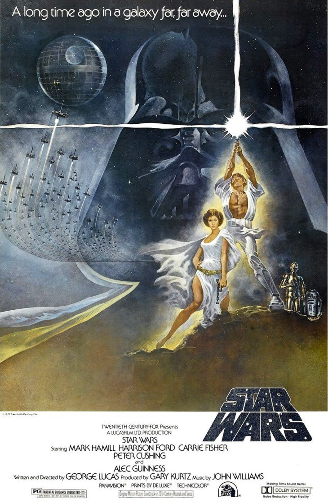
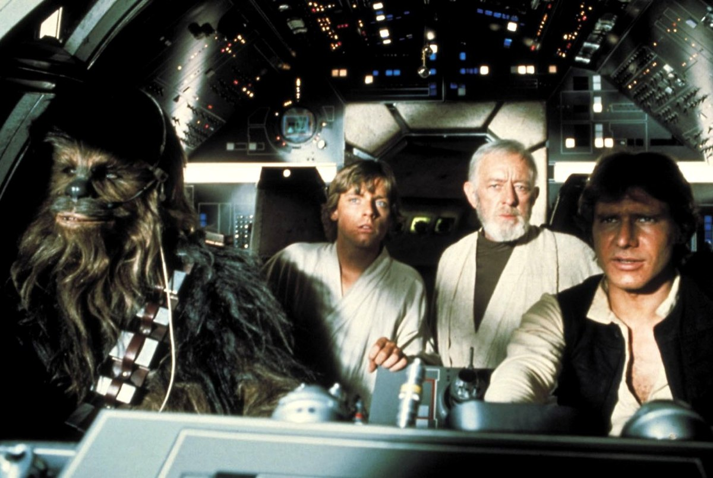
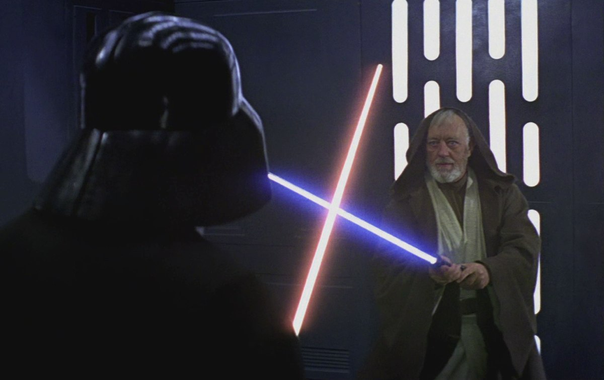

+++
titre = "<em>Star Wars, Épisode IV : Un nouvel espoir</em>, George Lucas"
title = "Star Wars, Épisode IV : Un nouvel espoir, George Lucas"
url = "/star-wars-episode-4-nouvel-espoir-lucas"
date = "2012-06-03T09:25:40"
Lastmod = "2014-11-28T17:46:23"
cover = "star-wars-episode-IV-hamill-lucas.jpg"
categorie = [ "À voir" ]
tag = [ "Action", "Aventure", "Mythe", "Saga", "Science-Fiction", "Star Wars" ]
createur = [ "George Lucas" ]
acteur = [ "Carrie Fisher", "Harrison Ford", "Mark Hamill" ]
annee = [ "1977" ]
weight = 1977
saga = [ "Star Wars" ]
pays = [ "États-Unis" ]
original = "Star Wars: Episode IV - A New Hope"

+++

En 1977, George Lucas n&rsquo;est pas encore le réalisateur connu de la planète tout entière, même s&rsquo;il s&rsquo;est fait un nom aux États-Unis avec <em>American Graffiti</em>, une comédie bien éloignée du genre qu&rsquo;il affectionne. Ce succès lui permet de se consacrer enfin à son projet : une saga de science-fiction d&rsquo;une ampleur jamais vue au cinéma. Le cinéaste alors trentenaire ne commence pas par le début, mais par ce qui devait être le cœur de la saga : <em>Star Wars, Épisode IV : Un nouvel espoir</em> est la suite de la prélogie sortie dans les années 2000 et elle ouvre une trilogie concentrée sur la défaite du mal. Le sous-titre de ce premier épisode est clair : après des années de domination, un nouvel espoir apparaît avec le personnage de Luke Skywalker. George Lucas compose un film d&rsquo;aventures à l&rsquo;ancienne, une réussite qui vieillit plutôt bien.

Voilà maintenant une vingtaine d&rsquo;années que l&rsquo;Empire règne sans partage sur l&rsquo;univers connu et habité. Suite au coup d&rsquo;État contre la République découvert dans <a title="Star Wars, Épisode III : La Revanche des Sith, George Lucas" href="http://voiretmanger.fr/2012/05/28/star-wars-episode-3-revanche-sith-lucas/"><em>Star Wars, Épisode III : La Revanche des Sith</em></a>, une dictature s&rsquo;est rapidement mise en place et a détruit patiemment tous les opposants au régime. Pas tous, non : au fur et à mesure que l&rsquo;étau impérial se resserre, des hommes et des femmes protestent et s&rsquo;élèvent contre la dictature et l&rsquo;Empire a bien du mal à réprimer les rebelles. Quand l&rsquo;épisode s&rsquo;ouvre, la princesse Leia a obtenu les plans de l&rsquo;Étoile de la Mort, un vaisseau spatial en forme de planète qui dispose de l&rsquo;arme la plus puissante de l&rsquo;univers puisqu&rsquo;elle peut détruire une planète en une fraction de seconde. Ces plans sont vitaux pour la résistance qui espère ainsi trouver une faille dans le vaisseau et le vaincre par la ruse plutôt que par la force. Hélas, les troupes de l&rsquo;Empire menées par le terrible Dark Vador, le bras droit de l&rsquo;Empereur, sont à ses trousses et emprisonnent la Princesse qui a tout juste le temps de donner les plans à R2D2, un petit robot. Accompagné d&rsquo;un autre droïde, ils arrivent sur la planète Tatooïne où Obi Wan Kenobi, jadis un grand Jedi, se cache depuis la chute de la République. Les deux robots vont d&rsquo;abord être achetés par Luke Skylwaker, jeune homme qui ne rêve que d&rsquo;une chose : quitter la planète et parcourir l&rsquo;univers…

La saga <em>Star Wars</em> étant maintenant complète, on peut la regarder dans l&rsquo;ordre de l&rsquo;histoire, et non plus dans l&rsquo;ordre chronologique des sorties en salle. <em>Star Wars, Épisode IV : Un nouvel espoir</em> apparaît alors sous un angle bien différent puisque l&rsquo;on sait beaucoup de choses qui sont normalement passées sous silence. Le spectateur de 1977 ne pouvait pas savoir qui est véritablement Dark Vador, qui sont Leia et Luke, ni la nature véritable de l&rsquo;Empire. Quand le film sort, c&rsquo;est l&rsquo;occasion pour George Lucas de plonger ses spectateurs pour la première fois dans un univers que l&rsquo;on devine extrêmement riche. On a beau connaître le tableau en entier, on ne peut qu&rsquo;être frappé par cette introduction qui en dit si peu et donne envie d&rsquo;en savoir beaucoup plus. Comme dans tous les films de la saga, <em>Star Wars, Épisode IV : Un nouvel espoir</em> commence directement au cœur de l&rsquo;action : après les célèbres explications en grosses lettres jaunes, on voit immédiatement un vaisseau attaqué par un autre, plus gros. Les explications initiales sont très réduites et George Lucas distille ensuite les informations avec parcimonie. On découvre peu à peu tous les personnages importants, mais il nous manque à chaque fois des informations que l&rsquo;on aura souvent dans les épisodes V et VI. Ce choix maintient un peu de suspense, mais permet surtout d&rsquo;avoir une petite idée de l&rsquo;ampleur de l&rsquo;univers créé pour la saga…

<em>Star Wars, Épisode IV : Un nouvel espoir</em> est peut-être le film le plus indépendant de toute la saga. Tout n&rsquo;est pas réglé quand il se termine, mais l&rsquo;Empire a connu une sérieuse défaite et l&rsquo;histoire pourrait s&rsquo;arrêter là. À bien des égards, George Lucas compose un film d&rsquo;aventures à l&rsquo;ancienne, bien loin du sérieux des épisodes II et III qui le précèdent, mais aussi des épisodes à suivre. Pour concevoir ce film et la saga, il a puisé dans les mythes et contes occidentaux : il est après tout ici question d&rsquo;une princesse et d&rsquo;un jeune homme qui vient la sauver et qui sauve au passage un peuple d&rsquo;un oppresseur. Le scénario a bien nécessité quelques ajustements liés à l&rsquo;univers de science-fiction, mais on retrouve les schémas traditionnels des contes ou des romans-feuilletons. Dans cette optique, certains choix sont loin d&rsquo;être anodins, comme le sabre laser évidemment. Les combats dans l&rsquo;espace rassemblent quant à eux tantôt aux batailles navales, tantôt aux combats aériens des deux Guerres mondiales, mais George Lucas ajoute une composante mystique avec la Force. Dans cet épisode, il s&rsquo;agit explicitement d&rsquo;une religion, le terme revient d&rsquo;ailleurs à plusieurs reprises du côté obscur, comme de l&rsquo;autre. On est loin des explications rationnelles et scientifiques de <a title="Star Wars, Épisode I : La Menace fantôme, George Lucas" href="http://voiretmanger.fr/2012/02/12/star-wars-1-menace-fantome-lucas/"><em>Star Wars, Épisode I : La Menace fantôme</em></a> où la Force se mesurait par une prise de sang. Ici, les trois personnages qui en sont pourvus la sentent, mais le concept reste encore abstrait. Il faudra attendre l&rsquo;<a href="http://voiretmanger.fr/2012/06/05/star-wars-5-empire-contre-attaque-kershner/" title="Star Wars, Épisode V : L’Empire contre-attaque, Irvin Kershner">épisode V</a> et l&rsquo;enseignement de Yoda pour l&rsquo;expliciter ; en attendant, le choix d&rsquo;en faire explicitement une religion fait de <em>Star Wars, Épisode IV : Un nouvel espoir</em> un mythe complet, au cœur d&rsquo;une aventure épique.

Toute la saga est plus ou moins marquée par une certaine légèreté. Si le premier épisode est certainement le plus léger et le moins sérieux, et si les épisodes II et III sont peut-être les plus sombres, <em>Star Wars, Épisode IV : Un nouvel espoir</em> ne cesse d&rsquo;évoquer la légèreté des contes à l&rsquo;ancienne. Le film n&rsquo;est pas particulièrement drôle, même si le duo comique de C3PO et R2D2 est toujours programme, et si le sarcasme de Han Solo fait parfois mouche. Il n&rsquo;est en revanche jamais dramatique et ne s&rsquo;arrête que très brièvement sur les épisodes les plus tristes. On est frappé de voir que Luke ne semble pas vraiment affecté par la perte de ses deux parents adoptifs et de la ferme où il a grandi dans une scène traitée avec une désinvolture qui tranche avec la mort de la mère d&rsquo;Anakin dans <a title="Star Wars, Épisode II : L’Attaque des clones, George Lucas" href="http://voiretmanger.fr/2012/05/26/star-wars-episode-2-attaque-clones-lucas/"><em>Star Wars, Épisode II : L’Attaque des clones</em></a>.

Cette désinvolture a un impact sur la réalisation qui évite là encore les effets de dramatisation, tandis que George Lucas imprime un rythme intense à son film. <em>Star Wars, Épisode IV : Un nouvel espoir</em> passe rapidement et les personnages ne sont jamais vraiment sérieusement en difficulté. C&rsquo;est à la fois la réussite de ce film qui ressemble d&rsquo;autant plus à un film d&rsquo;aventures, mais aussi sa limite et les deux épisodes qui suivent sont beaucoup plus ambitieux. En attendant, George Lucas se débrouille plutôt bien avec la caméra et fait surtout preuve d&rsquo;une imagination débordante pour faire avec les limites technologiques de l&rsquo;époque. Les maquettes pour les vaisseaux spatiaux et les combats sont efficaces et l&rsquo;illusion fonctionne, même si le côté carton-pâte se voit nécessairement. Pareil pour le bestiaire, assez peu présent ici à l&rsquo;exception notable d&rsquo;une scène dans un bar sur Tatooine : les marionnettes et costumes à l&rsquo;ancienne vieillissent finalement mieux que les équivalents numériques. <em>Star Wars, Épisode IV : Un nouvel espoir</em> n&rsquo;a ainsi pas si mal vieilli, il reste aujourd&rsquo;hui encore agréable à regarder et la version proposée par <a href="http://www.amazon.fr/gp/product/B004HYGSXS/ref=as_li_ss_tl?ie=UTF8&amp;tag=leblogdenic07-21&amp;linkCode=as2&amp;camp=1642&amp;creative=19458&amp;creativeASIN=B004HYGSXS">le coffret Blu-Ray</a> est d&rsquo;excellente qualité. Signalons aussi la mise en place des thèmes musicaux phares par John Williams dans une bande originale toujours aussi prenante…

George Lucas fait un pari avec <em>Star Wars, Épisode IV : Un nouvel espoir</em> : lancer une saga de science-fiction aussi ambitieuse que populaire. Dès ce premier épisode, le succès est au rendez-vous avec un film qui évoque les récits d&rsquo;aventures à l&rsquo;ancienne, mais qui témoigne aussi d&rsquo;un univers particulièrement riche. Les choses sérieuses commenceront avec l&rsquo;épisode suivant, en attendant ce film est l&rsquo;occasion d&rsquo;une découverte légère et réjouissante de l&rsquo;un des récits les plus célèbres de l&rsquo;histoire du cinéma.

<h3>Vous voulez m&rsquo;aider ?<a href="#footnote_0_6631" id="identifier_0_6631" class="footnote-link footnote-identifier-link" title="&Agrave; propos de la publicit&eacute;&hellip;">1</a></h3>
<ul>
<li><a href="http://www.amazon.fr/gp/product/B002K9C11A/ref=as_li_ss_tl?ie=UTF8&amp;tag=leblogdenic07-21&amp;linkCode=as2&amp;camp=1642&amp;creative=19458&amp;creativeASIN=B002K9C11A">Acheter le film en DVD sur Amazon</a></li>
<li><a href="http://www.amazon.fr/gp/product/B004HYGSXS/ref=as_li_ss_tl?ie=UTF8&amp;tag=leblogdenic07-21&amp;linkCode=as2&amp;camp=1642&amp;creative=19458&amp;creativeASIN=B004HYGSXS">Acheter la saga en Blu-Ray sur Amazon</a></li>
<li><a href="http://itunes.apple.com/fr/album/star-wars-episode-iv-new-hope/id196875476">Acheter la bande originale du film sur l&rsquo;iTunes Store</a></li>
</ul>

<ol class="footnotes"><li id="footnote_0_6631" class="footnote"><a href="http://voiretmanger.fr/soutien/">À propos de la publicité…</a> [<a href="#identifier_0_6631" class="footnote-link footnote-back-link">&#8617;</a>]</li></ol>
