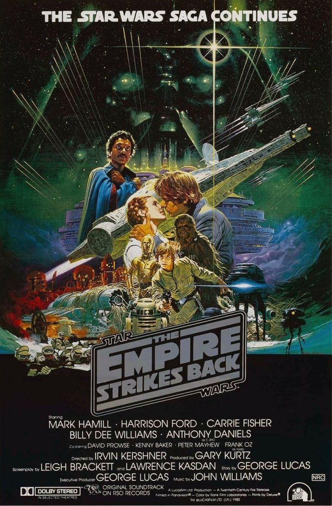
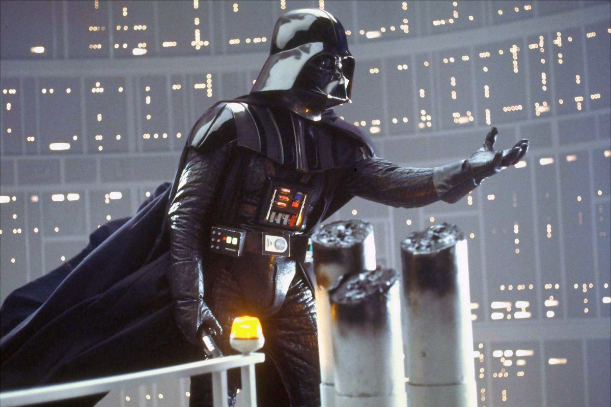
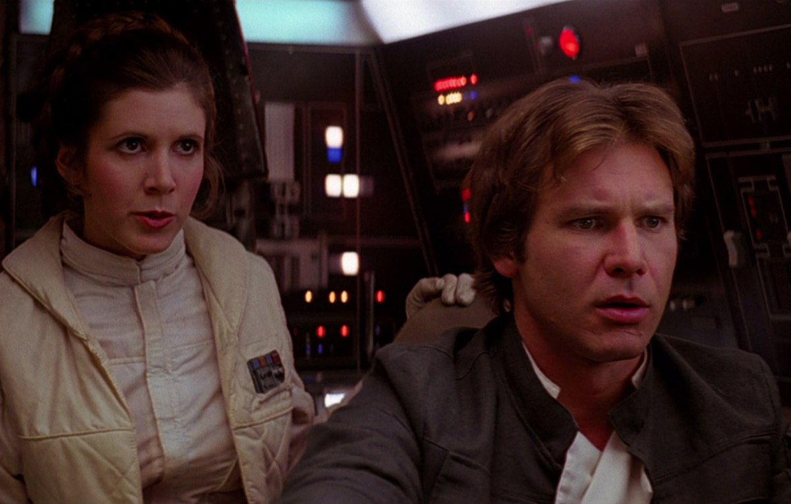

+++
type = "post"
titre = "<em>Star Wars, Épisode V : L&rsquo;Empire contre-attaque</em>, Irvin Kershner"
title = "Star Wars, Épisode V : L'Empire contre-attaque, Irvin Kershner"
url = "/star-wars-episode-5-empire-contre-attaque-kershner"
date = "2012-06-05T20:37:15"
Lastmod = "2014-11-28T17:48:42"
cover = "star-wars-episode-5-kershner.jpg"
categorie = [ "À voir" ]
tag = [ "Action", "Blockbuster", "Guerre", "Saga", "Science-Fiction", "Star Wars" ]
createur = [ "Irvin Kershner" ]
acteur = [ "Carrie Fisher", "Harrison Ford", "Mark Hamill" ]
annee = [ "1980" ]
weight = 1980
saga = [ "Star Wars" ]
pays = [ "États-Unis" ]
original = "Star Wars: Episode V - The Empire Strikes Back"

+++

La première trilogie <em>Star Wars</em> suit un cheminement très classique : après une première victoire des Rebelles dans <a title="Star Wars, Épisode IV : Un nouvel espoir, George Lucas" href="http://voiretmanger.fr/2012/06/03/star-wars-episode-4-nouvel-espoir-lucas/"><em>Star Wars, Épisode IV : Un nouvel espoir</em></a>, les choses se corsent et la situation se retourne dans <em>Star Wars, Épisode V : L&rsquo;Empire contre-attaque</em>. L&rsquo;Empire gagne à nouveau du terrain et la situation est très difficile pour ses ennemis quand l&rsquo;épisode se termine. Ce long-métrage est également une transition avant le grand final du sixième épisode. Un moment-clé pour lequel George Lucas laisse les commandes et c&rsquo;est Irvin Kershner qui passe derrière la caméra. Cet ancien professeur du créateur de la saga a su conserver l&rsquo;esprit <em>Star Wars</em> tout en lui offrant un peu de noirceur. <em>Star Wars, Épisode V : L&rsquo;Empire contre-attaque</em> est peut-être le film le plus équilibré de toute la saga et un excellent blockbuster.

À la fin de l&rsquo;épisode précédent, les Rebelles ont réussi à détruire l&rsquo;Étoile de la Mort, la plus puissante arme impériale capable de détruire une planète. C&rsquo;était indiscutablement une victoire, mais l&rsquo;Empire n&rsquo;a pas dit son dernier mot et la guerre est loin d&rsquo;être gagnée. Elle reprend même de plus belle alors que Dark Vador remue ciel et terre à la recherche de Luke Skywalker. Les drones qu&rsquo;il envoie dans tout l&rsquo;univers parviennent justement à localiser la nouvelle base rebelle située sur une planète glacée. La flotte impériale rapplique immédiatement et oblige les Rebelles à lever le camp et à fuir. Le jeune Luke Skywalker a eu une vision d&rsquo;Obi Wan Kenobi, le maître Jedi mort sous le coup du sabre laser de Dark Vador dans l&rsquo;épisode IV. Cette vision le conduit sur une planète inhabitée ou Yoda a pris refuge. Ce dernier va tenter de former Luke pour lui permettre de devenir un Jedi, mais la formation est écourtée quand le jeune homme sent que ses amis sont en danger.

<em>Star Wars, Épisode V : L&rsquo;Empire contre-attaque</em> partage de nombreux points communs avec <a title="Star Wars, Épisode II : L’Attaque des clones, George Lucas" href="http://voiretmanger.fr/2012/05/26/star-wars-episode-2-attaque-clones-lucas/"><em>Star Wars, Épisode II : L’Attaque des clones</em></a>. Les deux films sont situés en positions intermédiaires et ils ont tous les deux comme sujet principal la formation d&rsquo;un jeune Jedi. Après Anakin, la saga s&rsquo;intéresse maintenant à Luke et même si le contexte est bien différent, la problématique reste la même. Sa formation est encore fragile et Luke pourrait très bien tomber à son tour du côté obscur de la Force. Son prédécesseur avait échoué à rester du côté lumineux et on retrouve de nombreux points communs entre les deux. Comme on le découvre au cours du film, Dark Vador est le mieux placé pour le savoir : le terrifiant être qui n&rsquo;a plus rien d&rsquo;humain n&rsquo;est autre qu&rsquo;Anakin, le père de Luke. Il sait très bien que son ennemi n&rsquo;est pas encore assez fort pour l&rsquo;affronter, ni même pour résister à l&rsquo;attrait du côté obscur. Le piège qu&rsquo;il lui tend a précisément cette fonction : essayer d&rsquo;énerver Luke, faire appel à ses colères et ses peurs les plus profondes pour le détourner des enseignements de Yoda et Obi Wan Kenobi. La menace est réelle, comme en témoigne bien la vision qu&rsquo;a Luke de lui-même en Dark Vador dans la grotte. Le film d&rsquo;Irvin Kershner montre bien que si les deux parcours partagent des similarités, ils ne sont pas équivalents : à l&rsquo;issue de <em>Star Wars, Épisode V : L&rsquo;Empire contre-attaque</em>, Luke n&rsquo;a pas vacillé, mais comme dans la prélogie, tout se jouera dans l&rsquo;épisode suivant…

Si l&rsquo;intrigue se concentre essentiellement sur Luke Skywalker et son conflit avec Dark Vador avec la scène de la révélation sur l&rsquo;identité de ce dernier en guise de point culminant, <em>Star Wars, Épisode V : L&rsquo;Empire contre-attaque</em> n&rsquo;en oublie pas pour autant de développer une intrigue secondaire. Le film d&rsquo;Irvin Kershner suit également les pas de Han Solo et Leia avec cette fois la concrétisation de l&rsquo;intrigue amoureuse qui pointait son nez dans l&rsquo;épisode IV. Cette histoire d&rsquo;amour s&rsquo;entremêle de manière astucieuse à l&rsquo;intrigue principale : quand Han et Leia arrivent à la cité dans les airs, c&rsquo;est d&rsquo;abord pour réparer le vaisseau endommagé, mais cette escale va amener Dark Vador et enfin Luke Skywalker. À la fin de l&rsquo;épisode, le capitaine du Faucon Millenium est en très mauvaise posture et l&rsquo;intrigue secondaire se poursuit dans <em>Star Wars, Épisode VI : Le Retour du Jedi</em>. En attendant, cet épisode est très varié, c&rsquo;est même sans doute celui qui offre la plus grande variété de décors et d&rsquo;actions dans la saga. Alors que l&rsquo;épisode précédent se déroulait essentiellement dans l&rsquo;espace, l&rsquo;action de <em>Star Wars, Épisode V : L&rsquo;Empire contre-attaque</em> est située en majorité sur différentes planètes. On voyage beaucoup, avec des paysages très variés : après le désert de Tatooïne, place aux glaces de Hoth, puis à la jungle épaisse de Dagobah et enfin la cité dans les airs. Les batailles spatiales ont en contrepartie disparu, même s&rsquo;il faut noter quelques courses-poursuites épiques entre le vaisseau spatial de Han Solo et les troupes impériales. Même si l&rsquo;ambiance n&rsquo;est plus à la rigolade, Irvin Kershner a su conserver l&rsquo;humour si typique de la saga et cet épisode maintient une belle place au duo de robots C3PO et R2D2.

George Lucas n&rsquo;a laissé la main à la réalisation que pour deux films dans la saga, celui-ci et le suivant. Quelle lourde tâche pour un cinéaste de s&rsquo;attaquer à des films d&rsquo;une telle ampleur, surtout quand on s&rsquo;appelle Irvin Kershner. Ce professeur qui a eu pour élève George Lucas est bien plus expérimenté, mais il n&rsquo;a jamais tourné de grosse production comme <em>Star Wars, Épisode V : L&rsquo;Empire contre-attaque</em>. Enjeu supplémentaire, il lui fallait maintenir l&rsquo;esprit et l&rsquo;esthétique de la saga pour conserver son unité. Mission réussie de ce côté : dès l&rsquo;ouverture, avec l&rsquo;explication en lettres jaunes qui défilent avec effet de perspective puis le plan dans l&rsquo;espace sur un vaisseau en mouvement, on retrouve les principes mis en place précédemment par George Lucas. Le film conserve aussi certains clichés, comme les transitions toujours atypiques, et le spectateur n&rsquo;est pas dépaysé. Tout n&rsquo;est pas comme avant pour autant et même si on pourrait croire par moment que le réalisateur n&rsquo;a pas changé, la présence discrète d&rsquo;Irvin Kershner se fait tout de même sentir. <em>Star Wars, Épisode V : L&rsquo;Empire contre-attaque</em> semble plus mur que son prédécesseur, il semble tourné avec plus d&rsquo;assurance et on peut considérer que la noirceur de certaines scènes sont le fait du nouveau réalisateur. Le film n&rsquo;a toutefois pas perdu en efficacité et la musique géniale et particulièrement présente de John Williams n&rsquo;y est pas étrangère, notamment dès que le thème impérial entre en scène. Les acteurs ont aussi muri avec ce film et ils sont tous meilleurs que dans l&rsquo;épisode IV, surtout Harrison Ford qui semble parfaitement à l&rsquo;aise.

<em>Star Wars, Épisode V : L&rsquo;Empire contre-attaque</em> est indéniablement un excellent épisode dans la saga. Irvin Kershner a su conserver l&rsquo;univers et l&rsquo;ambiance mis en place par George Lucas dans <em>Star Wars, Épisode IV : Un nouvel espoir</em>, mais il y a ajouté sa pâte personnelle pour un résultat plus mur et peut-être plus ambitieux. Cet épisode de transition avant le grand final de l&rsquo;épisode VI est parfaitement maîtrisé et il est toujours aussi plaisant à regarder, d&rsquo;autant que les effets spéciaux qui ont progressé en trois ans ont bien vieilli. Un classique de la SF, à voir et à revoir…

<h3>Vous voulez m&rsquo;aider ?<a href="#footnote_0_6655" id="identifier_0_6655" class="footnote-link footnote-identifier-link" title="&Agrave; propos de la publicit&eacute;&hellip;">1</a></h3>
<ul>
<li><a href="http://www.amazon.fr/gp/product/B000G5R796/ref=as_li_ss_tl?ie=UTF8&amp;tag=leblogdenic07-21&amp;linkCode=as2&amp;camp=1642&amp;creative=19458&amp;creativeASIN=B000G5R796">Acheter le film en DVD sur Amazon</a></li>
<li><a href="http://www.amazon.fr/gp/product/B004HYGSXS/ref=as_li_ss_tl?ie=UTF8&amp;tag=leblogdenic07-21&amp;linkCode=as2&amp;camp=1642&amp;creative=19458&amp;creativeASIN=B004HYGSXS">Acheter la saga complète en Blu-Ray sur Amazon</a></li>
<li><a href="http://itunes.apple.com/fr/album/star-wars-episode-v-empire/id261749656">Acheter la bande originale du film sur l&rsquo;iTunes Store</a></li>
</ul>

<ol class="footnotes"><li id="footnote_0_6655" class="footnote"><a href="http://voiretmanger.fr/soutien/">À propos de la publicité…</a> [<a href="#identifier_0_6655" class="footnote-link footnote-back-link">&#8617;</a>]</li></ol>
