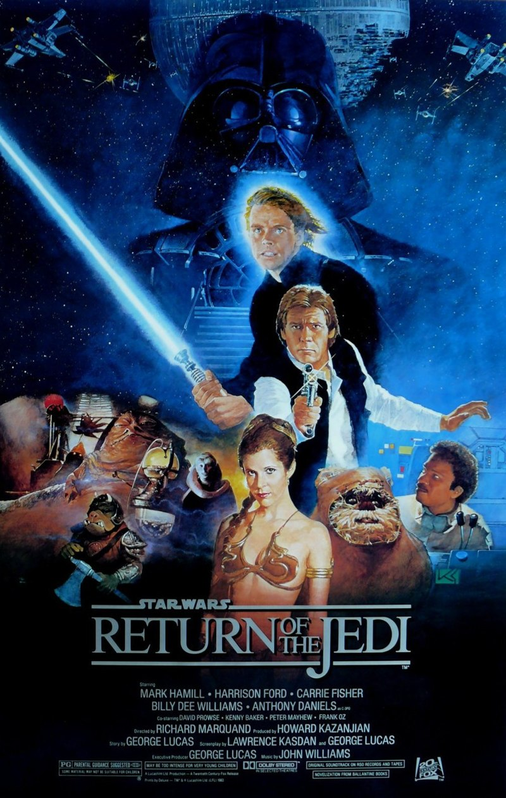
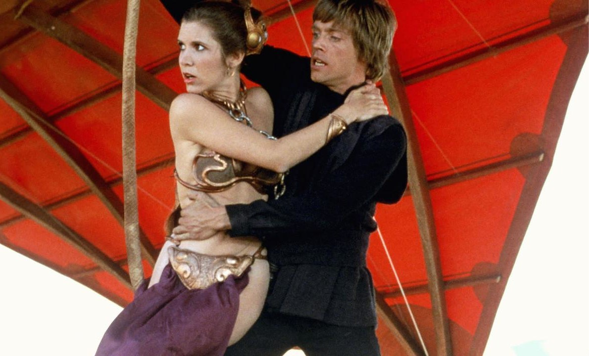
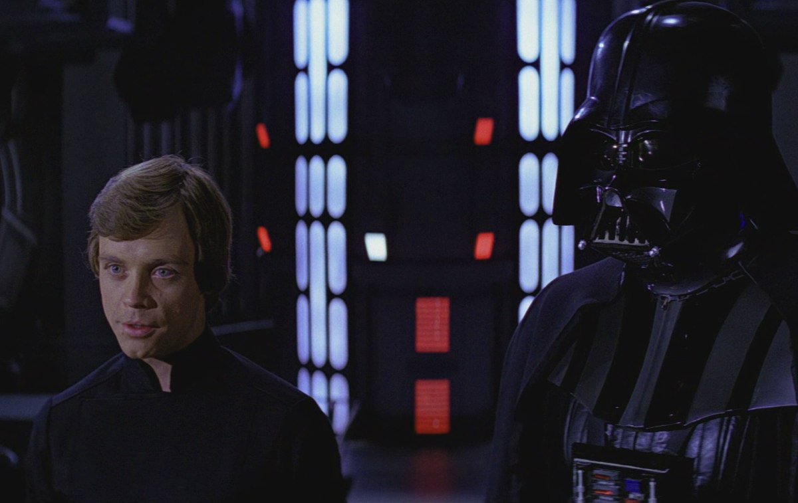
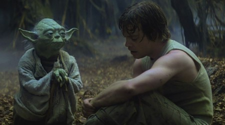

+++
titre = "<em>Star Wars, Épisode VI : Le Retour du Jedi</em>, Richard Marquand"
title = "Star Wars, Épisode VI : Le Retour du Jedi, Richard Marquand"
url = "/star-wars-episode-6-retour-jedi-marquand"
date = "2012-06-08T00:16:32"
Lastmod = "2014-02-12T10:09:04"
cover = "star-wars-6-retour-jedi-dark-vador.jpg"
categorie = [ "À voir" ]
tag = [ "Action", "Famille", "Guerre", "Saga", "Science-Fiction", "Star Wars" ]
createur = [ "Richard Marquand" ]
acteur = [ "Carrie Fisher", "Harrison Ford", "Mark Hamill" ]
annee = [ "1983" ]
weight = 1983
saga = [ "Star Wars" ]
pays = [ "États-Unis" ]
original = "Star Wars: Episode VI - Return of the Jedi"

+++

Sorti en 1983 dans les salles, <em>Star Wars, Épisode VI : Le Retour du Jedi</em> est l&rsquo;épisode qui clôt la trilogie initiale et avec elle la saga complète. Cette fin est logique et sans vraie surprise : alors que la situation est catastrophique pour l&rsquo;Alliance rebelle à la fin de <a title="Star Wars, Épisode V : L’Empire contre-attaque, Irvin Kershner" href="http://voiretmanger.fr/2012/06/05/star-wars-5-empire-contre-attaque-kershner/"><em>Star Wars, Épisode V : L’Empire contre-attaque</em></a>, les gentils reprennent le dessus jusqu&rsquo;à un happy-end dans la plus grande tradition hollywoodienne. Pour clore sa saga, George Lucas sous-traite à nouveau et fait appel à un autre réalisateur : pas plus qu&rsquo;Irvin Kershner pour l&rsquo;épisode V, Richard Marquand n&rsquo;a pas durablement marqué l&rsquo;histoire du cinéma par son travail. Qu&rsquo;importe, <em>Star Wars, Épisode VI : Le Retour du Jedi</em> conclut l&rsquo;une des sagas les plus ambitieuses au cinéma et l&rsquo;histoire se suffit largement à elle-même dans cet épisode épique.

La guerre entre la République et l&rsquo;Alliance commence à toucher sa fin et quand cet épisode s&rsquo;ouvre, ce n&rsquo;est pas du tout en faveur des rebelles. La fin de l&rsquo;épisode V était funeste pour ce camp avec la captivité de Han Solo et l&rsquo;échec de Luke Skywalker contre son père, Dark Vador. Quand <em>Star Wars, Épisode VI : Le Retour du Jedi</em> commence, on apprend que la République fait reconstruire l&rsquo;Étoile de la mort détruite dans <a title="Star Wars, Épisode IV : Un nouvel espoir, George Lucas" href="http://voiretmanger.fr/2012/06/03/star-wars-episode-4-nouvel-espoir-lucas/"><em>Star Wars, Épisode IV : Un nouvel espoir</em></a>, mais la base spatiale sera cette fois beaucoup plus puissante et bien mieux défendue que le modèle précédent. La situation est au plus bas, mais cela ne décourage pas Luke et Leia de tenter le tout pour le tout et d&rsquo;aller arracher Han aux mains du cruel Jabba. Reste ensuite le plus difficile, vaincre la République et surtout déjouer le machiavélique plan mis en place par l&rsquo;Empereur pour annihiler totalement l&rsquo;Alliance et régner en maître sur tout l&rsquo;univers. Les rebelles ont perdu une bataille, ils vont tout faire pour gagner la guerre, mais c&rsquo;est loin d&rsquo;être gagné…

<em>Star Wars, Épisode VI : Le Retour du Jedi</em> a la lourde tâche de clore une saga entière. À sa sortie, il ne s&rsquo;agit &laquo;&nbsp;que&nbsp;&raquo; de mettre un point final à une trilogie, mais avec le développement de la prélogie, ce film conclut une série de six films. Pourtant, cet épisode n&rsquo;est pas le plus dense de tous, au contraire même. Richard Marquand prend son temps pour déployer le récit qui avance non sans gravité : on est loin de l&rsquo;urgence insouciante de l&rsquo;épisode IV, ou de la densité dramatique <a title="Star Wars, Épisode III : La Revanche des Sith, George Lucas" href="http://voiretmanger.fr/2012/05/28/star-wars-episode-3-revanche-sith-lucas/"><em>Star Wars, Épisode III : La Revanche des Sith</em></a>. De la même manière, ce film ne multiplie pas les décors et les situations et il peut se résumer en deux parties bien distinctes. L&rsquo;épisode débute sur Tatooïne avec l&rsquo;opération de récupération de Han Solo, il se termine autour de la lune d&rsquo;Endos, une planète très boisée autour de laquelle la nouvelle Étoile de la Mort est placée en orbite pendant les travaux. Toute la fin de <em>Star Wars, Épisode VI : Le Retour du Jedi</em> est consacrée à la bataille qui évite toutefois la monotonie et la linéarité en occupant trois terrains différents : à côté de la bataille spatiale très spectaculaire, Richard Marquand suit la bataille au sol pour la désactivation du bouclier qui entoure la base spatiale, tandis que la lutte se déroule aussi au cœur de l&rsquo;Étoile de la Mort, entre Luke, Dark Vador et l&rsquo;Empereur. Une bataille à trois niveaux où tous sont essentiels : tout se joue autant au sol avec les Ewoks, que dans le vide spatial où les combats font rage entre les deux camps, que bien sûr au plus haut niveau où la victoire du côté lumineux de la Force sur l&rsquo;obscur est en question.

La trilogie proposée dans un premier par George Lucas se consacre en apparence entièrement à un héros, Luke Skywalker, alors que la prélogie était dédiée à Anakin Skywalker. Dans <em>Star Wars, Épisode VI : Le Retour du Jedi</em>, la situation se brouille un peu en accordant à Dark Vador une place centrale et peut-être même la responsabilité principale dans le dénouement de la guerre. Dans toute la saga <em>Star Wars</em>, le seul personnage vraiment présent d&rsquo;un bout à l&rsquo;autre est Anakin devenu Dark Vador et cette présence n&rsquo;est pas anodine. C&rsquo;est lui le véritable héros de la saga, pas un Luke Skywalker assez fade, nécessairement fade puisque lui ne dévie jamais vers le côté obscur de la Force. Le retournement d&rsquo;Anakin à la fin de la prélogie, puis son nouveau retournement à la fin du sixième épisode en font un personnage plus intéressant, car psychologiquement complexe. Le travail de Richard Marquand est à cet égard remarquable : alors que Dark Vador n&rsquo;est qu&rsquo;un personnage monolithique et finalement assez peu intéressant dans les épisodes IV et V, il devient ici humain, tout simplement. Le coup de force du cinéaste est d&rsquo;avoir réussi à transmettre cette humanité malgré le masque parfaitement statique et glaçant du personnage. Dark Vador n&rsquo;est plus qu&rsquo;un lointain souvenir d&rsquo;Anakin, on sait qu&rsquo;il a perdu ses quatre membres et qu&rsquo;il ne peut survivre que par l&rsquo;assistance respiratoire fournie par son costume, mais on découvre malgré tout son humanité. Le procédé est le même que pour R2D2, le petit robot si humain qui accompagne lui aussi toute la saga sans interruption, mais il surprend dans <em>Star Wars, Épisode VI : Le Retour du Jedi</em>. Cette surprise vient sans doute de ce que le spectateur est habitué à un personnage antipathique, mais peut-être aussi parce que le personnage de Luke est, en comparaison, bien peu intéressant.

Réaliser une saga à l&rsquo;envers relève de l&rsquo;exercice de style particulièrement difficile et si George Lucas l&rsquo;a plutôt bien assuré, il a fallu malgré tout compter sur un peu de casse. La prélogie s&rsquo;est construite à partir de la trilogie, mais certaines idées qui sont apparues dans les années 2000 ne collaient pas avec la trilogie initiale. Perfectionniste, le créateur de <em>Star Wars</em> s&rsquo;est mis en tête de retoucher les films originaux pour les corriger, voire les moderniser grâce aux effets spéciaux numériques disponibles aujourd&rsquo;hui.<a href="#footnote_0_6693" id="identifier_0_6693" class="footnote-link footnote-identifier-link" title="Si le sujet vous int&eacute;resse, cette liste exhaustive disponible sur Wikipedia est tout simplement &eacute;tourdissante&hellip;">1</a> À la fin de <em>Star Wars, Épisode VI : Le Retour du Jedi</em>, Anakin apparaît sous les traits de Hayden Christensen pour coller avec la prélogie, ce qui est assez logique et indolore. Plus gênantes en revanche, les scènes ajoutées comme le concert devant Jabba qui greffe quelques plans totalement numériques au milieu d&rsquo;autres plans avec marionnettes. Cette modification casse l&rsquo;illusion de la scène et distrait le spectateur, alors qu&rsquo;elle n&rsquo;ajoute strictement rien. Plus surprenant encore, l&rsquo;<a href="http://www.amazon.fr/gp/product/B004HYGSXS/ref=as_li_ss_tl?ie=UTF8&amp;tag=leblogdenic07-21&amp;linkCode=as2&amp;camp=1642&amp;creative=19458&amp;creativeASIN=B004HYGSXS">édition Blu-Ray</a> sortie récemment modifie les dialogues et fait dire quelques &laquo;&nbsp;Non&nbsp;&raquo; à Dark Vador dans la scène finale. Ces ajouts et modifications permanentes sont aussi fascinants que pénibles. Fascinants, car c&rsquo;est la première fois qu&rsquo;une œuvre sortie au cinéma n&rsquo;est pas fixée, mais évolue constamment. Pénibles, car George Lucas devrait se rappeler que le mieux est l&rsquo;ennemi du bien et prendre enfin conscience que ses fans veulent voir les films originaux, avec leur charme à l&rsquo;ancienne.

<em>Star Wars, Épisode VI : Le Retour du Jedi</em> est le plus récent de la trilogie initiale et a logiquement le moins vieilli des trois. Plus qu&rsquo;Irvin Keshner dans l&rsquo;épisode V, Richard Marquand imprime sa marque sur ce film avec un épisode qui fait la part belle aux émotions et évite partiellement l&rsquo;aspect action permanente que la saga pouvait avoir. Que l&rsquo;on se rassure, ce long-métrage est bien un blockbuster et le grand spectacle est au rendez-vous, notamment dans la bataille spatiale finale. Reste que le rythme est ici beaucoup plus lent qu&rsquo;avant et la confrontation entre Luke et son père est empreinte d&rsquo;une certaine émotion, alors qu&rsquo;elle était totalement absente de <em>Star Wars, Épisode V : L’Empire contre-attaque</em>. Les dialogues sont aussi un peu mieux écrits, même si on reste là aussi dans la tradition de la saga. Pour cet ultime épisode, Harisson Ford confirme son aisance, tandis que Mark Hammill ne parvient malheureusement pas à s&rsquo;imposer comme un bon acteur.

La saga <em>Star Wars</em> se termine sur des feux d&rsquo;artifice : George Lucas souhaitait un happy-end complet et Richard Marquand lui en offre un réussi avec <em>Star Wars, Épisode VI : Le Retour du Jedi</em>. Plus posé que ses prédécesseurs, cet ultime épisode passionne d&rsquo;abord pour son récit, avec une bataille finale particulièrement épique. Une réussite que les années n&rsquo;ont pas attaquée, à (re)voir sans hésiter.

<h3 style="text-align:center"><a href="http://voiretmanger.fr/archives/saga-star-wars/">Saga Star Wars</a></h3>

<h3>Vous voulez m&rsquo;aider ?<a href="#footnote_1_6693" id="identifier_1_6693" class="footnote-link footnote-identifier-link" title="&Agrave; propos de la publicit&eacute;&hellip;">2</a></h3>
<ul>
<li><a href="http://www.amazon.fr/gp/product/B000G5R79Q/ref=as_li_ss_tl?ie=UTF8&amp;tag=leblogdenic07-21&amp;linkCode=as2&amp;camp=1642&amp;creative=19458&amp;creativeASIN=B000G5R79Q">Acheter le film en DVD sur Amazon</a></li>
<li><a href="http://www.amazon.fr/gp/product/B004HYGSXS/ref=as_li_ss_tl?ie=UTF8&amp;tag=leblogdenic07-21&amp;linkCode=as2&amp;camp=1642&amp;creative=19458&amp;creativeASIN=B004HYGSXS">Acheter la saga en Blu-Ray sur Amazon</a></li>
</ul>

<ol class="footnotes"><li id="footnote_0_6693" class="footnote">Si le sujet vous intéresse, cette <a href="http://en.wikipedia.org/wiki/List_of_changes_in_Star_Wars_re-releases">liste exhaustive</a> disponible sur Wikipedia est tout simplement étourdissante… [<a href="#identifier_0_6693" class="footnote-link footnote-back-link">&#8617;</a>]</li><li id="footnote_1_6693" class="footnote"><a href="http://voiretmanger.fr/soutien/">À propos de la publicité…</a> [<a href="#identifier_1_6693" class="footnote-link footnote-back-link">&#8617;</a>]</li></ol>
