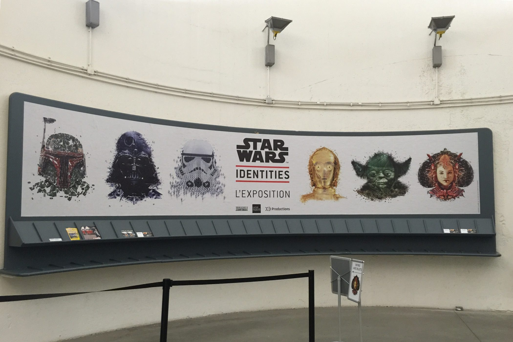

+++
type = "post"
titre = "Exposition Star Wars Identités à Lyon"
title = "Exposition Star Wars Identités à Lyon"
url = "/star-wars-identites-lyon"
date = "2015-02-01T16:40:51"
Lastmod = "2015-02-11T17:24:03"
cover = "star-wars-identites-lyon.jpg"
categorie = [ "Sorties" ]
tag = [ "Exposition", "Star Wars" ]

+++

Après être restée quelques mois au Canada puis à Paris, l&rsquo;exposition <a href="http://www.starwarsidentities.fr">Star Wars Identités</a> se retrouve à Lyon, avant de repartir vers une autre ville, dans un autre pays. Elle se déplacera ainsi pendant six ans, dans douze villes différentes du monde. Une exposition monstre qui se fait dans la foulée du retour de la <a href="http://voiretmanger.fr/saga/star-wars/">saga <em>Star Wars</em></a>, attendu en fin d&rsquo;année. L&rsquo;évènement a attiré les foules et il faut dire que l&rsquo;on peut aisément comprendre pourquoi : on a rarement l&rsquo;occasion de voir rassemblés des dessins, des costumes et des maquettes utilisées pour les longs-métrages de la saga. Ainsi, trois mois après l&rsquo;installation de l&rsquo;exposition à La Sucrière, il y avait encore foule en ce samedi après-midi pluvieux. Il faut toujours réserver les billets en ligne et prévoir malgré tout une bonne heure d&rsquo;attente pour entrer. Qu&rsquo;à cela ne tienne, quand on est fan, le temps ne compte pas… mais mieux vaut en avoir conscience : on passe presque autant de temps à attendre, qu&rsquo;à regarder les objets rassemblés.

Une fois à l&rsquo;intérieur, Star Wars Identités se concentre sur l&rsquo;identité — son nom est bien choisi… — de quelques personnages clés de la saga. On y parle beaucoup d&rsquo;Anakin et de Luke Skywalker, de leurs compagnons et de leurs ennemis. Découvrir les costumes utilisés par les acteurs pendant le tournage est émouvant, mais le plus intéressant était probablement les dessins préparatoires. On découvre ainsi que George Lucas avait d&rsquo;abord nommé son héros Luke Starkiller, avant d&rsquo;opter pour le nom plus pacifique que l&rsquo;on connaît. On découvre aussi que Chewbacca a été créé à partir du gros chien du cinéaste qui était constamment sur le fauteuil passager quand il conduisait et les premiers dessins étaient d&rsquo;ailleurs beaucoup plus proches du chien que de l&rsquo;ours. On peut aussi admirer le sens du détail pour toutes les maquettes de vaisseau rassemblées dans l&rsquo;exposition. Et noter quelques détails amusants, comme le fait que les réacteurs n&rsquo;étaient que des spots lumineux sur ces maquettes. Les commentaires, en français ou en anglais, apportent un éclairage intéressant sur tous ces éléments et on en apprend un petit peu sur l&rsquo;univers de <em>Star Wars</em> et sa création, même s&rsquo;il s&rsquo;agit toujours d&rsquo;informations assez simples. L&rsquo;exposition vise plutôt le grand public et elle décevra probablement les plus grands fans, d&rsquo;autant qu&rsquo;elle n&rsquo;est pas très riche, au fond. Il faut en effet se contenter de dessins préliminaires, de costumes et de quelques maquettes, alors que les six films à ce jour ont produit beaucoup, beaucoup plus d&rsquo;éléments. On aurait voir des décors entiers, se balader dans des bouts de vaisseaux créés pour la trilogie initiale, bref on aurait aimé en voir plus. Star Wars Identités n&rsquo;est pas très impressionnante pour cette raison, c&rsquo;est un petit peu dommage.

 
 
 
  
 
 <!-- close group --> 
 <!-- close row --> 

Star Wars Identités se veut une exposition moderne et elle est donc aussi interactive. Avant la visite, on vous donne non seulement un casque — avec une seule oreille, ce qui donne un effet mono assez déplaisant —, mais aussi un bracelet. Celui-ci permet de créer son propre personnage à travers dix stations différentes. À chaque station, on vous pose une ou plusieurs questions : au départ, il s&rsquo;agit de choisir une race, puis un sexe, une couleur dominante, avant de définir votre caractère. Pour cela, les concepteurs de l&rsquo;exposition ont imaginé quelques traits caractéristiques censés résumer tous les personnages de la saga, et le vôtre aussi. L&rsquo;idée n&rsquo;était pas mauvaise, mais le résultat un peu grossier. Les enfants aimeront sans doute créer un personnage avec des critères aussi basiques, même s&rsquo;ils auront probablement besoin d&rsquo;adultes pour leur expliquer toutes les options. Pour le reste, cette couche d&rsquo;interactivité qui entraîne des embouteillages pendant toute la visite est assez gadget, mais plutôt amusante. En fin d&rsquo;exposition, on peut afficher son personnage et même donner son mail pour recevoir un descriptif (<a href="http://sw-id.com/54cd1c118819f">voici le mien…</a>). Pourquoi pas, mais on regrette que cela empiète sur toute l&rsquo;exposition, résumée elle aussi à quelques traits de caractères ou à des explications générales assez banales sur la génétique ou l&rsquo;importance de la famille et des amis. On imagine que cette idée plaît beaucoup à George Lucas, mais c&rsquo;est une vision qui reste simpliste de la saga…

 
 
 
  
 En fin de visite, on peut afficher le personnage créé tout au long de l&rsquo;exposition. Gadget, mais plutôt sympa. 
 
 
 <!-- close group --> 
 <!-- close row --> 

