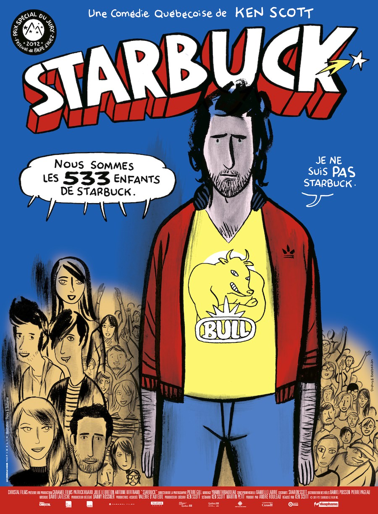
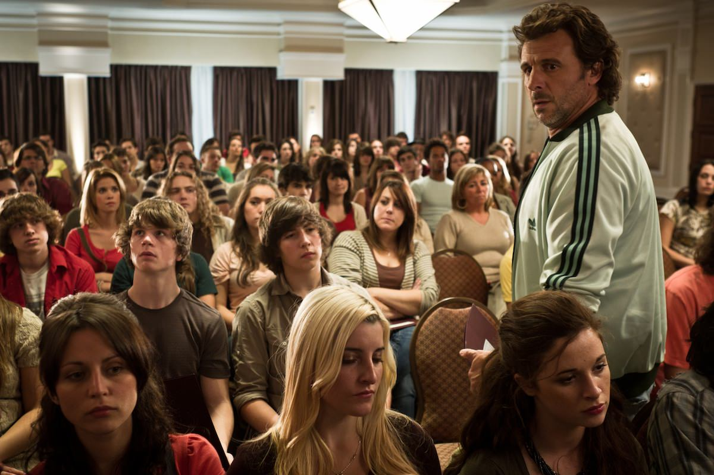
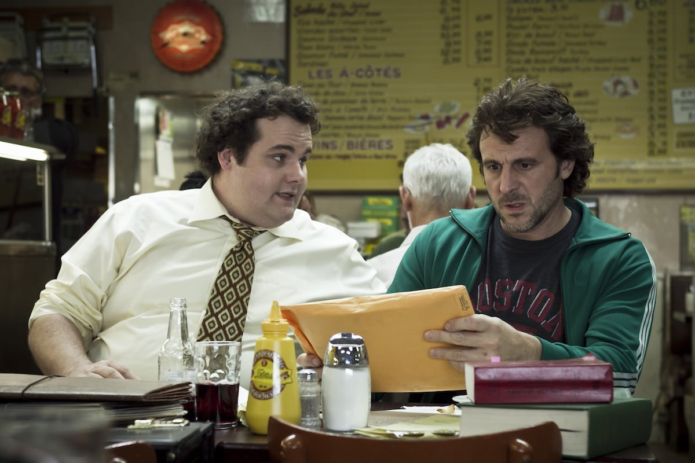
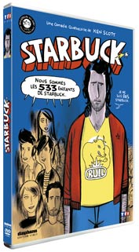

+++
titre = "<em>Starbuck</em>, Ken Scott"
title = "Starbuck, Ken Scott"
url = "/starbuck-scott"
date = "2012-10-06T00:28:21"
Lastmod = "2013-07-09T16:52:43"
cover = "starbuck-scott.jpg"
categorie = [ "À voir" ]
tag = [ "Comédie", "Famille", "Humour", "Procès" ]
createur = [ "Ken Scott" ]
acteur = [ "Antoine Bertrand", "Julie Le Breton", "Patrick Huard" ]
annee = [ "2012" ]
weight = 2012

+++

<em>Starbuck</em>, c&rsquo;est d&rsquo;abord une très bonne idée de comédie : un donneur de sperme un peu trop actif qui se retrouve avec pas moins de 533 enfants, dont une bonne centaine qui demande à le connaître. Une idée un peu folle qui sert à Ken Scott de prétexte pour réaliser une comédie loufoque qui parvient, presque miraculeusement, à ne pas dévier de son sujet initial et à ne pas tomber dans le mièvre. Subtil et drôle, <em>Starbuck</em> est un film à voir.

David Wozniak a souvent eu des problèmes d&rsquo;argent dans sa vie. La quarantaine passée, il doit encore 80 000 $ à des types pas nets qui viennent le menacer chez lui et il est bien en peine de trouver une idée pour gagner rapidement tout cet argent. Il essaie de cultiver de la marijuana chez lui, mais cette tentative est vouée à l&rsquo;échec. Plus jeune, il a eu une autre idée, l&rsquo;idée parfaite sur le papier : David est allé donner son sperme à l&rsquo;hôpital du coin. Il n&rsquo;y est pas allé qu&rsquo;une fois, non. Ce don étant rémunéré, il y est allé des centaines et des centaines de fois et a gagné au total près de 20 000 $. Une sacrée somme contre un boulot qui lui paraît si simple, lui qui n&rsquo;a aucune difficulté à se masturber. Vingt années passent et David a réussi à oublier cet épisode peu glorieux dans sa vie. Alors qu&rsquo;il apprend que sa copine du moment est tombée enceinte et qu&rsquo;il va devenir papa, l&rsquo;avocat de la clinique l&rsquo;attend chez lui. Ses semences ont été particulièrement productives et ses nombreux dons ont donné naissance à pas moins de 533 enfants, dont 162 veulent le rencontrer et le connaître. Une situation extrêmement originale et qui plonge David dans l&rsquo;embarras. Va-t-il assumer ce qu&rsquo;il a fait et se dévoiler auprès de tous ces enfants ?

Une bonne idée ne fait pas toujours un bon film. Ken Scott en a trouvé une très originale pour <em>Starbuck</em>, mais encore fallait-il la tenir pendant près de deux heures. Le long-métrage suit une structure assez classique : on découvre dans un premier temps David, le héros de l&rsquo;histoire. Ce quarantenaire n&rsquo;a jamais vraiment grandi, il est resté dans l&rsquo;adolescence et ne sait pas quoi faire de sa vie, contrairement à ses frères qui travaillent tous à la boucherie familiale. Lui aussi y a un job, mais son emploi de livreur est purement alimentaire, et il ne le garde que parce qu&rsquo;il s&rsquo;agit d&rsquo;une entreprise familiale. David est un poser qui ne réussit rien dans sa vie, même pas à amener à temps les maillots de l&rsquo;équipe de foot de la boucherie. Passé cette description peu avantageuse, <em>Starbuck</em> intègre son idée de départ avec la visite de l&rsquo;avocat et le film se tourne entièrement et judicieusement vers ce problème. David a une liste d&rsquo;une centaine de jeunes qui désirent le connaître et après une période initiale de rejet, il finit par accepter de les rencontrer, d&rsquo;abord un par un, puis tous ensembles. La force de Ken Scott est d&rsquo;avoir tenu bon sur cette histoire de multi-paternité et de ne pas avoir dévié sur un autre sujet. <em>Starbuck</em> ne manque pas de sujets liés qui auraient pu éloigner le cinéaste du sien, mais il tient bon et parvient en outre à maintenir son humour d&rsquo;un bout à l&rsquo;autre.

Ce n&rsquo;est certainement pas un hasard si l&rsquo;un des coscénaristes de <em>Starbuck</em>, Martin Petit, est aussi un humoriste bien connu au Canada. Le film est très bien écrit et son humour provient essentiellement des situations cocasses, mais aussi des dialogues. Vu depuis le Vieux Continent, la langue ajoute encore une touche humoristique — sous-titres conseillés pour ceux qui n&rsquo;y sont pas familiers —, mais ils sont de manière générale très bien écrits. Ken Scott s&rsquo;en est donné à cœur joie avec son histoire d&rsquo;un père de 533 enfants. David a une grosse enveloppe avec des dizaines et des dizaines de profils ; il en sort un au hasard et il s&rsquo;avère que c&rsquo;est un joueur de foot très connu. Par la suite, le héros de <em>Starbuck</em> sort d&rsquo;autres fiches qui sont l&rsquo;occasion d&rsquo;autant de rencontres souvent loufoques, parfois dramatiques. Même si le film a alors un peu tendance à résumer chaque personnage à un archétype, l&rsquo;ensemble s&rsquo;avère très convaincant et drôle, mais pas seulement. <em>Starbuck</em> n&rsquo;est pas qu&rsquo;une simple comédie, c&rsquo;est aussi l&rsquo;occasion d&rsquo;une réflexion plus profonde sur la paternité. Ken Scott place devant ses caméras plusieurs figures paternelles : on a le père de la fratrie de bouchers et l&rsquo;avocat et par ailleurs ami de David qui représentent deux visions très différentes du rôle du père. Le film avance et forme peu à peu une autre vision encore, celle de David justement qui se retrouve confronté à plus de 500 enfants et qui, naturellement, ne sait pas comment gérer tous ces jeunes gens, ni comment assumer cette énorme responsabilité d&rsquo;avoir mis au monde autant d&rsquo;enfants. Sans tomber dans le mièvre ou le sentimental, <em>Starbuck</em> pose les bonnes questions et s&rsquo;avère moins bête qu&rsquo;il pouvait paraître.

Un scénario bien ficelé autour d&rsquo;une bonne idée de départ, <em>Starbuck</em> est réalisé sans extravagance, mais avec efficacité. Derrière la caméra, Ken Scott parvient à bien rendre l&rsquo;univers un peu glauque de son personnage principal, mais c&rsquo;est surtout les foules qu&rsquo;il sait bien gérer. À plusieurs reprises, le film montre à l&rsquo;écran plus d&rsquo;une centaine de personnes à la fois et le cinéaste a bien su rendre cette idée de groupe uni, tout en maintenant ses objectifs sur les quelques enfants que l&rsquo;on avait rencontrés auparavant. <em>Starbuck</em> tient aussi la route grâce à ses acteurs, et il faut ici relever la bonne performance de Patrick Huard, excellent dans le rôle-titre et récompensé justement au Festival de l&rsquo;Alpe d&rsquo;Huez cette année. Autour de lui, on remarque surtout son avocat, joué par Antoine Bertrand, mais tous les rôles secondaires sont réussis.

Une bonne idée ne fait pas toujours un bon film, mais Ken Scott a parfaitement utilisé la sienne. <em>Starbuck</em> est une comédie vraiment réussie, à la fois drôle et émouvante sur la fin. Une histoire improbable qui est à la fois l&rsquo;occasion de rire et de réfléchir sur le don de sperme autant que sur la paternité. Un beau petit film, à ne pas rater.

Starbuck <em>sera disponible en DVD et en Blu-Ray le 7 novembre 2012.</em>

<h3>Vous voulez m&rsquo;aider ?<a href="#footnote_0_7534" id="identifier_0_7534" class="footnote-link footnote-identifier-link" title="&Agrave; propos de la publicit&eacute;&hellip;">1</a></h3>
<ul>
<li><a href="http://www.amazon.fr/gp/product/B008PRTYS4/ref=as_li_ss_tl?ie=UTF8&amp;tag=leblogdenic07-21&amp;linkCode=as2&amp;camp=1642&amp;creative=19458&amp;creativeASIN=B008PRTYS4">Acheter le film en Blu-Ray sur Amazon</a></li>
<li><a href="http://www.amazon.fr/gp/product/B008PRTYKM/ref=as_li_ss_tl?ie=UTF8&amp;tag=leblogdenic07-21&amp;linkCode=as2&amp;camp=1642&amp;creative=19458&amp;creativeASIN=B008PRTYKM">Acheter le film en DVD sur Amazon</a></li>
<li><a href="https://itunes.apple.com/fr/movie/starbuck/id563920525">Acheter ou louer le film sur l&rsquo;iTunes Store</a></li>
</ul>

<ol class="footnotes"><li id="footnote_0_7534" class="footnote"><a href="http://nicolinux.fr/soutien/">À propos de la publicité…</a> [<a href="#identifier_0_7534" class="footnote-link footnote-back-link">&#8617;</a>]</li></ol>
