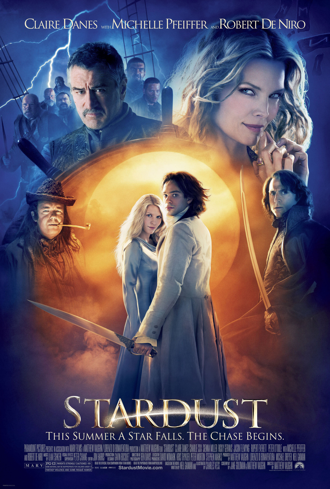
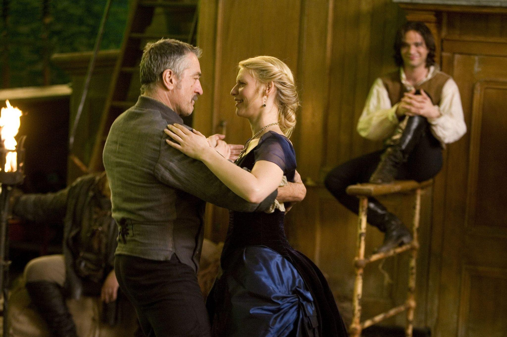
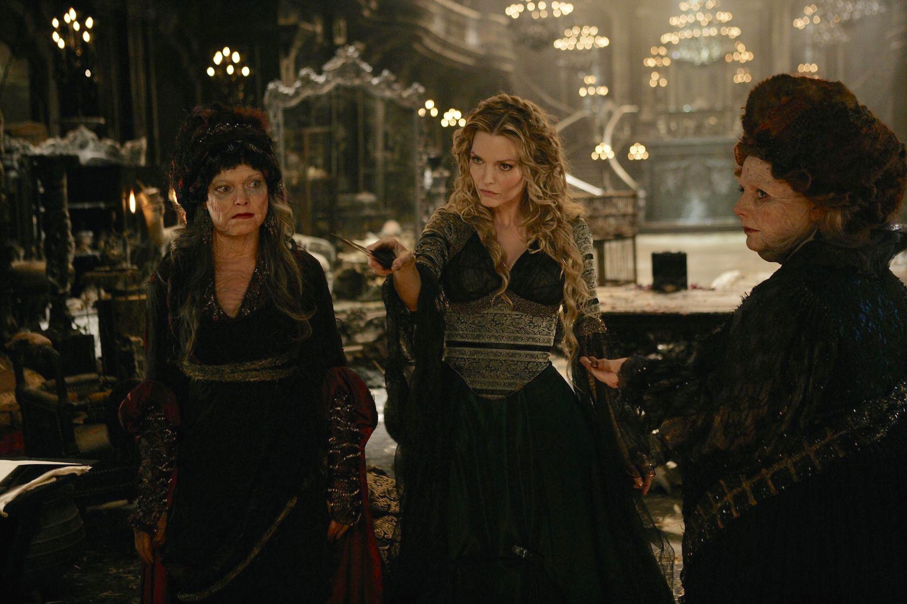

+++
type = "post"
titre = "<em>Stardust, le mystère de l&rsquo;étoile</em>, Matthew Vaughn"
title = "Stardust, le mystère de l'étoile, Matthew Vaughn"
url = "/stardust-mystere-etoile-vaughn"
date = "2015-01-25T18:12:00"
Lastmod = "2015-01-25T23:56:51"
cover = "stardust-mystere-etoile-vaughn-claire-danes.jpg"
categorie = [ "À voir" ]
tag = [ "Adaptation littéraire", "Amour", "Aventure", "Conte", "Drame", "Fantastique", "Humour", "Princesse" ]
createur = [ "Matthew Vaughn" ]
acteur = [ "Charlie Cox", "Claire Danes", "Michelle Pfeiffer", "Robert De Niro" ]
annee = [ "2007" ]
weight = 2007
pays = [ "États-Unis", "Grande-Bretagne", "Islande" ]
original = "Stardust"

+++

Adapter un conte fantastique au cinéma n&rsquo;est jamais simple, mais c&rsquo;est encore plus difficile quand le conte en question est une œuvre noire destinée aux adultes. Écrit par Neil Gaiman, <em>Stardust</em> était une gageure à adapter et un studio s&rsquo;était déjà cassé les dents sur ce projet, quand Matthew Vaughn s&rsquo;en est emparé. Cette fois, il a mené l&rsquo;adaptation avec l&rsquo;auteur et a choisi, paradoxalement, une toute autre direction. <em>Stardust, le mystère de l&rsquo;étoile</em> n&rsquo;est plus du tout un conte noir et sérieux, mais plutôt une comédie qui instaure une distance permanente avec le fantastique qu&rsquo;elle décrit. Un choix probablement salutaire : le long-métrage est souvent assez kitsch et ses effets spéciaux auraient vraiment mal vieilli s&rsquo;ils n&rsquo;étaient pas constamment remis en cause par un humour ambiant très convaincant. Grâce à ses personnages secondaires de première classe qui viennent contre-balancer un héros plus transparent, la deuxième réalisation de Matthew Vaughn est un divertissement très plaisant.

<em>Stardust, le mystère de l&rsquo;étoile</em> se déroule dans l&rsquo;Angleterre victorienne d&rsquo;un univers parallèle où un mur sépare le monde des humains, de celui du conte. De l&rsquo;autre côté de ce mur, il y a des sorcières et de la magie, des pirates sur des bateaux volants ou encore des étoiles qui tombent du ciel sous une forme humaine. C&rsquo;est justement l&rsquo;une de ces étoiles qui est au cœur du récit mis en images par Matthew Vaughn. D&rsquo;une part, il y a le roi de Stormhold — côté fantastique du mur — qui, sur son lit de mort, lance un défi à ses enfants encore vivants : celui qui récupérera la pierre accrochée au cou de l&rsquo;étoile incarnée héritera du trône. De l&rsquo;autre côté du mur, il y a Tristan, le commis un peu naïf du village, qui promet à la femme qu&rsquo;il pense aimer de ramener l&rsquo;étoile pour prouver son amour. Sans compter les sorcières qui veulent mettre la main sur l&rsquo;étoile et surtout sur son cœur avant les autres : en le mangeant, elles peuvent retrouver leur jeunesse et rester immortelles. <em>Stardust, le mystère de l&rsquo;étoile</em> s&rsquo;organise ainsi en une course contre la montre avec trois groupes différents qui veulent tous la même chose. Tristan est le premier à tomber sur l&rsquo;étoile, littéralement, mais il aura ensuite fort à faire pour la sauver et naturellement, il l&rsquo;aimera avant la fin du film. Tout ceci est très classique, et pour cause : Matthew Vaughn adapte un conte fantastique et il ne cherche pas à faire autre chose. Le début du film est d&rsquo;ailleurs au premier degré, ce qui n&rsquo;est pas la meilleure idée : le côté kitsch, renforcé par quelques effets numériques un peu datés et handicapé par le manque de moyens — on n&rsquo;est pas au niveau du <a href="/saga/le-seigneur-des-anneaux/"><em>Seigneur des Anneaux</em></a>, pour rester dans le fantastique — forme un ensemble assez surprenant, et ce n&rsquo;est pas positif.

Fort heureusement, Matthew Vaughn était conscient de la difficulté de la tâche et il a opté pour une idée absence du roman de Neil Gaiman, mais qui sauve le film : l&rsquo;humour. <em>Stardust, le mystère de l&rsquo;étoile</em> n&rsquo;est pas une comédie, mais ce film d&rsquo;aventures teinté de fantastique fait la part belle au second degré, instaurant une distance salutaire avec son univers de sorcières et autres composants caractéristiques du genre. Après une séquence introductive un peu trop sérieuse, le film adopte un ton plus léger, avec des personnages tous aussi ridicules les uns que les autres, et quelques idées vraiment drôles. Pour les prétendants au trône, l&rsquo;idée de faire agir les fantômes aux côtés des survivants est l&rsquo;occasion de multiples gags parfois hilarants et en tout cas, elle relativise l&rsquo;importance de leur quête. Les sorcières sont, elles aussi, comiques à leur dépens avec une autre bonne idée : elles sont vieilles et ridées, mais celle qui part en quête de l&rsquo;étoile redevient jeune au début du film. C&rsquo;est Michelle Pfeiffer qui l&rsquo;incarne et qui retrouve ses rides et sa vieillesse quand elle utilise la magie, avec à la clé quelques séquences vraiment drôles quand elle perd brutalement un attribut de jeunesse. Quant aux tourtereaux — Tristan et l&rsquo;étoile —, ils forment un couple malgré eux et surtout ils rencontrent ces pirates de l&rsquo;air qui volent des éclairs pendant les orages. En soi, rien de drôle, mais <em>Stardust, le mystère de l&rsquo;étoile</em> a l&rsquo;excellente astuce de faire de leur capitaine — incarné par un Robert De Niro inattendu dans ce rôle et qui s&rsquo;éclate manifestement autant que nous — un homosexuel précieux et qui danse même le french cancan dans sa cabine. Matthew Vaughn multiplie ainsi les pistes comiques et c&rsquo;est une bonne chose : alors que son long-métrage est un peu trop sérieux au départ, il gagne vite en légèreté et s&rsquo;améliore en cherchant du côté de l&rsquo;absurde à l&rsquo;anglaise. On comprend que Terry Gilliam a été approché pour le réaliser, on n&rsquo;est pas si éloigné par moment de l&rsquo;univers des Monty Python, sans aller aussi loin dans l&rsquo;absurde.

Pour adapter un conte sérieux, Matthew Vaughn a fait le pari de l&rsquo;humour et c&rsquo;est une excellente solution. Le cinéaste a indiqué qu&rsquo;il voulait un film dans l&rsquo;esprit de <a href="/princess-bride-reiner/" title="Princess Bride, Rob Reiner"><em>Princess Bride</em></a> pour cette mise à distance du fantastique et dans un cas, comme dans l&rsquo;autre, c&rsquo;est une réussite. <em>Stardust, le mystère de l&rsquo;étoile</em> n&rsquo;est pas un chef-d&rsquo;œuvre, mais il n&rsquo;en a aucunement l&rsquo;ambition. C&rsquo;est un divertissement solide, sauvé par son second degré et par des seconds rôles excellents. Un cocktail réussi !

<h3>Vous voulez <a href="/soutien/">m&rsquo;aider</a> ?</h3>
<ul>
<li><a href="http://www.amazon.fr/gp/product/B0041KW46S/ref=as_li_ss_tl?ie=UTF8&amp;tag=leblogdenic07-21&amp;linkCode=as2&amp;camp=1642&amp;creative=19458&amp;creativeASIN=B0041KW46S">Acheter le film en Blu-ray sur Amazon</a></li>
<li><a href="http://www.amazon.fr/gp/product/B00141CX0Y/ref=as_li_ss_tl?ie=UTF8&amp;tag=leblogdenic07-21&amp;linkCode=as2&amp;camp=1642&amp;creative=19458&amp;creativeASIN=B00141CX0Y">Acheter le film en DVD sur Amazon</a></li>
<li><a href="https://itunes.apple.com/fr/movie/stardust-le-mystere-letoile/id366163363">Acheter ou louer le film sur l&rsquo;iTunes Store</a></li>
<li><a href="http://www.netflix.com/WiMovie/70054920?trkid=13462100">Regarder le film sur Netflix</a></li>
</ul>

