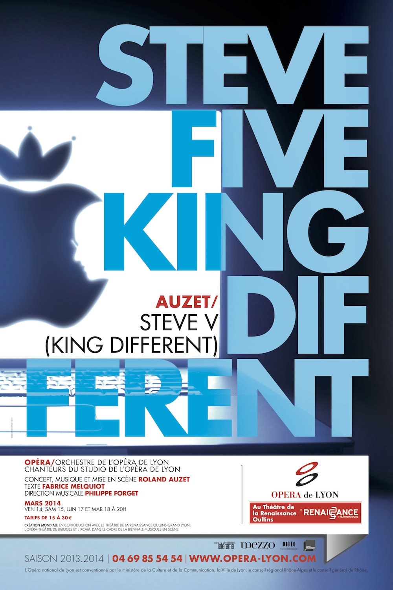
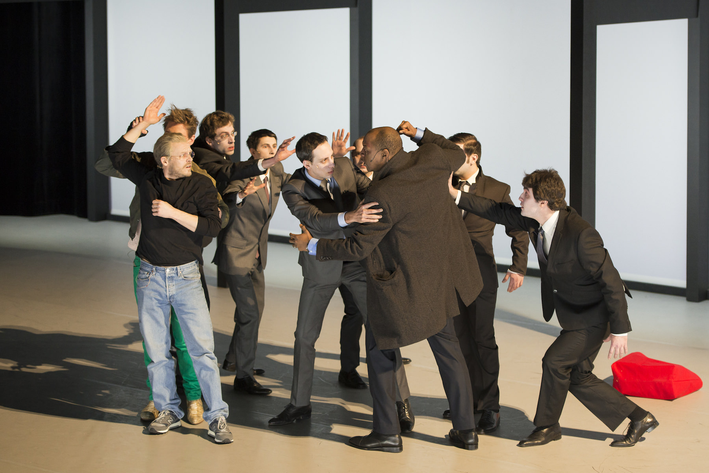
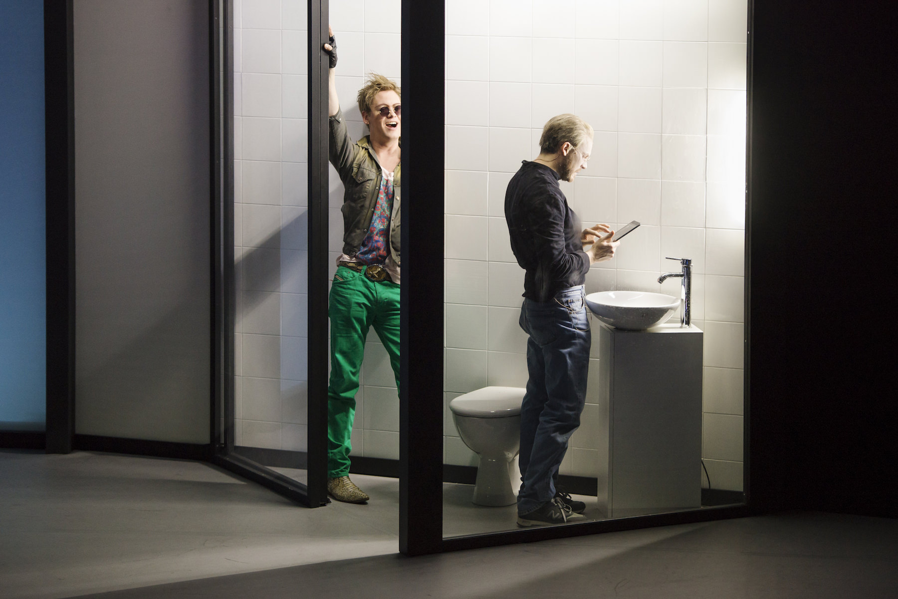

+++
type = "post"
titre = "<em>Steve V (King Different)</em>, Roland Auzet (Théâtre de la Renaissance, 14 mars 2014)"
title = "Steve V (King Different), Roland Auzet (Théâtre de la Renaissance, 14 mars 2014)"
url = "/steve-v-king-different-auzet"
date = "2014-03-15T21:27:38"
Lastmod = "2014-12-22T01:13:14"
cover = "steve-v-king-different-roland-auzet-thibault-vincon.jpg"
categorie = [ "À voir… en live" ]
tag = [ "Apple", "Art", "Classique", "Expérience", "Maladie", "Mort", "Musique", "Opéra", "Steve Jobs" ]
createur = [ "Roland Auzet" ]
acteur = [ "Michael Slattery", "Oxmo Puccino", "Thibault Vinçon" ]
annee = [ "2014" ]
weight = 2014
pays = [ "France" ]
metteur = [ "Roland Auzet" ]
lieu = [ "Théâtre de la Renaissance" ]
chef = [ "Philippe Forget" ]

+++

<blockquote class="pull-quote">
Librement inspiré de la biographie de Steve Jobs, fondateur d’Apple, et du drame historique Henry V de Shakespeare, Steve V est une Passion hantée par l’ambition, le génie créateur, la révolution numérique et la mort. Dans l’ombre de son Cancer, Steve chemine vers sa disparition, son effacement du monde moderne et son entrée dans le Nuage, homme devenant somme de données, abstraction blanche dans le paysage contemporain.<cite class="author"> — Fabrice Melquiot, Steve V (King Different), Note d’intention</cite>

</blockquote>

Librement, c’est le moins que l’on puisse dire. Créé par l’Opéra de Lyon, <em>Steve V (King Different)</em> est un opéra moderne qui met en scène le cofondateur d’Apple, certes, mais qui ne doit surtout pas être confondu avec <a href="http://voiretmanger.fr/jobs-stern/" title="Jobs, Joshua Michael Stern"><em>Jobs</em></a> sorti l’an dernier. Loin du sage biopic de Joshua Michael Stern, cette œuvre ambitieuse signée Roland Auzet utilise la fin de la vie de Steve Jobs pour évoquer des sujets bien plus profonds, de la maladie à l’ère du numérique, en passant par la création ou la solitude de l’homme moderne. À ce fond ambitieux, le compositeur ajoute une modernité radicale dans la forme, pour un résultat pour le moins étonnant. <em>Steve V (King Different)</em> esquisse des idées intéressantes et propose une utilisation originale et bien trouvée des techniques les plus modernes, mais Roland Auzet tombe dans les travers de la modernité excessive et signe une œuvre caricaturale et finalement assez prévisible.

Plutôt que de parler simplement de la vie de Steve Jobs, de son amour de l’informatique, de son perfectionnisme maladif et de sa vraie maladie qui l’a finalement terrassé, <em>Steve V (King Different)</em> préfère établir un audacieux parallèle avec <a href="http://fr.wikipedia.org/wiki/Henri_V_(Shakespeare)"><em>Henry V</em></a>, la pièce de Shakespeare. Roland Auzet n’a pas eu froid aux yeux pour s’attaquer à un tel monument de la littérature anglophone et c’est sans doute par volonté de ne pas en rester à la trivialité d’une vie, mais au contraire pour élever le débat qu’il a suivi cette piste. Pour autant, les liens entre la vie de Steve Jobs et la pièce ne semblaient pas évidents et l’opéra ne nous aide pas vraiment à comprendre les intentions de l’auteur. Quand le spectacle commence vraiment — on entre dans la salle alors que le chœur est déjà sur la scène et l’orchestre répète dans son coin —, on est plongé dans un étrange ensemble composé d’un vaste espace au premier plan avec une estrade au-dessus et des toilettes au fond. Le décor unique de <em>Steve V (King Different)</em> veut sûrement rappeler les Apple Store, ces boutiques d’Apple au design minimaliste, mais on ne sait jamais très bien où l’on est et le choix de placer des toilettes est pour le moins déroutant et semble assez gratuit. On découvre un Steve Jobs maigre et faible comme il pouvait l’être à la fin de sa vie — interprété par un Michael Slattery convaincant —, mais aussi les deux autres personnages principaux imaginés par Roland Auzet. Il y a d’abord son cancer, personnifié par Thibault Vinçon, le seul soliste de cet opéra tout aussi minimaliste que peuvent l’être les produits du constructeur — trois personnages dont un seul qui chante, un chœur de cinq ou six hommes et puis une dizaine de musiciens seulement. Et puis il y a Billy Bud — incarné par Oxmo Puccino, le rappeur qui ajoute une étonnante corde à son arc avec cette participation —, un personnage encore plus étonnant, puisque l’on ne sait pas ce qu’il fait là, ni qui il est et l’auteur ne fait surtout aucun effort pour nous aider. À la fin, c&rsquo;est Siri, l&rsquo;assistant vocal qui accompagne tous les appareils mobiles d&rsquo;Apple, qui fait son apparition dans un dialogue surprenant avec son créateur.

C’est bien le défaut de cet opéra qui souffre de tous les clichés de la musique classique contemporaine, ou presque. À bien des égards, <em>Steve V (King Different)</em> s’apparente à la compilation de ce qu’il faut faire pour dégoûter le grand public d’aller à l’opéra. Faut-il nécessairement que la musique, interprétée ici par un petit orchestre de chambre d’une dizaine d’instruments, soit absolument dissonante et jamais agréable à l’oreille ? On ne demande pas nécessairement des mélodies populaires, mais Roland Auzet qui a aussi composé la musique semble tout faire pour ne jamais produire la moindre mesure qui puisse être agréable, comme si c’était la pire vulgarité à ne pas faire. Dommage, d&rsquo;autant que l&rsquo;on a droit à une très belle reprise de « <em>Strawberry Fields Forever</em> » des Beatles qui  constitue sans conteste un des plus beaux moments de la représentation. D’autant, aussi, que cet opéra sonorisé joue de façon astucieuse avec des bandes enregistrées et avec des bruitages qui sont envoyés dans la salle en plus de la musique produite par les instruments traditionnels. Même si ces effets sonores n’étaient pas toujours parfaits et nuisaient parfois à la compréhension des paroles, ils restent une bonne idée. Fallait-il aussi nécessairement tomber dans la provocation gratuite ? Les toilettes bien mises en évidence sur la scène servent à rappeler en permanence la maladie de Steve Jobs, soit. Mais <em>Steve V (King Different)</em> devait-il vraiment nous signifier par les dialogues, puis par des bruitages explicites que son personnage vomit à quatre ou cinq reprises ? Dans un autre genre, comment expliquer les excès du chanteur qui incarne le cancer et qui se dandine sur scène comme s’il était dans une boîte de nuit ? Au-delà de ces détails pénibles, le vrai problème de cet opéra est son incohérence. On ne comprend pas grand-chose, même quand on lit le résumé rédigé par Fabrice Melquiot, l’auteur du livret. On a déjà évoqué le rôle mystérieux de Billy Bud qui n’est jamais explicité, mais on retiendra surtout ces pistes lancées par le scénario et qui n’aboutissent jamais. Roland Auzet a voulu s’inspirer de la vie de Steve Jobs et on retrouve bien quelques éléments — les pommiers de l’Oregon ici, la femme de Steve Jobs là, le garage de ses parents adoptifs ailleurs —, mais <em>Steve V (King Different)</em> n’est en rien une biographie. Il y a aussi une part plus ou moins métaphysique avec quelques réflexions qui pourraient d’ailleurs être intéressantes sur l’homme à l’ère du numérique et de la dématérialisation, mais cette piste est perdue dans l’ensemble. Et puis il y a des séquences presque gênantes, où la pièce tente d’être drôle avec une caricature si banale sur Apple, ses produits et sa culture d’entreprise. Ou, pire, ces autres passages où Steve Jobs vomit, ou quand son cancer le balance à terre avant de poser des mains ensanglantées sur une vitre, sans raison non plus…

Perplexe : c’est bien la sensation qui s’empare du spectateur dès les premières minutes de <em>Steve V (King Different)</em>. Que l’on soit surpris par une œuvre, c’est une bonne chose, mais pas quand on ne comprend que des bribes pendant une heure trente. L’opéra de Roland Auzet semble assez gratuitement élitiste et c’est bien dommage : un tel sujet aurait appelé un traitement plus accessible et on aurait pu avoir une œuvre vraiment passionnante. En l’état, on apprécie l’utilisation de tablettes dans la mise en scène — et ce n’est pas qu’un gadget, mais une vraie idée forte et bien exploitée —, on peut aussi saluer le travail des acteurs et chanteurs avec la présence surprenante d’Oxmo Puccimo, mais on ne peut pas être séduit par ce spectacle qui semble prendre un malin plaisir à nous perdre. <em>Steve V (King Different)</em> aurait peut-être gagné à laisser de côté la comparaison avec Shakespeare qui n&rsquo;est pas vraiment exploitée. Peut-être aussi qu’à trop chercher la modernité, Roland Auzet s’est perdu avec une œuvre inutilement complexe, au point de passer à côté d’un sujet vraiment passionnant. À tel point que la piste lancée par la note d&rsquo;intention d&rsquo;un Steve Jobs dématérialisé dans le Nuage, allégorie des serveurs qui stockent et gèrent toutes nos données personnelles, a été également oubliée en cours de route, alors que c&rsquo;était un autre sujet intéressant. Dommage…

<small>Steve V (King Different) <em>ne devrait avoir qu&rsquo;une vie très courte, avec trois autres représentations prévues au Théâtre de la Renaissance d&rsquo;Oullins, les samedi 15, lundi 17 et mardi 18 mars, à chaque fois à 20 heures.</em></small>

