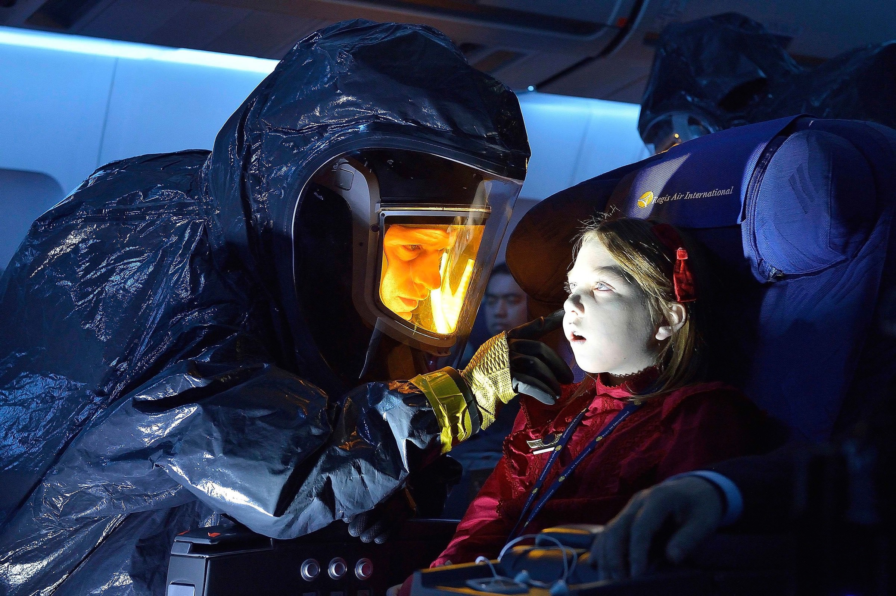
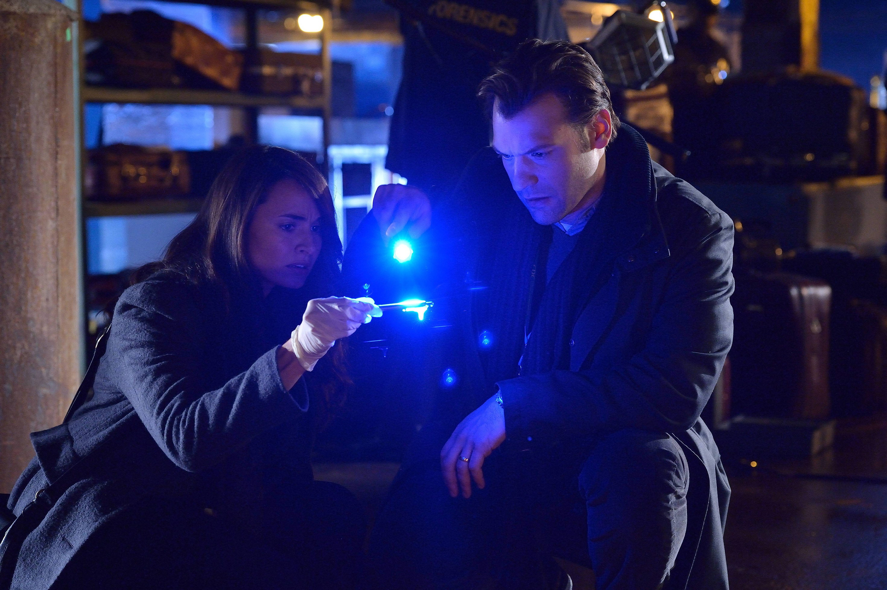
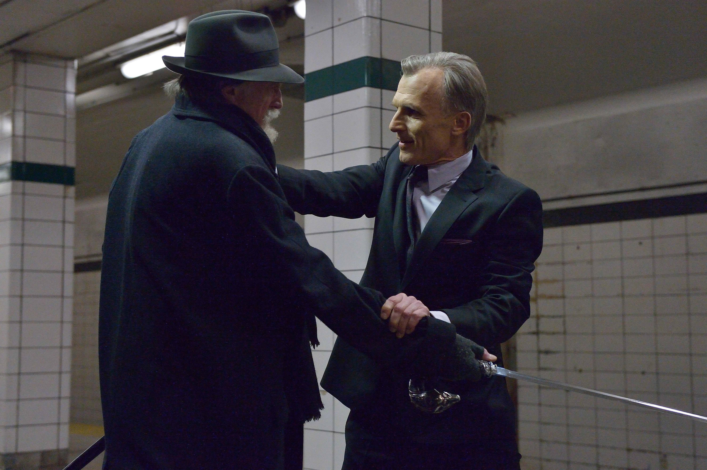

+++
type = "post"
titre = "<em>The Strain</em>, Guillermo del Toro et Chuck Hogan (FX)"
title = "The Strain, Guillermo del Toro et Chuck Hogan (FX)"
url = "/strain-toro-hogan-fx"
date = "2015-05-07T23:53:07"
Lastmod = "2015-06-04T22:07:23"
cover = "strain-toro-hogan-fx.jpg"
categorie = [ "À voir" ]
tag = [ "Adaptation littéraire", "Apocalypse", "Fantastique", "Horreur", "Série", "Vampires", "Zombie" ]
createur = [ "Chuck Hogan", "FX", "Guillermo del Toro" ]
acteur = [ "Ben Hyland", "Corey Stoll", "David Bradley", "Kevin Durand", "Mía Maestro", "Miguel Gomez", "Richard Sammel", "Ruta Gedmintas", "Sean Astin" ]
annee = [ "2015" ]
weight = 2015
pays = [ "États-Unis" ]

+++

Pour son passage du grand au petit écran, Guillermo del Toro ne s&rsquo;est pas éloigné de l&rsquo;un de ses genres de prédilection : l&rsquo;horreur. <em>The Strain</em> prends des allures de série de fin du monde, avec une invasion de créatures à mi-chemin entre les zombies et les vampires. Résolument tournée vers les films de série B, cette série ne se prend pas trop au sérieux, mais déploie son récit avec un plaisir communicatif. Si vous aimez les créatures déplaisantes à regarder, les intrigues à base de vampires et les vengeurs solitaires armés d&rsquo;épées en argent, <em>The Strain</em> offre un bonheur coupable indéniable. On sent que Guillermo del Toro et Chuck Hogan ont d&rsquo;abord écrit un roman avant de l&rsquo;adapter en série pour se faire plaisir, mais c&rsquo;est une réussite aussi pour les spectateurs. On a hâte de voir la suite après une première saison pleine de promesses !

Comme <a href="/fringe-abrams-kurtzman-orci-fox/" title="Fringe, J. J. Abrams, Alex Kurtzman et Roberto Orci (FOX)"><em>Fringe</em></a>, cette série commence autour d&rsquo;un accident d&rsquo;avion. Nulle explosion en vol ici toutefois, simplement un avion qui arrive mort : il se pose à l&rsquo;aéroport, mais personne ne répond à la radio, tous les volets sont fermés et on a l&rsquo;impression qu&rsquo;il n&rsquo;y a rien de vivant à l&rsquo;intérieur. Puisqu&rsquo;il pourrait s&rsquo;agir d&rsquo;un accident bactériologique ou d&rsquo;une épidémie d&rsquo;une quelconque sorte, c&rsquo;est le CDC qui entre le premier dans l&rsquo;avion et constate que les 200 passagers et membres d&rsquo;équipage sont morts. Le mystère, c&rsquo;est qu&rsquo;il n&rsquo;y a aucune cause évidente : <em>The Strain</em> repose largement sur cette idée que l&rsquo;on ne sait pas ce qui se passe. Guillermo del Toro et Chuck Hogan ne vont pas aussi loin que <a href="/leftovers-lindelof-perrotta-hbo/" title="The Leftovers, Damon Lindelof et Tom Perrotta (HBO)"><em>The Leftovers</em></a>, jusqu&rsquo;au-boutiste pour ne donner aucune explication, mais leur série ne donne pas toutes les clés tout de suite. On comprend en même temps que le docteur « Eph » Goodweather que quelque chose ne va vraiment pas dans cet avion, mais si on voit très vite ceux qui sont derrière ce qui se passe, on ne connait pas tout de suite leurs motivations. La première saison dévoile quelques éléments, mais en garde aussi : on découvre rapidement que l&rsquo;on a affaire à une attaque de vampires/zombies, on comprend qu&rsquo;elle est organisée sans savoir à quelle fin et surtout on découvre petit à petit que la situation est beaucoup plus complexe que prévu. Il y a d&rsquo;autres groupes qui se forment pour attaquer le problème et on ne sait pas ce qu&rsquo;ils cherchent. Bref, <em>The Strain</em> met en place son univers et ses personnages clés et on a envie d&rsquo;en savoir plus, mais le scénario n&rsquo;en dévoile habilement pas trop. Il faudra attendre la suite, d&rsquo;ores et déjà prévue avec au moins deux saisons de plus, pour mieux comprendre ce qui se passe et savoir si les héros pourront battre les vilains.

Même si c&rsquo;est un petit peu plus complexe, <em>The Strain</em> peut se résumer très simplement à une opposition entre le bien et le mal. À cet égard, Guillermo del Toro et Chuck Hogan restent dans l&rsquo;esprit de la série B et assument : leur histoire ne cherche pas les complications inutiles et la ligne directrice est assez claire. Le plaisir ne vient pas d&rsquo;une intrigue qui part dans tous les sens, mais plutôt de ses thèmes classiques revisités avec brio. La série joue sur le mythe du vampire et ajoute quelques éléments à ce personnage vieux de plusieurs siècles et déjà tellement utilisé au cinéma. Les créatures de <em>The Strain</em> vivent en buvant du sang, elles craignent la lumière du jour et l&rsquo;argent ; en cela, elles sont bien des vampires. Mais elles se comportent largement comme des morts-vivants, se déplacent comme eux, sont stupides comme eux. Et puis il y a cet appendice qui sort de leur bouche et qui rappelle plus un Alien qu&rsquo;un vampire traditionnel. De ce fait, on est bien dans le registre de l&rsquo;horreur, mais c&rsquo;est de l&rsquo;horreur revisitée, une vision originale avec ses propres règles qui renouvelle le genre. Les treize épisodes de la première saison se suivent comme un feuilleton, on a toujours envie d&rsquo;en voir plus et le récit est bien mené, avec des personnages bien dessinés. <em>The Strain</em> n&rsquo;évite pas quelques défauts, le grand méchant notamment manque étonnamment de réalisme et ressemble plus à un vilain de dessin-animé, ce qui tranche avec le traitement assez sérieux des autres créatures. Et puis, alors que la série entend maintenir un traitement réaliste malgré ses bestioles fantastiques, le récit opte souvent pour la facilité : on se demande bien comment l&rsquo;infection peut être aussi large dans une ville comme New York, sans que les autorités n&rsquo;interviennent, par exemple. Par ailleurs, certains épisodes abusent un petit peu des flashbacks et le scénario gagnerait souvent à être moins prompt à toujours tout expliciter. Néanmoins, on ne s&rsquo;ennuie jamais, le rythme maintient l&rsquo;attention d&rsquo;un bout à l&rsquo;autre et le simple plaisir de voir des créatures hideuses, combiné à un sens aiguisé du suspense font le reste.

Essai réussi pour <em>The Strain</em> ! À condition d&rsquo;aimer le genre de l&rsquo;horreur, tendance vampires et zombies, vous auriez tort de ne pas regarder la première série de Guillermo del Toro. Le cinéaste s&rsquo;est manifestement fait plaisir en combinant ce qui constitue ce qu&rsquo;il préfère dans le genre, et le résultat est convaincant. Nonobstant quelques défauts, cette première saison est très encourageante et donne envie de voir la suite. <em>The Strain</em> a posé de bonnes bases et on espère qu&rsquo;elles serviront à des saisons encore plus folles par la suite.

<h3>Vous voulez <a href="/soutien/">m&rsquo;aider</a> ?</h3>
<ul>
<li><a href="http://www.amazon.fr/gp/product/B00NGOAHAK/ref=as_li_ss_tl?ie=UTF8&amp;tag=leblogdenic07-21&amp;linkCode=as2&amp;camp=1642&amp;creative=19458&amp;creativeASIN=B00NGOAHAK">Acheter la série en Blu-ray sur Amazon</a></li>
<li><a href="http://www.amazon.fr/gp/product/B00NGOAGLU/ref=as_li_ss_tl?ie=UTF8&amp;tag=leblogdenic07-21&amp;linkCode=as2&amp;camp=1642&amp;creative=19458&amp;creativeASIN=B00NGOAGLU">Acheter la série en DVD sur Amazon</a></li>
</ul>

