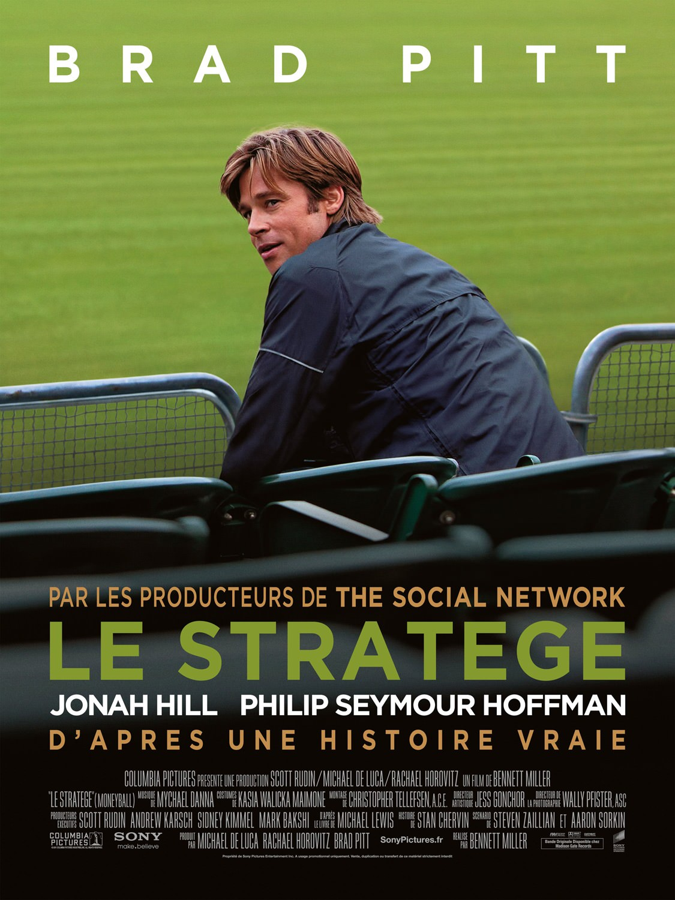
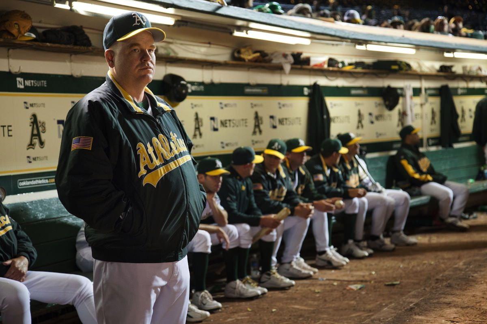

+++
titre = "<em>Le Stratège</em>, Bennett Miller"
title = "Le Stratège, Bennett Miller"
url = "/stratege-miller"
date = "2012-11-23T00:39:25"
Lastmod = "2014-09-20T21:35:34"
cover = "le-stratege-brad-pitt.jpg"
categorie = [ "À voir" ]
tag = [ "Comédie dramatique", "Histoire vraie", "Société", "Spectacle", "Sport" ]
createur = [ "Bennett Miller" ]
acteur = [ "Brad Pitt", "Jonah Hill", "Philip Seymour Hoffman" ]
annee = [ "2011" ]
weight = 2011
pays = [ "États-Unis" ]
original = "Moneyball"

+++

L’histoire vraie d’un club de baseball qui a réussi à gagner 20 matchs d’affilée en adoptant une stratégie radicalement différente basée sur des statistiques. Autant le dire, le sujet de <em>Le Stratège</em> n’est pas très sexy <em>a priori</em>, mais il ne faut pas prendre peur. Même si on ne connaît rien à ce sport qui reste souvent mystérieux pour un non-Américain, même si on n’aime pas le sport de manière plus générale, le long-métrage de Bennett Miller reste passionnant. On ne comprend pas tous les tenants et aboutissants de la stratégie mise en place, mais <em>Le Stratège</em> offre une plongée fascinante dans un univers méconnu…

Le baseball, sport américain par excellence, répond à des règles très précises qui en font avant tout un spectacle très lucratif. De la même manière, les joueurs sont sélectionnés non pas uniquement pour leurs aptitudes sportives, mais pour un ensemble de critères parmi lesquels le personnage, son physique et son caractère, compte tout autant, voire plus que le côté purement sportif. Les enjeux monétaires sont énormes et les différents clubs organisent leur équipe en fonction d’un budget et d’un manager qui choisit ses joueurs. <em>Le Stratège</em> suit les pas de Billy Beane, un ancien joueur de baseball prometteur, mais qui a déçu sur le terrain. Sa carrière n’a jamais décollé, mais il ne peut quitter ce sport qui est sa passion depuis tout petit et Billy abandonne le terrain au profit de la gestion et devient ainsi le manager des Oaklands Athletics, une toute petite équipe. Alors qu’il perd tous ses bons joueurs, achetés des fortunes par les clubs plus gros que le sien, il décide de tenter le tout pour le tout en changeant de stratégie. Aidé d’un analyste, il constitue une équipe de joueurs qui n’intéressent personne, mais qui doit lui permettre de gagner des parties. Contre toute attente, sa stratégie fonctionne, même s’il faudra composer avec un univers très hostile…

Dès les premières secondes, <em>Le Stratège</em> plonge ses spectateurs dans un univers en général plutôt mal connu de ce côté de l’Atlantique. Les commentateurs s’en donnent à cœur joie sur un match de baseball, les images défilent et les termes techniques ainsi que les noms de joueur s’accumulent. Bennett Miller ne cherche pas à faire un documentaire sur ce sport, mais le scénario est très bien renseigné et cela s’entend. Tout au long du film, les dialogues sont riches de phases techniques qui ne sont jamais indispensables pour comprendre ce qui se passe, heureusement, mais qui contribuent au réalisme de <em>Le Stratège</em>. On découvre alors un sport méconnu et franchement surprenant : ici, les joueurs sont de la marchandise que les clubs s’échangent au grès de leurs envies et de leurs réussites. Les managers s’appellent pour négocier des échanges de joueurs, fixer des prix et constituer ainsi des équipes qui vont et viennent en fonction des contrats. Les dollars s’échangent eux aussi par million et les clubs les plus fortunés s’offrent immanquablement les services des meilleurs joueurs. Un cercle vertueux qui empêche mécaniquement les petits clubs de s’en sortir : Billy Bean essaie justement sans relâche de gagner avec sa petite équipe. La tâche n’est pas aisée, d’autant qu’il essaie de mettre en place une nouvelle stratégie qui plait aussi peu aux piliers du club qu’à l’entraîneur. <em>Le Stratège</em> montre bien le fonctionnement d’un club et surtout sa gestion difficile, des joueurs envoyés d’un club à l’autre comme des meubles à la direction partagée entre le manager qui embauche et l’entraîneur qui exploite sur le terrain. Au cœur des enjeux, on trouve aussi un conflit entre deux hommes que tout oppose.

Bennett Miller s’intéresse d’abord au parcours d’un homme. Billy Beane a accepté d’arrêter ses études contre un gros chèque et la promesse d’une brillante carrière sur les terrains de baseball. Las, le jeune homme prometteur déçoit sur le terrain, il ne concrétise rien et mène une carrière décevante, à tout le moins. Dépité, il reste dans le milieu et devient manager, mais <em>Le Stratège</em> filme un homme énervé. Billy Beane voudrait changer ce sport qui choisit ses joueurs plus sur le physique et sur la vie privée que sur leurs capacités. La scène la plus impressionnante du film est peut-être celle qui se déroule au cours d’une réunion qui doit désigner un nouveau joueur pour remplacer la star du club. Les sélectionneurs suggèrent des noms et commentent qui leur charisme, qui la beauté de leur copine et on a l’impression de se trouver au cœur d’un casting pour un film de téléréalité. Billy Beane n’en peut plus de ces vieilles méthodes, il veut des idées nouvelles et il les trouve avec Peter Brand. Ce jeune homme, caricature parfaite du geek, sort de Yale où il a étudié l’économie et il a mis au point un programme qui analyse les vastes <a href="http://fr.wikipedia.org/wiki/Statistiques_au_baseball">statistiques</a> de ce sport pour tirer des rapports objectifs sur chaque joueur. En se basant uniquement sur ces rapports, il aide Billy à mettre en place une équipe très originale, composée en apparence uniquement de bras cassés, mais qui va mener les Oaklands Atlantics à la victoire à vingt reprises de suite, un record absolu. La force de <em>Le Stratège</em> est de bien montrer qu’il s’agit aussi d’une revanche de Billy Beane sur la vie et sur sa carrière ratée. On ne révèlera pas la fin de cette histoire vraie, mais elle s’avère à cet égard très touchante.

<em>Le Stratège</em> entre immédiatement dans le vif du sujet, le baseball, et de ne jamais le quitter pendant toute sa durée. Le spectateur est plongé dans cet univers qu’il ne connaît pas forcément, mais Bennett Miller a su doser parfaitement les informations techniques pour ne jamais le perdre. Que l’on s’intéresse <em>a priori</em> au baseball ou non, peu importe : le film parvient dans tous les cas à être intéressant et à maintenir une certaine tension jusqu’à la fin. Le long-métrage est bien rythmé et le cinéaste est parvenu à rendre palpable cette tension, si bien que l’on est pris par l’action, même si on ne la comprend pas toujours, pour être franc. Les acteurs se devaient aussi de convaincre et il faut saluer ici le talent de Brad Pitt, parfait en manager en quête de revanche. La star est très bien entourée, avec un excellent Philip Seymour Hoffman, tandis que Jonah Hill fait un geek statisticien très convaincant. <em>Le Stratège</em> sait rester divertissant, il ne se laisse pas écraser par son sujet historique et propose un divertissement de qualité.

Si <em>Le Stratège</em> n’attire pas forcément l’attention au premier abord, Bennett Miller a su en faire un film passionnant, même pour qui ne s’intéresse absolument pas au baseball. On découvre avec plaisir ce monde si étonnant et l’histoire de ce manager intéresse au-delà même du sport. À voir si vous l’aviez raté en salles…

<h3>Vous voulez m’aider ?<a href="#footnote_0_7812" id="identifier_0_7812" class="footnote-link footnote-identifier-link" title="&Agrave; propos de la publicit&eacute;&hellip;">1</a></h3>
<ul>
<li><a href="http://www.amazon.fr/gp/product/B0067JPGAC/ref=as_li_ss_tl?ie=UTF8&#038;tag=leblogdenic07-21&#038;linkCode=as2&#038;camp=1642&#038;creative=19458&#038;creativeASIN=B0067JPGAC">Acheter le film en Blu-Ray sur Amazon</a></li>
<li><a href="http://www.amazon.fr/gp/product/B0067JPG52/ref=as_li_ss_tl?ie=UTF8&#038;tag=leblogdenic07-21&#038;linkCode=as2&#038;camp=1642&#038;creative=19458&#038;creativeASIN=B0067JPG52">Acheter le film en DVD sur Amazon</a></li>
<li><a href="https://itunes.apple.com/fr/movie/le-stratege/id504826773">Acheter le film sur l’iTunes Store</a></li>
</ul>

<ol class="footnotes"><li id="footnote_0_7812" class="footnote"><a href="http://voiretmanger.fr/soutien/">À propos de la publicité…</a> [<a href="#identifier_0_7812" class="footnote-link footnote-back-link">&#8617;</a>]</li></ol>
