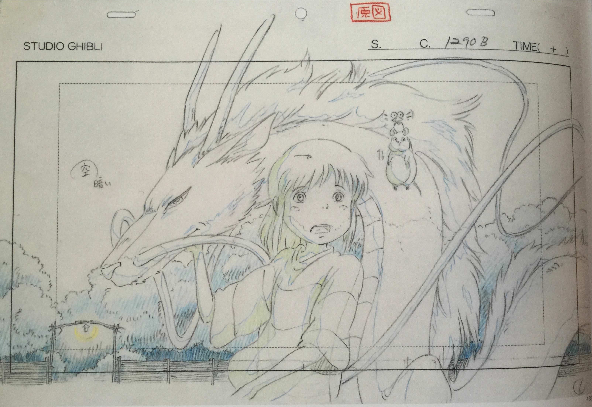

+++
type = "post"
titre = "Dessins du studio Ghibli au Musée Art Ludique de Paris"
title = "Dessins du studio Ghibli au Musée Art Ludique de Paris"
url = "/studio-ghibli-art-ludique-paris"
date = "2015-02-15T00:33:42"
Lastmod = "2015-02-15T00:35:00"
cover = "dessins-studio-ghibli-paris.jpg"
categorie = [ "Sorties" ]
tag = [ "Animation", "Dessin", "Exposition", "Ghibli" ]

+++

Les longs-métrages produits par le studio Ghibli ont marqué pour toujours le paysage de l&rsquo;animation. Tous ses chefs d&rsquo;œuvre ont contribué à populariser l&rsquo;animation japonaise et l&rsquo;exposition <em>Dessins du studio Ghibli</em> offre un regard passionnant du côté de la réalisation. Ces images et séquences que l&rsquo;on connaît si bien dévoilent tous leurs secrets grâce aux 1300 dessins rassemblés dans cette exposition exceptionnelle, que l&rsquo;on peut encore voir à Paris (jusqu&rsquo;au premier mars). Ces « layout » ne doivent être manqués sous aucun prétexte par tous les fans du studio Ghibli !

Le concept même du layout a été inventé par Isao Takahata, qui travaillait sur des dessins-animés dans les années 1970. Chaque semaine, il fallait produire un nouvel épisode et donc travailler vite. Jusque-là, les dessinateurs et animateurs recevaient leurs consignes de vive voix de la part du réalisateur, mais cette méthode entraînait de nombreux retards. Les demandes étaient mal comprises et il fallait tout recommencer : c&rsquo;était du temps, et de l&rsquo;argent perdu. Isao Takahata, qui travaillait déjà avec Hayao Miyazaki, a imaginé une feuille avec l&rsquo;intégralité des consignes pour les dessinateurs et animateurs. On y trouve le dessin bien sûr, parfois extrêmement précis et détaillé, parfois plus grossier, mais ce n&rsquo;est pas le plus important. L&rsquo;essentiel, ce sont les notes sur le mouvement de la caméra ou sur l&rsquo;action dans le cadre. Le décor est réalisé par une équipe, les personnages par une autre, mais certains éléments de décor doivent être dessinés séparément : tous les éléments qui doivent être devant les personnages ou l&rsquo;action — un arbre derrière lequel passe le héros, par exemple — sont nommés « <em>book</em> » et ils dont réalisés par une autre équipe, sur un autre support. Et puis il y a les mouvements, que ce soit les nuages qui bougent derrière un avion et donnent ainsi l&rsquo;impression qu&rsquo;il avance, ou bien encore un mouvement de caméra qui embrasse la scène dans un sens, ou dans l&rsquo;autre. Sur ces feuillets, tout est déjà extrêmement précis et bien réglé. Quand il y a un mouvement par exemple, celui qui imagine la scène donne une consigne de défilement : pour un avion à réaction, le décor à l&rsquo;arrière doit avancer plus vite que pour un avion à hélices.

C&rsquo;est tout cela que l&rsquo;on découvre à travers les salles du Musée Art Ludique de Paris. On se sent un peu submergé par les informations quand on commence et que tous les termes techniques sont résumés en quelques panneaux, mais on finit par comprendre ce qui se passe sur ces dessins. Certains textes sont traduits et on découvre alors les demandes de Hayao Miyazaki en vers ses équipes, des demandes toujours très polies, souvent pleines d&rsquo;excuses. On n&rsquo;en apprend pas forcément plus sur les œuvres elles-mêmes, mais cette accumulation de dessins, parfois à l&rsquo;excès — pas moins de 600 dessins rien que pour <em>Le Voyage de Chihiro</em> — est vraiment émouvante. On est au plus près des dessins, séparés seulement par une fine couche de verre, et on peut vraiment en profiter, comme si l&rsquo;on était par dessus l&rsquo;épaule des dessinateurs, des animateurs, voire des réalisateurs eux-mêmes. C&rsquo;est passionnant et on a brusquement envie de tous les revoir, ou de découvrir les œuvres plus rares, pas forcément aussi connues. L&rsquo;exposition livre ces dessins tel quels, sans aucune explication, si bien que l&rsquo;audioguide est obligatoire, pour obtenir un peu de contexte et comprendre certains layout, plus détaillés.

 
 
 
  
 
 
 

L&rsquo;exposition se termine bientôt et on ne sait pas si elle trouvera une autre place ailleurs, mais elle mérite vraiment le détour. Très riche, elle offre une plongée vertigineuse dans l&rsquo;univers des studios Ghibli et permet, pas forcément de mieux connaître l&rsquo;œuvre, mais de mieux l&rsquo;apprécier. À défaut de voir les œuvres exposées, le catalogue de l&rsquo;exposition est un épais pavé qui reprend tous les layouts et il permet d&rsquo;en apprécier chaque détail. Seul regret, il manque peut-être d&rsquo;explications, mais les dessins, par leur poésie, se suffisent souvent à eux-même.

