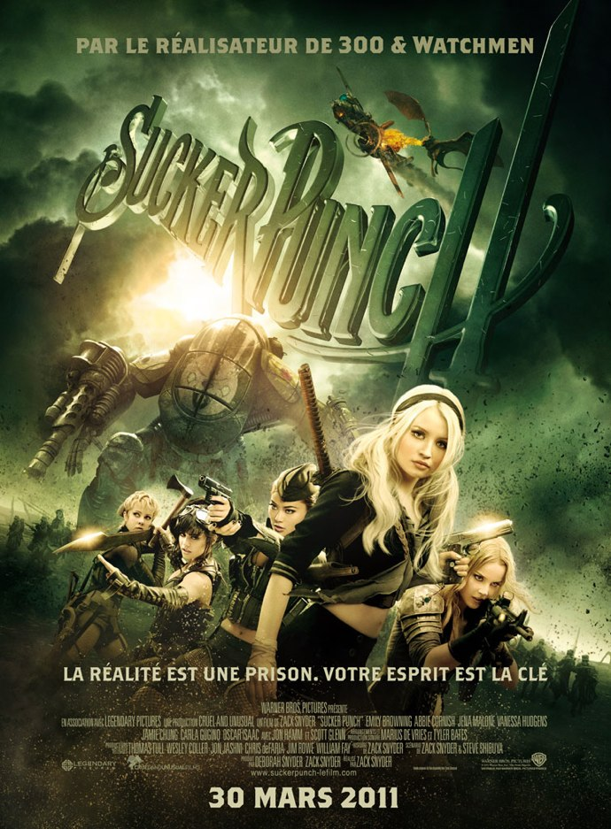
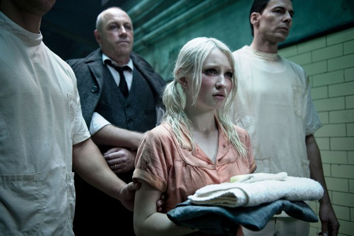

+++
type = "post"
titre = "Sucker Punch, Zack Snyder"
title = "Sucker Punch, Zack Snyder"
url = "/sucker-punch-snyder"
date = "2011-03-30T23:59:43"
Lastmod = "2011-03-31T13:17:17"
cover = "snyder-sucker-punch.jpg"
categorie = [ "À voir" ]
tag = [ "Blockbuster", "Délire", "Expérience", "Fantastique", "Geek", "Guerre", "Violence" ]
createur = [ "Zack Snyder" ]
annee = [ "2011" ]
weight = 2011
pays = [ "États-Unis" ]

+++

Zack Snyder est désormais bien connu des cinéphiles. On l&rsquo;aime ou on le déteste, mais il laisse rarement indifférent. En quelques films, de <em>300</em> à <em><a href="/2009/03/05/watchmen-zack-snyder/">Watchmen</a></em> en passant par le film d&rsquo;animation pour enfants <em><a href="/2010/11/06/royaume-gahoole-legende-gardiens-snyder/">Le Royaume de Ga&rsquo;Hoole</a></em>, il a en tout cas imposé une vraie vision de cinéaste. Toujours dans l&rsquo;outrance et les effets cinématographiques à ne plus savoir qu&rsquo;en faire, le réalisateur américain réalise son cinquième film, mais il ne se contente pas de la réalisation cette fois. <em>Sucker Punch</em> est le premier film original qu&rsquo;il réalise et c&rsquo;est lui qui l&rsquo;a imaginé et qui a écrit le scénario. Le résultat ? Une exubérance d&rsquo;effets qui retrouve cette fois une exubérance scénaristique d&rsquo;une rare intensité. Soyez prévenu, <em>Sucker Punch</em> est un film exténuant, mais pour peu que l&rsquo;on adhère à sa folie, c&rsquo;est une expérience de cinéma à faire.

<a href="http://www.allocine.fr/film/fichefilm_gen_cfilm=126882.html">

</a>

Babydoll est une jeune fille presque comme les autres, presque. À la mort de sa mère, son beau-père découvre que son ancienne épouse n&rsquo;a fait aucun cas de son existence en léguant toute sa fortune à ses deux filles, plutôt qu&rsquo;à lui. Énervé, il décide d&rsquo;éliminer les deux filles en question et réussit par un tour de passe-passe à faire croire que la jeune fille a tué sa sœur avant de s&rsquo;en prendre à lui. Babydoll est alors enfermée dans un hôpital psychiatrique extrêmement glauque où son beau-père s&rsquo;arrange pour la faire lobotomiser quelques jours après son arrivée. Faute de pouvoir s&rsquo;échapper physiquement de sa prison, Babydoll s&rsquo;échappe par l&rsquo;esprit pour se réfugier dans un univers fantastique où l&rsquo;hôpital est transformé en bar avec danseuses dénudées. Dans cet univers, Babydoll parvient encore à s&rsquo;enfuir par la danse pour combattre dans d&rsquo;autres univers fantasmés, en quête de sa liberté. Chaque danse est l&rsquo;occasion d&rsquo;un combat et d&rsquo;un vol

<em>Sucker Punch</em> reprend le principe de l&rsquo;univers imbriqué dans l&rsquo;univers qu&rsquo;avait déjà exploité Christopher Nolan dans <em><a href="/2010/07/17/inception-nolan/">Inception</a></em>. Le principe est ici le même, on s&rsquo;enfonce toujours plus loin dans l&rsquo;esprit de Babydoll et une strate influe sur les strates adjacentes, cette fois-ci du bas vers le haut. Les combats menés dans le troisième niveau sont autant de victoires pour se libérer du deuxième niveau, et donc du premier qui est identifié par le film comme étant la réalité. Ce principe offre à Zack Snyder une liberté totale, comme l&rsquo;explicite d&rsquo;ailleurs l&rsquo;affiche : une fois les principes de réalité supprimés, tout, absolument tout est possible. Autant dire que le réalisateur s&rsquo;est lâché en faisant coïncider des éléments qui n&rsquo;ont absolument rien à faire ensemble. On aura ainsi successivement un combat entre la jeune fille et des Samouraïs géants qui utilisent aussi des sulfateuses et des lance-roquettes — heureusement que la jeune fille blonde et innocente a plus d&rsquo;un tour dans son sac… ; une plongée dans une Première guerre mondiale fantasmée, concentré de steampunk où les Allemands sont des morts animés à la vapeur et où les zeppelins affrontent les armes les plus modernes ; un mélange improbable entre l&rsquo;heroïc-fantasy (Tolkien est très proche, avec des dragons en plus) et la Seconde Guerre mondiale cette fois ; et enfin une plongée dans un futur plein de vils robots. Le film donne parfois le sentiment de répondre au seul objectif que se serait fixé Zack Snyder : faire rentrer dans un seul film tout ce qu&rsquo;il aime voir au cinéma, sans se soucier de cohérence, sans même parler de réalisme.

Le plus fort néanmoins, c&rsquo;est que <em>Sucker Punch</em> parvient à conserver une certaine cohérence interne. Comprenons-nous bien, il ne s&rsquo;agit pas de parler de réalisme, le film ne s&rsquo;en approche jamais à plus de trois kilomètres. Néanmoins, Zack Snyder a réussi à trouver la bonne idée de scénario pour que son film tienne la route. L&rsquo;idée des strates successives de l&rsquo;esprit fonctionne plutôt bien et elle offre au grand n&rsquo;importe quoi du film une justification suffisante pour que le spectateur s&rsquo;y retrouve. Il faut accepter que l&rsquo;univers des combats ne soit régi par aucune règle, si ce n&rsquo;est les envies ou pulsions de son réalisateur, mais passé ce cap, <em>Sucker Punch</em> se révèle finalement assez logique. Il vous faudra également accepter une bonne dose de culture geek tant le film en est rempli. Zack Snyder s&rsquo;est amusé à multiplier les genres et les clins d&rsquo;œil que ce soit vers la culture manga, le fantastique ou heroïc-fantasy, la culture punk et steampunk… Sans compter, bien entendu, le jeu vidéo qui est présent de part en part : d&rsquo;ailleurs, le film dans son ensemble est un jeu où il faut trouver plusieurs objets pour mener à bien sa quête. Les quatre combats sont également filmés comme autant de jeux vidéos, avec systématiquement les objectifs énumérés en début de mission, mais aussi des boss de fin de niveau (l&rsquo;officier allemand, le dragon). Tout cela contribue à faire de <em>Sucker Punch</em> un film extrêmement geek, susceptible de plaire à ce groupe plus qu&rsquo;au grand public, qui sera sans doute rapidement lassé devant tant d&rsquo;exubérance.

Zack Snyder n&rsquo;est pas un cinéaste connu pour sa réalisation fine et subtile. Au contraire, le cinéaste adore multiplier les effets les plus grossiers et il adore faire dans l&rsquo;esbroufe. Il l&rsquo;avait déjà prouvé auparavant, en particulier dans <em>300</em> qui était déjà un film extrêmement esthétisant et visuellement très travaillé, mais il va encore plus loin, beaucoup plus loin dans <em>Sucker Punch</em>. Le film commence très fort avec une introduction à la noirceur extrême et qui accumule les clichés à un degré que l&rsquo;on ne pensait pas possible et qui aurait été ridicule chez tous les autres réalisateurs. Zack Snyder filme comme une caricature de clip musical, sauf que cette séquence dure longtemps et elle n&rsquo;est que l&rsquo;introduction à des plans qui vont si loin que l&rsquo;on peine parfois à croire ce que l&rsquo;on voit à l&rsquo;écran. Le clou du spectacle est certainement le combat dans la Première Guerre mondiale qui multiplie les idées, les plans, les effets… c&rsquo;est bluffant. Parmi les effets de prédilection du cinéaste, on retrouve bien entendu un nombre incalculable de ralentis qui se muent parfois en <em>bullet time</em> à la <em><a href="/2011/01/02/trilogie-matrix-wachowski/">Matrix</a></em>. Les travellings sont omniprésents, la caméra voltige, tombe d&rsquo;en haut, multiplie les gros plans, modifie sa vitesse constamment… Zack Snyder n&rsquo;arrête jamais et le résultat est souvent impressionnant. Certes, tout cela n&rsquo;a rien d&rsquo;original et cette manière de chercher à impressionner en permanence est fatigante, mais il faut bien avouer que le résultat est à la hauteur de ses ambitions. Techniquement, <em>Sucker Punch</em> est une réussite indéniable, avec un soin extrême apporté autant aux cadres qu&rsquo;à la photographie. C&rsquo;est du cinéma clinquant, certes, mais du cinéma clinquant réussi.

<em>Sucker Punch</em> est un film tellement exubérant qu&rsquo;il en devient fatiguant, exténuant même. Zack Snyder en fait des tonnes en permanence, tant à l&rsquo;écran que pour son scénario, concentré d&rsquo;idées et de genres qui n&rsquo;ont rien à voir. À la longue, le spectacle devient presque pénible, d&rsquo;autant que le son est vraiment trop fort et on est bien content de quitter (enfin) la salle et de retrouver la tranquillité du monde réel. Ce défaut est sans doute aussi la plus grande qualité de <em>Sucker Punch</em>. Le film donne l&rsquo;impression d&rsquo;être l&rsquo;œuvre d&rsquo;un gamin qui aurait voulu montrer tous ses jouets, sans la moindre exception. Zack Snyder s&rsquo;est manifestement fait plaisir en choisissant… de ne pas choisir et en mettant absolument toutes ses idées en action. Ce cinéma de l&rsquo;extrême, ce côté jusqu&rsquo;au-boutiste est également plaisant, à condition toutefois d&rsquo;adhérer à un univers du n&rsquo;importe quoi. Personnellement, j&rsquo;ai trouvé le film très fun, très plaisant. C&rsquo;est une expérience à voir au cinéma parce que, qu&rsquo;on se le dise, <em>Sucker Punch</em> en met plein la vue et les oreilles, pour notre plus grand plaisir.

