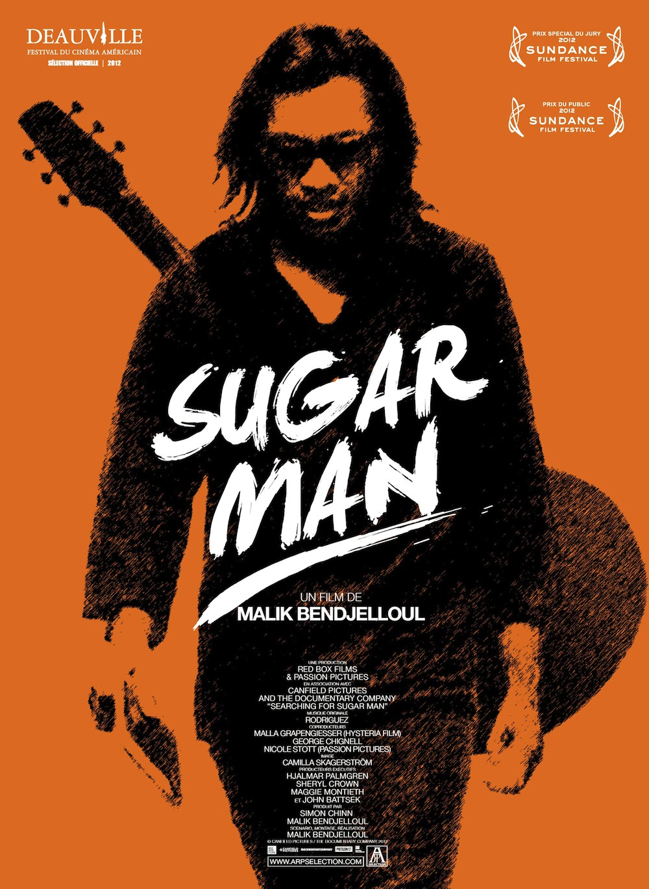
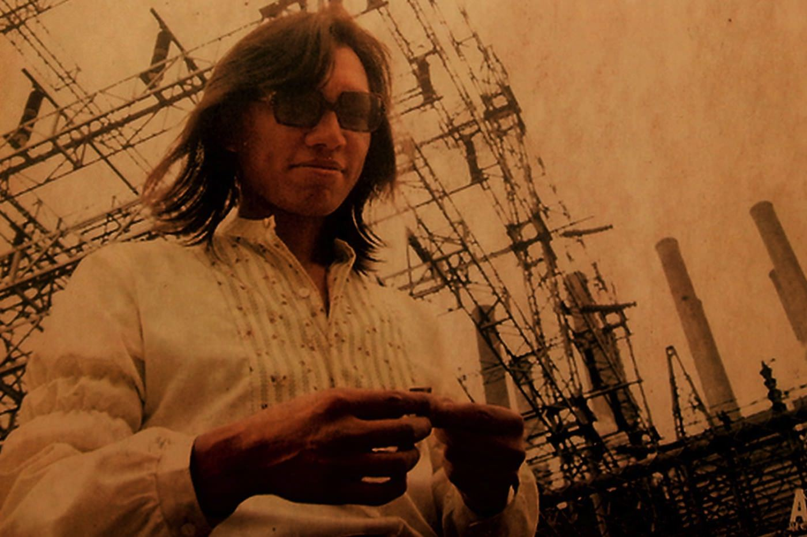

+++
type = "post"
titre = "*Sugar Man*, Malik Bendjelloul"
title = "Sugar Man, Malik Bendjelloul"
url = "/sugar-man-bendjelloul"
date = "2013-05-05T11:02:20"
Lastmod = "2015-06-15T22:33:49"
cover = "rodriquez-sugar-man-bendjelloul.jpg"
categorie = [ "À voir" ]
tag = [ "Documentaire", "Enquête", "Folk", "Musique" ]
createur = [ "Malik Bendjelloul" ]
pays = [ "Grande-Bretagne", "Suède" ]
annee = [ "2012" ]
weight = 2012
original = "Searching for Sugar Man"

+++

Rodriguez, de son vrai nom Sixto Diaz Rodriguez, ce nom ne vous dit rien ? C’est sans doute assez normal : cet artiste folk qui a sorti deux albums au début des années 1970 n’a jamais connu le succès et il a disparu après <em>Coming From Reality</em>, son deuxième album sorti en 1971. Cet illustre inconnu est pourtant le sujet choisi par le documentariste Malik Bendjelloul pour son dernier film. Dit comme ça, <em>Sugar Man</em> ne passionne pas vraiment : un film complet sur un homme que l’on ne connait pas, à quoi bon ? Pendant une heure trente, ce documentaire nous prouve à quel point on pouvait avoir tort : Malik Bendjelloul raconte une histoire fascinante et passionnante et on ne peut qu’être scotché par ce film intense et en sortir le sourire aux lèvres. Ne ratez surtout pas <em>Sugar Man</em> et mieux vaut ne rien lire de plus à son sujet pour garder tout le plaisir de la découverte…

Le meilleur moyen de découvrir le film est encore de ne rien connaître de son sujet. <em>Sugar Man</em> commence en Afrique du Sud et ce documentaire déroute d’emblée. On suit d’abord un disquaire surnommé &laquo;&nbsp;Sugar Man&nbsp;&raquo;, une déformation de son nom héritée de l’armée, mais il n’est pas le sujet du film. Malik Bendjelloul avance et on comprend qu’il parle de Rodriguez, un artiste folk que l’on ne connait pas, et pour cause. Il a sorti deux albums au début des années 1970 et il a disparu de la circulation. Dans la plus grande tradition du rock, on dit qu’il se serait suicidé sur scène, les uns disent avec un pistolet, les autres qu’il se serait immolé pendant son dernier concert. Une fin tragique, pour cet artiste qui n’a pas marqué les esprits : voilà un drôle de sujet pour un documentaire. Le cinéaste a l’excellente idée de dissimuler pendant toute sa première partie le vrai sujet de son film. <em>Sugar Man</em> contient une révélation qui fait l’effet d’un choc à mi-parcours, après une enquête quasiment policière pour retrouver la trace de cet artiste qui n’a jamais percé aux États-Unis ou ailleurs… sauf en Afrique du Sud. Par un étonnant hasard de l’histoire, ses deux disques se sont vendus par millions dans ce pays et ils ont été associés à la lutte contre l’Apartheid. Malik Bendjelloul montre très bien en quoi les paroles de cet artiste ont fait l’effet d’une bombe dans ce pays où tout était censuré, un pays fermé sur lui-même où les informations du reste du monde ne passaient pas : instantanément, ce Rodriguez et ses chansons aux paroles crues ont été associés à la lutte contre le régime. 

<em>Sugar Man</em> s’intéresse à ce paradoxe : comment une star plus connue encore qu’Elvis Presley en Afrique du Sud pouvait rester, à ce point, un mystère ? Malik Bendjelloul suit les pas du disquaire sud-africain que l’on évoquait précédemment, mais aussi ceux d’un journaliste américain qui se met en tête de découvrir qui était vraiment cet artiste. Le premier commence uniquement avec les photographies présentes sur les deux disques de Rodriguez, et les quelques noms à l’intérieur. C’est une vraie enquête policière qui s’ouvre et le documentaire est passionnant pour cette raison : si vous ne connaissez rien à l’artiste, vous en découvrirez autant que les personnes qui sont à l’écran. Peu à peu, on met le doigt sur une histoire fascinante, où les grosses sommes associées aux ventes en Afrique du Sud se perdent aux États-Unis. <em>Sugar Man</em> nous montre l’impresario de l’artiste à l’époque, un homme qui a travaillé à Motown avec les plus grands (dont Michael Jackson) et qui semble immédiatement louche à l’écran. Tout en restant strictement un documentaire, le film de Malik Bendjelloul ressemble souvent à un film, tant son histoire paraît incroyable. On découvre cet homme louche qui pourrait avoir récupéré un peu trop d’argent, mais qui dit ne rien savoir, on découvre aussi des gens qui l’auraient vu mourir, ou qui ont entendu quelqu’un le dire… <em>Sugar Man</em> est en permanence entouré d’une belle aura de mystère, du moins dans sa première partie, mais il permet surtout de découvrir un homme.

Rodriguez est, logiquement, le principal sujet de <em>Sugar Man</em> et quand vous aurez fini de voir le film, il est fort probable que vous n’ayez qu’une envie : écouter ses albums. Tout au long du film, Malik Bendjelloul nous fait découvrir un homme extrêmement surprenant, un artiste d’une modestie rare, à tel point que l’on se demande parfois s’il n’est pas un fou. Un homme qui n’a connu vraiment aucun succès, alors que tout le monde à ses côtés voyait en lui un artiste de la trempe de Bob Dylan. Ses deux albums sont, de fait, très intéressants dans un genre assez proche, de la folk calme et belle, surtout grâce à sa voix claire et puissante qui accompagne une guitare sèche et quelques instruments bien placés. <em>Cold Facts</em> et <em>Coming From Reality</em> sont deux très beaux albums et on se dit, rétrospectivement, que l’on aurait aimé une suite et pourquoi pas une belle carrière internationale. À la place, Rodriguez n’a vendu aucun album aux États-Unis et le label a vite mis fin à son contrat, interrompant l’enregistrement d’un troisième album qui n’a jamais été achevé. Dans les années 1970, internet n’étaient encore que des expérimentations universitaires et les informations ne circulaient pas comme aujourd’hui : à cette époque donc, l’artiste d’origine mexicaine n’a jamais su que ses albums étaient des succès quelque part dans le monde. Au fond, <em>Sugar Man</em> est le récit d’une rencontre ratée entre un homme et son public et si le documentaire ne donne pas d’explications — y en a-t-il seulement ? –, c’est une passionnante étude d’un succès qui n’a pas lieu. 

Malik Bendjelloul n’a pas choisi la facilité avec ce sujet surprenant : <em>Sugar Man</em> est un documentaire consacré entièrement à un homme que les spectateurs n’ont aucune chance de connaître. Loin de conduire à 1h30 d’ennui, ce film est passionnant du début à la fin et il l’est d’autant plus si vous ne connaissez rien à Rodriguez. Entre enquête presque policière et découverte d’un artiste atypique qui mérite vraiment d’être connu et reconnu, <em>Sugar Man</em> est un documentaire à ne rater sous aucun prétexte pour ajouter deux excellents albums à votre discothèque, ou au moins découvrir un artiste fascinant. 

<h3>Vous voulez m’aider ?</h3>
<ul>
<li><a href="http://www.amazon.fr/gp/product/B00BCV0Y34/ref=as_li_ss_tl?ie=UTF8&tag=leblogdenic07-21&linkCode=as2&camp=1642&creative=19458&creativeASIN=B00BCV0Y34">Acheter le film en Blu-Ray sur Amazon</a></li>
<li><a href="http://www.amazon.fr/gp/product/B00BCV0Y2A/ref=as_li_ss_tl?ie=UTF8&tag=leblogdenic07-21&linkCode=as2&camp=1642&creative=19458&creativeASIN=B00BCV0Y2A">Acheter le film en DVD sur Amazon</a></li>
<li><a href="https://itunes.apple.com/fr/movie/sugar-man-vost/id635706498">Acheter ou louer le film sur l’iTunes Store</a></li>
</ul>
<ul>
<li><a href="https://itunes.apple.com/fr/album/cold-fact/id293895479">Acheter <em>Cold Fact</em> sur l’iTunes Store</a> (<a href="http://www.amazon.fr/gp/product/B001BKVWYG/ref=as_li_ss_tl?ie=UTF8&tag=leblogdenic07-21&linkCode=as2&camp=1642&creative=19458&creativeASIN=B001BKVWYG">en CD sur Amazon</a>)</li>
<li><a href="https://itunes.apple.com/fr/album/coming-from-reality/id609694322">Acheter <em>Coming From Reality</em> sur l’iTunes Store</a> (<a href="http://www.amazon.fr/gp/product/B001TCHDPS/ref=as_li_ss_tl?ie=UTF8&tag=leblogdenic07-21&linkCode=as2&camp=1642&creative=19458&creativeASIN=B001TCHDPS">en CD sur Amazon</a>)</li>
<li><a href="https://itunes.apple.com/fr/album/searching-for-sugar-man/id540070151">Acheter la bande originale du film sur l’iTunes Store</a> (<a href="http://www.amazon.fr/gp/product/B008C1WUZ2/ref=as_li_ss_tl?ie=UTF8&tag=leblogdenic07-21&linkCode=as2&camp=1642&creative=19458&creativeASIN=B008C1WUZ2">en CD sur Amazon</a>)</li>
</ul>
<ul>
<li><a href="http://open.spotify.com/artist/5PrHzxc3kFm4hIrGNmelpX">Rodriguez en écoute sur Spotify</a></li>
<li><a href="http://www.rodriguez-music.com/products-page/downloadablealbums/">Les albums de Rodriguez sur son site</a></li>
</ul>

