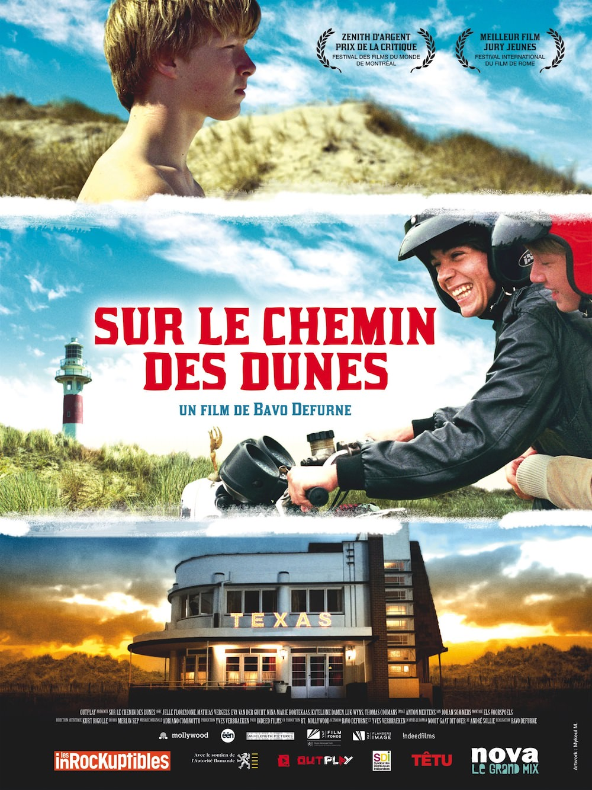
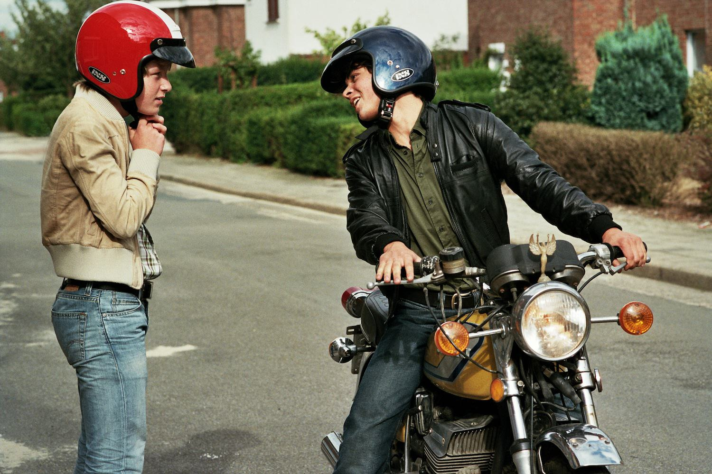

+++
titre = "<em>Sur le chemin des dunes</em>, Bavo Defurne"
title = "Sur le chemin des dunes, Bavo Defurne"
url = "/sur-le-chemin-des-dunes-defurne"
date = "2013-06-04T10:37:10"
Lastmod = "2013-06-03T08:47:48"
cover = "sur-le-chemin-des-dunes-defurne-jelle-florizoone.jpg"
categorie = [ "À voir" ]
tag = [ "Adaptation littéraire", "Adolescence", "Amour", "Drame", "Homosexualité", "Romance" ]
createur = [ "Bavo Defurne" ]
acteur = [ "Eva Van der Gucht", "Jelle Florizoone", "Mathias Vergels", "Thomas Coumans" ]
annee = [ "2012" ]
weight = 2012
original = "Noordzee"

+++

Pour son premier long-métrage, Bavo Defurne s&rsquo;attaque à un sujet difficile : la découverte de sa sexualité par un adolescent. Situé dans les années 1960 sur la côté belge, <em>Sur le chemin des dunes</em> suit les premiers émois amoureux de Pim, un jeune homme différent qui préfère dessiner en silence que jouer avec les gens de son âge. À défaut d&rsquo;être original, ce joli film séduit par l&rsquo;intensité de son jeune acteur, mais aussi par sa sincérité touchante. 

Pim est différent, c&rsquo;est un « rêveur » comme aime à le répéter Sabrina, sa jeune voisine qui l&rsquo;aime et qui aimerait bien que ce soit réciproque. Mais Pim, 15 ans, lui préfère son grand frère, Gino, 17 ans. <em>Sur le chemin des dunes</em> est un récit d&rsquo;apprentissage, le passage à l&rsquo;âge adulte d&rsquo;un garçon qui se sait homosexuel depuis qu&rsquo;il est tout petit, mais qui ne sait pas comment le faire comprendre à son entourage. Sa mère, Yvette, fut Miss Camping bien des années avant, elle n&rsquo;est plus qu&rsquo;une grosse femme exubérante qui couche un peu avec qui veut bien d&rsquo;elle. Fuyant cette famille encombrante, le héros du premier long-métrage de Bavo Defurne se réfugie constamment chez ses voisins, chez Gino. Les deux garçons ont grandi ensemble, ils sont très proches et découvrent ensemble la sexualité. Gino n&rsquo;est pas insensible aux charmes de Pim et ils découvrent le sexe à deux dans des tentes sur les plages des environs. Pim aimerait aller plus loin et vivre un amour au grand jour, mais Gino est sur une autre longueur d&rsquo;onde, il expérimente, mais finit vite par « sortir avec » une fille et délaisser son ami d&rsquo;enfance. Le scénario adapté d&rsquo;un roman largement autobiographique d&rsquo;André Sollie n&rsquo;est pas très original, mais <em>Sur le chemin des dunes</em> déjoue quelques pièges et clichés. En posant la sexualité différente de Pim dès le premier plan, le film évite les interrogations et les phases de doute que l&rsquo;on retrouve souvent dans ces films. Bavo Defurne a en outre une manière bien personnelle de filmer ses personnages qui évite de tomber dans la caricature. Le personnage de la mère par exemple est interprété de manière très sensible par Eva Van der Gucht et il n&rsquo;est jamais ridicule, tandis que ses relations avec Pim sont complexes et belles. Le cinéaste respecte tous ses personnages et les filme avec tout le respect nécessaire pour ne pas tomber dans le second degré et permettre à l&rsquo;ensemble de tenir.

<em>Sur le chemin des dunes</em> frappe aussi par sa description de l&rsquo;amour de Pim et Gino. Avec la finesse et la pudeur nécessaires, Bavo Defurne rapproche ses deux personnages qui se cherchent et leurs premiers baisers fougueux sous une tente n&rsquo;en sont que plus touchants. Pudique, le film ne montre jamais rien, mais suggère beaucoup et surtout de la tendresse : c&rsquo;est rare de la retrouver avec autant de force dans un film et c&rsquo;est incontestablement la réussite de ce premier long-métrage. Ces deux adolescents sont touchants et il faut saluer le travail de Jelle Florizoone qui interprète un Pim convaincant, alors que son rôle consiste à rester sans rien dire la plupart du temps. <em>Sur le chemin des dunes</em> a comme personnage principal un adolescent refermé sur lui-même, qui dessine Gino en cachant en permanence son dessin, qui reste à rêver avec sa tête d&rsquo;ange souvent inexpressive. En même temps, il renferme aussi une colère bien sensible quand celui qu&rsquo;il aime l&rsquo;abandonne pour une fille, puis quand le locataire qui dort dans la chambre à côté de la sienne et sur lequel il fantasme finit par coucher avec sa mère. Bavo Defurne travaille sur de petits détails — la boîte dans laquelle son personnage ajoute continuellement des objets — et la sincérité de son travail est constamment éclatante. <em>Sur le chemin des dunes</em> n&rsquo;a absolument pas l&rsquo;ambition d&rsquo;être un grand film, mais on voit rarement une œuvre de fiction tomber aussi justement au cinéma et la réussite du long-métrage est là, dans cette précision de sentiments adolescents.

Avec beaucoup de douceur, <em>Sur le chemin des dunes</em> retrouve un fil narratif que l&rsquo;on a déjà vu ailleurs, mais qui est parfaitement mené ici. Bavo Defurne a réussi, en 1h30, à raconter une histoire d&rsquo;amour banale, mais sublimée par sa grâce et sa justesse. Film sincère, ce premier long-métrage mérite d&rsquo;être vu pour ses personnages précis et pour son histoire simple, mais touchante…

<h3>Vous voulez m&rsquo;aider ?<a href="#footnote_0_9648" id="identifier_0_9648" class="footnote-link footnote-identifier-link" title="&Agrave; propos de la publicit&eacute;&hellip;">1</a></h3>
<ul>
<li><a href="http://www.amazon.fr/gp/product/B009SK85IW/ref=as_li_ss_tl?ie=UTF8&#038;tag=leblogdenic07-21&#038;linkCode=as2&#038;camp=1642&#038;creative=19458&#038;creativeASIN=B009SK85IW">Acheter le film en Blu-Ray sur Amazon</a></li>
<li><a href="http://www.amazon.fr/gp/product/B009SK85K0/ref=as_li_ss_tl?ie=UTF8&#038;tag=leblogdenic07-21&#038;linkCode=as2&#038;camp=1642&#038;creative=19458&#038;creativeASIN=B009SK85K0">Acheter le film en DVD sur Amazon</a></li>
<li><a href="https://itunes.apple.com/fr/movie/sur-le-chemin-des-dunes/id641910256">Acheter ou louer le film sur l&rsquo;iTunes Store</a></li>
</ul>

<ol class="footnotes"><li id="footnote_0_9648" class="footnote"><a href="http://voiretmanger.fr/soutien/">À propos de la publicité…</a> [<a href="#identifier_0_9648" class="footnote-link footnote-back-link">&#8617;</a>]</li></ol>
