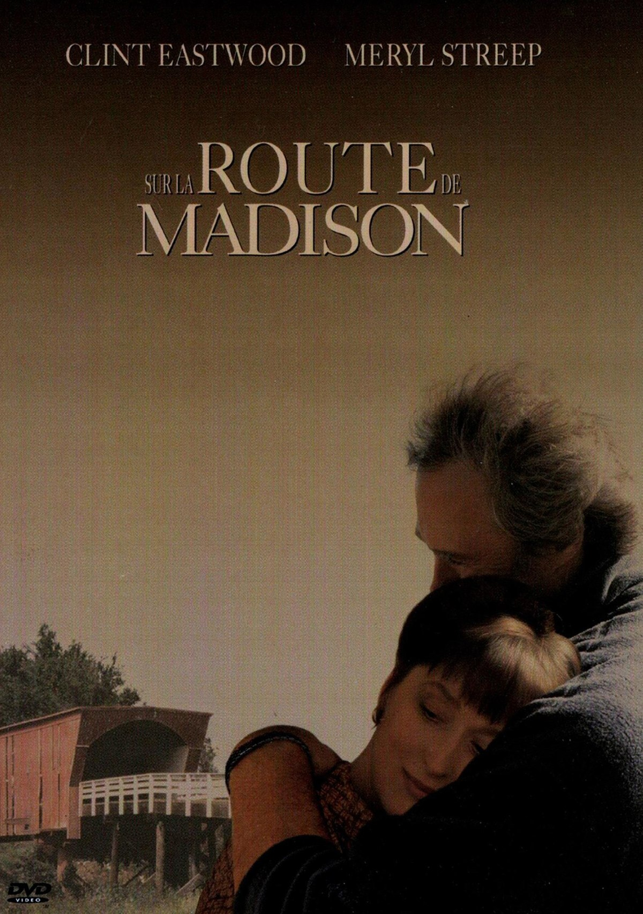
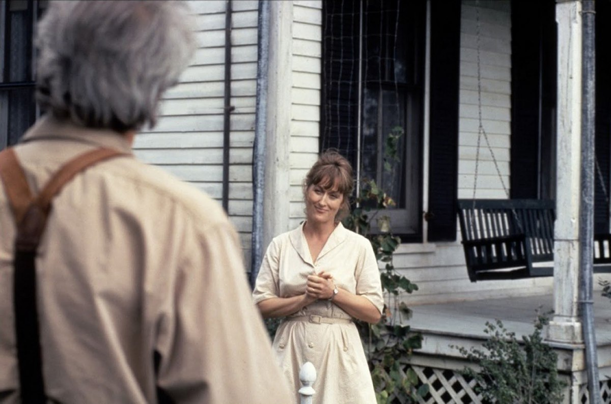
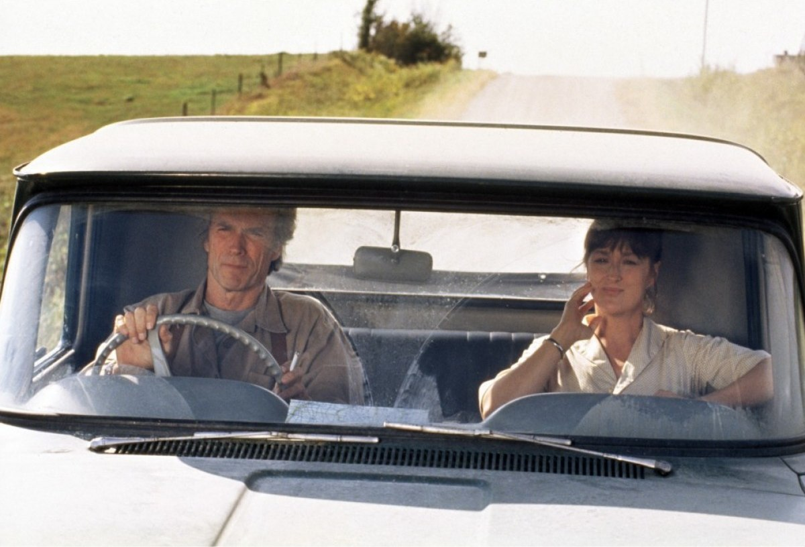

+++
titre = "<em>Sur la route de Madison</em>, Clint Eastwood"
title = "Sur la route de Madison, Clint Eastwood"
url = "/sur-route-madison-eastwood"
date = "2012-03-24T08:58:25"
Lastmod = "2013-12-09T15:54:49"
cover = "sur-la-route-de-madison-eastwood.jpg"
categorie = [ "À voir" ]
tag = [ "Amour", "Drame", "Famille", "Romance", "Société" ]
createur = [ "Clint Eastwood" ]
acteur = [ "Clint Eastwood", "Meryl Streep" ]
annee = [ "1995" ]
weight = 1995
pays = [ "États-Unis" ]
original = "The Bridges of Madison County"

+++

L&rsquo;amour total est souvent aussi un amour impossible, et d&rsquo;abord un amour impossible à retranscrire correctement au cinéma. Au milieu des années 1990, Clint Eastwood s&rsquo;y est risqué comme réalisateur et comme comédien avec <em>Sur la route de Madison</em>. Loin des clichés du genre, loin de l&rsquo;émotion forcée à grands coups de nappes de violons, ce film réussit à mettre en images une histoire d&rsquo;amour aussi puissante que sincère et impossible. Une vraie réussite, à (re)voir sans la moindre hésitation…

Michael et Caroline viennent de perdre leur mère, Francesca. De retour dans la maison de leur enfance, dans l&rsquo;Iowa, ils découvrent avec stupeur que leur mère n&rsquo;a pas souhaité se faire enterrer auprès de leur père, dans le cimetière déjà réservé pour l&rsquo;occasion. Son testament est très clair, elle veut être incinérée et ses cendres doivent être jetées depuis un pont non loin de la maison. Les deux enfants ne comprennent pas cette demande : on est alors dans les années 1980 et cela ne se fait pas d&rsquo;incinérer les gens plutôt que de les enterrer. Francesca a laissé avec son testament quelques photos, des lettres et trois journaux intimes que ses enfants n&rsquo;avaient jamais vus. Ces différents éléments évoquent tous une époque lointaine quand, dans les années 1960, Francesca avait rencontré et aimé de manière très fugace un autre homme que son époux. Ce dernier était parti pendant quatre jours avec les enfants et un photographe, Robert, était passé pour demander son chemin. Entre Francesca et Robert, ce fut le coup de foudre, du genre qui ne se produit qu&rsquo;une fois dans une vie, au mieux. Un amour extrêmement puissant que Michael et Caroline vont découvrir brutalement : il était resté totalement secret jusqu&rsquo;à la mort de leur mère…

<em>Sur la route de Madison</em> est une romance assez classique. Un homme et une femme se rencontrent de manière fortuite, à moins que cette rencontre ne soit provoquée par le destin. L&rsquo;amour est immédiat et il emporte tout sur son passage, même si Francesca surtout essaie de résister un peu au départ. Cette mère de famille a accès à l&rsquo;<em>American Way of Life</em> et son origine italienne — elle a rencontré son mari alors qu&rsquo;il était en service pendant la Seconde Guerre mondiale — renforce l&rsquo;importance de ce mode de vie. Plus jeune, elle rêvait des États-Unis et de sa culture ; à l&rsquo;âge adulte, elle peut en profiter pleinement. Elle est mariée, a deux enfants et un mari attentionné : ses réticences quand Robert arrive sont logiques. Ce dernier n&rsquo;a en revanche aucune attache familiale, ni géographique. Grand reporter, il a parcouru le monde et se sent chez lui partout, mais nulle part en particulier. Il a connu plusieurs femmes et sa rencontre avec Francesca ne ressemble dans un premier temps qu&rsquo;à un flirt de plus. Sauf que l&rsquo;amour de <em>Sur la route de Madison</em> est évidemment bien plus fort. Francesca finit par rendre les armes en invitant le photographe à diner une deuxième fois, tandis que Robert lui fait comprendre que ce n&rsquo;est pas qu&rsquo;une amourette pour lui. Le film de Clint Eastwood entre alors dans la catégorie des drames amoureux où l&rsquo;amour est total, mais impossible. Celui de Robert et Francesca est resté inconnu pendant des années pour une bonne raison : il n&rsquo;a duré physiquement que quatre jours dans les années 1960.

L&rsquo;amour impossible est une thématique bien connue en littérature, comme au cinéma. Celui de <em>Sur la route de Madison</em> ne dure pas d&rsquo;abord pour des raisons sociales. Clint Eastwood oppose ainsi l&rsquo;amour fou et totalement libre de Robert, à l&rsquo;amour officiel et autorisé de Richard, l&rsquo;époux de Francesca. L&rsquo;amour romantique contre la société : c&rsquo;est une idée classique, mais parfaitement menée ici. Le film évoque en parallèle de la rencontre amoureuse l&rsquo;histoire malheureusement d&rsquo;une femme surprise en train de tromper son mari. Dans ce coin reculé des États-Unis, tout le monde se connait et tout se sait : la pauvre femme est rejetée en bloc par toute la société et elle ne peut plus rien faire, pas même boire un café, sans que son infidélité lui soit renvoyée à la figure. Quand Francesca refuse de partir, on imagine que cet exemple malheureux lui reste dans les esprits, mais non pas pour elle qui quitterait la région. C&rsquo;est à sa famille qu&rsquo;elle pense d&rsquo;abord : à son mari qui ne supporterait pas les qu&rsquo;en-dira-t-on, à ses enfants à qui elle donnerait une mauvaise image du mariage. La société s&rsquo;oppose à l&rsquo;amour de Robert et Francesca, mais le film de Clint Eastwood est plus subtil et dépasse cette opposition mécanique entre amour et société. Si Francesca ne veut pas partir, c&rsquo;est aussi parce qu&rsquo;elle sent que cet amour total ne résistera pas à l&rsquo;épreuve du temps. <em>Sur la route de Madison</em> se mue quasiment en tragédie quand son héroïne se sacrifie à sa vie de famille par amour pour Robert. Seul le souvenir de leur amour pourra résister au temps et tout le film consiste justement à collecter ces souvenirs, par des photos bien sûr, mais aussi par le biais du journal intime qu&rsquo;écrit Francesca. Si elle refuse de quitter sa famille et de partir, c&rsquo;est d&rsquo;abord par amour, plus que par la contrainte de la société.

Clint Eastwood a réussi à filmer une histoire d&rsquo;amour déchirante et réaliste. <em>Sur la route de Madison</em> y parvient d&rsquo;abord par ses deux acteurs principaux. Le réalisateur a pris le risque de se filmer et d&rsquo;interpréter Robert, mais ce choix s&rsquo;impose comme une évidence à l&rsquo;écran. L&rsquo;acteur commence déjà à marquer les années, il est brillant dans son registre de l&rsquo;amour total, puissant, mais aussi intériorisé et assez calme. Meryl Streep de son côté compose une Francesca extrêmement convaincante, à tel point que l&rsquo;actrice n&rsquo;est pas toujours reconnaissable. Elle emprunte un très léger accent italien sans tendre à la farce ou au moins à la comédie et son déchirement entre son époux et son amour offre quelques scènes d&rsquo;une rare puissance à la fin. La scène au feu rouge où on la sent déchirée contient une émotion réelle, sincère et extrêmement puissante qui devrait toucher même les plus insensibles. Cette scène suffit à exprimer la réussite de <em>Sur la route de Madison</em> : Clint Eastwood signe un drame romantique à mille lieues des clichés du genre, mais avec une justesse qui force le respect. Sa mise en scène est elle aussi sobre, le cinéaste prend son temps pour poser ses personnages et leur amour et c&rsquo;est dans un certain minimalisme qu&rsquo;il construit son histoire.

<em>Sur la route de Madison</em> est indéniablement un grand film. Même si les drames romantiques vous laissent en temps normal de marbre, Clint Eastwood devrait malgré tout emporter votre émotion avec une histoire racontée simplement, mais avec une puissance émotive que l&rsquo;on voit rarement sur un écran. Le cinéaste a changé de genre aujourd&rsquo;hui, mais cette boule d&rsquo;émotion qu&rsquo;est <em>Sur la route de Madison</em> mérite absolument d&rsquo;être vue…

<h3>Vous voulez m&rsquo;aider ?<a href="#footnote_0_6014" id="identifier_0_6014" class="footnote-link footnote-identifier-link" title="&Agrave; propos de la publicit&eacute;&hellip;">1</a></h3>
<ul>
<li><a href="http://www.amazon.fr/gp/product/B002DQKKZ4/ref=as_li_ss_tl?ie=UTF8&#038;tag=leblogdenic07-21&#038;linkCode=as2&#038;camp=1642&#038;creative=19458&#038;creativeASIN=B002DQKKZ4">Acheter le film en DVD sur Amazon</a></li>
</ul>

<ol class="footnotes"><li id="footnote_0_6014" class="footnote"><a href="http://voiretmanger.fr/a-propos/publicite/">À propos de la publicité…</a> [<a href="#identifier_0_6014" class="footnote-link footnote-back-link">&#8617;</a>]</li></ol>
