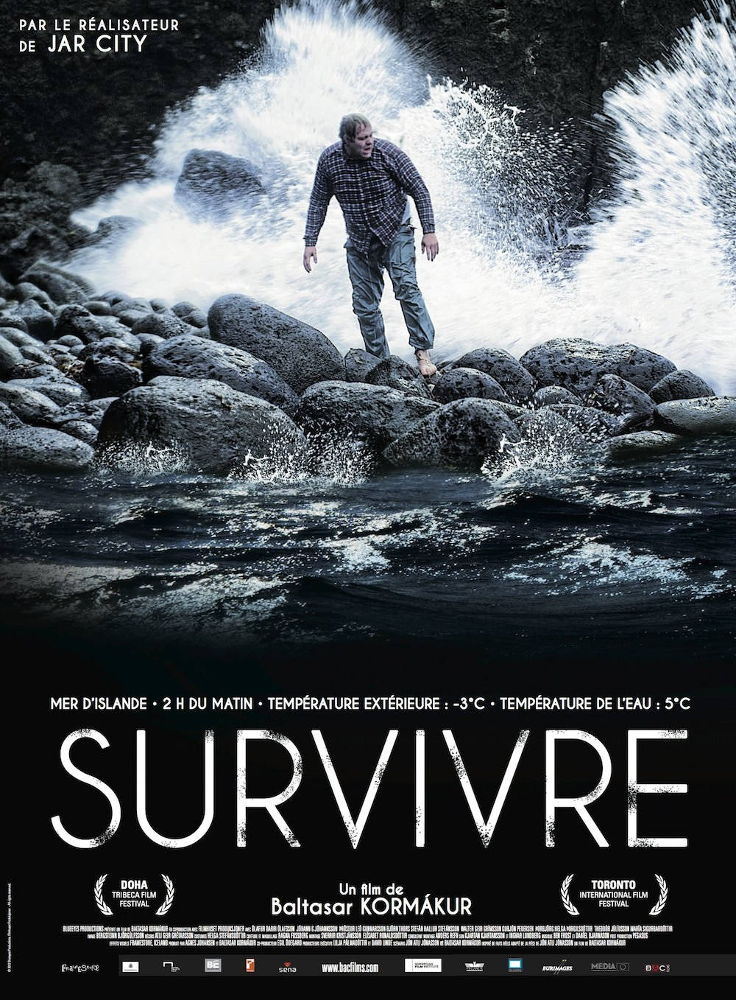
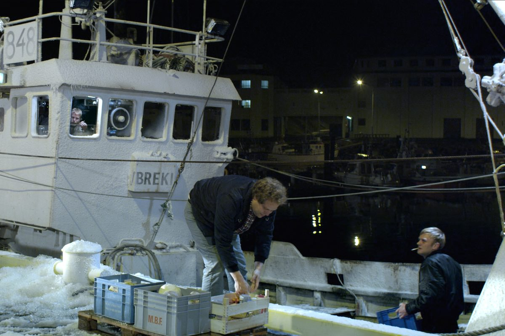

+++
titre = "<em>Survivre</em>, Baltasar Kormákur"
title = "Survivre, Baltasar Kormákur"
url = "/survivre-kormakur"
date = "2012-12-17T08:47:31"
Lastmod = "2013-10-29T09:28:46"
cover = "survivre-kormakur.jpg"
categorie = [ "À voir" ]
tag = [ "Arcs 2012", "Bateau", "Drame", "Histoire vraie" ]
createur = [ "Baltasar Kormákur" ]
acteur = [ "Jóhann G. Jóhannsson", "Ólafur Darri Ólafsson", "Theódór Júlíusson", "Þorbjörg Helga Þorgilsdóttir" ]
annee = [ "2013" ]
weight = 2013
festival = [ "Arcs 2012" ]
original = "Djúpið"

+++

Inspiré d’une histoire vraie, <em>Survivre</em> raconte l’histoire incroyable d’un homme qui nage pendant six heures dans les eaux glaciales de l’Islande, avant de marcher deux heures sur la roche volcanique sans mourir. Un phénomène vivant, mais cet homme devenu un héros dans son pays est resté totalement inconnu hors de l’île. C’est ce sujet qu’a choisi Baltasar Kormákur pour son dernier film, un long-métrage assez bref, mais intense et surtout glacial.

<em>Survivre</em> commence avec un plan très similaire à celui qui ouvrait <a href="http://voiretmanger.fr/2012/04/08/titanic-cameron/" title="Titanic, James Cameron - À voir et à manger"><em>Titanic</em></a>. L’épave filmée au fond de l’océan par Baltasar Kormákur est moins imposante que celle de James Cameron, c’est évident, mais elle plante tout autant le décor. On connaît la fin, du moins en ce qui concerne le navire, le Breki en l’occurrence. Ce chalutier islandais emmène ses hommes dans l’océan glacial au large de l’île volcanique, à la recherche de poissons pendant plusieurs jours. On commence par suivre leur quotidien, à terre d’abord et puis en mer : il faut larguer le chalut, puis le remonter, trier les poissons et recommencer. La vie à bord n’est pas facile, d’autant que les températures montent rarement au-dessus de zéro. Une nuit, le filet se coince dans un rocher et c’est tout le navire qui est tiré par cette énorme pression. Les pêcheurs auraient dû casser le filin immédiatement, mais ils ne veulent pas sacrifier ce chalut neuf et le commandant pense être capable de sauver son navire… à tort comme on le sait déjà. Le Breki se retourne et la température tue tout l’équipage en quelques minutes, sauf Gulli qui survit miraculeusement. Non seulement il survit dans les premières minutes, mais il tient ensuite le coup et parvient à nager sans fin, pendant des heures…

Le dernier film de Baltasar Kormákur commence de façon assez traditionnelle pour un film de naufrage, avec la présentation des membres de l’équipage. On suit Gulli et ses collègues sur l’île, les uns se soûlent dans un bar, les autres disent au revoir à leur famille tout en priant une dernière fois : d’emblée, on ressent la menace qui plane sur eux. <em>Survivre</em> poursuit ensuite cette chronologie, les hommes montent à bord, le navire quitte le port et la pêche se déroule dans un premier temps plutôt bien avant le naufrage. Ce dernier survient très tôt, ce qui ne manque pas de surprendre dans un premier temps, même si le titre du long-métrage laisse finalement peu de place aux doutes. Tout l’enjeu ici n’est pas tant comment le Breki coule, mais plutôt comment survivre après sa disparition. De manière étonnante, Baltasar Kormákur fait mourir tous les membres de l’équipage sauf un de façon très rapide. On n’a jamais appris à connaître ces personnages de toute manière, on n’est pas vraiment ému à leur mort. Le vrai héros du film, celui qui occupe la majeure partie du temps, c’est Gulli, l’homme qui a survécu au naufrage. On ne révèlera rien en disant qu’on le suit alors perdu au milieu de la mer, dans cette nuit qui ne semble jamais s’arrêter. Le chalutier coule vers 21h30 et il n’atteint la première maison qu’au petit matin, avant l’aube. Une assez longue période qui occupe en fait l’essentiel du temps dans <em>Survivre</em>. 

Alors que Baltasar Kormákur évacue rapidement les personnages secondaires morts dans les premières minutes du naufrage, il s’attarde plus longuement sur Gulli. <em>Survivre</em> se mue quasiment en huis clos après le naufrage, alors que le personnage reste seul dans l’océan. On le voit parler avec les mouettes et surtout résister face au froid et à la perspective réconfortante de se laisser partir. Il ne veut pas mourir, pas sans avoir dit au revoir à ses proches et régler ses dettes et c’est sûrement ce qui explique finalement sa survie. Les habitants de l’île voient le retour de Gulli comme un miracle, évidemment, mais Baltasar Kormákur a la bonne idée d’introduire dans son film une partie importante sur les analyses scientifiques menées par la suite. <em>Survivre</em> montre bien comment Gulli a été transformé en rat de laboratoire, multipliant les tests qui ont permis d’expliquer sa survie de manière rationnelle. Qu’importent les explications, le film se penche alors plus particulièrement sur le ressenti de Gulli et on sent monter en lui de la nostalgie, comme s’il se sentait coupable de sa survie. Baltasar Kormákur reste très discret sur ces points, il ne cherche jamais à susciter l’émotion chez le spectateur et parvient au total à émouvoir avec cet être très silencieux qui ne désire finalement rien de plus que d’être laissé en paix. 

<em>Survivre</em> est un film assez sombre, déjà parce qu’il se déroule majoritairement de nuit, mais aussi par le drame assez intense qu’il déroule. Baltasar Kormákur est un cinéaste prolifique — huit films depuis 2000 — qui gagnerait à être mieux connu en France. Ses réalisations sont assez simples, mais efficaces et certains plans, notamment du navire seul dans la mer déchainée, sont très réussis. C’est une vision assez réaliste de l’Islande, loin des clichés que l’on voit souvent, même s’il est question d’éruption volcanique et du climat difficile. L’ensemble reste assez simple, à l’image de la bande-son épurée — où Sigur Ròs n’apparaît qu’à la toute fin, pour le générique.  Le cinéaste islandais peut aussi compter sur le talent de son acteur principal : Ólafur Darri Ólafsson est excellent dans ce rôle difficile et on imagine que le tournage principalement réalisé en mer a favorisé son jeu très réaliste et assez poignant par moment. Quand, pendant le générique, le vrai Gulli apparaît à l’écran pour raconter son expérience, la ressemblance est vraiment frappante.

Loin des grosses productions hollywoodiennes, <em>Survivre</em> propose son histoire inspirée de la réalité avec simplicité et honnêteté. Par moment, on pourrait presque croire que Baltasar Kormákur a réalisé une reconstitution documentaire, même s’il s’agit incontestablement de cinéma. C’est cette sobriété des moyens qui fait que <em>Survivre</em> s’impose comme une réussite : au lieu de chercher par tous les moyens à tirer une larme à ses spectateurs, il parvient à émouvoir avec cette histoire assez belle d’un homme qui lutte pour sa survie.

<h3>Vous voulez m&rsquo;aider ?<a href="#footnote_0_8033" id="identifier_0_8033" class="footnote-link footnote-identifier-link" title="&Agrave; propos de la publicit&eacute;&hellip;">1</a></h3>
<ul>
<li><a href="http://www.amazon.fr/gp/product/B00D8ZHEFS/ref=as_li_ss_tl?ie=UTF8&#038;tag=leblogdenic07-21&#038;linkCode=as2&#038;camp=1642&#038;creative=19458&#038;creativeASIN=B00D8ZHEFS">Acheter le film en Blu-Ray sur Amazon</a></li>
<li><a href="http://www.amazon.fr/gp/product/B00D8ZHEOE/ref=as_li_ss_tl?ie=UTF8&#038;tag=leblogdenic07-21&#038;linkCode=as2&#038;camp=1642&#038;creative=19458&#038;creativeASIN=B00D8ZHEOE">Acheter le film en DVD sur Amazon</a></li>
</ul>

<ol class="footnotes"><li id="footnote_0_8033" class="footnote"><a href="http://voiretmanger.fr/soutien/">À propos de la publicité…</a> [<a href="#identifier_0_8033" class="footnote-link footnote-back-link">&#8617;</a>]</li></ol>
