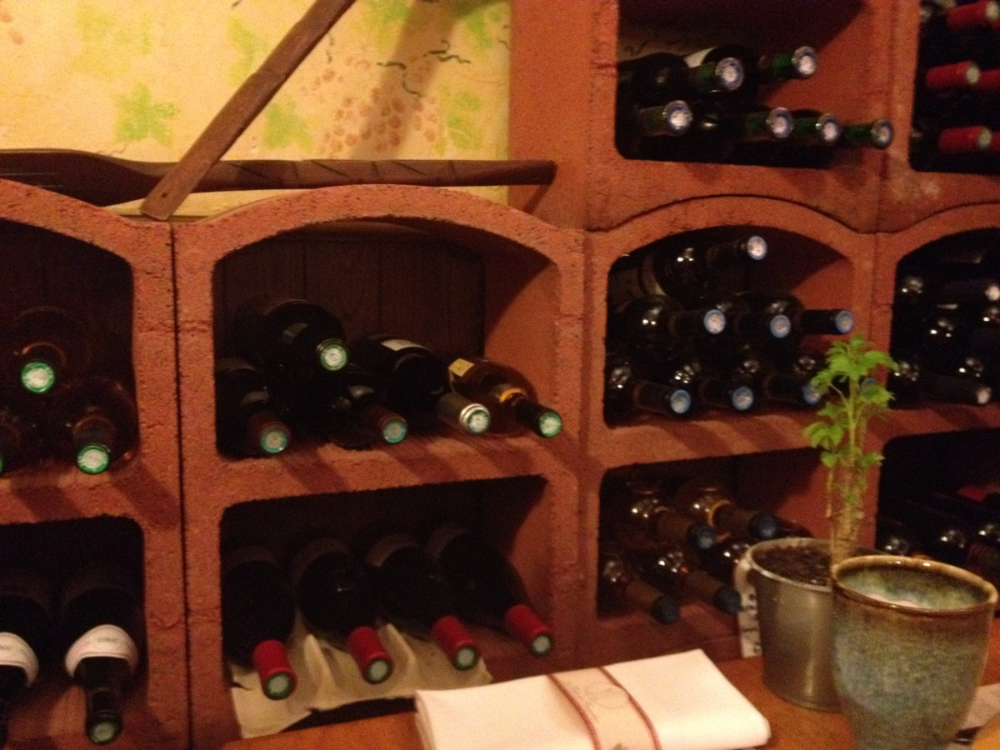
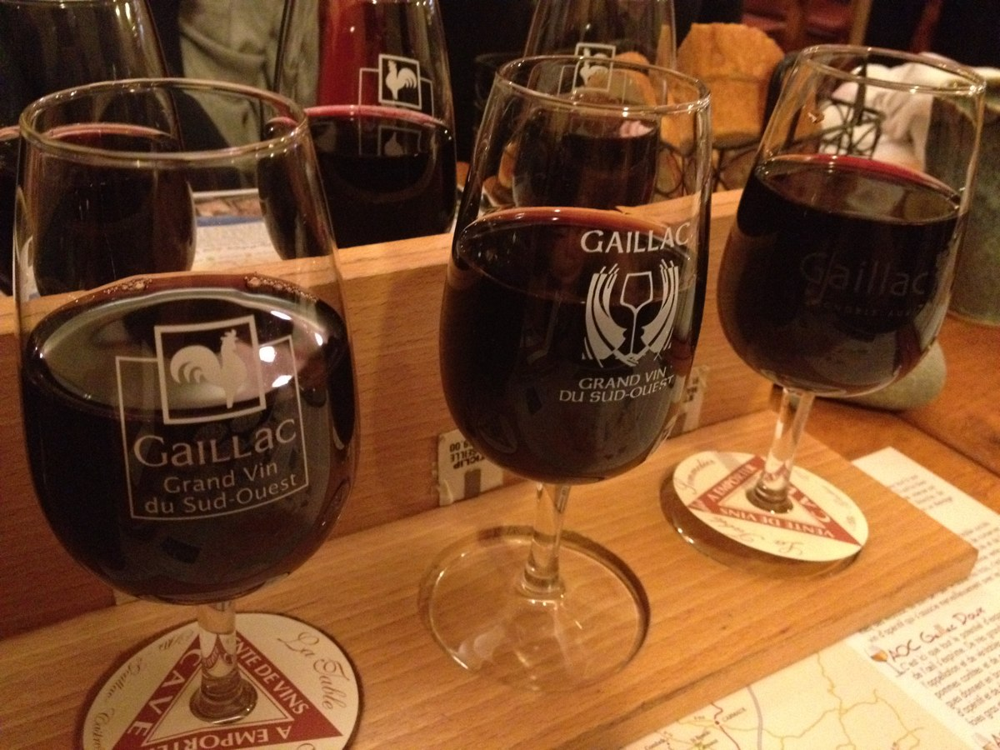
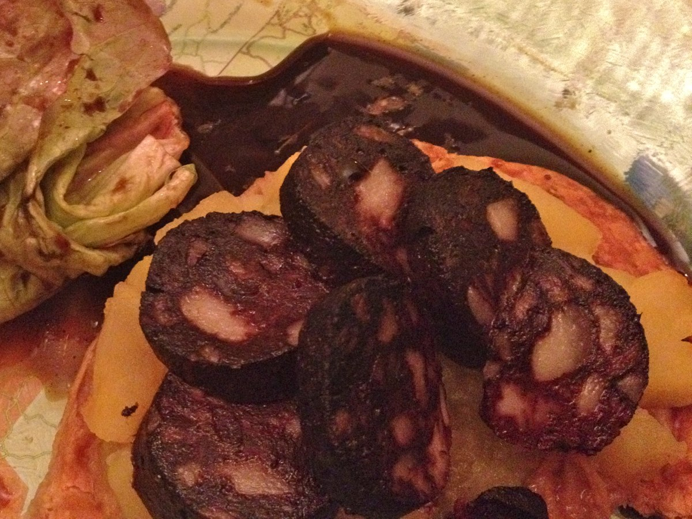
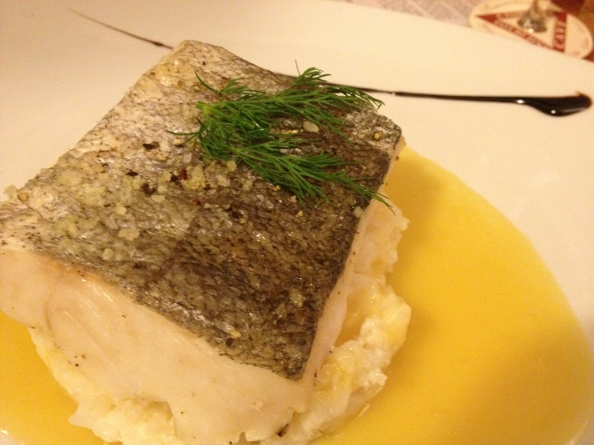
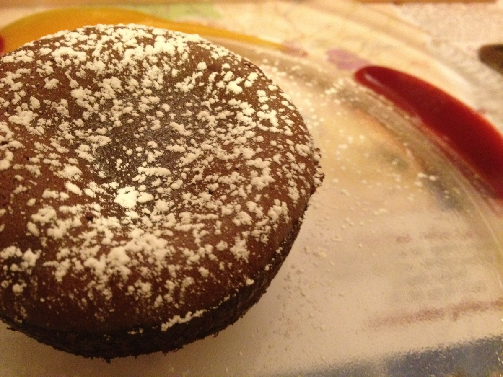

+++
type = "post"
titre = "La Table du Sommelier à Gaillac"
title = "La Table du Sommelier à Gaillac"
url = "/table-sommelier-gaillac"
date = "2012-05-18T20:12:17"
Lastmod = "2012-05-18T20:18:38"
cover = "la-table-du-sommelier-gaillac.jpg"
categorie = [ "À manger" ]
tag = [ "Association plat/vin", "Cuisine française", "Terroir", "Vin" ]

+++

<a href="http://www.latabledusommelier.com"><strong>La Table du Sommelier</strong></a> a d&rsquo;abord ouvert à Albi, avant de s&rsquo;étendre sur Gaillac, au cœur du vignoble éponyme. Avec un nom pareil, ces deux restaurants ne pouvaient que s&rsquo;intéresser au vin et de fait, ils proposent une cuisine traditionnelle conçue pour être dégustée avec des verres de vin. Ce midi, c&rsquo;est l&rsquo;adresse gaillacoise que nous testons pour un résultat réussi : si vous aimez associer un plat et un vin, <strong>La Table du Sommelier</strong> est une valeur sûre.

Dès la devanture, outre le nom, les feuilles de vigne évoquent les relations entre <strong>La Table du Sommelier</strong> et le monde du vin. L&rsquo;ambiance dans le restaurant est encore plus explicitement rattachée au vignoble : les grappes de raisin ou les bouteilles sont partout, des murs au plafond. L&rsquo;adresse fait aussi office de boutique, on trouve donc quelques bouteilles alignées sur un côté, prêtes à être achetées. On n&rsquo;y trouve que du vin local, du Gaillac vendu, si l&rsquo;on en croit les propriétaires, à des prix identiques à ceux pratiqués dans les caves des producteurs. Certaines bouteilles sont même réservées aux deux restaurants et ne peuvent être achetées — ou bues — qu&rsquo;à <strong>La Table du Sommelier</strong>. Les tables sont dressées de manière rustique, avec assiettes en bois et verres en grès. À l&rsquo;intérieur de la salle voutée, des clients plutôt âgés ce jour-là et essentiellement des groupes. Les beaux jours, la place devant le restaurant se transforme en terrasse, sinon mieux vaut réserver, la salle n&rsquo;est pas extrêmement grande.

La bonne idée de ce restaurant est bien sûr de vous permettre de goûter aux vins qui sont en vente pendant votre repas. Vous pouvez prendre des plats à la carte ou des menus simples, mais l&rsquo;intérêt de <strong>La Table du Sommelier</strong> réside surtout dans ses menus vin. Pas moins de cinq menus différents sont proposés, par type de vin : on trouve ainsi un menu vin rouge, un vin blanc sec, un vin doux, un autre composé uniquement de Gaillac avec plusieurs couleurs ou enfin un menu spécial gourmand avec du foie gras et du magret et quatre vins. Les menus proposent par défaut trois verres de vin, associés aux trois plats qui les composent. Chaque type de vin a droit à ses plats et les menus sont tous différents et renouvelés très régulièrement. Au total, le restaurant propose peu de plats et les change souvent, un gage de qualité et de produits frais.

Ceux qui choisissent les vins rouges ont droit aux trois verres devant eux dès le début du repas, seuls les blancs sont amenés au fur et à mesure pour les boire à bonne température. Chaque verre a droit à sa base à une étiquette qui l&rsquo;identifie : il faudra s&rsquo;en contenter, les serveurs n&rsquo;ajouteront aucune explication ce qui est d&rsquo;ailleurs un peu dommage pour qui veut parfaire ses connaissances viticoles. Reste que l&rsquo;association d&rsquo;un plat avec son verre de vin ne fait appel qu&rsquo;aux sens et il suffit de goûter l&rsquo;un et l&rsquo;autre pour en profiter. Le menu vin rouge du jour était composé d&rsquo;une tarte fine pommes et boudin noir en entrée, d&rsquo;une ballotine de pintade au chorizo accompagnée de boulgour et d&rsquo;un fondant au chocolat entouré de coulis de fruits. Trois verres de vin rouge complètent le tout et le principe est le même pour les autres menus : ceux qui choisissent du vin blanc ont droit à des produits de la mer — du saumon en entrée, un filet de merlu accompagné d&rsquo;un risotto en plat.

Les associations plat et vin ont bien fonctionné, même si les choix du moment ne sont pas forcément toujours parfaitement réussis. Le verre de côte roannaise de l&rsquo;entrée était légèrement trop faible par rapport au boudin noir qui avait tendance à le masquer, mais le Gaillac servi avec la pintade était parfait. Assez fort et poivré, il relève et accompagne la saveur assez forte du chorizo. Un équilibre remarquable qui s&rsquo;est aussi retrouvé dans le dessert : l&rsquo;association chocolat/ vin rouge est trop souvent méconnue, mais elle fonctionne à merveille et a livré ici encore un excellent résultat, avec un moelleux assez savoureux et un vin rouge bien choisi pour l&rsquo;accompagner. Les autres menus étaient également réussis dans l&rsquo;ensemble, avec quelques nuances selon les plats. Le menu vin doux proposait des vins très différents, avec des associations surprenantes à l&rsquo;image de ce carpaccio de betteraves judicieusement accompagné d&rsquo;un tout aussi surprenant vin parfumé à l&rsquo;ananas.

Dans l&rsquo;ensemble, <strong>La Table du Sommelier</strong> ne propose pas une cuisine inventive et folle, mais ce n&rsquo;est pas ce qu&rsquo;on lui demande. Cette adresse offre de solides bases pour une dégustation de vin réussie : les plats accompagnent idéalement les verres de vin proposés à chaque fois. Plus encore que dans les autres restaurants associant plats et vins, les menus avec verres sont un passage obligé que vous ne regretterez pas. De quoi motiver l&rsquo;achat d&rsquo;une bouteille ou deux plus en partant. Pensez d&rsquo;ailleurs à ménager un peu de marge avant de reprendre la route : les verres sont remplis avec générosité. Cela tombe bien, Gaillac est un bourg très agréable qui mérite d&rsquo;en faire le tour.

