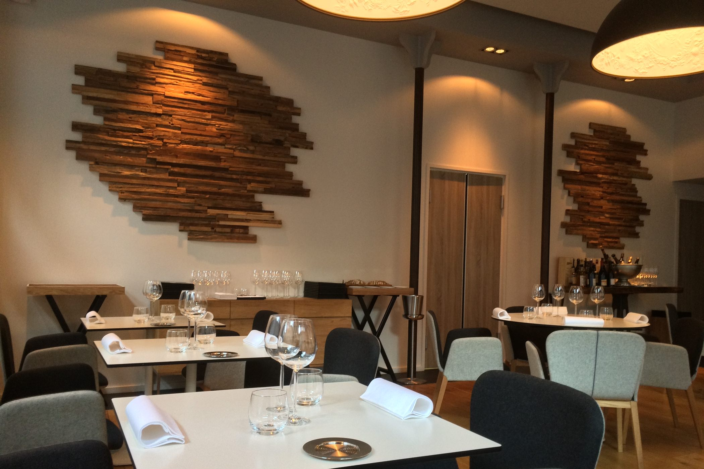
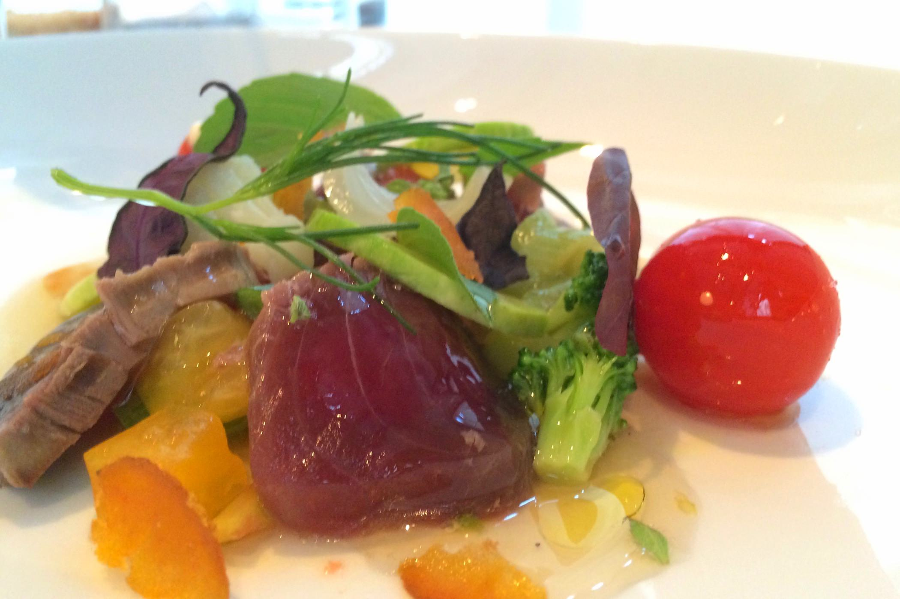
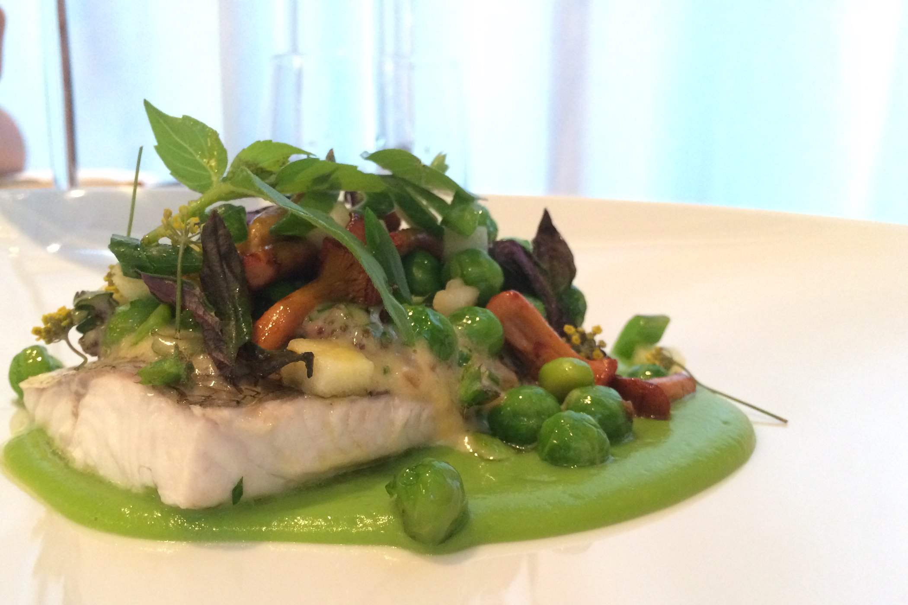
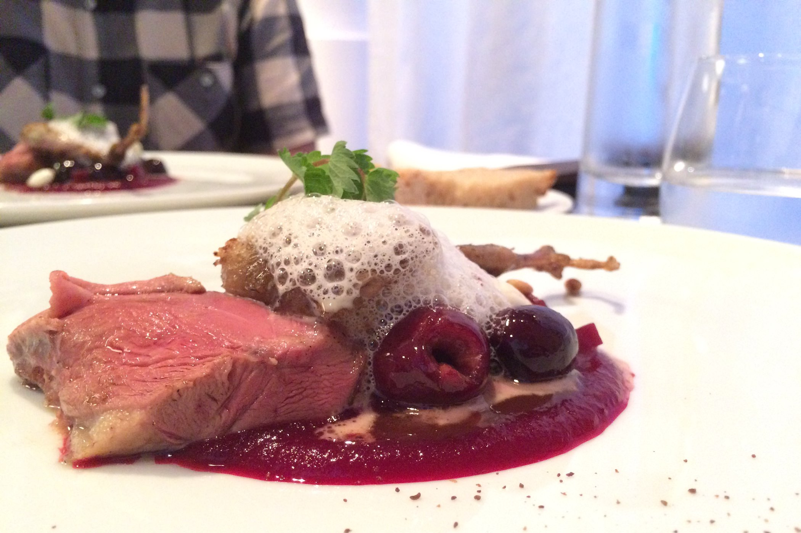
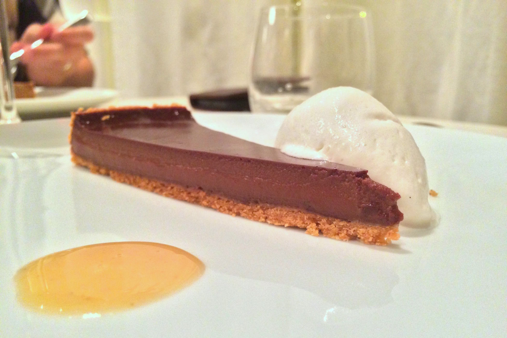

+++
type = "post"
titre = "Takao Takano à Lyon"
title = "Takao Takano à Lyon"
url = "/takao-takano-lyon"
date = "2014-07-27T01:08:48"
Lastmod = "2014-07-27T01:11:37"
cover = "takao-takano-lyon.jpg"
categorie = [ "À manger" ]
tag = [ "Cuisine française", "Cuisine japonaise", "Une étoile Guide Michelin" ]

+++

À Lyon, les chefs japonais occupent souvent les cuisines de restaurants qui servent une cuisine française, et le résultat est en général excellent. Dans ce genre, <a href="http://voiretmanger.fr/au-14-fevrier-lyon/" title="Au 14 février, Lyon"><strong>Au 14 février</strong></a> reste une référence, mais <a href="http://voiretmanger.fr/ourson-qui-boit-lyon/" title="L’ourson qui boit à Lyon"><strong>L’ourson qui boit</strong></a> est aussi très convaincant. Plus récent, le <a href="http://www.takaotakano.com"><strong>Takao Takano</strong></a> reprend la même recette, avec à nouveau un grand succès. Cette adresse étoilée propose des plats d&rsquo;une grande finesse, avec des produits de qualité parfaitement cuisinés et toujours cette touche orientale amenée par le chef. Une vraie réussite, à découvrir dans le sixième arrondissement lyonnais !

Situé à l&rsquo;angle des rues Sully et Malesherbes, <strong>Takao Takano</strong> est à deux pas de la place et du métro Foch, à quelques minutes du Parc de la Tête d&rsquo;Or à Lyon. Un quartier huppé plein de restaurants et peu d&rsquo;attrapes-touristes comme on en trouve dans le Vieux Lyon. La devanture de celui-ci joue la carte de la discrétion, une caractéristique que l&rsquo;on retrouve aussi à l&rsquo;intérieur. De la rue, on ne voit rien de la salle, si bien que l&rsquo;on est surpris quand on entre pour découvrir un restaurant de petite taille, décoré avec beaucoup de goût. Une vingtaine de couverts seulement, un décor sobre qui serait froid s&rsquo;il n&rsquo;était pas réchauffé par du bois au sol et sur les murs. L&rsquo;ensemble est vraiment agréable et la taille modeste du restaurant est appréciable : sur son site, le chef indique qu&rsquo;il sert ses clients comme s&rsquo;ils étaient ses invités. Même s&rsquo;il n&rsquo;est pas en salle, il faut reconnaître que l&rsquo;accueil est agréable et même quand le restaurant est plein comme c&rsquo;était le cas ce samedi soir-là, il reste à visage humain.

On ne sert pas de plats à la carte au <strong>Takao Takano</strong> : le soir, deux menus sont proposés et c&rsquo;est le seul choix que l&rsquo;on a. Le premier, surnommé « Essence », rassemble cinq assiettes, plus les traditionnels amuses-bouches et mignardises naturellement. Le deuxième, dit « Partage » est plus ambitieux avec ses sept plats au programme. Côté prix, on est à environ 50 € pour l&rsquo;un, environ 80 € pour l&rsquo;autre. Pour une adresse avec une étoile au <em>Guide Michelin</em>, cela reste raisonnable et on dépasse largement du cadre du sempiternel entrée/plat/dessert avec, au minimum, une entrée, un poisson, une viande, fromage et dessert. Ces deux menus sont proposés tous les soirs, mais leur composition change très souvent. Et pour les accompagner, la carte des vins est bien plus complète et sur ce point, vous ne manquerez pas de choix. Vous pouvez aussi choisir de suivre l&rsquo;avis du sommelier, qui nous a déniché un verre de blanc puis un verre de vin rouge qui convenaient parfaitement au plat du jour, un bon point.

<a href="http://voiretmanger.fr/wp-content/2014/07/takao-takano-menu.jpg">À la carte</a> ce soir-là, des produits variés et dès les énoncés, la marque d&rsquo;une recherche. Le chef aime manifestement expérimenter et les amateurs seront ravis de pouvoir sortir un petit peu des sentiers battus, sans tomber dans la cuisine expérimentale pour autant. L&rsquo;<a href="http://voiretmanger.fr/wp-content/2014/07/takao-takano-amuse-bouche.jpg">amuse-bouche</a> servi pour ouvrir notre appétit en est d&rsquo;ailleurs une très belle démonstration. Sur un fond de flanc de fumé de poisson subtil en goût et si fondant, quelques champignons, des tranches de maquereau cru, mais mariné, et un assaisonnement qui explose en bouche. Ce n&rsquo;est même pas un plat au menu, mais on déguste déjà de la très bonne cuisine, une très belle surprise. À côté, l&rsquo;entrée composée de thonine — une sorte de thon, mais qui n&rsquo;est pas protégé apparemment — et de légumes du soleil crus est presque décevante. Les tomates et autres légumes rassemblés autour du poisson simplement marinés sont très bons, le jus de tomate légèrement citrons au fond est aussi réussi, mais on est moins surpris qu&rsquo;avec cette coupelle que l&rsquo;on vient de nous servir.

La suite relève cependant le niveau : le premier plat est construit autour du fera, un poisson de lac accompagné ici de petits pois frais succulents. Ce poisson à la chair fragile a été préservé par une cuisson vapeur et l&rsquo;assaisonnement à base de girolles et marjolaine le relève bien, mais on retient surtout les petits pois entiers et le velouté qui fait la base de l&rsquo;assiette. C&rsquo;est très simple, mais c&rsquo;est vraiment bien fait et le produit est si savoureux que c&rsquo;est amplement suffisant. La viande, du pigeonneau parfaitement cuit, était accompagnée de betteraves et cerises, une alliance sucrée/salée qui fonctionne bien. Côté fromage, <strong>Takao Takano</strong> ne fait pas non plus de fioritures, on a trois morceaux sélectionnés et surtout affinés avec soin. Ce soir-là, on avait du chèvre de la Loire, un brebis de Corse et une tome de Vache. Pour conclure ce repas, la tarte au chocolat est un dessert simple, un peu régressif, mais très bien réalisé. Très concentrée en cacao, la crème de la tarte est savoureuse, mais on aurait aimé une page plus croustillante. La confiture de lait au thé apportait un goût étrange pas forcément idéal avec le chocolat, mais la glace à la fève de Tonka apportait juste ce qu&rsquo;il fallait de gourmandise. Seul regret finalement : la part était peut-être un peu légère, on en aurait bien repris… Heureusement, le petit cookie et la madeleine faits maison et tout juste sortis du four ont largement compensé.

Pour environ 60 € par personne avec les vins, on mange vraiment très bien chez <strong>Takao Takano</strong>. Le service est digne d&rsquo;un restaurant deux, voire trois étoiles sans être guindé, et les menus sont généreux avec des assiettes très finement composées. C&rsquo;est original et savoureux, un coup de cœur pour qui veut sortir des sentiers battus à Lyon, sans pour autant donner dans la cuisine moléculaire. Pensez bien à réserver, l&rsquo;adresse connaît un beau succès…

