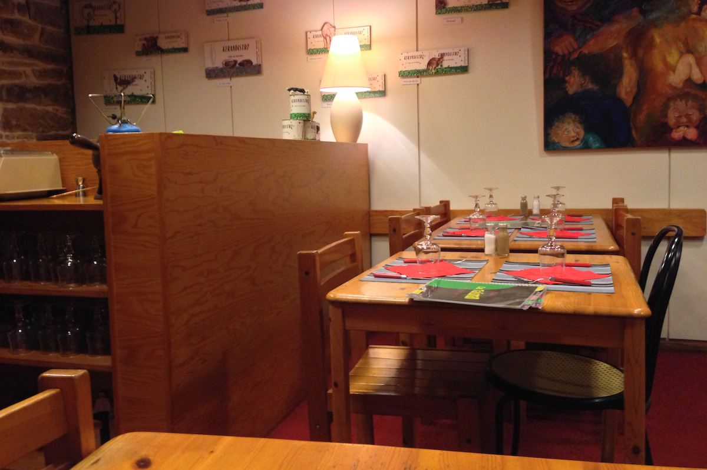
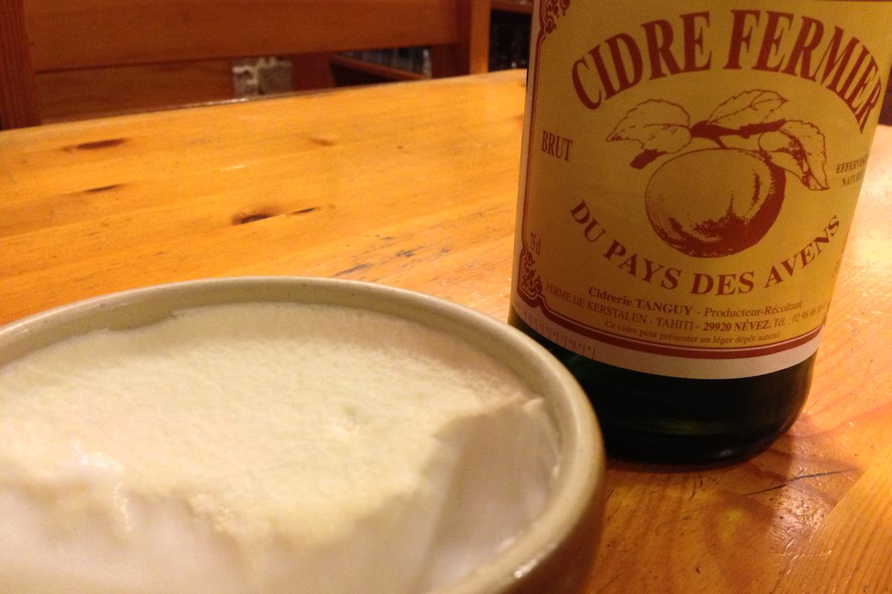
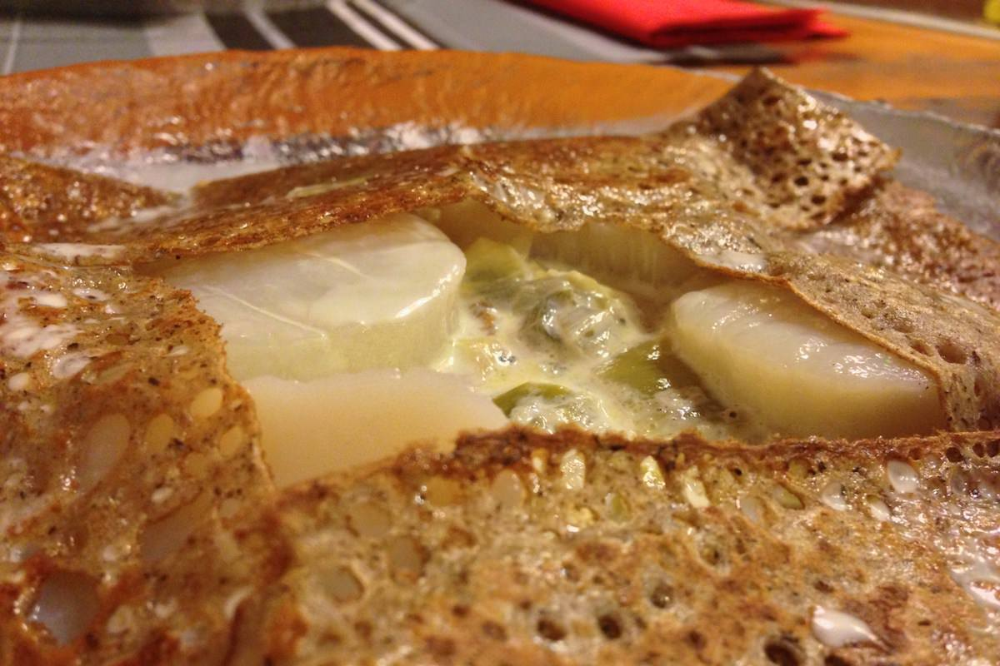
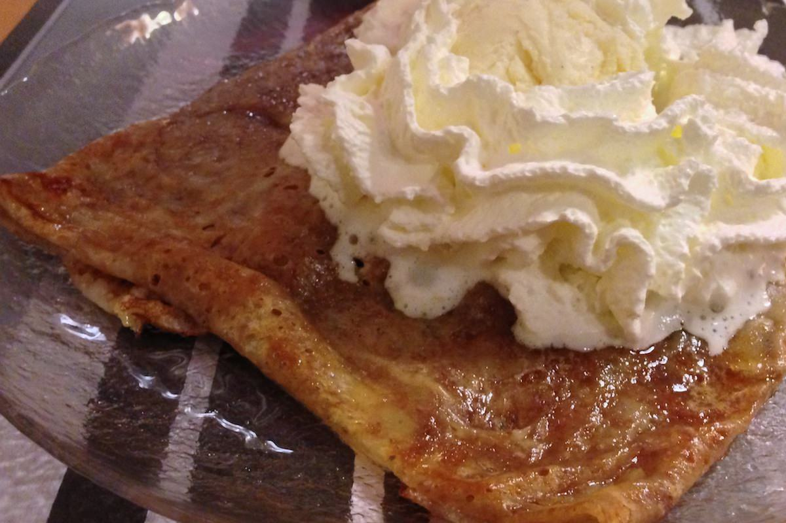
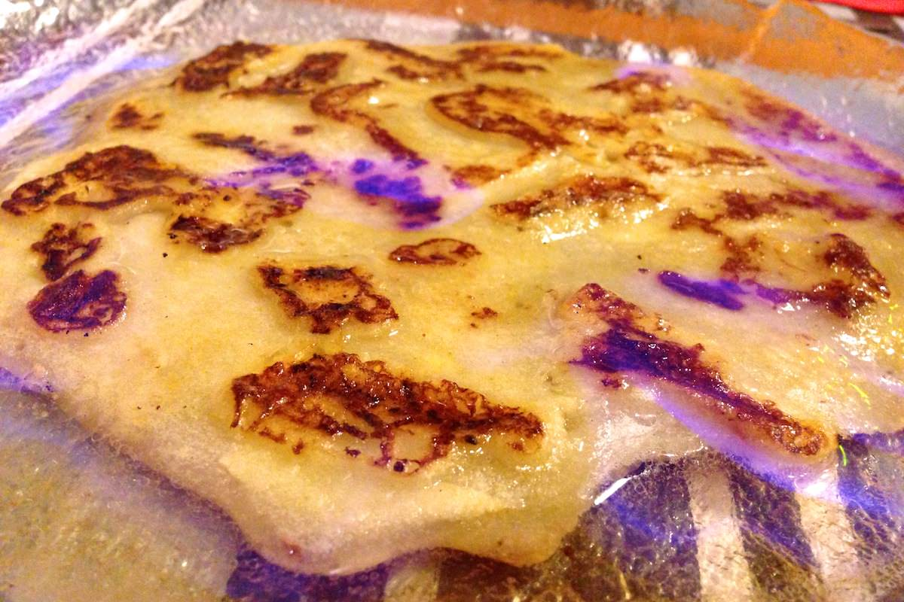

+++
type = "post"
titre = "Le Talisman à Pont-Aven"
title = "Le Talisman à Pont-Aven"
url = "/talisman-pont-aven"
date = "2013-02-16T22:14:18"
Lastmod = "2013-12-31T00:03:11"
cover = "pont-aven-creperie-talisman.jpg"
categorie = [ "À manger" ]
tag = [ "Bretagne", "Crêperie", "Cuisine régionale" ]

+++

La petite bourgade de Pont-Aven est devenue très célèbre depuis qu’une poignée d’impressionnistes de renom l’a élue pour peindre leurs toiles. Au centre de la ville, on trouve ainsi un pont sur l’Aven, mais aussi de nombreuses boutiques touristiques et les inévitables restaurants avec terrasses qui se multiplient toujours dans ces zones. <a href="http://www.creperie-talisman-pontaven.fr"><strong>Le Talisman</strong></a> est à l’écart de ce centre au demeurant charmant. Cette petite crêperie est située le long d’une départementale qui sort de la ville et on ne s’y rendra pas pour son cadre, mais pour ses galettes et crêpes vraiment savoureuses…

<strong>Le Talisman</strong> ne brille par sa façade quelconque, à peine rehaussée par les multiples récompenses obtenues par la crêperie depuis de nombreuses années. On note aussi la rassurante mention &laquo;&nbsp;Recette originale depuis 1920&Prime; et on ne vient de toute manière pas ici pour un cadre original, mais pour la cuisine. La salle est à l’image de cette devanture : petite, exiguë et assez vieillotte. L’ensemble a été rénové dans les années 1980 ou 1990 sans doute et cette décoration dans les tons bordeaux, de la moquette au plafond, a très mal vieilli. Le mobilier est également quelconque et la seule vue que l’on aura sera celle sur la rue, assez passante en saison. Ne vous y trompez pas : si cette adresse est à l’écart du centre touristique et si elle n’attire pas ses clients par un cadre exceptionnel, <strong>Le Talisman</strong> est rarement vide, surtout l’été où il faut absolument réserver. Ce samedi soir de février, la petite salle était quasiment pleine et constituée essentiellement de familles avec enfants. Une ambiance conviviale et détendue qui est loin d’être déplaisante…

La carte plastifiée est plutôt impressionnante. Deux pages pleines pour les galettes salées, deux autres pour les crêpes sucrées. Nulle recette originale ici, <strong>Le Talisman</strong> a fait le pari pertinent de proposer des produits simples, mais d’excellente qualité et cuisinés en les respectant. Le concept est en revanche très simple : choisissez les ingrédients que vous désirez et vous aurez votre propre galette ou votre crêpe. Malheureusement, la carte est loin d’être aussi simple : des dizaines de combinaisons sont proposées, il y a aussi des suggestions, des spécialités… Côté salé, vous pouvez opter pour une complète traditionnelle (œuf, jambon, fromage) ou ajouter l’un des ingrédients en plus, des oignons fondus à l’andouillette, en passant par de la poitrine fumée, de la saucisse bretonne, des champignons, du fromage de chèvre, etc. Même principe du côté du sucré : vous pourrez vous contenter d’un peu de beurre, de la traditionnelle beurre sucre ou piocher dans la longue liste d’ingrédients, comme du chocolat, de la compote de pommes, du caramel au beurre salé ou un alcool flambé. Dans les deux cas, les indécis auront du mal à se décider, mais cela signifie aussi que la liste des possibilités peut être étendue quasiment à l’infini, de quoi renouveler l’expérience sans tomber dans la redite. 

Pour commencer le repas, le gros lait fait maison est un excellent choix : avec sa légère couche de crème et sa touche d’acidité, c’est une très bonne façon d’ouvrir l’appétit. Les galettes sont toutes proposées à un prix ridicule comparé à ceux que l’on peut constater dans les crêperies hors de Bretagne : comptez 4 à 6 € en fonction du nombre d’ingrédients et de leur nature, à l’exception de la version aux noix de Saint-Jacques qui tourne autour de 7 €. Ce petit prix permet d’envisager d’en prendre deux, mais les portions sont assez conséquentes. La galette &laquo;&nbsp;Le Talisman&nbsp;&raquo;, spécialité de la maison à base d’œuf, fromage, tomate et champignon plus un ingrédient de votre choix, suffira à nourrir les petits appétits avant de passer à un dessert. Les plus gourmands pourront tenter la galette aux Saint-Jacques : accompagnées d’une fondue de poireaux, les noix sont à peine cuites comme il se doit et elles fondent littéralement en bouche, un délice. 

<strong>Le Talisman</strong> est ainsi fidèle à son objectif : une cuisine simple, mais de qualité. La page est très fine, moelleuse et craquante quand il le faut, la cuisson au beurre se ressent en bouche, bref, c’est un délice, que vous choisissiez une trois fromages, une complète ou la spécialité de la maison. Le dessert ne vous décevra pas plus : les crêpes sont également cuites au beurre et elles sont tout aussi savoureuses. On recommande la galette aux pommes, spécialité de la maison qui est en fait de la page à crêpe mêlée à de la compote de pommes. Le résultat est totalement différent d’une crêpe avec de la compote à l’intérieur, on a une galette plus épaisse, mais plus petite aussi et l’ensemble, très moelleux, vaut le détour. À déguster seule (comprendre, au beurre) ou avec du citron, du caramel au beurre salé, ou encore du calvados flambé à déconseiller à tous ceux qui doivent conduire juste après. Chaque dessert est vendu de 3 à 5 € en fonction de sa composition et même en forçant sur les suppléments — de la chantilly et/ou des boules de glace sur la crêpe —, on s’en tire toujours pour une somme raisonnable. Si vous aimez les expériences, vous pourrez en profiter pour tester les crêpes salées avec une page de galette, du blé noir donc. Ce mélange original ne conviendra pas à tout le monde, mais il mérite d’être essayé…

Si vous cherchez une bonne adresse à Pont-Aven, non pas un restaurant avec une belle vue sur la rivière et une cuisine médiocre, mais une crêperie qui propose des galettes et des crêpes exquises, <strong>Le Talisman</strong> est le lieu à retenir. L’originalité et la créativité ne sont pas de mise ici, mais la cuisine simple et de qualité perpétuée à travers les générations reste une valeur sûre. Ne passez pas à côté si vous passez dans les environs…

