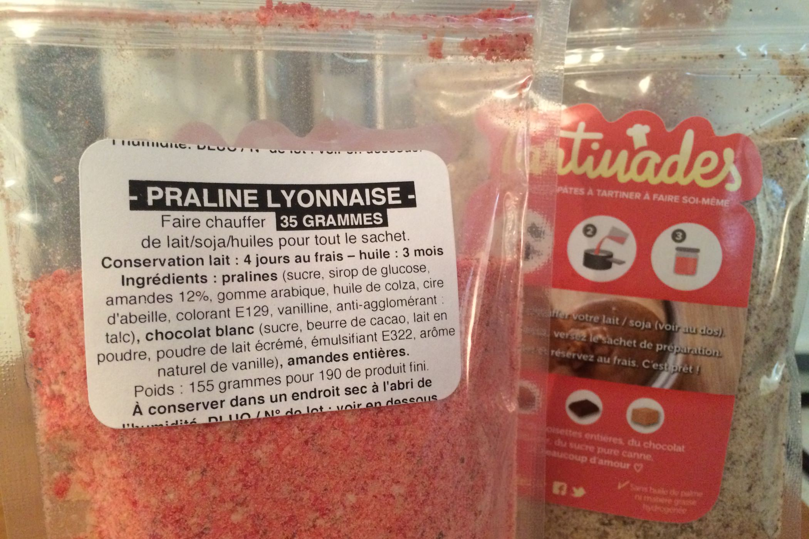
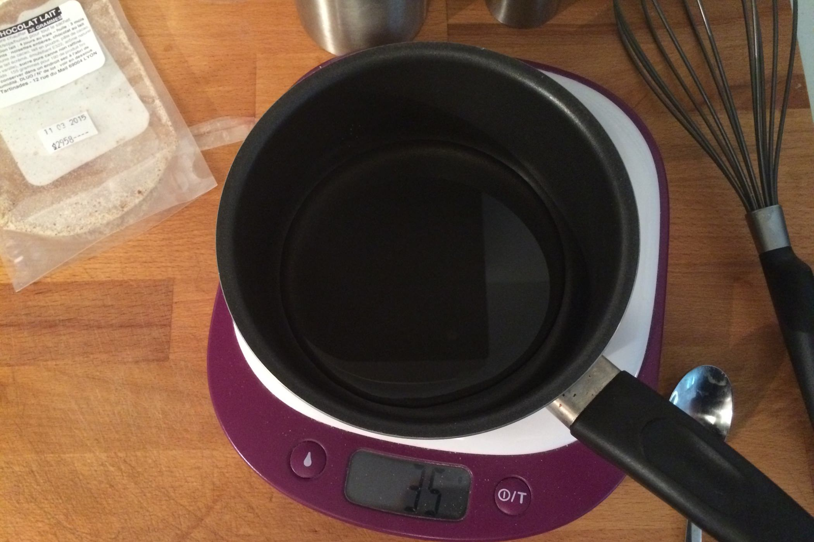
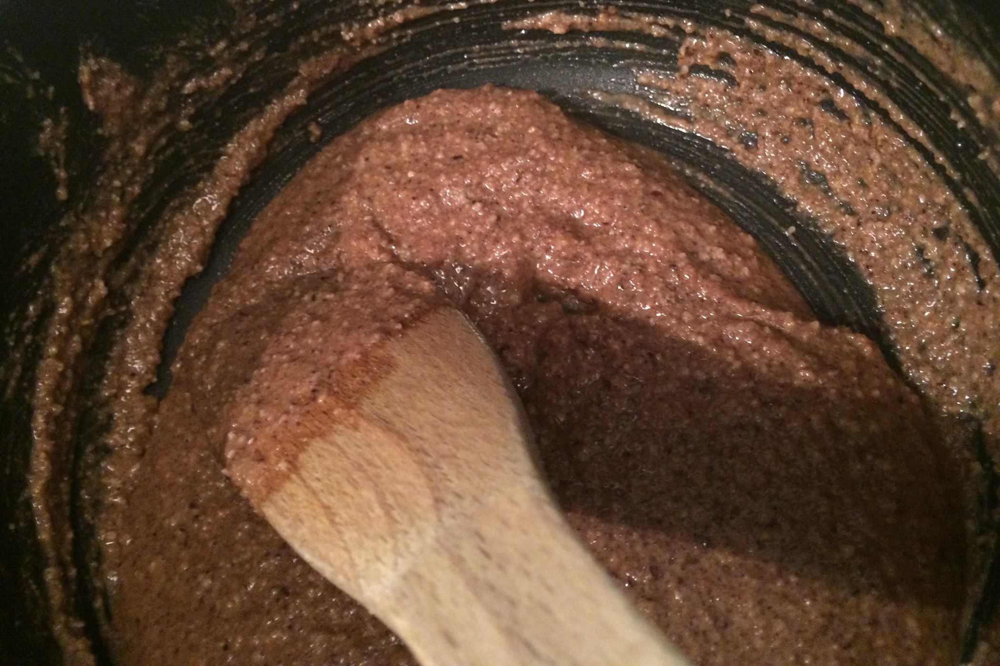

+++
titre = "Tartinades : pâtes à tartiner « maison »"
title = "Tartinades : pâtes à tartiner « maison »"
url = "/tartinades"
date = "2014-07-20T21:50:18"
Lastmod = "2014-07-20T23:15:23"
cover = "tartinades.jpg"
categorie = [ "En bref" ]
tag = [ "Cuisine", "Recette" ]

+++

En matière de pâte à tartiner, le marché est dominé par une marque. Tous les enfants connaissent et veulent du Nutella, si bien qu’il est difficile d’imposer autre chose. Pourtant, il existe d’autres pâtes à tartiner, et pas uniquement les copies bon marché vendues par les chaînes de supermarché. On trouve d’autres produits excellents, à commencer par l’irrésistible version aux Speculoos. Basée à Lyon, une petite équipe cherche à se faire connaître avec une autre formule, beaucoup plus originale : <a href="http://www.tartinades.fr">les Tartinades</a> sont des pâtes à tartiner à faire soi-même. Vous n’achetez pas un pot prêt à emploi, mais un sachet qu’il faudra transformer en un pot de pâte à tartiner. Une excellente idée pour tous ceux qui ne veulent plus entendre parler d’huile de palme et autres produits étranges : il n’y a ici que trois ou quatre ingrédients, et vous maîtrisez la conception du produit final.

Les Tartinades m’ont envoyé deux paquets pour tester leurs produits. La version au chocolat au lait est la plus classique, la plus proche de la fameuse pâte à tartiner réclamée par tout le monde. L’autre paquet est beaucoup plus original, puisqu’il permet de créer une pâte à tartiner à base de pralines, une spécialité lyonnaise. Dans les deux cas, le principe ne change pas : dans chaque paquet, on a environ 150 g d’une poudre qu’il faut mélanger à une matière grasse légèrement chauffée. Plusieurs options sont proposées : on peut mettre de l’huile naturellement, mais aussi du lait ou du soja. Malheureusement, dans ce cas, il faut consommer la pâte très rapidement : elle se conserve quatre jours au frais maximum. L’huile est une option plus grasse, mais plus proche de ce que l’on connaît par ailleurs, avec une conservation pendant trois mois sans problème. Ne voulant pas tout manger en une fois, j’ai choisi de faire mes pâtes à tartiner avec de l’huile. La recette est très simple : faites chauffer 35 g du liquide souhaité, puis plongez la poudre dans la matière grasse et mélangez quelques secondes. La pâte se forme rapidement et on obtient ainsi un résultat homogène, que l’on peut mettre dans un pot à confiture et consommer sitôt refroidi. Le résultat est étonnant si l’on s’attend à une pâte lisse, comme peut l’être le Nutella. Les fruits à coque qui composent l’essentiel de la poudre sont mixés assez grossièrement et ils restent très présents dans le résultat final, ce qui est normal.

À la dégustation, cet aspect granuleux est un peu déstabilisant. Peut-être parce que l’on s’attend à un résultat plus proche des pâtes à tartiner plus traditionnelles, on aimerait une pâte plus lisse. Côté goût, la noisette est particulièrement présente dans la version chocolat lait testée ici. Il faut dire c’est l’ingrédient principal et le fait de laisser la noisette mixée assez grossièrement plutôt que finement permet au goût de bien ressortir. De fait, cette tartinade n’a rien à voir avec le Nutella, même si c’est la version qui s’en approche le plus d’après ses concepteurs. Ce n’est pas plus mal : obtenir exactement le même goût est sûrement impossible, et c’est probablement mieux de s’en éloigner franchement et de proposer quelque chose de vraiment différent. Les amateurs de noisette devraient être aux anges, pour ma part j’ai trouvé le sucre un peu trop présent et le chocolat un peu trop en retrait. Dans le paquet, on a du sucre pure canne non raffiné que l’on sent bien, d’autant que les cristaux n’ont pas totalement fondu après transformation. Résultat, la pâte à tartiner est très sucrée : peut-être qu’il y en a autant que dans le Nutella, mais le sucre est plus présent en bouche, un peu trop à mon goût. La tartinade aux pralines lyonnaises est bien plus originale naturellement. Composée principale de pralines, mais aussi de chocolat blanc et d’amandes entières, la pâte à tartiner a un bel aspect rose, mais elle est là aussi très granuleuse. En bouche, on ne retrouve pas vraiment le goût que j’attendais, à savoir celui des tartes à la praline que l’on trouve partout à Lyon. Là encore, c’est assez sucré : la praline l’est énormément, et le chocolat blanc qui fait la saison n’aide pas. N’étant pas spécialement amateur de chocolat blanc, le résultat ne m’a pas totalement convaincu, mais on peut apprécier la recherche d’originalité de la part des Tartinades.

Les Tartinades m’ont convaincu par leur idée : proposer une pâte à tartiner que l’on peut finir soi-même à la maison est à la fois ludique — on imagine bien le faire avec ses enfants — et sécurisant. On sait exactement ce qu’il y a dans le pot et le nombre très restreint d’ingrédients pour composer chaque poudre est rassurant. Si l’idée est excellente, la réalisation n’est pas aussi réussie à mon goût. Le côté granuleux m’a un peu gêné, j’aurais aimé une pâte plus fluide, tandis que sur le plan gustatif, j’aurais apprécié que le sucre soit moins présent. Peut-être que le choix de l’huile n’était pas le meilleur pour le goût, mais la durée de conservation pose alors un problème. Notons quand même que la poudre elle-même se conserve pendant plusieurs mois sans problème : peut-être que la meilleure solution est de faire très peu de pâte à chaque fois ?

L’idée reste malgré tout excellente, et je serais curieux de tester les Tartinades pour faire un gâteau, comme ils le recommandent sur leur site. Si vous voulez essayer vous-même, vous pouvez commander <a href="http://www.tartinades.fr/#!boutique/mainPage">à cette adresse</a> : comptez 4 € pour environ la moitié d’un pot de confiture Bonne Maman et 7 € pour le double (plus des frais de port). Vous pouvez également profiter de <a href="http://www.kisskissbankbank.com/fr/projects/tartinades-pate-a-tartiner-saines-gourmandes-a-faire-soi-meme-diy">la campagne de financement</a> organisée par les créateurs du produit. Cette campagne est un vrai succès et elle leur permettra d’investir dans des locaux dédiés pour augmenter la production, qui reste à ce jour très artisanale. En vous rendant <a href="http://www.kisskissbankbank.com/fr/projects/tartinades-pate-a-tartiner-saines-gourmandes-a-faire-soi-meme-diy">à cette autre adresse</a>, vous pourrez en apprendre plus sur le projet, mais aussi participer au financement en fonction de vos moyens.

