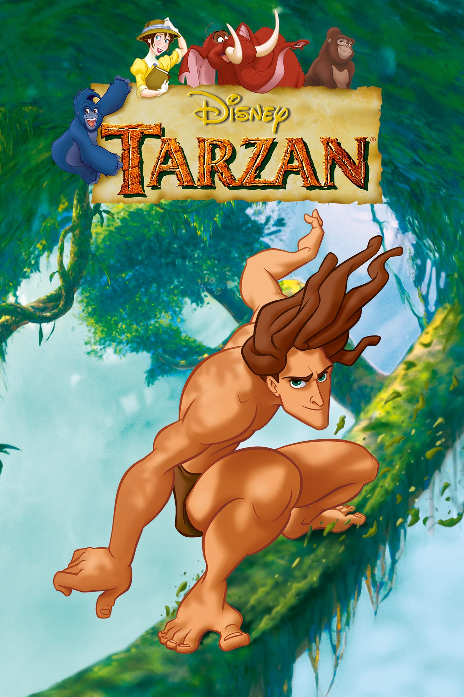
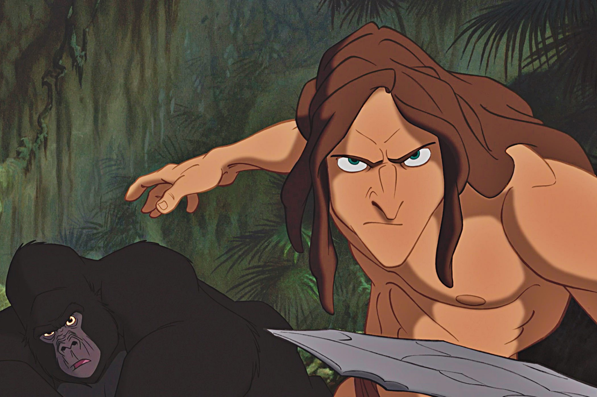
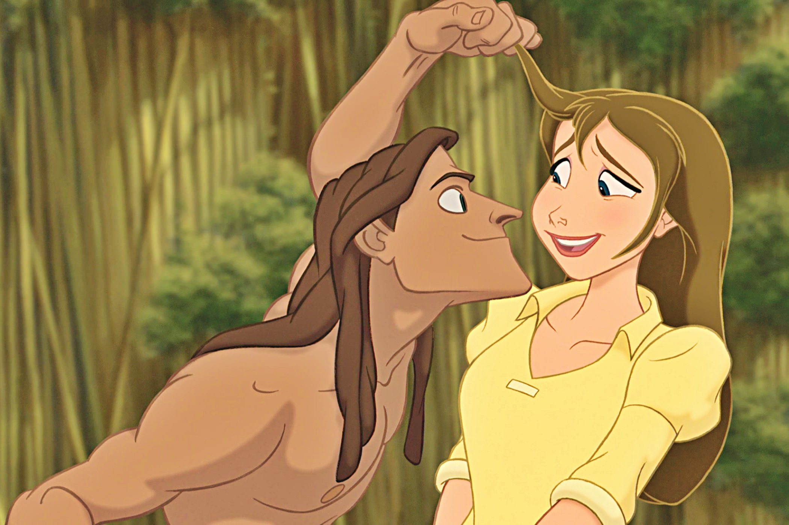

+++
titre = "<em>Tarzan</em>, Chris Buck et Kevin Lima"
title = "Tarzan, Chris Buck et Kevin Lima"
url = "/tarzan-buck-lima"
date = "2014-07-04T11:13:31"
Lastmod = "2014-07-04T13:47:37"
cover = "tarzan-lima-buck-disney.jpg"
categorie = [ "À voir" ]
tag = [ "Adaptation littéraire", "Amour", "Animation", "Animaux", "Famille", "Nature" ]
createur = [ "Chris Buck", "Kevin Lima" ]
annee = [ "1999" ]
weight = 1999
saga = [ "Classiques d'animation Disney" ]
pays = [ "États-Unis" ]

+++

Dernier gros succès des années 1990 pour Disney, <em>Tarzan</em> était aussi à sa sortie le film d’animation le plus cher de l’histoire. De fait, le studio n’a pas lésiné sur les moyens pour son trente-septième <a href="http://voiretmanger.fr/saga/classiques-danimation-disney/">classique</a> : imaginant une nouvelle technique, il réussit à composer pour la première fois des fonds animés qui changent totalement le rendu final. Cette nouvelle technologie illustre une histoire classique, celle de l’homme singe Tarzan et sa rencontre avec Jane. Disney adapte à sa sauce le roman original d’Edgar Rice Burroughs et garde ainsi essentiellement une histoire d’amour, sans occulter totalement la critique de fond sur la destruction de la nature par l’homme. À l’heure des bilans, <em>Tarzan</em> est un classique plaisant, à défaut d’être inoubliable.

L’histoire est connue : une famille fait naufrage sur les côtes africaines, les deux parents meurent rapidement, laissant un bébé derrière. Une gorille passe alors dans les environs et le recueille comme son propre fils : Tarzan, l’homme-singe, est né. Walt Disney est fidèle à l’idée de base du roman, mais la version animée s’éloigne considérablement de l’original pour finalement raconter une tout autre histoire. Ici, la mort des parents n’a rien à voir avec les gorilles : c’est un tigre qui attaque la hutte de fortune et tue les naufragés, mais pas le bébé. La gorille Kala vient le secourir et Tarzan appartient alors à la famille des gorilles. Sous la plume d’Edgar Rice Burroughs, le sauvage découvre par lui-même qui il est vraiment et il s’en prend à une tribu d’Africains. Rien de tel pour <em>Tarzan</em> qui simplifie l’intrigue à l’extrême : le héros vit comme un gorille et se prend même pour un gorille atypique, faute de poils. Ce n’est que sa rencontre avec Jane qui bouleverse ses repères et lui permet de réaliser qu’il n’est pas un singe, mais un homme. Enfin, le happy-end ici se fait dans la jungle et non de retour à la civilisation : Disney choisit ainsi explicitement le point de vue de la nature et fait de l’homme l’envahisseur et le destructeur. Le chef des gorilles est impressionnant et il est puissant, mais c’est pour mieux repousser l’ennemi et uniquement pour cela. Sa méfiance envers les hommes, y compris envers Tarzan, est justifiée par les évènements : les nouveaux venus sont effectivement mauvais et même si l’homme-singe finit par les sauver, c’est lui qui cause leur perte dans un premier temps.

Face à ce constat assez sombre, on pourrait croire que <em>Tarzan</em> est un classique lourd et noir, mais il n’en est rien. Chris Buck et Kevin Lima mettent aussi en scène des personnages secondaires qui ajoutent la touche de comique nécessaire, ici une gorille et un éléphant qui ont le même âge que Tarzan et qui deviennent ses amis. Le procédé est classique, mais on note l’effort des scénaristes pour un humour plus léger que ce que l’on a pu voir dans les productions Disney précédentes. Loin de la farce que l’on pouvait avoir dans <a href="http://voiretmanger.fr/hercule-musker-clements/"><em>Hercule</em></a> ou dans <a href="http://voiretmanger.fr/mulan-bancroft-cook/"><em>Mulan</em></a>, on a ici un humour mieux dosé, plus subtil, mais aussi moins efficace, il faut bien le dire, malgré le choix de Muriel Robin pour l’un des deux personnages en version française. L’histoire d’amour domine dans <em>Tarzan</em> et il faut reconnaître qu’elle est plutôt bien menée, de la curiosité rejetée dans un premier temps par la belle, jusqu’à l’amour appris petit à petit par Tarzan. Le temps des princesses est décidément loin quand le long-métrage sort en 1999 et c’est une vision beaucoup plus moderne de l’amour qui est présentée par les scénaristes, même si elle est un peu guimauve aussi. Il faut dire que les <a href="https://itunes.apple.com/fr/album/tarzan-music-from-motion-picture/id724443167">chansons composées et chantées par Phil Collins</a> — même en français — n’aident pas vraiment. Le plaisir reste intact, en grande partie grâce à l’animation qui marque une étape très nette par rapport à ses prédécesseurs. Le studio Disney imagine une nouvelle technique pour produire des décors qui ressemblent à des peintures, tout en étant animés, une première. Le rendu est assez magnifique, même si certains éléments créés avec un ordinateur tranchent un peu. Par ailleurs, seuls les gorilles et les autres animaux s’intègrent parfaitement aux décors : les humains donnent l’impression d’avoir été collés là au hasard. Peut-être que les animateurs voulaient montrer qu’ils n’étaient pas à leur place, mais c’est un choix plus gênant qu’autre chose. Un mot pour finir sur Tarzan lui-même : ce personnage est sans conteste l’un des mieux animés par le studio à ce jour et l’impression de vitesse est impressionnante, surtout quand on sait que tout a été fait à la main.

Sans être aussi passionnant et réussi que <a href="http://voiretmanger.fr/roi-lion-allers-minkoff/"><em>Le Roi Lion</em></a> ou <a href="http://voiretmanger.fr/aladdin-musker-clements/"><em>Aladdin</em></a>, <em>Tarzan</em> reste un bon classique, qui se distingue d’abord par une forme très réussie. L’histoire est moins originale, mais elle est bien menée et on ne s’ennuie jamais. Un bon divertissement donc, qui signe la fin de la prospérité pour les studios Disney. Après une dizaine d’années pleines de succès, les difficultés recommencent, mais ce <em>Tarzan</em> est encore un beau succès à sa sortie.

<h3>Vous voulez <a href="http://voiretmanger.fr/soutien/">m’aider</a> ?</h3>
<ul>
<li><a href="http://www.amazon.fr/gp/product/B009DH9EBC/ref=as_li_ss_tl?ie=UTF8&amp;tag=leblogdenic07-21&amp;linkCode=as2&amp;camp=1642&amp;creative=19458&amp;creativeASIN=B009DH9EBC">Acheter le film en Blu-ray sur Amazon</a></li>
<li><a href="http://www.amazon.fr/gp/product/B0007DDR3W/ref=as_li_ss_tl?ie=UTF8&amp;tag=leblogdenic07-21&amp;linkCode=as2&amp;camp=1642&amp;creative=19458&amp;creativeASIN=B0007DDR3W">Acheter le film en DVD sur Amazon</a></li>
<li><a href="https://itunes.apple.com/fr/movie/tarzan/id764477584">Acheter ou louer le film sur l’iTunes Store</a></li>
</ul>

