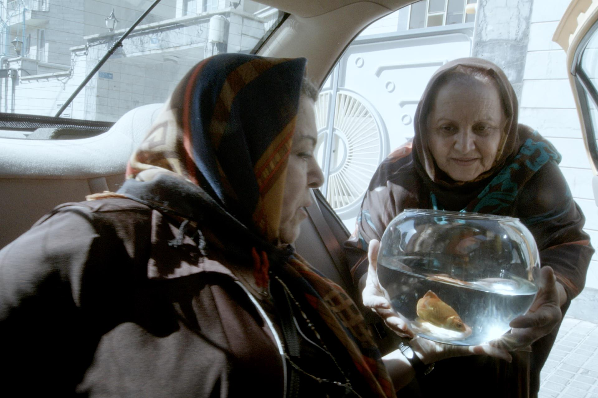
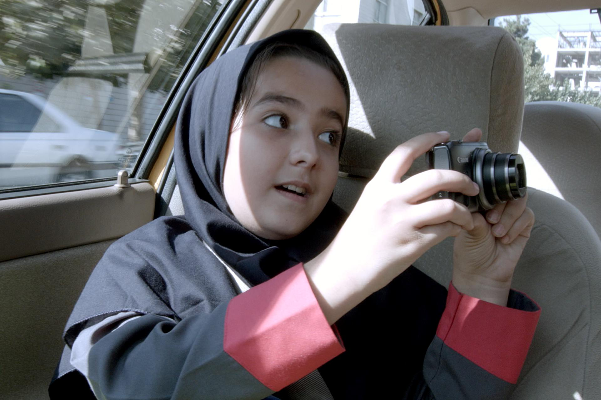

+++
type = "post"
titre = "<em>Taxi Téhéran</em>, Jafar Panahi"
title = "Taxi Téhéran, Jafar Panahi"
url = "/taxi-teheran-panahi"
date = "2015-04-22T22:10:10"
Lastmod = "2015-05-03T16:44:14"
cover = "taxi-teheran-jafar-pahani.jpg"
categorie = [ "À voir" ]
tag = [ "Docufiction", "Huis clos", "Humour", "Politique", "Quotidien", "Religion", "Société", "Sorties du mois", "Taxi", "Violence" ]
createur = [ "Jafar Panahi" ]
acteur = [ "Jafar Panahi" ]
annee = [ "2015" ]
weight = 2015
pays = [ "Iran" ]
original = "Taxi"

+++

<blockquote class="pull-quote">
 Le ministère de l’Orientation islamique valide les générique des films «diffusables». À mon grand regret, ce film n’a pas de générique. J’exprime ma gratitude à tous ceux qui m’ont soutenu. Sans leur précieuse collaboration, ce film n’aurait pas vu le jour. <cite class="author"> — Jafar Panahi, Taxi Téhéran, </cite>

</blockquote>

<em>Taxi Téhéran</em> est un drôle d&rsquo;objet cinématographique. Avant d&rsquo;être un long-métrage, c&rsquo;est d&rsquo;abord un pied de nez de son réalisateur à son gouvernement. Jafar Panahi est en effet officiellement interdit de faire du cinéma depuis 2010 : son pays, l&rsquo;Iran, n&rsquo;apprécie pas ses films qui pointent tous du doigt le régime islamique qui y est en place. La censure officielle n&rsquo;autorise qu&rsquo;une liste très restreinte de sujets et encore, elle n&rsquo;autorise qu&rsquo;un angle positif pour ces sujets. Le cinéaste n&rsquo;a jamais pu faire de film « diffusible », comme ils disent, si bien qu&rsquo;il est obligé de travailler dans la clandestinité. Après avoir tourné chez lui <em>Ceci n&rsquo;est pas film</em>, qui évoquait son incapacité à tourner, il a trouvé une astuce pour écrire une fiction et surtout effectuer un tournage au cœur de Téhéran, en plein jour. Jafar Panahi est devenu chauffeur de taxi qui accueille des clients presque normaux… sauf qu&rsquo;en l&rsquo;occurrence, il s&rsquo;agit d&rsquo;acteurs (tous non-professionnels) qui ont un rôle à jouer face à de petites caméras portables. Une idée astucieuse, pour un résultat étonnant : <em>Taxi Téhéran</em> dresse un portrait passionnant de l&rsquo;Iran d&rsquo;aujourd&rsquo;hui, mais il est aussi, contre toutes attentes, très drôle. Une franche réussite !

Le film commence avec un plan fixe derrière le pare-brise d&rsquo;une voiture. La caméra est déjà dans le taxi, et elle ne le quittera jamais, ce qui fait de <em>Taxi Téhéran</em> une sorte de huis clos, même si techniquement ce n&rsquo;est pas tout à fait le cas, puisque les personnages sortent et entrent en permanence. Malgré tout, l&rsquo;action est toujours filmée à l&rsquo;intérieur du véhicule, ou à travers ses vitres, jamais en-dehors. À la base, ce dispositif est une contrainte liée au contexte politique : Jafar Panahi risque 20 ans pour chaque interdit — en plus de la réalisation de film, sa condamnation compte l&rsquo;écriture de scénario, les entretiens donnés à la presse et la sortie de territoire — et on comprend qu&rsquo;il ait pris quelques précautions pour éviter toute arrestation. En filmant uniquement depuis sa voiture, il limite au maximum les risques de flagrant délit, sachant que des caméras portables ont été utilisées exclusivement, pour pouvoir les ranger rapidement en cas de problème. C&rsquo;est une contrainte énorme malgré tout, d&rsquo;autant que le cinéaste était seul, dans la voiture, avec ses acteurs non-professionnels. Il devait conduire — après tout, c&rsquo;est un chauffeur de taxi ! —, mais aussi contrôler la caméra en l&rsquo;orientant différemment selon les besoins de chaque plan, et évidemment contrôler les acteurs. Il n&rsquo;y a par ailleurs aucun moyen technique, aucun éclairage, aucune caméra supplémentaire pour multiplier les plans… Le film se résume vraiment à un taxi, une caméra et quelques acteurs, point final. Autant dire qu&rsquo;avec un dispositif aussi minimaliste, on peut craindre de s&rsquo;ennuyer ferme, et les premières minutes, silencieuses avec cette caméra statique qui ne filme qu&rsquo;un carrefour de Téhéran n&rsquo;appellent pas à un excès de confiance.

Pourtant, on ne s&rsquo;ennuie jamais dans <em>Taxi Téhéran</em>, déjà parce que le long-métrage a le bon sens de rester assez court — moins d&rsquo;une heure et demi —, mais aussi et surtout parce que ce qu&rsquo;il montre est passionnant. On a tous des images de l&rsquo;Iran et de sa capitale, mais le portrait dressé par Jafar Panahi est étrangement complet, alors même qu&rsquo;il n&rsquo;est dressé que depuis une seule voiture, avec une seule caméra. Pour préparer le film, le cinéaste a pris le taxi et écouté les conversations des autres occupants, puisque les taxis iraniens, contrairement aux nôtres, se partagent. Il a pris des notes sur des anecdotes intéressantes et a pu ainsi esquisser un scénario qui, sans chercher l&rsquo;exhaustivité impossible, offre un aperçu relativement complet de la société iranienne. Il y a différentes couches sociales et différentes manières de penser, depuis celui qui veut pendre les voleurs de roues à cette avocate qui risque sa vie pour défendre des femmes attaquées par le régime, en passant par un homme plus aisé qui n&rsquo;ose pas dénoncer ses voleurs ou encore par un duo de femmes si superstitieuses qu&rsquo;elles veulent absolument jeter un poisson dans une fontaine à une heure précise pour ne pas mourir dans la minute. Avec ces différents passagers qui montent et descendent, <em>Taxi Téhéran</em> multiplie les points de vue sur l&rsquo;Iran d&rsquo;aujourd&rsquo;hui et l&rsquo;ensemble est passionnant, mais aussi très drôle. Ces acteurs ne sont pas des professionnels, ce sont des proches de Jafar Panahi ou des personnes qui incarnent leur propre rôle, mais ils ont un humour étonnant et ravissant. Il faut voir ces deux vieilles qui se chamaillent, cette jeune fille un peu impertinente ou encore ce vendeur de DVD piratés qui essaie de s&rsquo;associer avec le réalisateur pour faire prospérer son commerce. Même dans les moments les plus dramatiques, le film sait désamorcer les crises avec une pointe humoristique, à l&rsquo;image de cette femme qui insiste pour récupérer la vidéo testamentaire de son mari qui pensait mourir dans le taxi, alors même qu&rsquo;il va beaucoup mieux. L&rsquo;écriture du réalisateur fait ainsi preuve de toute sa finesse et on passe constamment d&rsquo;une émotion à l&rsquo;autre.

La contrainte peut parfois compliquer les choses, mais comme <em>Taxi Téhéran</em> le prouve à nouveau, elle est aussi toujours libératrice. Interdit de travail par son propre pays, Jafar Panahi ne se résigne pas, bien au contraire : en imaginant comment contourner l&rsquo;interdit, il s&rsquo;est imposé des contraintes qui lui ont peut-être empêché de tout faire, mais qui lui ont aussi permis de trouver une forme originale, simple et parfaitement adaptée. Ce taxi, dans lequel il filme et qu&rsquo;il conduit avec un sourire sincère qui fait plaisir à voir, c&rsquo;est un petit peu la société iranienne condensée et c&rsquo;est une franche réussite. N&rsquo;ayez pas peur, <em>Taxi Téhéran</em> est un vrai long-métrage, passionnant et drôle, à voir absolument.

&#x1f696;

