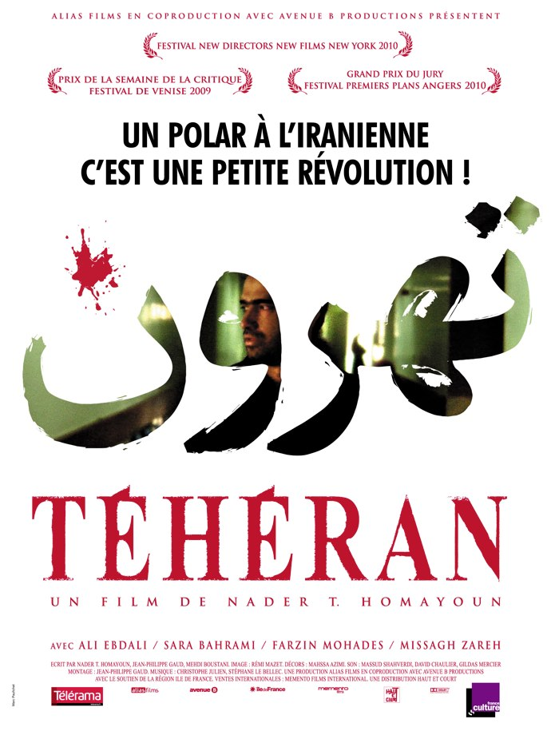
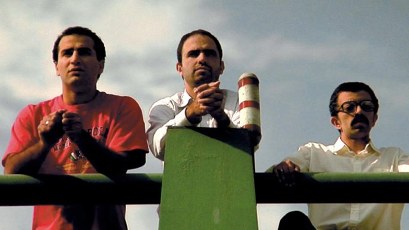
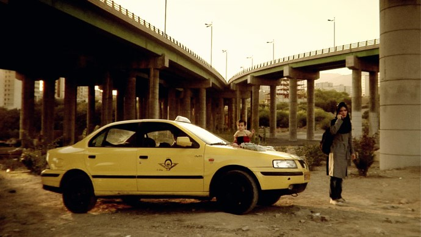

+++
type = "post"
titre = "Téhéran, Nader T. Homayoun"
title = "Téhéran, Nader T. Homayoun"
url = "/teheran-homayoun"
date = "2010-03-17T23:42:40"
Lastmod = "2010-03-17T23:48:59"
cover = "teheran-homayoun-e1268866497650.jpg"
categorie = [ "À voir" ]
tag = [ "Mafia", "Religion", "Société", "Thriller" ]
createur = [ "Nader T. Homayoun" ]
annee = [ "2010" ]
weight = 2010
pays = [ "France" ]

+++

<strong>À lire : j’ai été invité par Haut et Court à une projection de presse pour voir <em>Téhéran</em>. Je n’ai reçu aucun paiement pour cette critique, et je ne pense pas que mon jugement a été influencé par cette invitation. Si cela vous dérange, votre navigateur Internet dispose d’une fonction « Fermer la fenêtre ». Sinon, je vous remercie pour votre confiance et vous propose de continuer votre lecture.</strong>

<em>Téhéran</em> est le premier film du franco-iranien Nader T. Homayoun. Je n&rsquo;avais jamais entendu du film avant d&rsquo;être invité à le voir, et je ne savais pas bien à quoi m&rsquo;attendre. L&rsquo;affiche promet &laquo;&nbsp;un polar à l&rsquo;iranienne&nbsp;&raquo; et même une &laquo;&nbsp;petite révolution&nbsp;&raquo; et si, comme d&rsquo;habitude, c&rsquo;est exagéré, <em>Téhéran</em> ne m&rsquo;a pas déplu.

<a href="http://www.allocine.fr/film/fichefilm_gen_cfilm=177037.html">

</a>

Le film s&rsquo;ouvre sur un carrefour encombré de véhicules en tout genre. Un homme, un nourrisson dans les bras, frappe à toutes les fenêtres, suppliant qu&rsquo;on lui offre quelques pièces pour survivre après la mort de sa femme. Très vite, le doute s&rsquo;installe : il tient le bébé comme une poupée, semble n&rsquo;avoir aucune considération pour lui. Certes, il est dans une situation délicate et dans ce pays marqué par un machisme omniprésent, on peut imaginer qu&rsquo;il n&rsquo;avait jamais géré lui-même son enfant. Néanmoins, quelque chose cloche, surtout quand il donne de l&rsquo;argent à une personne qui inspecte alors l&rsquo;enfant comme s&rsquo;il s&rsquo;agissait d&rsquo;un cheval. On finit par comprendre qu&rsquo;il loue le bébé pour gagner plus d&rsquo;argent en mendiant. Plusieurs réseaux de mafia élèvent ainsi des écuries de bébés et enfants qu&rsquo;ils louent ou vendent aux plus fortunées. Un bébé s&rsquo;échange ainsi jusqu&rsquo;à 10 millions de rials iraniens soit&#8230; <a href="http://irr.cer24.com/eur/?q=10000000">740 €</a>.

<em>Téhéran</em> n&rsquo;est pas l&rsquo;adaptation d&rsquo;une histoire vraie, mais plutôt, d&rsquo;après le réalisateur, une création à partir de rumeurs qui courent en Iran. Apparemment, l&rsquo;idée du trafic de jeunes enfants est répandue et c&rsquo;est par cet angle que Nader T. Homayoun a choisi de parler de l&rsquo;Iran d&rsquo;aujourd&rsquo;hui, et de sa capitale. L&rsquo;histoire est d&rsquo;abord un prétexte pour montrer ce pays complexe, mélange de traditionalisme empreint de l&rsquo;Islam, et de modernité capitaliste et mondialisée. Les voitures les plus récentes et luxueuses côtoient ainsi dans les mêmes rues des épaves qui roulent encore pour une raison que Dieu, sans doute, seul connaît. Un métro moderne circule sous une ville frappée par la pauvreté et la misère, même si des quartiers riches et occidentalisés sont juste à côté. La ségrégation sociospatiale, caractéristique principale de toutes les villes des pays dits en voie de développement est ainsi clairement marquée et bien rendue par le film.

Le film de Homayoun présente aussi une société duale, encore marquée par la religion islamique, mais aussi en partie libérée des carcans religieux, quitte à aller dans le libéralisme à outrance. Dans Téhéran, c&rsquo;est un peu la loi du plus fort qui règne. <em>Téhéran</em> ne montre jamais une seule fois les forces de l&rsquo;ordre, ni même d&rsquo;ailleurs une quelconque figure de l&rsquo;autorité étatique. Tout au plus, voit-on à un moment un imam, mais sinon les personnages évoluent dans un monde dirigé par des bandes mafieuses ou par des petits groupes de voleurs qui commettent leurs méfaits déguisés en policier. Le déguisement semble, d&rsquo;ailleurs, être une règle courante à l&rsquo;image de cette prostituée qui se déguise en étudiante pour mieux tromper ses cibles. Le personnage principal, en inventant une histoire de veuvage et en louant un bébé, entre d&rsquo;ailleurs dans le mensonge, un mensonge qui ne semble même pas étonner sa vraie femme qui attend leur enfant. Comme si la société iranienne était devenue blasée : c&rsquo;est d&rsquo;ailleurs ce qu&rsquo;indique le réalisateur dans le dossier de presse quand il évoque &laquo;&nbsp;<em>le triomphe du cynisme, de la démagogie et de l&rsquo;impunité</em>&laquo;&nbsp;.

Mais si <em>Téhéran</em> a des allures de documentaires et une ambition clairement affichée de montrer l&rsquo;Iran d&rsquo;aujourd&rsquo;hui, il s&rsquo;agit aussi d&rsquo;un thriller assez efficace. L&rsquo;intrigue du thriller n&rsquo;a rien d&rsquo;original, il s&rsquo;agit de rembourser au plus vite un mafieux d&rsquo;une somme que le personnage principal, réduit à mendier, ne pourrait imaginer obtenir en un mois. Tous les moyens sont bons, de part et d&rsquo;autre, pour faire pression ou obtenir le plus d&rsquo;argent possible, quitte à le faire illégalement. Le suspense n&rsquo;envahit jamais vraiment le spectateur, mais j&rsquo;ai trouvé que le thriller fonctionnait assez bien. Certes, on reste loin des super productions hollywoodiennes, mais en même temps ça n&rsquo;était pas l&rsquo;ambition du réalisateur. Disons que la partie fictionnelle n&rsquo;est pas aussi intéressante, à mes yeux, que la partie plus attachée à montrer les différentes facettes de la société iranienne.

Les conditions de tournage d&rsquo;un tel film ont été exceptionnelles et cela se voit à l&rsquo;écran. En Iran, il faut encore en 2010 demander une autorisation officielle pour réaliser un film. Autant dire que l&rsquo;autorisation ne serait jamais accordée à un film qui critique si ouvertement le pays. Néanmoins, on peut tourner à l&rsquo;aide de caméras numériques, jugées apparemment incapables de faire des films par le régime. <em>Téhéran</em> a ainsi été tourné à l&rsquo;aide de matériel numérique semi-pro, ce qui explique une image souvent floue, souvent marquée par un grain important, et même de gros défauts dans les couleurs. L&rsquo;image n&rsquo;est pas très belle, et fait un peu film volé… ce qu&rsquo;il est finalement en grande partie puisqu&rsquo;il faut aussi une autorisation pour filmer dans un lieu public, ce que Nader T. Homayoun n&rsquo;a pas eu alors que son film s&rsquo;y déroule essentiellement. Il raconte ainsi une le tournage n&rsquo;a duré que 18 jours et que pour la majorité des scènes, ils n&rsquo;ont eu droit qu&rsquo;à une prise unique. Le tout avec la peur permanente de se faire saisir le matériel et les images, et donc la nécessité de dupliquer et disperser le plus rapidement possible des copies. L&rsquo;image est imparfaite, mais elle fait aussi le charme du film et contribue surtout à son réalisme. Ces difficultés techniques ont été en outre corsées par les difficultés morales d&rsquo;acteurs qui ont catégoriquement refusé de tourner des scènes avec des femmes dévoilées, par exemple.

<em>Téhéran</em> n&rsquo;est sans doute pas la &laquo;&nbsp;petite révolution&nbsp;&raquo; annoncée par l&rsquo;affiche<a href="#footnote_0_3033" id="identifier_0_3033" class="footnote-link footnote-identifier-link" title="Quoique, c&rsquo;est pratique comme formule finalement, &ccedil;a ne veut pas dire grand-chose&hellip;">1</a>, mais c&rsquo;est en tout cas un premier film au moins intéressant, pour un réalisateur qu&rsquo;il faudra suivre de près. Le film est meilleur dans sa partie &laquo;&nbsp;documentaire&nbsp;&raquo; que sur la partie purement thriller, mais même cette dernière est assez efficace, suffisamment en tout cas pour tenir en haleine le spectateur.

Le film ne sort en France que le 14 avril, mais il ne sortira sans doute jamais en Iran, comme c&rsquo;était le cas pour les récents <em><a href="http://voiretmanger.fr/?p=2370">Chats persans</a></em>.

<ol class="footnotes"><li id="footnote_0_3033" class="footnote">Quoique, c&rsquo;est pratique comme formule finalement, ça ne veut pas dire grand-chose… [<a href="#identifier_0_3033" class="footnote-link footnote-back-link">&#8617;</a>]</li></ol>
