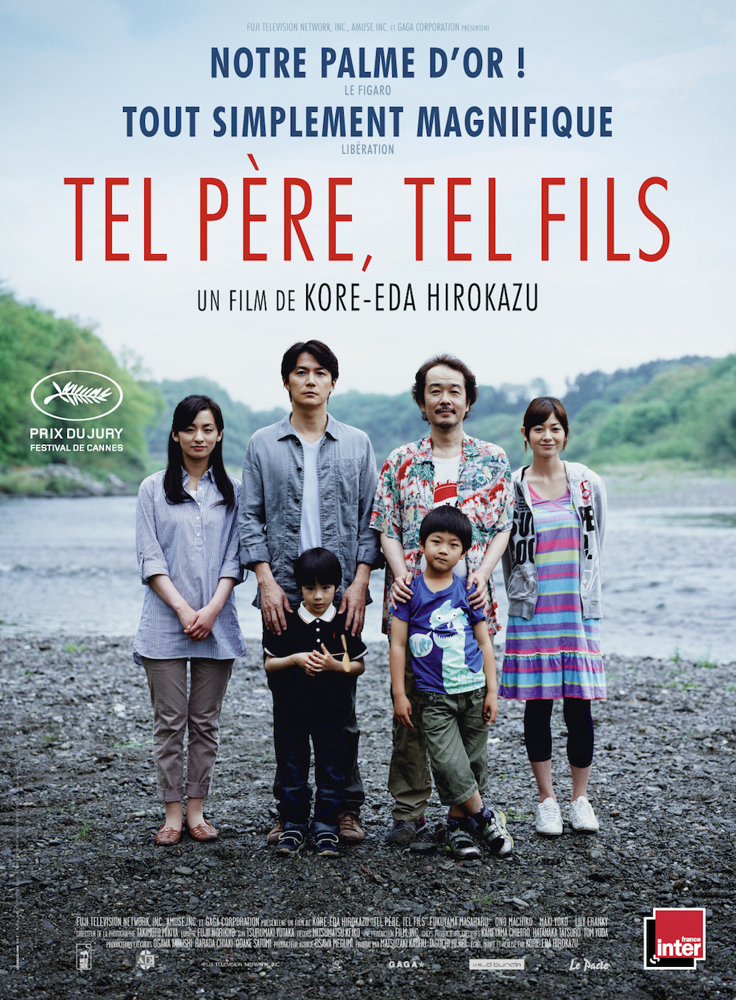
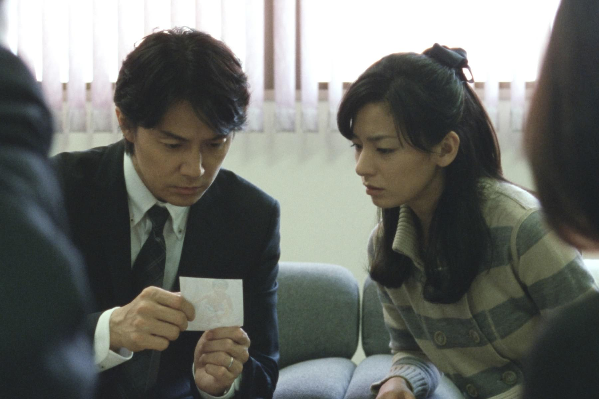
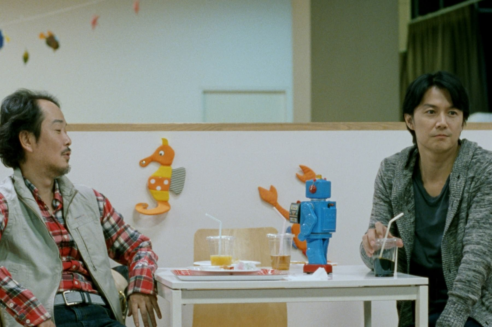

+++
type = "post"
titre = "<em>Tel père, tel fils</em>, Hirokazu Kore-eda"
title = "Tel père, tel fils, Hirokazu Kore-eda"
url = "/tel-pere-tel-fils-koreeda"
date = "2014-01-11T18:57:42"
Lastmod = "2014-01-11T18:59:34"
cover = "tel-pere-tel-fils-keita-ninomiya-horiokazu-kore-eda.jpg"
categorie = [ "À voir" ]
tag = [ "Argent", "Drame", "Enfance", "Famille", "Société" ]
createur = [ "Hirokazu Kore-eda" ]
acteur = [ "Keita Ninomiya", "Lily Franky", "Machiko Ono", "Masaharu Fukuyama", "Yoko Maki" ]
annee = [ "2013" ]
weight = 2013
pays = [ "Japon" ]
original = "Soshite Chichi ni Naru"

+++

Deux enfants échangés à la naissance dans une maternité : cette idée a déjà fait l’objet d’un film français dans les années 1980 avec le culte <a href="http://voiretmanger.fr/la-vie-est-un-long-fleuve-tranquille-chatiliez/" title="La vie est un long fleuve tranquille, Étienne Chatiliez"><em>La vie est un long fleuve tranquille</em></a> et c’est à nouveau le sujet de ce long-métrage. Japonais, <em>Tel père, tel fils</em> aborde aussi cette même idée avec un angle et un ton complètement différents. Hirokazu Kore-eda ne choisit pas l’humour et la farce, mais plutôt un drame qui peut prêter à sourire, mais dont le fond sombre ne trompe personne. S’il reprend l’opposition sociale des deux familles comme chez Étienne Chatilliez, ce n’est pas l’aspect le plus réussi de ce film qui est surtout parfaitement équilibré et qui a l’excellente idée de ne pas apporter de réponses toutes faites. Un très beau film sur la famille et la paternité, un long-métrage aussi dur par son propos qu’il peut-être doux sur la forme… ne ratez pas <em>Tel père, tel fils</em> !

Une fiche avec une photo : un petit garçon entouré de ses parents, une famille qui semble tout à fait heureuse. La caméra monte et on découvre la même famille, alignée sur trois chaises. Une voix demande au garçon qui n’a pas quitté la petite enfance depuis longtemps son identité, avant d’interroger le père sur les qualités et défauts de son enfant. Les premières images de <em>Tel père, tel fils</em> font froid dans le dos, alors même que le spectateur n’a pas d’emblée toutes les clés pour les comprendre. On découvre par la suite qu’il s’agit d’un entretien d’embauche : Ryota, le père, et Machiko, la mère, veulent placer Keita, leur jeune garçon, dans une école primaire privée et ils doivent pour cela se soumettre à un véritable entretien d’embauche. À six ans, ce gamin doit entendre son père indiquer qu’il est un peu trop calme et manque de dynamisme et il doit ensuite raconter qu’il a passé du temps avec son père à jouer au cerf-volant, ce qui n’est absolument pas vrai, mais c’est ce qu’il sait devoir dire pour être accepté. Cette première scène permet à Hirokazu Kore-eda de bien mettre en avant la violence psychologique que la société japonaise peut exercer sur cet enfant qui doit déjà se vendre et prouver qu’il est digne d’entrer dans une école. Même si ce n’est pas le sujet principal de <em>Tel père, tel fils</em>, cet aspect est passionnant et le long-métrage le met bien en avant. Ce petit garçon, admirablement interprété par un acteur nommé Keita Ninomiya, fait de la peine et il n’a jamais connu d’enfance, passant du statut de bébé à celui d’adulte miniature. Son père est intransigeant et réclame toujours le meilleur de lui et il le blesse souvent par des remarques acerbes sur son manque de volonté. Un père par ailleurs toujours absent et qui consacre sa vie au travail, y compris les week-ends : Hirokazu Kore-eda n’est pas tendre avec ce personnage. Le film dresse toutefois un tableau plus contrasté avec l’autre famille où le père est très présent et où les enfants peuvent jouer sans penser à leur carrière. 

Deux familles que tout oppose et qui se trouvent réunies bien malgré elles à cause d’une erreur de l’hôpital : on le disait en préambule,  l’idée de départ de <em>Tel père, tel fils</em> rappelle une comédie française et Hirokazu Kore-eda tombe lui aussi dans le piège de la confrontation trop systématique. Tout oppose les deux familles, à tel point que l’on a un peu de mal à y croire. Du côté des Nonomiya, on a un riche architecte, sa femme et leur fils unique qui habitent dans une tour de luxe, sans doute à Tokyo. Ils vivent dans le calme et le luxe, ils écoutent du classique, Keita apprend le piano et entre dans une école privée. Ryota, son père, n’est jamais à la maison et il passe sa vie entière au travail, y compris les dimanches. Du côté des Saiki, l’ambiance est bien différente : le père de famille est un petit commerçant qui n’aime pas vraiment travailler et préfère passer du temps avec ses trois enfants. Les revenus sont modestes, mais on vit avec une joie bruyante dans cette famille haute en couleur. Deux univers complètement différents que l’on aurait aimé un petit peu plus finement imaginé, mais <em>Tel père, tel fils</em> s’en sort malgré tout. Contre toute attente, Hirokazu Kore-eda extrait de cette cascade de clichés un film très fin et très fort sur ce qui fait une famille et plus particulièrement sur la paternité. Les deux familles ont vécu pendant six ans avec un enfant qui ne partage rien avec ses parents sur le plan biologique. Le lien du sang est-il plus fort ? Ils n’ont que six ans, mais déjà Keita et Ryusei commencent à plus ressembler à leurs parents biologiques et cela n’ira qu’en s’amplifiant. Faut-il pour autant revenir sur tous ces liens tissés pendant l’enfance ? Est-ce seulement possible ? Ces questions ne sont pas très originales, mais le cinéaste les pose avec beaucoup de force et se garde bien d’apporter de réponses. Le long-métrage se terminera avec une forme de réponse que l’on se gardera bien de dévoiler, mais <em>Tel père, tel fils</em> fait partie de ces films qui ne disent pas tout et qui n’en disent pas trop. Le scénario est à cet égard très bien écrit, en faisant patienter le spectateur plutôt qu’en lui donnant toutes les informations tout de suite. Cette finesse de l’écriture compense la comparaison un peu grossière des deux familles et on apprécie beaucoup ce film fin et doux, malgré un fond très dur. 

Loin du remake nippon de <em>La vie est un long fleuve tranquille</em> que l’on pouvait craindre, la dernière réalisation de Hirokazu Kore-eda est un très beau film sur la paternité et la famille. <em>Tel père, tel fils</em> fait éclater une cellule famille qui semblait parfaite et il pose les bonnes questions sur ce qui fait un père et un fils, en évitant de donner trop de réponses. Une très belle réussite qui permet en outre d’en apprendre plus sur l’éducation japonaise dans un milieu aisé, sans jamais tomber dans le didactisme. Récompensé par le prix du Jury à Cannes, <em>Tel père, tel fils</em> mérite vraiment d’être découvert !

