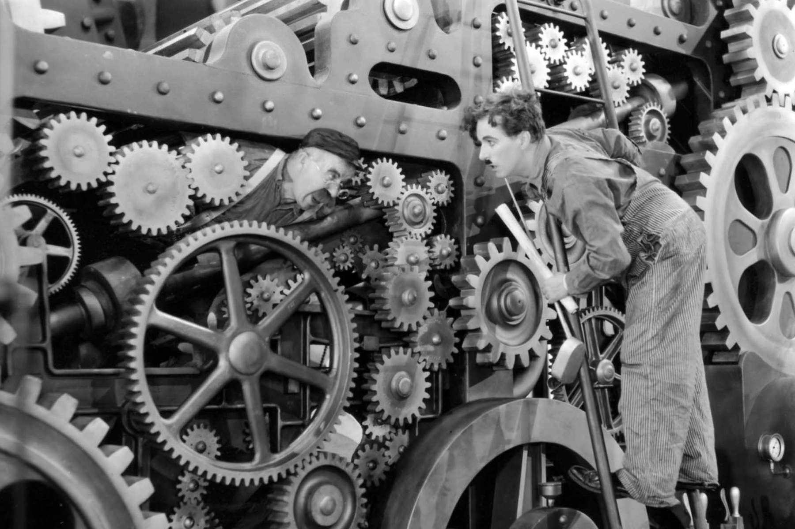
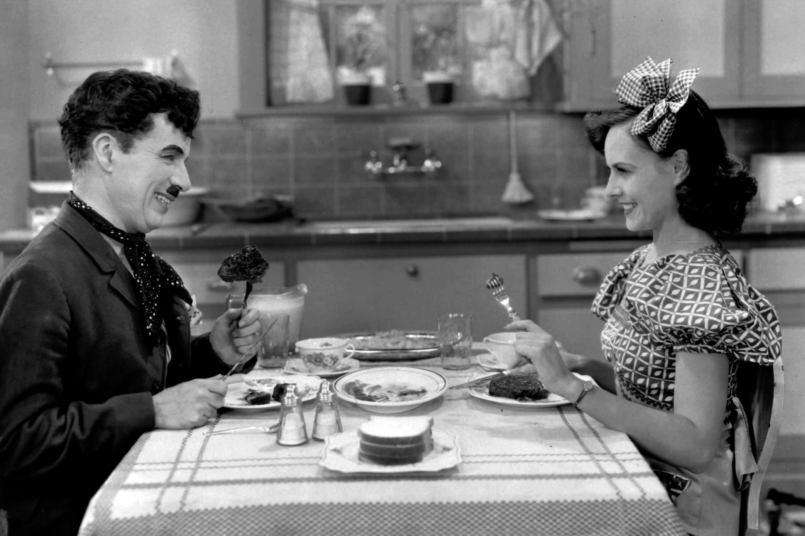

+++
type = "post"
titre = "<em>Les Temps modernes</em>, Charlie Chaplin"
title = "Les Temps modernes, Charlie Chaplin"
url = "/temps-modernes-chaplin"
date = "2013-12-30T00:01:53"
Lastmod = "2013-12-30T00:04:46"
cover = "les-temps-modernes-charlie-chaplin.jpg"
categorie = [ "À voir" ]
tag = [ "Comédie", "Culte", "Humour", "Politique", "Satire", "Société" ]
createur = [ "Charlie Chaplin" ]
acteur = [ "Charlie Chaplin", "Paulette Goddard" ]
annee = [ "1936" ]
weight = 1936
pays = [ "États-Unis" ]
original = "Modern Times"

+++

<em>Les Temps modernes</em> fait partie des films les plus célèbres dans la longue filmographie de Charlie Chaplin, des meilleurs aussi sans aucun doute. Ce film culte que tout écolier a forcément rencontré un jour dans un cours d’histoire est une œuvre de transition. Entre muet et parlant, il commence à faire entendre quelques voix, mais reste sur l’ancienne mode. L’acteur qui est aussi réalisateur et scénariste du film change aussi de ton : dernière œuvre qui met en scène son personnage de Charlot, <em>Les Temps modernes</em> est aussi le premier long-métrage ouvertement politique, même si la comédie reste au rendez-vous. C’est en tout cas un film brillant qui multiplie les scènes cultes intemporelles. Un classique dont on ne se lasse pas. 

Du film, on retient surtout la première scène. Charlie Chaplin interprète un ouvrier dans l’une des nombreuses usines des États-Unis, probablement dans les années 1920. Henri Ford a inventé le fordisme à la fin des années 1900 et il est désormais bien implanté dans le pays. L’usine qui sert d’introduction au film suit ces préceptes à la perfection : les ouvriers ne servent plus qu’à une seule tâche très précise dans une immense chaîne de production. Le héros du film passe ainsi ses journées à tourner deux boulons sur une plaque, avant qu’un voisin donne un coup de marteau sur chaque boulon et ainsi tous les jours. <em>Les Temps modernes</em> n’a besoin que de quelques plans pour montrer que ce travail est abrutissant et de fait, le héros perd très vite la tête. À trop répéter le même geste, Charlot est incapable d’arrêter après le travail et il ne maîtrise plus son corps : ses deux bras continuent de faire le même geste, sans qu’il n’y puisse rien. Dans cette scène devenue culte, Charlie Chaplin règle ses comptes avec le fordisme à outrance qui est ridiculisé par cette usine immense et supposée à la pointe du progrès. Depuis son confortable bureau où il s’occupe avec des puzzles, c’est le patron qui décide de tout et notamment des cadences, sans jamais se soucier de l’état de santé de ses ouvriers. Le rythme imposé est insoutenable, mais ce n’est jamais assez pour le patron qui veut toujours plus de productivité, quitte à expérimenter avec les machines les plus absurdes. Dans cette scène, la séquence du repas automatisé est l’une des plus impressionnantes en même temps que l’une des plus critiques contre l’idéal même de la productivité avant tout. <em>Les Temps modernes</em> touche à la farce par la même occasion, mais on retient surtout la satire tordante de cette recherche à tout prix de la meilleure productivité qui soit.

Contrairement à ce que l’on pourrait parfois croire, <em>Les Temps modernes</em> ne se résume pas à cette première et excellente scène. De fait, elle ne dure que quelques minutes, alors que le film réalisé par Charlie Chaplin compte près d’une heure trente. Suite à la dépression nerveuse de Charlot et son internement, le récit devient plus social avec l’évocation de la crise de 1929 et surtout des vagues de chômage qui ont suivi. On retrouve le héros pris au milieu d’une grève et emporté par la police en tant que communiste suite à une succession malheureuse de hasards. On le retrouve alors en prison, avant de le revoir dans la rue où il rencontre le deuxième personnage principal du film, une jeune fille qui n’a pas plus de nom que l’ouvrier interprété par le réalisateur. Entre les deux personnages nait, non pas vraiment une histoire d’amour — ou alors un amour purement platonique et plutôt paternel —, mais au moins une profonde amitié et c’est un aspect du film que l’on retient moins, mais qui prend pourtant au moins autant de place. Oubliant pour un temps l’industrialisation et la productivité, <em>Les Temps modernes</em> se fait plus tendre et filme avec une sorte de poésie de très belles scènes dans une maison qui ne tient plus debout ou dans un grand magasin. Charlie Chaplin n’oublie jamais d’être drôle — une scène tordante quand il doit chanter dans un bar et improvise sans savoir les paroles —, mais il sait aussi être touchant. En majorité muet, le film prouve à nouveau tout le savoir-faire de son auteur et principal acteur. C’est bien simple, les dialogues semblent quasiment superflus et on pourrait se passer de la majorité des cartons. Le talent des acteurs et la musique font le nécessaire : Charlie Chaplin est magistral dans ce rôle d’ouvrier, mais Paulette Goddard à ses côtés n’est pas mauvaise non plus. Quant à <a href="https://itunes.apple.com/fr/album/music-movies-modern-times/id300464581">la bande originale</a>, également composée par le réalisateur, elle est un vrai personnage et offre bien souvent tout l’éclairage nécessaire pour comprendre les scènes.  

Chef d’œuvre culte du cinéma, film culte… <em>Les Temps modernes</em> n’a pas volé sa réputation. En ouvrant son cinéma à un sujet plus politique et directement ancré dans l’actualité de son époque, Charlie Chaplin n’en a pas moins fait un film intemporel. Avec ce film, le comédien fait ses adieux autant à son personnage mythique de Charlot qu’au cinéma muet qu’il affectionnait tant, mais cela ne veut pas dire que <em>Les Temps modernes</em> est sans saveur, bien au contraire. Drôle et émouvant, touchant autant à la farce qu’à la satire sociale, le long-métrage reste toujours aussi efficace et mérite encore aujourd’hui d’être vu et revu.

<h3>Vous voulez m’aider ?<a href="#footnote_0_10808" id="identifier_0_10808" class="footnote-link footnote-identifier-link" title="&Agrave; propos de la publicit&eacute;&hellip;">1</a></h3>
<ul>
<li><a href="http://www.amazon.fr/gp/product/B005JYUWUA/ref=as_li_ss_tl?ie=UTF8&tag=leblogdenic07-21&linkCode=as2&camp=1642&creative=19458&creativeASIN=B005JYUWUA">Acheter le film en Blu-Ray sur Amazon</a></li>
<li><a href="http://www.amazon.fr/gp/product/B0017LI83C/ref=as_li_ss_tl?ie=UTF8&tag=leblogdenic07-21&linkCode=as2&camp=1642&creative=19458&creativeASIN=B0017LI83C">Acheter le film en DVD sur Amazon</a></li>
<li><a href="https://itunes.apple.com/fr/movie/les-temps-modernes/id567965197">Acheter ou louer le film sur l’iTunes Store</a></li>
</ul>

<ol class="footnotes"><li id="footnote_0_10808" class="footnote"><a href="http://voiretmanger.fr/soutien/">À propos de la publicité…</a> [<a href="#identifier_0_10808" class="footnote-link footnote-back-link">&#8617;</a>]</li></ol>
