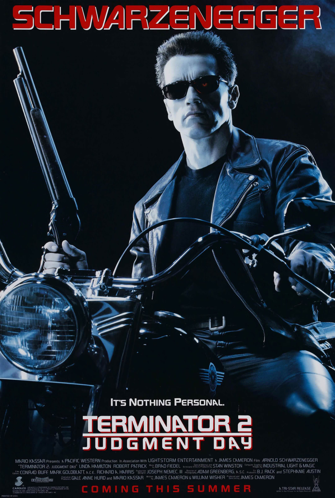
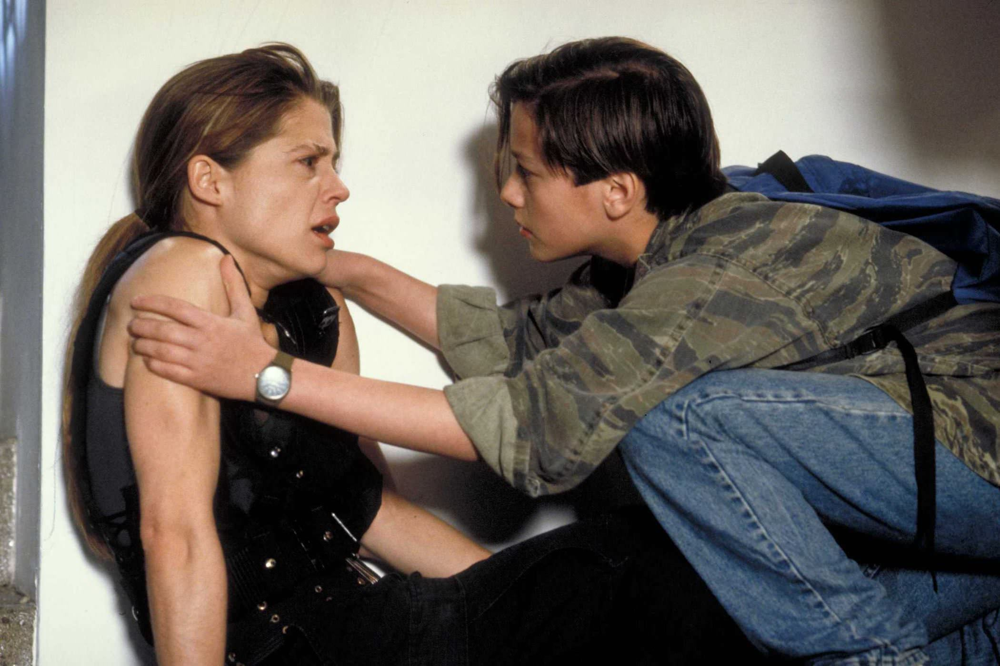
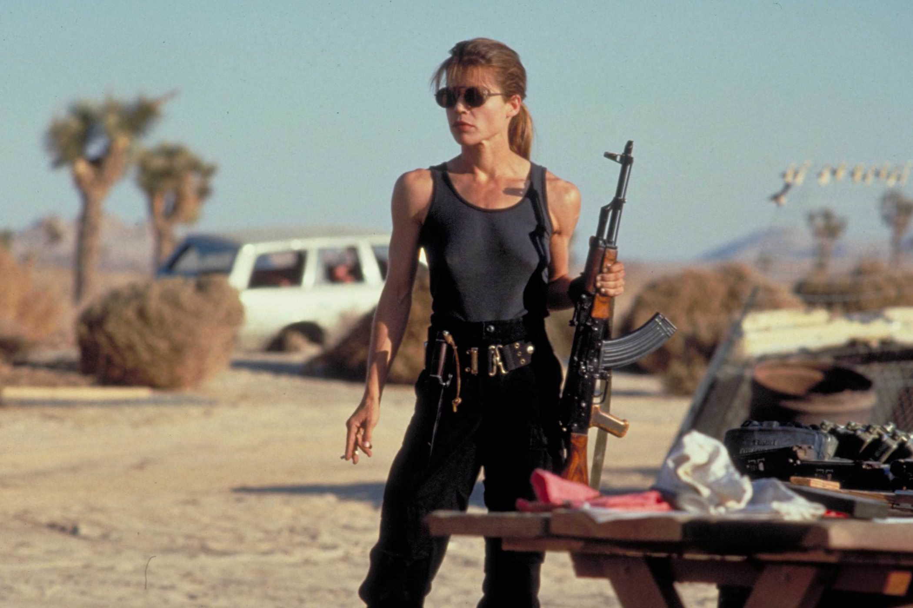

+++
type = "post"
titre = "<em>Terminator 2 : Le Jugement dernier</em>, James Cameron"
title = "Terminator 2 : Le Jugement dernier, James Cameron"
url = "/terminator-2-jugement-dernier-cameron"
date = "2014-12-22T01:34:28"
Lastmod = "2014-12-22T15:09:52"
cover = "terminator-2-jugement-dernier-arnold-schwarznegger.jpg"
categorie = [ "À voir" ]
tag = [ "Action", "Blockbuster", "Dystopie", "Famille", "Folie", "Intelligence artificielle", "Robot", "Science-Fiction", "Voyage temporel" ]
createur = [ "James Cameron" ]
acteur = [ "Arnold Schwarzenegger", "Edward Furlong", "Joe Morton", "Linda Hamilton", "Robert Patrick" ]
annee = [ "1991" ]
weight = 1991
saga = [ "Terminator" ]
pays = [ "États-Unis" ]
original = "Terminator 2: Judgment Day"

+++

Plus de cent millions de dollars : à sa sortie, <em>Terminator 2 : Le Jugement dernier</em> est le film le plus cher de l&rsquo;histoire du cinéma, rien que cela. Aujourd&rsquo;hui, cela peut paraître un peu illusoire, tant les budgets de super-productions américaines ont explosé ces dernières années, mais James Cameron a marqué les esprits avec ce long-métrage. Cela deviendra une habitude au fil des années pour le réalisateur canadien : de <a href="/titanic-cameron/" title="Titanic, James Cameron"><em>Titanic</em></a> à <a href="/avatar-james-cameron/" title="Avatar, James Cameron"><em>Avatar</em></a>, il a souvent eu l&rsquo;occasion de repousser les limites de ce que la technique permettait au cinéma. Et au début des années 1990 déjà, le deuxième volet de la saga <em>Terminator</em> va plus loin que n&rsquo;importe quel autre film à l&rsquo;époque. Utilisant des techniques qui n&rsquo;étaient pas à sa disposition pour le premier épisode, le réalisateur compose un blockbuster qui reste, encore aujourd&rsquo;hui, une référence en matière de science-fiction et d&rsquo;action. Moins simple que son prédécesseur, <em>Terminator 2 : Le Jugement dernier</em> est très bien écrit et particulièrement plaisant, les effets spéciaux n&rsquo;ont (quasiment) pas pris une ride et James Cameron a trouvé l&rsquo;équilibre parfait entre action et intrigue secondaire, entre famille et amitié improbable. Un classique, à voir et à revoir !

Dans <a href="/terminator-cameron/" title="Terminator, James Cameron"><em>Terminator</em></a>, un robot ayant une apparence humaine était envoyé en 1984 depuis le futur pour tuer Sarah Connor, la mère de John Connor qui sera celui qui, en 2029, vaincra les robots. À la fin du premier volet, le Terminator T-800 ne parvient pas à remplir sa mission et John est conçu ; face à cette défaite, les robots envoient un nouvel élément pour éviter la défaite, mais cette fois en 1995. John Connor a alors 13 ans et sa mère est enfermée dans un asile psychiatrique : personne ne croit à son histoire complètement folle, comme on peut s&rsquo;en douter. James Cameron ouvre <em>Terminator 2 : Le Jugement dernier</em> avec un bref résumé de l&rsquo;épisode précédent, avant d&rsquo;embrayer sur cette nouvelle histoire. Cette fois, les robots ont envoyé l&rsquo;un des leurs pour tuer John Connor, mais le camps des humains parvient lui aussi à envoyer de l&rsquo;aide. L&rsquo;introduction évacuée, le film commence d&rsquo;une manière extrêmement similaire au premier film : dans un cas comme dans l&rsquo;autre, des éclairs signalent l&rsquo;arrivée des deux « paquets » du futur et dans les deux cas, le premier qui arrive à tuer ou protéger la cible gagne la partie. Le déroulé est étonnamment similaire, mais ce n&rsquo;est pas un hasard : le cinéaste compte sur nos attentes et naturellement, on pense que le T-800, toujours incarné par un Arnold Schwarzenegger plus stoïque que jamais, est le méchant de cette histoire. À ses côtés, un autre arrivant du futur qui devrait être le gentil au contraire, si l&rsquo;on reprend le même scénario que dans <em>Terminator</em>… mais évidemment, ce n&rsquo;est pas aussi simple. L&rsquo;effet de surprise est de courte durée, puisque l&rsquo;on comprend vite que le deuxième arrivant est un autre robot terminateur, mais plus moderne que celui du premier film, et surtout bien plus redoutable. Ce T-1000 est conçu en métal liquide, ce qui lui permet de prendre n&rsquo;importe quelle apparence à volonté et ce qui le rend aussi beaucoup plus difficile à tuer. C&rsquo;est lui qui a été envoyé depuis le futur pour tuer John Connor, alors que le T-800 que l&rsquo;on connaissait bien est envoyé par John, pour protéger son existence. Une excellente idée, qui permet à James Cameron non seulement d&rsquo;éviter les répétitions, mais aussi d&rsquo;amplifier son histoire originale pour donner la saga des enjeux autrement plus importants. C&rsquo;est probablement en partie ce qui explique que ce deuxième opus est plus réussi que le premier.

Avec deux robots, l&rsquo;opposition binaire de <em>Terminator</em> n&rsquo;a plus lieu d&rsquo;être. L&rsquo;idée de faire venir du futur non pas un, mais deux Terminator ne sert pas simplement à créer la surprise au début du film, c&rsquo;est beaucoup plus profond que cela. James Cameron multiplie les options avec ce conflit entre les deux robots et le cinéaste ne se prive pas d&rsquo;exploiter ces pistes. <em>Terminator 2 : Le Jugement dernier</em> repose en grande partie sur ce moteur, avec un jeu sur l&rsquo;âge des robots : le T-800 est complètement dépassé face au T-1000 et l&rsquo;histoire reprend l&rsquo;idée du premier volet de l&rsquo;invincibilité, mais sur un autre mode. Cette fois, c&rsquo;est un robot qui ne parvient pas à tuer un autre robot, mais on est toujours dans l&rsquo;attente de savoir s&rsquo;il va réussir à le tuer, ou non. Et il faut reconnaître que ce nouveau robot est vraiment très bien pensé : c&rsquo;est une machine redoutable, capable d&rsquo;à peu près tout et même passer à travers une grille, qui ne craint ni les explosions, ni les balles les plus grosses. Sa malléabilité lui permet de résister à tout et il faudra beaucoup d&rsquo;efforts pour en venir à bout. Les effets spéciaux sont vraiment excellents et la technique, toute nouvelle à la sortie, du <em>morphing</em>, fait des miracles. On est très loin des effets à l&rsquo;ancienne qui ont mal vieilli du premier volet, le bon en avant est spectaculaire et ceux de <em>Terminator 2 : Le Jugement dernier</em> n&rsquo;ont pas pris une ride. La plus grosse différence entre les deux films toutefois, ce n&rsquo;est peut-être pas la technique, ni l&rsquo;introduction d&rsquo;un deuxième robot, mais plutôt que l&rsquo;action est ici parfaitement balancée par des séquences plus intimes. Contrairement aux séquences amoureuses qui peinaient à être crédibles entre Sarah Connor et Kyle Reese dans <em>Terminator</em>, les scènes de famille entre John Reese et sa mère sont beaucoup plus convaincantes. Linda Hamilton est parfaitement crédible en mère guerrière un peu folle et Edward Furlong est un sale gosse réussi. James Cameron a même réussi à humaniser le robot meurtrier de son premier film et <em>Terminator 2 : Le Jugement dernier</em> repose ainsi en partie sur l&rsquo;amitié naissante entre John et le T-800. Une amitié où se pose aussi la question de l&rsquo;intelligence artificielle : ce robot exterminateur est capable d&rsquo;apprendre par lui-même, mais devient-il humain par la même occasion ? Le film se garde bien de répondre à cette question, mais il ouvre quelques portes intéressantes…

Après un premier volet réussi, mais limité, James Cameron compose avec <em>Terminator 2 : Le Jugement dernier</em> un grand blockbuster, un classique qui conserve encore aujourd&rsquo;hui toute sa force et son intérêt. Parfaitement maîtrisé sur le plan technique, avec des effets spéciaux qui ont surpris à l&rsquo;époque par leur modernité, le film est aussi porté par un scénario plus riche et plus intéressant. En confrontant deux robots plutôt que de s&rsquo;en tenir à une opposition binaire entre les robots et les humains et en creusant plus les relations familiales et même en tirant vers l&rsquo;amitié improbable entre un robot et un homme. Archétype du blockbuster d&rsquo;action, ce film a marqué les esprits à sa sortie, mais il reste encore une œuvre culte que l&rsquo;on revoit avec beaucoup de plaisir !

<h3>Vous voulez <a href="/soutien/">m&rsquo;aider</a> ?</h3>
<ul>
<li><a href="http://www.amazon.fr/gp/product/B002V931SG/ref=as_li_ss_tl?ie=UTF8&amp;tag=leblogdenic07-21&amp;linkCode=as2&amp;camp=1642&amp;creative=19458&amp;creativeASIN=B002V931SG">Acheter le film en Blu-ray sur Amazon</a></li>
<li><a href="http://www.amazon.fr/gp/product/B00005UVCR/ref=as_li_ss_tl?ie=UTF8&amp;tag=leblogdenic07-21&amp;linkCode=as2&amp;camp=1642&amp;creative=19458&amp;creativeASIN=B00005UVCR">Acheter le film en DVD sur Amazon</a></li>
<li><a href="https://itunes.apple.com/fr/movie/terminator-2/id371527401">Acheter ou louer le film sur l&rsquo;iTunes Store</a></li>
</ul>

