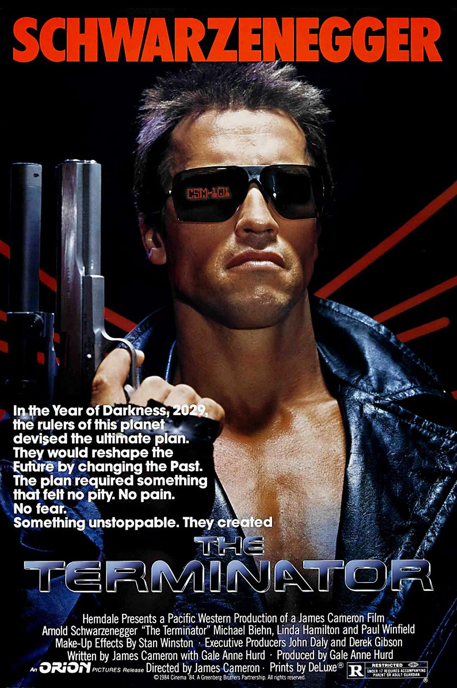

+++
type = "post"
titre = "<em>Terminator</em>, James Cameron"
title = "Terminator, James Cameron"
url = "/terminator-cameron"
date = "2014-12-20T22:48:21"
Lastmod = "2014-12-20T22:52:59"
cover = "terminator-arnold-schwarzenegger.jpg"
categorie = [ "À voir" ]
tag = [ "Action", "Blockbuster", "Dystopie", "Intelligence artificielle", "Robot", "Science-Fiction", "Voyage temporel" ]
createur = [ "James Cameron" ]
acteur = [ "Arnold Schwarzenegger", "Lance Henriksen", "Linda Hamilton", "Michael Biehn", "Paul Winfield" ]
annee = [ "1985" ]
weight = 1985
saga = [ "Terminator" ]
pays = [ "États-Unis" ]
original = "The Terminator"

+++

Techniquement, ce n&rsquo;est pas le premier film de James Cameron, puisqu&rsquo;il avait déjà signé un long-métrage quelques années avant. Mais le cinéaste canadien désavoue volontiers <em>Piranha 2 : Les Tueurs volants</em><a href="#fn-12624-1" rel="footnote">1</a> et préfère faire de <em>Terminator</em> sa première réalisation. Et pour une première fois, le réalisateur fait d&rsquo;emblée très fort, puisqu&rsquo;il sort un film culte qui est aussi le premier volet d&rsquo;<a href="/saga/terminator/">une saga</a> qui se poursuit encore aujourd&rsquo;hui. Pourtant, à l&rsquo;époque, personne ne croyait à cette histoire étrange de robot qui vient du futur empêcher une révolution qui aura lieu plusieurs années après. Le voyage temporel est un thème classique de la science-fiction, mais il est toujours l&rsquo;occasion de paradoxes complexes et on peut comprendra la méfiance des producteurs de l&rsquo;époque. <em>Terminator</em> a néanmoins connu un succès immédiat et le public et les critiques ont été séduits par ce film extrêmement moderne à l&rsquo;époque. Trente ans plus tard, certains effets ont mal vieilli et l&rsquo;intrigue semble un peu simpliste par moment, mais le premier long-métrage de James Cameron n&rsquo;a pas volé son statut de film culte.

James Cameron ouvre son film sur une scène de désolation, un champ de bataille d&rsquo;un futur dystopique où les humains se battent contre des robots. Le réalisateur, qui sait qu&rsquo;il est souvent préférable ne pas trop en dire, se contente de donner aux spectateurs le minimum d&rsquo;informations. Un <a href="http://fr.wikipedia.org/wiki/Terminator#Introduction">texte</a> donne ainsi une date (2029), un lieu (Los Angeles) et un bref exposé de la situation (une guerre nucléaire et des robots qui se mettent à tuer les hommes). C&rsquo;est tout pour le contexte, mais <em>Terminator</em> ne se déroule pas dans ce futur, mais au présent et on revient immédiatement dans le Los Angeles du milieu des années 1980. Là encore, le scénario délivre astucieusement le moins d&rsquo;informations possibles : on découvre deux hommes qui apparaissent totalement nus après quelques éclairs et on ne sait pas encore qu&rsquo;ils viennent du futur, même si le fait que l&rsquo;un d&rsquo;entre eux demande l&rsquo;année est un indice déjà. Comment souvent chez James Cameron, le film est assez limpide et l&rsquo;histoire reste très simple et, surtout dans ce premier volet, très linéaire. Mais le cinéaste n&rsquo;a pas son pareil pour mettre en scène cette histoire très simple et <em>Terminator</em> est, à cet égard, un modèle du genre. Avec des moyens somme toute limités — l&rsquo;informatique restait encore très timide au cinéma en 1984, si bien que le film n&rsquo;a été réalisé qu&rsquo;avec des techniques traditionnelles —, le cinéaste parvient à créer une tension permanente qui reste, encore aujourd&rsquo;hui, très efficace. Certains effets spéciaux ont mal vieilli : les plans avec l&rsquo;œil en moins du Terminator peinent à masquer qu&rsquo;il s&rsquo;agit d&rsquo;une marionnette bien trop lisse et tous les plans avec le robot sans la chair ont été réalisés image par image et c&rsquo;est aussi peu convaincant que dans le <a href="/robocop-verhoeven/" title="RoboCop, Paul Verhoeven"><em>RoboCop</em></a> de Paul Verhoeven qui utilisait la même technique.

Qu&rsquo;importe la technique toutefois : <em>Terminator</em> reste très convaincant par sa concision et son efficacité extrême. On l&rsquo;évoquait précédemment, James Cameron limite au maximum les informations au début, mais ce n&rsquo;est pas pour tout dévoiler par la suite. Certes, on en apprend petit à petit sur le futur terrifiant qui attend l&rsquo;humanité, mais on est frappé aujourd&rsquo;hui par le peu d&rsquo;informations qui est donné au spectateur. Les blockbusters modernes ont trop souvent tendance à tout dire, à ne laisser aucune zone d&rsquo;ombre et ainsi s&rsquo;assurer que l&rsquo;on a tout compris, quitte à prendre les spectateurs pour des idiots. À l&rsquo;inverse, le scénario ici n&rsquo;explique pas grand-chose et il se résume au fond à une course-poursuite entre un robot et deux humains en fuite. James Cameron réussit très bien la partie course-poursuite, avec des scènes assez « molles » au regard de nos standards actuels, mais qui savent malgré tout très bien entretenir le suspense et jouer avec le fait que le personnage principal est indestructible. <em>Terminator</em> nous laisse penser très souvent que le robot est détruit, mais il s&rsquo;en sort toujours, ce qui devient presque comique d&rsquo;ailleurs. Au passage, Arnold Schwarzenegger a confirmé son statut de star avec ce film, quelques années après <em>Conan le Barbare</em> qui l&rsquo;avait fait découvrir, et il faut bien dire qu&rsquo;il est parfait dans ce rôle. Quasiment muet pendant toute la durée du film, il a la carrure idéale pour le rôle et son corps bodybuildé ne semble pas réel, ce qui est exactement ce qu&rsquo;il faut. Toute la partie action est réussie, en revanche l&rsquo;histoire d&rsquo;amour entre Sarah Connor, la cible, et Kyle Reese venu la sauver, l&rsquo;est beaucoup moins. James Cameron a accepté d&rsquo;ajouter cette romance face aux pressions du studio, mais ce n&rsquo;était pas une bonne idée. Fort heureusement, l&rsquo;histoire ne vient pas parasiter <em>Terminator</em> et les acteurs choisis, Linda Hamilton et Michael Biehn, sont convaincants.

Avec <em>Terminator</em>, James Cameron pose les bases de ce qui fera son succès au cinéma. Une histoire simple et une efficacité extrême, tant dans la mise en scène, que dans la manière de raconter cette histoire. Le film paraît presque simpliste, mais c&rsquo;est justement parce qu&rsquo;il semble aussi évident, qu&rsquo;il est réussi. Et il ne faut pas oublier que certaines de ses idées, notamment sur le voyage temporel, étaient beaucoup plus surprenantes dans le cinéma populaire des années 1980. <em>Terminator</em> n&rsquo;est pas le meilleur de la saga, mais il pose d&rsquo;excellentes bases et il reste un film très plaisant à (re)voir.

<h3>Vous voulez <a href="/soutien/">m&rsquo;aider</a> ?</h3>
<ul>
<li><a href="http://www.amazon.fr/gp/product/B0089M11YK/ref=as_li_ss_tl?ie=UTF8&amp;tag=leblogdenic07-21&amp;linkCode=as2&amp;camp=1642&amp;creative=19458&amp;creativeASIN=B0089M11YK">Acheter le film en Blu-ray sur Amazon</a></li>
<li><a href="http://www.amazon.fr/gp/product/B00008NEFD/ref=as_li_ss_tl?ie=UTF8&amp;tag=leblogdenic07-21&amp;linkCode=as2&amp;camp=1642&amp;creative=19458&amp;creativeASIN=B00008NEFD">Acheter le film en DVD sur Amazon</a></li>
<li><a href="https://itunes.apple.com/fr/movie/terminator/id271991087">Acheter ou louer le film sur l&rsquo;iTunes Store</a></li>
<li><a href="http://www.netflix.com/WiMovie/1032625">Regarder le film sur Netflix</a></li>
</ul>

<ol>
<li id="fn-12624-1">
Avec un nom pareil, ce navet en puissance donnerait presque envie. Presque.&#160;<a href="#fnref-12624-1" rev="footnote">&#8617;</a>
</li>
</ol>

