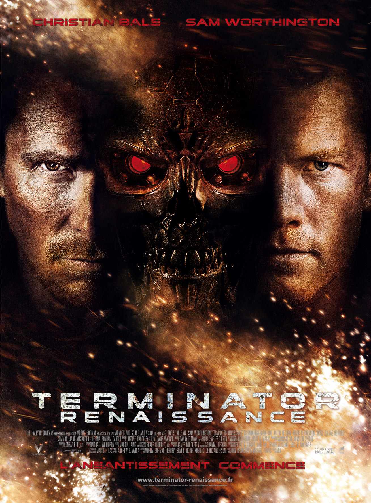
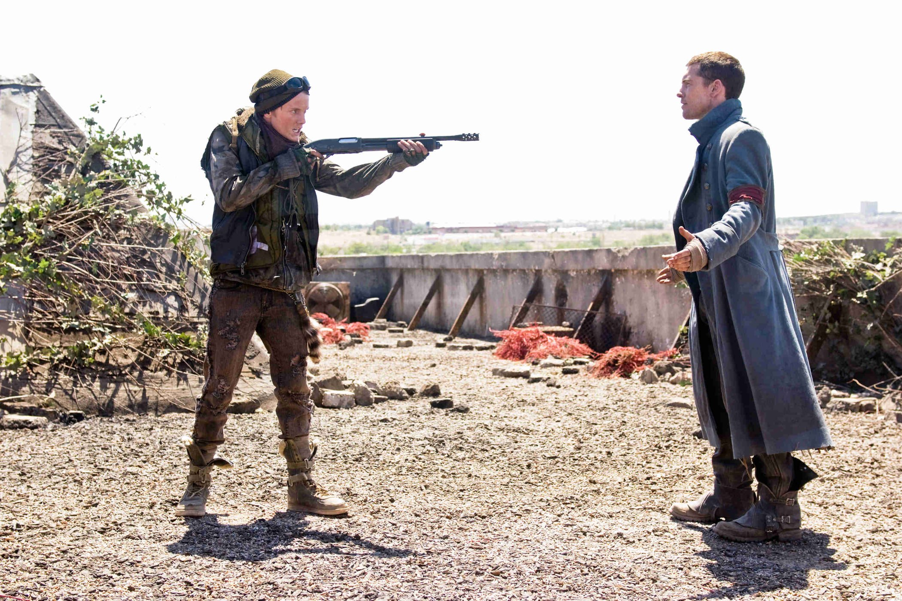
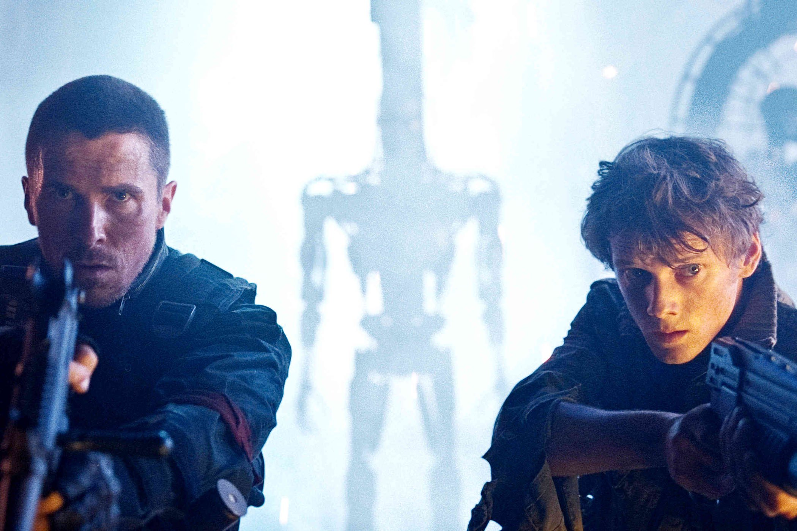

+++
type = "post"
titre = "<em>Terminator Renaissance</em>, McG"
title = "Terminator Renaissance, McG"
url = "/terminator-renaissance-mcg"
date = "2015-01-03T12:31:29"
Lastmod = "2015-01-03T12:55:47"
cover = "terminator-renaissance-mcg-christian-bale.jpg"
categorie = [ "À voir" ]
tag = [ "Action", "Apocalypse", "Blockbuster", "Dystopie", "Guerre", "Intelligence artificielle", "Robot", "Science-Fiction" ]
createur = [ "McG" ]
acteur = [ "Anton Yelchin", "Bryce Dallas Howard", "Christian Bale", "Sam Worthington" ]
annee = [ "2009" ]
weight = 2009
saga = [ "Terminator" ]
pays = [ "États-Unis" ]
original = "Terminator Salvation"

+++

Après trois films qui composent une trilogie assez cohérente, la <a href="http://voiretmanger.fr/saga/terminator/">saga <em>Terminator</em></a> change complètement d&rsquo;orientation avec <em>Terminator Renaissance</em>. Le titre déjà évite l&rsquo;affiliation avec les précédents en supprimant tout numéro, le casting a également été complètement renouvelé, des acteurs au réalisateur. Mais les changements sont plus profonds que cela : se déroulant dans le futur pour la première fois, ce long-métrage réalisé par McG est un blocbkuster beaucoup plus porté sur l&rsquo;action, comme l&rsquo;affiche le laisse bien entendre : « <em>L&rsquo;anéantissement commence</em> ». Le message est clair : il n&rsquo;est plus question de rigoler et de passer du bon temps, comme dans <a href="http://voiretmanger.fr/terminator-3-soulevement-machines-mostow/" title="Terminator 3 : le Soulèvement des Machines, Jonathan Mostow"><em>Terminator 3 : le Soulèvement des Machines</em></a>, l&rsquo;heure est à la guerre totale entre les humains et les robots. Un changement radical qui fait de <em>Terminator Renaissance</em> un épisode à part dans la saga, peut-être un peu trop d&rsquo;ailleurs…

Depuis <a href="http://voiretmanger.fr/terminator-cameron/" title="Terminator, James Cameron"><em>Terminator</em></a>, chaque épisode de la saga suivait un modèle bien défini : les robots qui ont pris le pouvoir dans le futur envoyaient un terminator pour détruire, dans le présent, la rébellion humaine avant même qu&rsquo;elle n&rsquo;existe. Dans le premier volet, il s&rsquo;agissait de tuer la mère John Connor, dans le deuxième et le troisième de tuer ce dernier, d&rsquo;abord adolescent, puis adulte. Rien de tel dans <em>Terminator Renaissance</em> et pour cause, il se déroule en 2018, neuf ans dans le futur par rapport à sa sortie en salle. McG opte ainsi pour la science-fiction, ce qui lui interdit tout retour en arrière : puisqu&rsquo;à la fin de <em>Terminator 3 : le Soulèvement des Machines</em>, Skynet était entré en action avec la guerre nucléaire que l&rsquo;on sait, son film est nécessairement post-apocalyptique. De fait, <em>Terminator Salvation</em> nous propulse dans un univers d&rsquo;apocalypse, avec des villes entièrement détruites et une image privée de la majorité de ses couleurs. L&rsquo;effet est connu, mais il faut aussi reconnaitre qu&rsquo;il est très efficace et le traitement visuel est vraiment réussi. Par ailleurs, le scénario montre bien que la résistance des humains est quasiment une cause perdue contre les machines : leur lutte n&rsquo;est pas équilibrée et d&rsquo;entrée de jeu, on comprend que les résistants ne sont pas loin de l&rsquo;extinction. Même si leur QG est un sous-marin nucléaire en constant déplacement, les troupes sur le sol sont peu nombreuses et faibles par rapport aux robots de Skynet. Au début du film, une attaque contre un centre de recherche de ce dernier se traduit par une défaite amère : John Connor est le seul survivant, tous ses hommes sont morts.

Avec cette première scène de combats, McG ne se contente pas de montrer que la lutte va être très difficile, c&rsquo;est aussi l&rsquo;occasion pour le cinéaste d&rsquo;imposer un style rapidement différent de celui de ses prédécesseurs. Tous les <em>Terminator</em> faisaient la part belle à l&rsquo;action, certes, mais jamais un film n&rsquo;avait été aussi radicalement porté sur cet aspect. <em>Terminator Renaissance</em> enchaîne les scènes pleines d&rsquo;explosion et le film est un vrai blockbuster d&rsquo;action. Techniquement, il n&rsquo;y a rien à dire, c&rsquo;est bien fait, mais il n&rsquo;empêche que le long-métrage perd un peu sa spécificité et devient un blockbuster parmi d&rsquo;autres. Et ce, d&rsquo;autant que pour les besoins de ce film, McG a été contraint de considérablement élargir le champ d&rsquo;action des robots. Dans les trois premiers films, il n&rsquo;y avait que deux robots, qui en plus avaient des formes humaines. Ici, il y a des dizaines de variantes, mais ces robots n&rsquo;ont absolument pas une forme humaine, on a des motos, des humanoïdes, des avions et encore d&rsquo;autres formes. C&rsquo;est logique dans l&rsquo;esprit de la saga — les robots de <em>Terminator Renaissance</em> précèdent ceux des autres films, ils sont donc censés être moins évolués —, mais là encore, l&rsquo;esprit de la série disparaît un peu. On pense à d&rsquo;autres films notamment à <em>Transformer</em> avec ces robots imbriqués, mais on ne pense pas vraiment au travail de James Cameron. Ce n&rsquo;est pas forcément dommage, après tout la saga peut bien évoluer dans n&rsquo;importe quelle direction, mais on sent malgré tout un malaise. Peut-être que McG aurait mieux fait de couper totalement les ponts plutôt que de tisser des <a href="https://fr.wikipedia.org/wiki/Terminator_Renaissance#R.C3.A9f.C3.A9rences_aux_films_pr.C3.A9c.C3.A9dents">dizaines de liens</a> avec les trois films précédents ? D&rsquo;un autre côté, c&rsquo;est aussi ce qui permet à la saga de rester cohérente, mais on aurait peut-être préféré un film qui se concentre moins sur l&rsquo;action et plus sur les paradoxes temporels. L&rsquo;idée que John Connor sauve son père plus jeune que lui est intéressante, mais elle n&rsquo;est qu&rsquo;à peine évoquée. Quant au personnage de Marcus Wright, il est un peu trop gratuit malheureusement.

<em>Terminator Renaissance</em> relance la saga sur de nouvelles bases, <em>a priori</em> pour une nouvelle trilogie que l&rsquo;on imagine toujours dans cet esprit de blockbuster d&rsquo;action. On en saura plus avec le prochain volet, prévu pour cette année, mais en attendant on peut saluer le travail de McG qui compose un monde post-apocalyptique certes classique, mais convaincant. Mais on peut aussi regretter que ce quatrième épisode oublie si complètement les trois premiers : la saga <em>Terminator</em> reste cohérente sur le fond, mais pas sur la forme. Dommage, même si <em>Terminator Renaissance</em> reste un explosif et spectaculaire, un bon divertissement.

<h3>Vous voulez <a href="http://voiretmanger.fr/soutien/">m&rsquo;aider</a> ?</h3>
<ul>
<li><a href="http://www.amazon.fr/gp/product/B002OL1RKK/ref=as_li_ss_tl?ie=UTF8&amp;tag=leblogdenic07-21&amp;linkCode=as2&amp;camp=1642&amp;creative=19458&amp;creativeASIN=B002OL1RKK">Acheter le film en Blu-ray sur Amazon</a></li>
<li><a href="http://www.amazon.fr/gp/product/B002OL1RKA/ref=as_li_ss_tl?ie=UTF8&amp;tag=leblogdenic07-21&amp;linkCode=as2&amp;camp=1642&amp;creative=19458&amp;creativeASIN=B002OL1RKA">Acheter le film en DVD sur Amazon</a></li>
<li><a href="https://itunes.apple.com/fr/movie/terminator-renaissance/id365693345">Acheter ou louer le film sur l&rsquo;iTunes Store</a></li>
<li><a href="http://www.netflix.com/WiMovie/70103524?trkid=13462100">Regarder le film sur Netflix</a></li>
</ul>

