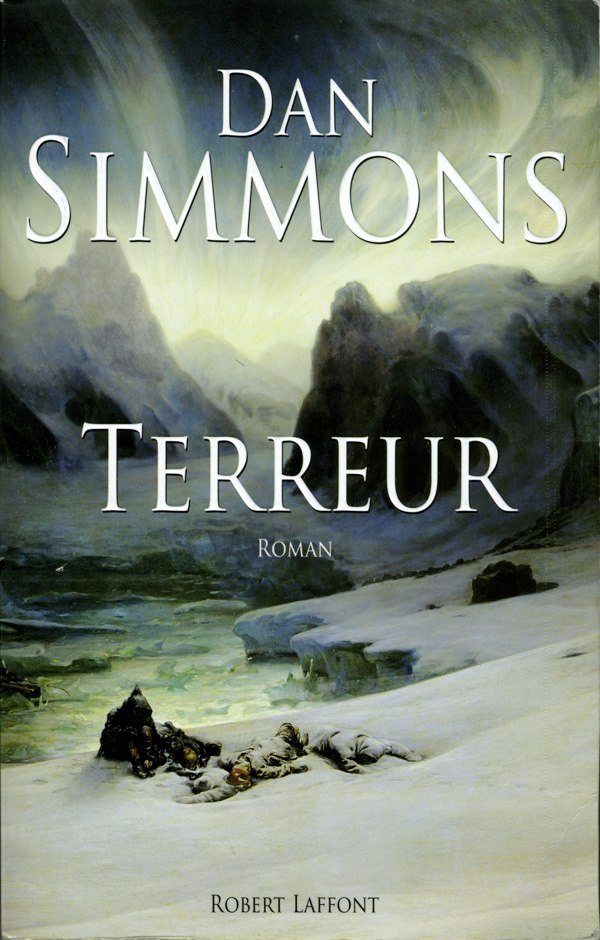
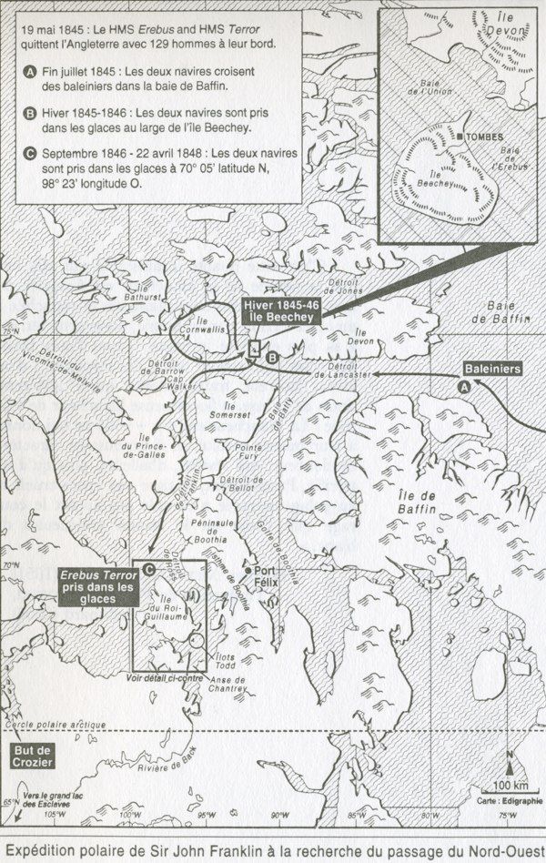
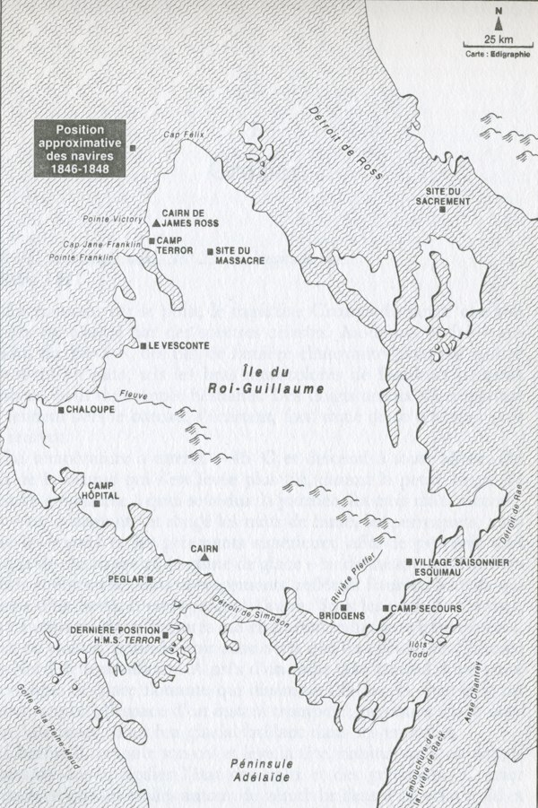
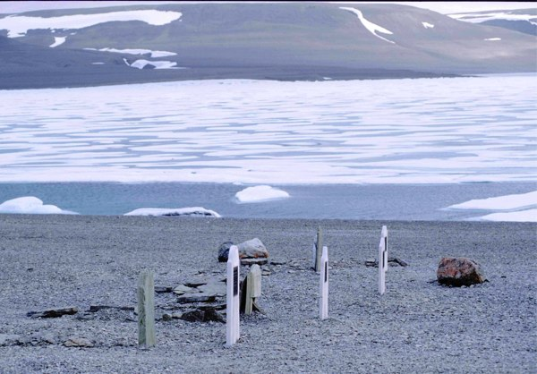
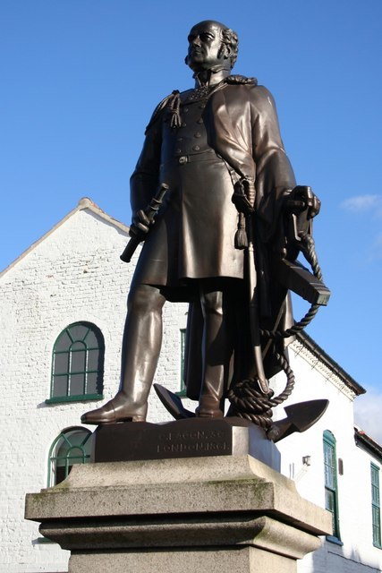

+++
type = "post"
titre = "Terreur, Dan Simmons"
title = "Terreur, Dan Simmons"
url = "/terreur-dan-simmons"
date = "2010-02-17T00:08:06"
Lastmod = "2012-04-13T14:10:59"
cover = "terror-dan-simmons.jpg"
categorie = [ "À lire" ]
tag = [ "Fantastique", "Histoire", "Horreur", "Roman" ]
createur = [ "Dan Simmons" ]
annee = [ "2007" ]
weight = 2007
pays = [ "États-Unis" ]

+++

Depuis le cycle <em>Hyperion</em>&#8211;<em>Endymion</em>, je suis un fan absolu de Dan Simmons. En deux livres, cet auteur américain est entré dans mon Panthéon personnel des auteurs de science-fiction pour avoir créé un univers original dote d&rsquo;une passionnante mythologie, le tout sur fond de Space Opera survitaminé. Mais Dan Simmons est aussi connu pour la série de l&rsquo;<em>Échiquier du mal</em> qui s&rsquo;éloigne de la SF pour constituer un thriller fantastique à l&rsquo;efficacité redoutable. Après le délirant cycle <em>Illium</em> à base de relecture SF d&rsquo;Homère, Dan Simmons change une nouvelle fois de style avec <em>Terreur</em>, un roman quasiment historique.

<em>Terreur</em> rapporte les aventures d&rsquo;une expédition polaire britannique du milieu du XIXe siècle. Cette époque correspond conjointement à une période de grande curiosité pour tout ce qui concerne notre planète (qui avait commencé des la découverte de l&rsquo;Amérique, en fait) et de progrès techniques accélérés qui permirent de plus grandes découvertes encore. Les cartes de la planète sont déjà bien remplies à l&rsquo;époque, tout du moins en ce qui concerne les côtes, mais les terres intérieures et les deux régions polaires conservent une grande part de mystère. On connait très mal les deux pôles et pourtant la connaissance de ces régions hostiles est primordiale. Comme à la fin du XVe siècle, on ne cherche pas tant de nouveaux espaces habités qu&rsquo;un passage navigable qui doit permettre de relier l&rsquo;Europe et le Pacifique ou la côte Ouest des États-Unis. Plusieurs expéditions sont ainsi mises en place par la première puissance sur les océans de l&rsquo;époque, à savoir la Grande-Bretagne. Ce sont des expéditions longues et coûteuses, tant sur le plan matériel qu&rsquo;humain, ce qui démontre bien l&rsquo;extraordinaire puissance britannique, mais aussi la formidable curiosité et naïveté des hommes de cette époque.

Le roman suit l&rsquo;expédition dite Franklin du nom de son commandant, le Sir John Franklin. Quand elle quitte le port de Greenhite le 19 mai 1845, c&rsquo;est tout simplement la plus grosse expédition polaire. Son objectif est aussi des plus ambitieux : il s&rsquo;agit de monter encore plus au Nord pour tenter de découvrir ce fameux passage. L&rsquo;<em>Erebus</em> et le <em>Terror</em>, les deux navires qui la composent, doivent naviguer là où aucun navire et même aucun Occidental n&rsquo;ont été, des zones encore blanches sur les cartes. On ne les connait pas, mais il n&rsquo;est nullement nécessaire d&rsquo;avoir fait de longues études pour savoir que ce sont des régions pour le moins hostiles à la survie de l&rsquo;espèce humaine. Hostiles, le mot est encore faible quand on sait que les températures se hissent aux alentours de 0 ° au cœur de l&rsquo;été tandis qu&rsquo;elles peuvent descendre sous les -50 ° durant l&rsquo;hiver qui dure, au mieux, 6 mois. Les deux navires ont été équipés en conséquence : s&rsquo;ils sont toujours faits de bois, leur coque a été renforcée de nombreux et épais morceaux des bois les plus solides, mais aussi de plusieurs couches de métal pour casser la glace sans risque. Mais la grande innovation provient plutôt de l&rsquo;hélice qui équipe les deux voiliers et qui est propulsée par une machine à vapeur alimentée au charbon. Ces deux éléments sont censés permettre à l&rsquo;expédition non seulement d&rsquo;avancer dans la banquise, mais aussi de chauffer les deux équipages, ce qui n&rsquo;est pas du luxe étant donné les conditions climatiques exceptionnelles. Pour que les 134 hommes et officiers se nourrissent, d&rsquo;importantes réserves ont été prévues, sous la forme de conserves essentiellement, encore une innovation du siècle. Les réserves sont prévues pour tenir en cas de retard, une situation régulière pour les expéditions polaires. Rien n&rsquo;a été laissé au hasard pour cette exceptionnelle expédition et les commandants des deux navires ont déjà navigué dans les eaux arctiques et connaissent bien leur métier. Bref, l&rsquo;expédition Franklin commence sous les meilleurs auspices.

<em>Aperçu des monts Terror et Erebus. Oui, c&rsquo;est très vide, quand même. <a href="http://www.sethwhite.org/back%20to%20the%20frozen%20volcano.htm">Crédit</a></em>

On s&rsquo;en doute, les choses ne se passent pas aussi bien que prévu. D&rsquo;ailleurs, le roman ne fait aucun mystère à ce sujet et de toute façon, le lecteur le sait peut-être déjà, l&rsquo;histoire de l&rsquo;expédition Franklin étant connue, au moins en Grande-Bretagne. Les <a href="http://fr.wikipedia.org/wiki/Expédition_Franklin">pages sur Wikipedia</a> témoignent bien de l&rsquo;engouement pour la mystérieuse disparition complète de l&rsquo;expédition. Le roman s&rsquo;ouvre sans introduction en octobre 1847, soit plus de deux ans après le départ de l&rsquo;expédition. On suit le capitaine du <em>HMS Terror</em>, Francis Crozier dans son navire labyrinthique et glacé. Simmons réussit bien, tout au long du roman, à faire ressentir ce froid extrême, même si le lecteur vivant sous des latitudes moyennes a évidemment du mal à imaginer des conditions climatiques qui lui sont totalement inconnues. À ces températures extrêmes, il n&rsquo;est pas question de laisser un bout du corps sans protection : les extrémités gèleraient en quelques minutes et l&rsquo;amputation serait alors inéluctable. Par ailleurs, le moindre contact, même bref, entre la peau et du métal ne pardonne pas : un bout de matière organique reste immanquablement collée. Dès lors, toutes les opérations simples en temps normal deviennent un véritable calvaire et nécessitent un luxe infini de précautions et préparation.

Les deux navires impériaux se sont trouvés coincés, pris au piège dans la banquise. L&rsquo;expédition était en retard et n&rsquo;a pas pu traverser la zone de banquise quand celle-ci était encore suffisamment mince pour être franchie relativement simplement par les deux voiliers et leurs hélices. Les amiraux avaient prévu cette possibilité, mais la banquise qui s&rsquo;est formée est si épaisse qu&rsquo;elle ne dégèle pas pendant l&rsquo;été qui suit et les équipages sont contraints de passer un autre hiver prisonniers des glaces. Un hiver d&rsquo;autant plus difficiles que les réserves de charbon sont épuisées et ne permettent même plus de chauffer les navires, et que le scorbut commence à faire son essai. On apprendra au cours du roman que les conserves, de mauvaise qualité, ont dégagé un poison mortel.

La situation n&rsquo;est pas très favorable, mais c&rsquo;était sans compter sur la &laquo;&nbsp;<em>chose</em>&laquo;&nbsp;. L&rsquo;expédition est en effet endeuillée à de multiples reprises par une monstrueuse bête, sorte de croisement entre un ours polaire et un géant. Un monstre qui ne craint ni le froid, ni les balles, mais qui semble se délecter de la chair humaine au point d&rsquo;en faire son repas principal. Le pire est qu&rsquo;elle semble prendre un malin plaisir à jouer avec ces hommes impuissants, en les chassant et en les attaquant par surprise à n&rsquo;importe quel moment, n&rsquo;importe où. Ainsi, outre une force surhumaine, la créature est intelligente et décime les rangs. avec une efficacité redoutable.

C&rsquo;est le seul élément fantastique de ce roman par ailleurs très sérieux sur le plan historique. La reconstitution de l&rsquo;expédition se veut réaliste et la bibliographie qui ferme le volume impressionne par sa longueur et sa richesse, ce qui est d&rsquo;ailleurs usuel avec Dan Simmons<a href="#footnote_0_2827" id="identifier_0_2827" class="footnote-link footnote-identifier-link" title="Illium, par exemple, a fait l&rsquo;objet d&rsquo;intenses recherches sur l&rsquo;Odyss&eacute;e. Il en allait de m&ecirc;me avec Keats pour Hyp&eacute;rion, d&rsquo;ailleurs.">1</a>. L&rsquo;expédition ayant passionné les foules depuis son non-retour, de nombreuses recherches ont été organisées depuis, d&rsquo;abord pour les retrouver vivants, puis pour comprendre comment ils sont morts. On sait finalement beaucoup de choses sur l&rsquo;expédition et sa fin tragique, comme le signale par exemple <a href="http://en.wikipedia.org/wiki/Franklin%27s_lost_expedition">l&rsquo;article de Wikipedia</a> sur la question. Dan Simmons a donc reconstitué à partir des éléments connus une version réaliste, comblant forcément quelques zones d&rsquo;ombre, surtout en ce qui concerne le personnage de Crozier, sacré héros par sa seule survie. Je n&rsquo;en dis pas plus sur la fin, franchement fantastique et née de l&rsquo;imagination débordante de l&rsquo;auteur.

<em>Terreur</em> n&rsquo;est pas un roman facile a ranger dans <a href="http://fr.wikipedia.org/wiki/Dan_Simmons#.C5.92uvres">l&rsquo;oeuvre de Dan Simmons</a> même si je m&rsquo;aperçois avec effroi que je la connais en fait très mal. J&rsquo;ignorais même qu&rsquo;il fut auteur de romans policiers, genre il est vrai qui me passionne moins. Comme quoi, on peut se déclarer fan absolu d&rsquo;un auteur sans en connaitre l&rsquo;intégralité…

Roman historique teinté de fantastique et d&rsquo;horreur, <em>Terreur</em> est un livre prenant qui emporte son lecteur comme seuls les romanciers anglo-saxons savent le faire<a href="#footnote_1_2827" id="identifier_1_2827" class="footnote-link footnote-identifier-link" title="Avant qu&rsquo;on me pose la question, non je ne range pas les Musso et autres Levy dans la cat&eacute;gorie des &laquo;&nbsp;romanciers&nbsp;&raquo;. Et oui, c&rsquo;est totalement gratuit, mais j&rsquo;assume.">2</a>. Le tour de force du romancier est d&rsquo;autant plus fort qu&rsquo;il ne s&rsquo;y passe finalement pas grand-chose, l&rsquo;action se réduisant à quelques brefs accès de violence et à de lentes marches de scorbutiques affamés sur la banquise. On ne s&rsquo;ennuie néanmoins jamais, même si je suis beaucoup moins fan des flashbacks, heureusement courts et peu nombreux. Le récit se concentre sur la survie d&rsquo;une poignée d&rsquo;êtres humains sans ressource sur une terre plus qu&rsquo;hostile. La sélection naturelle fait ainsi son œuvre, finalement rejointe par le cannibalisme, un impensable en temps normal qui s&rsquo;impose comme une évidence quand la survie est en jeu.

Sans vouloir faire de jeu de mots un peu puéril, le roman de Dan Simmons est terrifiant et glace d&rsquo;effroi son lecteur. L&rsquo;univers si dur que constitue la région polaire est décrit de manière progressive, les éléments s&rsquo;accumulent au fil du récit et mettent en place l&rsquo;enfer glacial dans lequel l&rsquo;homme occidental n&rsquo;a aucune chance. Pour survivre, il faut y être né et avoir appris à combattre le froid et reconnaitre les innombrables types de glace différente que la banquise présente à l&rsquo;œil averti. <em>Terreur</em> réussit bien à montrer les différences en matière de survie entre les Anglais et les populations autochtones jugées par les premiers avec condescendance, mais totalement adaptées aux conditions de vie de la région. On comprend alors que ces hommes n&rsquo;avaient de toute manière aucune chance et cela explique aussi sans doute pourquoi, aujourd&rsquo;hui encore, les deux régions polaires sont quasiment vides de toutes traces humaines.

<em>Ce qu&rsquo;il reste aujourd&rsquo;hui de l&rsquo;expédition…</em>

Il est toujours problématique d&rsquo;évoquer le style d&rsquo;un auteur à travers son traducteur. Quand on a fait soi-même de la traduction, on sait à quel point celle-ci est d&rsquo;abord affaire d&rsquo;interprétation pour ne pas dire de réécriture. Néanmoins, je pense que l&rsquo;on peut reconnaitre en Dan Simmons un très bon auteur de textes prenants que l&rsquo;on ne veut pas quitter et qu’on lit d&rsquo;une traite. Le choix de la narration interne multiple avec alternance des points de vue et des modes de narration (extraits du journal quotidien d&rsquo;un des docteurs de l&rsquo;expédition par exemple) n&rsquo;est certes pas très original, mais efficace. Elle permet notamment au lecteur d&rsquo;en savoir plus que certains personnages à des moments clés de l&rsquo;intrigue. En bref, une écriture (ou traduction au moins) fluide et efficace qui sert parfaitement le récit.

Le plus intéressant, avec <em>Terreur</em>, est sans doute son statut de relecture récente de l&rsquo;expédition Franklin. En effet, comme je l&rsquo;ai déjà souligné, l&rsquo;expédition a attiré une curiosité populaire et scientifique sans fin puisque l&rsquo;on menait encore des recherches en 2008. Très vite, l&rsquo;Angleterre victorienne se passionne pour l&rsquo;expédition et fait de Franklin un héros avec chansons populaires et statues. Après l&rsquo;échec des missions de secours officielles, on offre à quiconque ramènera tout élément nouveau une coquette somme et de multiples expéditions informelles sont lancées dans une vaste chasse au trésor. À la fin du XIXe siècle, les scientifiques s’emparent du sujet pour tenter de déterminer la cause de la mort de l&rsquo;ensemble des membres de l&rsquo;expédition. Les recherches et fouillent se succèdent et permettent finalement de découvrir une région qui eut été largement ignorée sans cette motivation. Et on a effectivement pu déterminer le faisceau de causes qui expliquent la mort de tous les membres d&rsquo;équipage, notamment grâce à des cadavres remarquablement conservés par le permafrost. On sait ainsi que la combinaison scorbut/plomb est le premier responsable, même si le cannibalisme est avéré sur une partie des cadavres au moins. Mais ces recherches scientifiques n&rsquo;ont pas nui à un mythe qui n&rsquo;a jamais faibli, tout particulièrement au Canada où Franklin est très populaire. La littérature a rapidement investi ce champ et pour n&rsquo;en citer qu&rsquo;un, Jules Vernes a exploité le sujet avec <em>Les Aventures du Capitaine Hatteras</em> dès 1866.

<em>Le capitaine Franklin, à jamais immortalisé.</em>

Le traitement réservé par l&rsquo;auteur à Crozier et Franklin est très intéressant également. L&rsquo;histoire se souvient uniquement de Franklin et s&rsquo;en souvient comme un héros — après tout, il donne son nom à toute l&rsquo;expédition —, alors qu&rsquo;elle semble n&rsquo;avoir gardé comme souvenir de Crozier qu&rsquo;un rôle subalterne dans l&rsquo;expédition. Dan Simmons inverse totalement cette distribution, faisant de ce dernier le clairvoyant qui sent très vite que l&rsquo;expédition va mal tourner et qui la prend en main quand celle-ci tourne effectivement mal. Sans dévoiler la fin, on peut quand même dire qu&rsquo;il joue un rôle essentiel dans le délire fantastique de Dan Simmons. À côté, le vieux capitaine Franklin est assez insouciant, imbu de lui-même, sûr de ses capacités alors qu&rsquo;il se plante lamentablement. Cette inversion des rôles répond aux dernières recherches sur l&rsquo;expédition et rappelle l&rsquo;évidence même, à savoir que Crozier étant d&rsquo;origine irlandaise, il ne pouvait être héroïsé dans l&rsquo;Angleterre de l&rsquo;époque.

<em>Terreur</em> n&rsquo;est certes pas une grande œuvre de littérature. Mais le dernier roman de Dan Simmons est très loin d&rsquo;avoir cette ambition. Il s&rsquo;agit avant tout d&rsquo;un divertissement, mais un divertissement qui se révèle plus malin que prévu. J&rsquo;ai été littéralement happé par l&rsquo;histoire de cette expédition et après avoir refermé le livre, j&rsquo;ai immédiatement voulu en savoir plus. Dan Simmons est quand même très doué pour broder ses délires, qu&rsquo;ils soient fantastiques ou de SF, autour de la réalité, ici une réalité historique. <em>Terreur</em> est efficace et intéressant sur le fond… que demander de plus ?

<h3>Vous voulez m&rsquo;aider ?<a href="#footnote_2_2827" id="identifier_2_2827" class="footnote-link footnote-identifier-link" title="&Agrave; propos de la publicit&eacute;&hellip;">3</a></h3>
<ul>
<li><a href="http://www.amazon.fr/gp/product/2266191179/ref=as_li_ss_tl?ie=UTF8&tag=leblogdenic07-21&linkCode=as2&camp=1642&creative=19458&creativeASIN=2266191179">Acheter le livre en version poche sur Amazon</a></li>
<li><a href="http://www.amazon.fr/gp/product/B003JH79D2/ref=as_li_ss_tl?ie=UTF8&tag=leblogdenic07-21&linkCode=as2&camp=1642&creative=19458&creativeASIN=B003JH79D2">Acheter le livre en version numérique et en anglais (version Kindle)</a></li>
<li><a href="http://itunes.apple.com/fr/book/terreur/id510780381?mt=11">Acheter le livre sur l&rsquo;iBookstore en version numérique et en français</a></li>
</ul>

<ol class="footnotes"><li id="footnote_0_2827" class="footnote"><em>Illium</em>, par exemple, a fait l&rsquo;objet d&rsquo;intenses recherches sur l&rsquo;<em>Odyssée</em>. Il en allait de même avec Keats pour <em>Hypérion</em>, d&rsquo;ailleurs. [<a href="#identifier_0_2827" class="footnote-link footnote-back-link">&#8617;</a>]</li><li id="footnote_1_2827" class="footnote">Avant qu&rsquo;on me pose la question, non je ne range pas les Musso et autres Levy dans la catégorie des &laquo;&nbsp;romanciers&nbsp;&raquo;. Et oui, c&rsquo;est totalement gratuit, mais j&rsquo;assume. [<a href="#identifier_1_2827" class="footnote-link footnote-back-link">&#8617;</a>]</li><li id="footnote_2_2827" class="footnote"><a href="http://voiretmanger.fr/a-propos/publicite/">À propos de la publicité…</a> [<a href="#identifier_2_2827" class="footnote-link footnote-back-link">&#8617;</a>]</li></ol>
