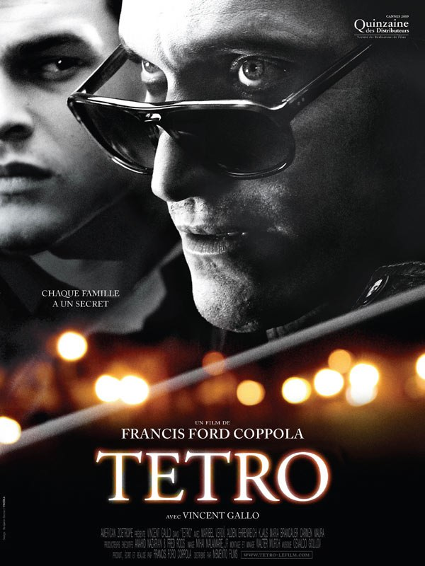
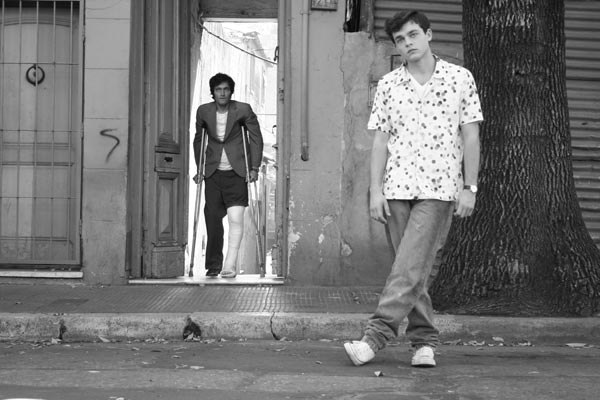
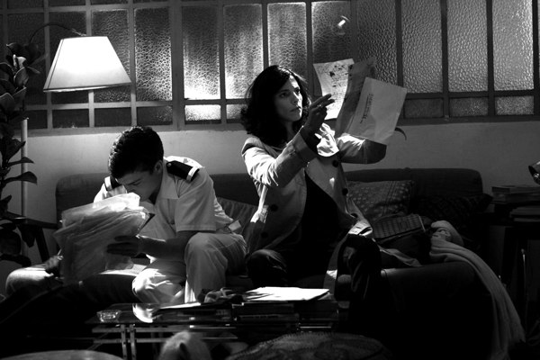
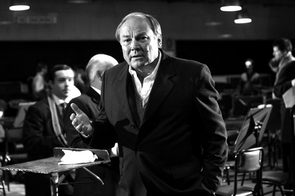

+++
type = "post"
titre = "<em>Tetro</em>, Francis Ford Coppola"
title = "Tetro, Francis Ford Coppola"
url = "/tetro-coppola"
date = "2009-12-28T09:34:38"
Lastmod = "2014-06-01T15:54:24"
cover = "tetro-francis-ford-coppola.jpg"
categorie = [ "À voir" ]
tag = [ "Amour", "Drame", "Famille" ]
createur = [ "Francis Ford Coppola" ]
acteur = [ "Alden Ehrenreich", "Klaus Maria Brandauer", "Maribel Verdú", "Vincent Gallo" ]
annee = [ "2009" ]
weight = 2009
pays = [ "États-Unis" ]

+++

Francis Ford Coppola, véritable dieu du cinéma hollywoodien à l&rsquo;origine de films tels que le <em>Parrain</em> ou l&rsquo;excellentissime <em>Apocalypse Now</em>, est donc vraiment de retour. Il y a deux ans, après dix ans de silence, il proposait bien <em>L&rsquo;homme sans âge</em>, mais ça n&rsquo;était pas une franche réussite et un film que l&rsquo;on peut rapidement oublier selon moi. Par contre, avec <em>Tetro</em>, le niveau est bien différent. Sans atteindre la force des classiques — en a-t-il seulement la prétention ? —, ce film s&rsquo;impose incontestablement pour une réussite.

L&rsquo;affiche du film ne laisse place à aucun doute : <em>Tetro</em> est un drame familial. Chaque famille recèle son lot de secrets, et la famille Tetrocini ne fait pas exception à la règle. Le père, chef d&rsquo;orchestre renommé et richissime, laisse peu de place à son fils, Angelo. Ce dernier aimerait faire plaisir à son père envahissant, mais il semble au contraire tout faire pour lui déplaire. Il faut dire qu&rsquo;il n&rsquo;a pas de chance, puisqu&rsquo;il est responsable de la mort de sa mère et donc de la femme de son père, l&rsquo;amour de sa vie on s&rsquo;en doute. Résultat, le père se venge quand le jeune Angelo ramène une copine à la maison, il lui pique et l&rsquo;épouse. Devant cet affront, Angelo finit par tout plaquer pour écrire loin de sa famille, avec laquelle il coupe tous les liens.

De ce second mariage naît Benjamin, dit Bennie. Depuis la disparition de son frère, il n&rsquo;a de cesse de retrouver celui qui est clairement son guide dans la vie, son modèle. Et les coïncidences, si tant est que cela existe, l&rsquo;amènent à bon port près de son frère, en Amérique du Sud. Autant dire que le retour du petit frère n&rsquo;excite que modérément Angelo, qui se fait désormais appeler Tetro et qui cherche surtout à oublier sa famille. On comprend peu à peu les motifs qui font qu&rsquo;il le rejette aussi brutalement, mais je préfère ne pas trop en dire et laisser un peu de suspense à ceux qui n&rsquo;ont pas encore vu le film. Disons donc simplement que, comme on pouvait s&rsquo;y attendre, les fameux secrets de famille vont voler en éclats.

Comme tous les films en noir et blanc qui sortent aujourd&rsquo;hui sans doute, <em>Tetro</em> frappe d&rsquo;abord par la forme. La dernière œuvre de Coppola père est tout simplement sublime. Le noir et blanc est traité à la manière d&rsquo;une photographie, l&rsquo;image est très contrastée et met très bien en valeur certains plans, sublimes. Filmer en noir et blanc ne suffit évidemment pas, mais <em>Tetro</em> est vraiment servi par une image très belle qui fait plaisir à voir, nonobstant le scénario.

Francis Ford Coppola profite du contraste entre le noir et blanc et la couleur. Rien de bien original, certes, sauf qu&rsquo;ici l&rsquo;usage attendu est inversé. Les quelques flashbacks qui ponctuent le film sont en couleur, alors que le présent est en noir et blanc (même si certains plans du passé sont en noir et blanc aussi&#8230;). L&rsquo;inversion est intéressante justement parce que l&rsquo;on attendrait l&rsquo;inverse. Au-delà de la couleur, le réalisateur multiplie les moyens offerts par le cinéma pour bien distinguer clairement les deux éléments. Alors que le film est en écran large, les séquences couleur sont raccourcies pour se rapprocher du carré. Ajoutons à cela des plans en général plus serrés, où l&rsquo;horizon est totalement effacé et une musique souvent envahissante et on obtient des scènes étouffantes, là où le noir et blanc respire.

Coppola fut un grand réalisateur hollywoodien, symbole d&rsquo;une époque sans doute révolue. Mais son retour, depuis deux ans, s&rsquo;est fait sans Hollywood, loin d&rsquo;Hollywood et je dirais même en opposition à Hollywood. Le choix de tourner un film en Amérique du Sud est à cet égard significatif. Mais le plus frappant reste les très faibles moyens du film. Tourné en numérique, il a manifestement fait appel à très peu de techniciens intermédiaires si l&rsquo;on en croit le générique de fin qui bat tous les records en terme de durée je pense. Manifestement, Coppola a fait le choix de filmer léger, avec également peu de vraies stars, même si <a href="http://fr.wikipedia.org/wiki/Vincent_Gallo">Vincent Gallo</a> n&rsquo;est pas un jeune premier. Dans cette catégorie, l&rsquo;acteur qui joue Bennie, Alden Ehrenreich, est vraiment très bon, tout à fait à sa place pour un rôle quand même difficile. Il rappelle fortement un Leonardo di Caprio quand Vincent Gallo campe un Pacino assez convaincant, ce qui est quand même assez étrange

Cette légèreté technique, si l&rsquo;on ose dire, n&rsquo;est pas pauvreté de la mise en scène. J&rsquo;ai déjà évoqué le noir et blanc, mais l&rsquo;on est aussi frappé de voir avec quelle aisance le réalisateur parvient à jouer sur les reflets ou les ombres pour animer ses dialogues, par exemple. Le cadre de <em>Tetro</em> est très serré au départ — un appartement, et même une seule pièce —, mais s&rsquo;élargit au fur et à mesure qu&rsquo;avance le film jusqu&rsquo;aux plans larges des montagnes de Patagonie dans sa dernière partie. Autant d&rsquo;éléments qui rappellent que l&rsquo;on n&rsquo;a pas, ici, affaire à un réalisateur débutant, mais à un maître en la matière.

Après tant d&rsquo;années et tant de chefs-d&rsquo;œuvre, le retour de Francis Ford Coppola était loin d&rsquo;être évident. Il l&rsquo;était d&rsquo;autant moins que <em>L&rsquo;homme sans âge</em>, n&rsquo;était pas vraiment un chef-d&rsquo;œuvre, justement. Mais cette fois, on sent le retour d&rsquo;un maître, et un retour qui fait plaisir à voir, étant très éloigné du piège de la redite purement commerciale. Chapeau&#8230;

Les avis sont globalement positifs, voire carrément dithyrambique comme <a href="http://www.toujoursraison.com/2009/12/tetro.html">chez Rob Gordon</a>. Avis également très positif pour <a href="http://www.leblogducinema.com/2009/12/25/critique-tetro/">le blog du cinéma</a>, un peu moins pour <a href="http://www.surlarouteducinema.com/archive/2009/12/26/tetro-de-francis-ford-coppola.html">Pascale</a> qui regrette l&rsquo;absence d&rsquo;émotions&#8230; Côté critique traditionnelle, attention événement, les <em><a href="http://www.cahiersducinema.com/">Cahiers</a></em> ont adoré et en font même la couverture du numéro en cours ! <em>Télérama</em> aime beaucoup et pour une fois <a href="http://www.telerama.fr/cinema/films/tetro,384893,critique.php">explique pourquoi</a> ; idem chez <em><a href="http://www.critikat.com/Tetro.html">Critikat</a></em>.

<h3>Vous voulez m&rsquo;aider ?<a href="#footnote_0_2296" id="identifier_0_2296" class="footnote-link footnote-identifier-link" title="&Agrave; propos de la publicit&eacute;&hellip;">1</a></h3>
<ul>
<li><a href="http://www.amazon.fr/gp/product/B003DQWQ8W/ref=as_li_ss_tl?ie=UTF8&tag=leblogdenic07-21&linkCode=as2&camp=1642&creative=19458&creativeASIN=B003DQWQ8W">Acheter le film en DVD sur Amazon</a></li>
</ul>

<ol class="footnotes"><li id="footnote_0_2296" class="footnote"><a href="http://voiretmanger.fr/a-propos/publicite/">À propos de la publicité…</a> [<a href="#identifier_0_2296" class="footnote-link footnote-back-link">&#8617;</a>]</li></ol>
