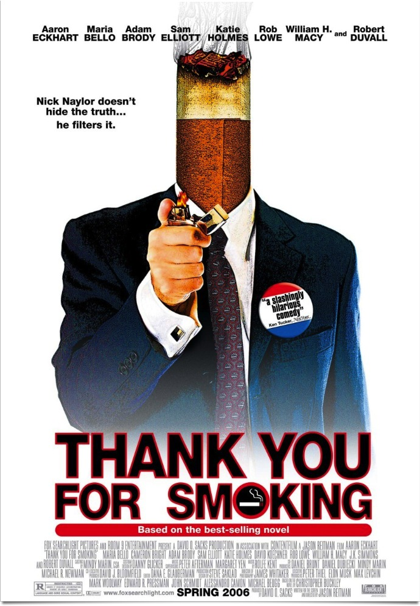
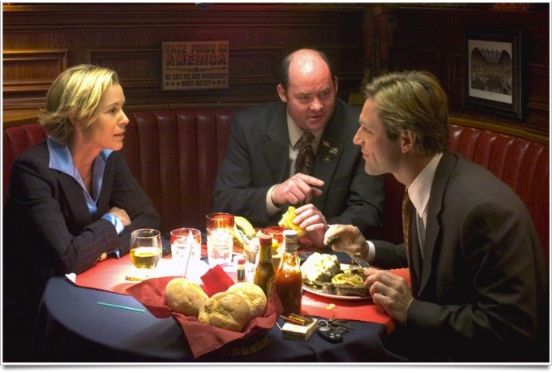

+++
titre = "Thank You For Smoking, Jason Reitman"
title = "Thank You For Smoking, Jason Reitman"
url = "/thank-you-for-smoking-reitman"
date = "2012-01-06T23:24:55"
Lastmod = "2012-02-05T23:08:15"
cover = "aaron-eckhart-thank-you-for-smoking.jpg"
categorie = [ "À voir" ]
tag = [ "Économie", "Humour", "Lobby", "Politique", "Société" ]
createur = [ "Jason Reitman" ]
acteur = [ "Aaron Eckhart" ]
annee = [ "2005" ]
weight = 2005
pays = [ "États-Unis" ]

+++

Une comédie sur un lobbyiste en faveur de l&rsquo;industrie du tabac aux États-Unis, il fallait oser. Jason Reitman choisit ce sujet pour son premier long-métrage et c&rsquo;est une idée brillante. <em>Thank You For Smoking</em> est gonflé, assez drôle même parfois, tout en dénonçant intelligemment ce que son personnage principal défend.

Nick Naylor défend l&rsquo;industrie du tabac et il est très bon pour ce job un peu ingrat. Il parvient toujours à convaincre son audience, même quand l&rsquo;hostilité naturelle est forte. Face à un garçon atteint du cancer, il réussit quand même à retourner la situation en sa faveur et à faire oublier son métier cynique. Nick vit d&rsquo;un business qui tue près d&rsquo;un demi-million de personnes aux États-Unis chaque année, mais ça ne le gêne pas. Il reprend les arguments habituels autour de la liberté et du choix et s&rsquo;amuse même à comparer ses morts avec deux autres lobbyistes qui défendent l&rsquo;un les armes, l&rsquo;autre l&rsquo;alcool. Un jour pourtant, il rencontre une charmante journaliste qui n&rsquo;hésite pas à abuser de ses charmes pour lui soutirer la vérité. Quand celle-ci paraît dans le journal, son assurance vacille…

Comme son titre ne l&rsquo;indique pas vraiment, <em>Thank You For Smoking</em> est un film anti-tabac qui dénonce le lobby représenté par son personnage principal. Il ne le fait pas directement, comme un documentaire le ferait plus volontiers, mais plutôt en montrant le ridicule de la position tenue par ce lobby. L&rsquo;académie du tabac que représente Nick est censée analyser les effets du tabac sur l&rsquo;homme, mais elle est financée uniquement par l&rsquo;industrie qui produit les cigarettes. Autant dire que son point de vue est biaisé, ce que reconnaît d&rsquo;ailleurs tout à fait le premier intéressé. Le scientifique réalise des tests absurdes et parvient à trouver des points positifs au tabac. En public, Nick vante les mérites de la cigarette et nie le plus souvent ses effets négatifs, mais dans le cadre privé des discussions avec son employeur, ou avec les deux autres lobbyistes qui sont aussi ses seuls vrais amis, le ton change. L&rsquo;industrie sait très bien qu&rsquo;elle tue, elle accepte ce fait très cyniquement et préfère détourner l&rsquo;attention. <em>Thank You For Smoking</em> montre bien comment ses avantages sont constamment mis en avant, comme l&rsquo;effet bénéfique des fermes de tabac sur l&rsquo;agriculture américaine. Tout va pour le mieux en apparence, mais le film de Jason Reitman fait vite comprendre que tout cela n&rsquo;est qu&rsquo;un écran de fumée.

Avant d&rsquo;être un film sur l&rsquo;industrie du tabac aux États-Unis, <em>Thank You For Smoking</em> est d&rsquo;abord un film sur un formidable orateur. Quoi que l&rsquo;on pense de sa position, Nick Naylor impressionne par sa maîtrise parfaite du débat. Il parvient toujours à se sortir des situations les plus difficiles et retourne systématiquement à son avantage les points que ses adversaires lui soumettent. La grande idée est de détourner l&rsquo;attention : à un sénateur qui évoque le nombre de morts liés au tabac, il répond que le cholestérol tue encore plus chaque année et que l&rsquo;on devrait ainsi placer une tête de mort sur chaque paquet de cheddar. Pour convaincre, il n&rsquo;hésite pas à aller dans le sens de l&rsquo;adversaire pour ensuite mieux le retourner : l&rsquo;exemple le plus brillant est sans doute celui de la valise d&rsquo;argent accepté par le premier cow-boy Malboro. Tout est bon pour convaincre et il faut le dire, Nick excelle dans ce domaine. Comme il le dit à un moment, il aime son métier et c&rsquo;est bien pour cela qu&rsquo;il le fait. Pour financer sa maison aussi, bien sûr, mais d&rsquo;abord parce que cela lui plait. C&rsquo;est un parti-pris assez osé de la part du scénario, mais c&rsquo;est très bien vu : <em>Thank You For Smoking</em> n&rsquo;en paraît que plus réaliste et le film parvient bien à nous convaincre.

Un tel film repose presque uniquement sur les épaules d&rsquo;un seul homme. Le personnage de Nick ne quitte jamais l&rsquo;écran et il fallait un acteur capable d&rsquo;assumer ce rôle difficile. On peut dire que Jason Reitman a trouvé la bonne personne en choisissant Aaron Eckhart, parfait dans ce rôle de lobbyiste cynique et malicieux. Le bonheur de celui qui parvient à retourner le débat en sa faveur est contagieux et participe beaucoup à faire de <em>Thank You For Smoking</em> une comédie. Le réalisateur canadien maîtrise parfaitement un humour très noir bien illustré par le titre même de son film.

Dans <em>Thank You For Smoking</em>, l&rsquo;industrie du tabac n&rsquo;est pas la seule à en prendre pour son grade. Le film n&rsquo;épargne personne, autant les pro que les anti-tabac et il est une critique du système de lobby, un système américain par excellence. Jason Reitman réussit le pari difficile de faire un film drôle et critique à la fois, une belle réussite à (re)voir…

<h3>Vous voulez m&rsquo;aider ?<a href="#footnote_0_5468" id="identifier_0_5468" class="footnote-link footnote-identifier-link" title="&Agrave; propos de la publicit&eacute;&hellip;">1</a></h3>
<ul>
<li><a href="http://www.amazon.fr/gp/product/B004CG2XUS/ref=as_li_ss_tl?ie=UTF8&#038;tag=leblogdenic07-21&#038;linkCode=as2&#038;camp=1642&#038;creative=19458&#038;creativeASIN=B004CG2XUS">Acheter le film en DVD sur Amazon</a></li>
</ul>

<ol class="footnotes"><li id="footnote_0_5468" class="footnote"><a href="http://voiretmanger.fr/a-propos/publicite/">À propos de la publicité…</a> [<a href="#identifier_0_5468" class="footnote-link footnote-back-link">&#8617;</a>]</li></ol>
