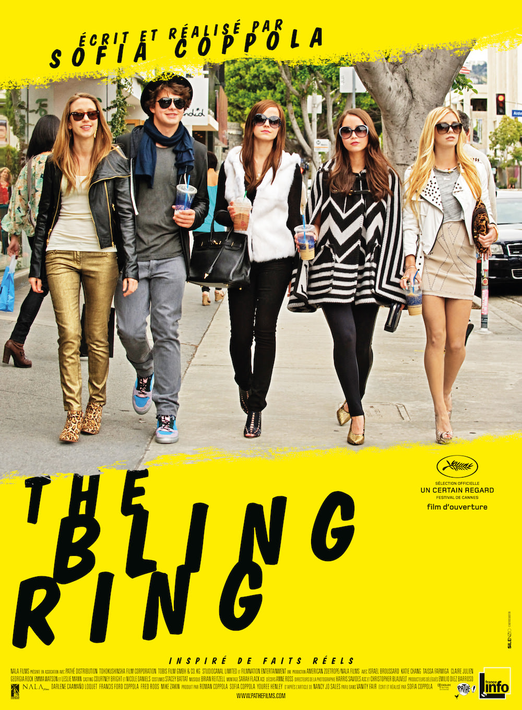

+++
type = "post"
titre = "<em>The Bling Ring</em>, Sofia Coppola"
title = "The Bling Ring, Sofia Coppola"
url = "/the-bling-ring-coppola"
date = "2013-06-14T23:03:09"
Lastmod = "2013-06-14T23:07:14"
cover = "the-bling-ring-coppola-israel-broussard-emma-watson.jpg"
categorie = [ "À voir" ]
tag = [ "Adolescence", "Argent", "Comédie dramatique", "Histoire vraie", "Hollywood", "Société", "Star" ]
createur = [ "Sofia Coppola" ]
acteur = [ "Claire Julien", "Emma Watson", "Israel Broussard", "Katie Chang", "Taissa Farmiga" ]
annee = [ "2013" ]
weight = 2013
pays = [ "États-Unis" ]

+++

Pour son cinquième film, Sofia Coppola s’est inspiré d’un fait divers passionnant. À la fin des années 2000, une bande de jeunes très propres sur eux et en apparence parfaitement innocents ont réussi à voler pour environ trois millions uniquement dans les villas des stars hollywoodiennes. Une histoire fascinante pour un sujet de film passionnant : on comprend aisément pourquoi la réalisatrice s’y est intéressée. <em>The Bling Ring</em> suit ainsi les pas de cinq lycéens qui commencent par entrer dans des maisons vides, pour voir, mais qui prennent vite goût à un mode de vie qui les fait rêver. Une escalade du vol dans un film qui s’éloigne du vide formel de <a href="http://voiretmanger.fr/somewhere-coppola/" title="Somewhere, Sofia Coppola"><em>Somewhere</em></a>, le précédent de Sofia Coppola. Le sujet était si intéressant que le résultat déçoit un peu, mais <em>The Bling Ring</em> reste un long-métrage fascinant, à découvrir. 

Marc, adolescent assez banal et donc mal dans sa peau, arrive dans un nouveau lycée. Raillé par tous ses nouveaux camarades, peut-être parce qu’il est « différent » (comprendre : gay), il est par contre immédiatement adopté par Rebecca. Ils sont tous deux issus de familles aisées, mais ils sont tous les deux en difficulté scolaire et sont bien partis pour rater à nouveau leur année. <em>The Bling Ring</em> part de ce couple pour constituer ensuite « la bande » : en plus de Marc et Rebecca, Nicki, Sam et Chloe forment une équipée qui va faire du vol dans les belles villas de Los Angeles sa spécialité. Au départ, il n’y a que les deux jeunes et tout se fait un peu par hasard : Sofia Coppola montre bien comment ils vont tester l’énorme maison d’une vague connaissance qu’ils savent loin de la ville. Grisés par leur réussite, ils s’en prennent ensuite aux stars profitant du fait que l’on peut facilement connaître leur agenda, autant que trouver leur adresse postale. Ces jeunes ne sont en rien des voleurs expérimentés, ils sont même plutôt du genre à multiplier les gaffes, laissant leurs empreintes partout et oubliant les multiples caméras de sécurité. Pourtant, et c’est sans doute le plus fascinant dans <em>The Bling Ring</em>, ils ne sont jamais inquiétés par les autorités pendant une année entière. Alors qu’ils vont plusieurs fois par semaine faire leur shopping, comme ils le disent eux-mêmes, dans les villas des stars, il faut plus d’un an pour qu’ils soient enfin appréhendés par la police de Los Angeles. 

Sofia Coppola se contente de le filmer sans en dire assez peut-être, mais cette vision de la société est vraiment fascinante. À la fois parce que des jeunes de 16 ou 17 ans peuvent chercher à tout prix à ressembler aux stars qu’ils admirent, mais une admiration cynique qui ne les empêche pas de voler, sans arrière-pensée. Mais aussi parce que les parents ne se rendent compte de rien, pas plus que l’école alors même que les joints et puis la poudreuse circulent allègrement et qu’ils ne vont jamais vraiment en cours. Les sujets abordés par <em>The Bling Ring</em> sont très intéressants et la réalisatrice les intègre bien à l’ensemble, mais le film n’est pas aussi passionnant qu’escompté et à ce titre, il n’est pas tout à fait réussi. Est-ce parce qu’on sait dès les premières minutes que leur histoire va mal se terminer (étonnante idée de commencer tout de suite par les témoignages effectués devant la presse ou un puy sur ce qui s’est passé) ? Toujours est-il que le sort des personnages de <em>The Bling Ring</em> ne fait aucun doute et on a un peu plus de mal à s’y intéresser. On aurait aimé en savoir plus sur leurs motivations, même si Sofia Coppola les esquisse naturellement : les vols ne sont jamais effectués pour des raisons financières, ces jeunes n’ont aucun problème d’argent et ils revendent les sacs de grandes marques pour une poignée de pain. Non, ce n’est pas l’argent qu’ils viennent chercher, mais le frisson de l’interdit et en même temps peut-être ce sentiment que tout leur est dû et qu’ils ont bien le droit de se servir. Le film reste trop discret sur ces points et a parfois tendance à ne ressembler qu’à un objet pop joli et plutôt bien réalisé, mais assez creux. Les jeunes acteurs sont plutôt bons : Israel Broussard incarne le garçon de la bande et il est convaincant, tandis que la performance d’Emma Watson, attendue au tournant depuis la fin de la <a href="http://voiretmanger.fr/saga/harry-potter/">saga <em>Harry Potter</em></a>, est correcte ; sauf qu’on ne ressent jamais vraiment l’ennui et le vide qui les caractérisent. On les devine, notamment parce que Sofia Coppola est derrière la caméra, mais <em>The Bling Ring</em> a un peu tendance à passer à côté.

<em>The Bling Ring</em> dispose d’un sujet vraiment excellent et Sofia Coppola en tire un bon film, à défaut d’un grand film. L’histoire passionnante se suffit largement à elle-même, les acteurs sont convaincants et la <a href="http://www.amazon.fr/gp/product/B00CRL587K/ref=as_li_ss_tl?ie=UTF8&#038;tag=leblogdenic07-21&#038;linkCode=as2&#038;camp=1642&#038;creative=19458&#038;creativeASIN=B00CRL587K">bande originale</a> de qualité, comme toujours. L’ensemble est plutôt réussi et on passe un bon moment, d’autant que le long-métrage est assez bref, mais il est aussi un petit peu frustrant. Sofia Coppola donne par moment le sentiment d’être passée à côté de son sujet, mais ne boudons pas le film pour autant : <em>The Bling Ring</em> mérite d’être vu, ne serait-ce que pour son sujet !

