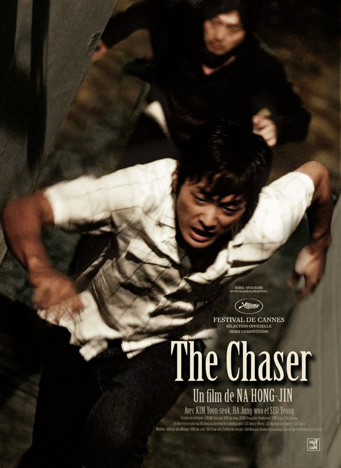
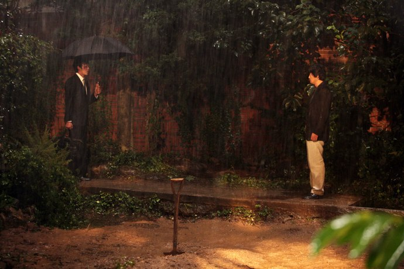

+++
titre = "The Chaser, Hong-jin Na"
title = "The Chaser, Hong-jin Na"
url = "/the-chaser-hong-jin-na"
date = "2010-06-20T17:35:44"
Lastmod = "2010-06-20T17:46:20"
cover = "the-chaser.jpg"
categorie = [ "À voir" ]
tag = [ "Corruption", "Drame", "Politique", "Thriller" ]
createur = [ "Hong-jin Na" ]
annee = [ "2009" ]
weight = 2009
pays = [ "Corée du Sud" ]

+++

<em>The Chaser</em> est le premier film de Hong-jin Na, réalisateur sud-coréen que l&rsquo;on suivra sans doute de près. Son premier film est un thriller noir assez classique dans la forme, mais impressionnant de maîtrise et de force. Un film violent qui dénonce aussi les manquements d&rsquo;une police incapable. Efficace.

Joong-ho est un ancien flic qui a quitté son travail pour devenir proxénète. Le film n&rsquo;explicite jamais les raisons de son départ, mais on suppose que la fréquentation de ce milieu lui a donné des idées, en même temps que des moyens de résister à ses anciens collègues. Comme en France, la prostitution ne se fait pas dans des lieux dédiés en Corée du Sud, mais chez les clients. Joong-ho envoie ses filles aux clients qui les &laquo;&nbsp;commandent&nbsp;&raquo; par téléphone, un peu comme on commanderait une pizza. Les affaires semblent bien tourner, mais le film s&rsquo;ouvre sur ses plaintes face à la disparition de deux filles que Joong-ho soupçonne de s&rsquo;être enfuies. Sauf si un de ses concurrents les a récupérées à son compte. Pour en avoir le cœur net, il suit une de ses filles qui disparaît tout aussi mystérieusement.

<em>The Chaser</em> est un film policier avec deux enquêtes parallèles qui s&rsquo;entrecroisent régulièrement, celle de Joong-ho et celle, officielle, de la police sud-coréenne. Il s&rsquo;agit de retrouver un meurtrier qui s&rsquo;avère être meurtrier en série avec au moins une douzaine de crimes à son actif. Mais ce film est plus complexe qu&rsquo;une simple enquête : le meurtrier ne fait aucun doute, l&rsquo;enjeu n&rsquo;est donc absolument pas son identité, dévoilée très rapidement. Tout l&rsquo;enjeu est plutôt de réussir à trouver des preuves contre lui : arrêté une première fois par la police à qui il avoue sans problème tuer des filles à l&rsquo;aide d&rsquo;un ciseau et d&rsquo;un marteau, il est finalement relâché faute de preuves et faute de mandats d&rsquo;arrêt. Le film s&rsquo;enrichit également d&rsquo;une histoire plus personnelle entre le héros et la dernière victime du meurtrier. Joong-ho récupère la fille de cette victime et même si le film ne dit rien explicitement, on comprend sans peine qu&rsquo;il en est sans doute le père. Dès lors, sa quête sera de retrouver la mère avant qu&rsquo;il ne soit trop tard.

Dénoncer les manquements de la police jugée froide et inefficace au profit d&rsquo;une justice personnelle souvent bien plus efficace parce que plus motivée, voilà un thème des plus classiques au cinéma. Les références ne manquent pas, à toutes les époques autant que pour toutes les nationalités. À cet égard, <em>The Chaser</em> n&rsquo;est pas très original et se contente d&rsquo;exploiter un thème déjà connu. Il le fait néanmoins très bien, avec une grande force et se révèle très efficace dans la dénonciation. La police y est présentée comme minée par des services concurrents, constamment menacée par des supérieurs très politisés et peu compétents. En même temps, cette même police peut chercher des preuves et aller jusqu&rsquo;à les fabriquer si elle n&rsquo;en trouve pas. C&rsquo;est aussi une police qui ferme les yeux sur les bastonnades en règle de suspects et une police qui entretient des relations pour le moins douteuses avec le monde du proxénétisme. Sa corruption n&rsquo;est pas vraiment le sujet du film, mais elle est constamment présente, implicitement. La critique de la police est dédoublée de manière très intelligente par une affaire médiatico-politique qui pourrait se dérouler de la même manière dans n&rsquo;importe quel autre pays. Lors d&rsquo;une visite officielle, le premier ministre sud-coréen se prend une poignée de merde en plein visage. La police et les médias se concentrent alors tous sur cette affaire, jugée beaucoup plus importante que le serial-killer un peu fou. Cette pointe de critique sociale est plutôt bien vue et apporte un peu de fraicheur au film.

Hong-jin Na respecte pour son premier film tous les codes du genre. L&rsquo;essentiel de <em>The Chaser</em> se déroule ainsi dans la nuit noire, sous une pluie battante. Certaines scènes, notamment de combats vers la fin, sont ainsi quasiment filmées dans le noir. Le résultat est plutôt réussi, la tension atteint souvent des sommets grâce à cette mise en scène que l&rsquo;on peut qualifier de baroque par sa surabondance d&rsquo;effets et de noirceur. C&rsquo;est aussi un film violent et gore (il n&rsquo;a pas été interdit en salles aux moins de 12 ans pour rien), mais qui laisse intelligemment la violence hors-champ la plupart du temps. La scène d&rsquo;interrogatoire musclé dans le commissariat est un bel exemple de cette violence sortie de l&rsquo;écran et d&rsquo;autant plus inquiétante parce que hors champs. Comme dans <em>Old Boy</em>, <em>The Chaser</em> devient parfois gore avec des scènes très sanglantes, en particulier sur le dernier meurtre au marteau. On peut d&rsquo;ailleurs regretter la multiplication des effets de ralentis qui soulignent plus que de raison la douleur du héros, alors que le film était resté plutôt sobre de ce côté jusque-là.

<em>The Chaser</em> est une belle réussite, surtout pour un premier film. Hong-jin Na propose un film très noir, violent et désabusé qui en dit long sur la société sud-coréenne. Dénonciation classique, mais efficace, des manquements de la police, <em>The Chaser</em> ajoute également une dimension politique et médiatique bienvenue, même si le film se concentre sur le proxénète et le meurtrier, formant comme un duel à mort entre les deux hommes. Si vous aimez les films noirs et que la violence ne vous fait pas peur, voilà un film à ne pas rater.

<a href="http://www.filmosphere.com/2009/03/critique-the-chaser-2008/">Nicolas</a> a également beaucoup aimé <em>The Chaser</em>. <a href="http://www.critikat.com/The-Chaser.html">Critikat</a> tempère en dénonçant une fin qui &laquo;&nbsp;flirte avec la démagogie&nbsp;&raquo; ce que je trouve un peu exagéré même si, en effet, la fin se fait un peu lourde sur les effets.

