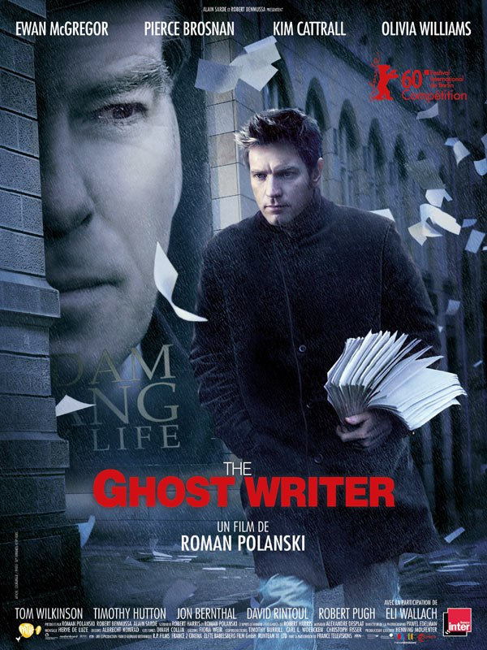
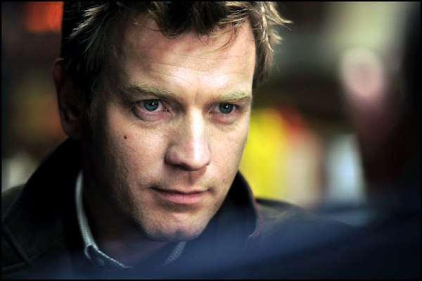
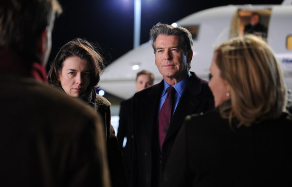
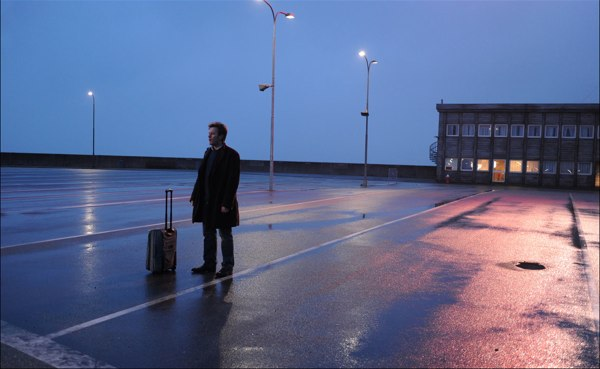
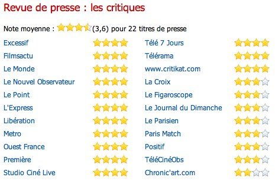

+++
type = "post"
titre = "The Ghost Writer, Roman Polanski"
title = "The Ghost Writer, Roman Polanski"
url = "/the-ghost-writer-polanski"
date = "2010-03-07T01:18:27"
Lastmod = "2012-02-07T12:02:51"
cover = "the-ghost-writer-polanski.jpg"
categorie = [ "À voir" ]
tag = [ "Blockbuster", "Espionnage", "Politique", "Thriller" ]
createur = [ "Roman Polanski" ]
acteur = [ "Ewan McGregor" ]
annee = [ "2010" ]
weight = 2010
pays = [ "France" ]

+++

On a beaucoup parlé de Roman Polanski ces derniers temps, pas forcément pour les bonnes raisons. Avec <em>The Ghost Writer</em>, il prouve qu&rsquo;il reste d&rsquo;abord un excellent cinéaste. Son dernier film est un thriller politique au scénario certes assez classique, mais extrêmement efficace tout en étant subtil. Une vraie réussite.

<a href="http://www.allocine.fr/film/fichefilm_gen_cfilm=132406.html">

</a>

<strong>Si vous ne voulez pas savoir que le gentil est en fait un agent triple à la solde de Ben-Laden, mieux vaut arrêter votre lecture ici. Allez voir le film, et revenez après lire ce qui suit.</strong>

Adam Lang, homme politique britannique de premier rang, écrit ses mémoires. Ou plutôt, les fait écrire puisqu&rsquo;il emploie un nègre, un &laquo;&nbsp;<em>ghost writer</em>&nbsp;&raquo; en anglais, pour les rédiger à sa place. Après la disparition mystérieuse de son premier nègre, il lui cherche un remplaçant et ce dernier que le film suit. Ce nègre sans nom hésite, il ne connaît rien à la politique et il n&rsquo;a pas tellement envie de succéder à un mort, mais l&rsquo;énorme chèque de 250 000 dollars qui est promis à vite fait de couper court à toutes ses hésitations. Le voilà qui s&rsquo;envole pour les États-Unis et l&rsquo;île qui abrite la maison et le QG de Lang. Pas bête, notre héros sent vite l&rsquo;entourloupe et le constat s&rsquo;impose rapidement : son prédécesseur s&rsquo;est peut-être noyé, mais on l&rsquo;a aidé. Comprenant, un peu tardivement, qu&rsquo;il s&rsquo;est embarqué dans une histoire bien plus complexe qu&rsquo;en apparence, il remonte une piste suivie par l&rsquo;écrivain fantôme au sens premier du terme et découvre une intrigue géopolitique qui mêle fabricants d&rsquo;armes, guerre en Afghanistan et CIA le tout sur fond de scandales policitico médiatiques.

L&rsquo;intrigue de <em>The Ghost Writer</em> n&rsquo;est pas vraiment originale et rappelle les nombreux romans ou films d&rsquo;espionnage qui ont fleuri pendant ou après la guerre froide. Certes, le héros n&rsquo;est pas un espion, juste un écriveur efficace, mais pas assez talentueux pour mettre son propre nom sur des bestsellers. Il se révèle néanmoins au cours du film très efficace en espion en herbe perspicace et efficace pour se sortir d&rsquo;affaire. Face à lui, un politicien controversé qui fut en haut des sondages, qui est maintenant critiqué par tous et d&rsquo;abord par ses &laquo;&nbsp;amis&nbsp;&raquo; en politique. L&rsquo;affaire est grave, on l&rsquo;accuse d&rsquo;avoir soutenu des actes de torture au Moyen-Orient et c&rsquo;est le tribunal de La Haye qui pourrait l&rsquo;arrêter. Les deux hommes ont comme point commun d&rsquo;être totalement dépassés par des enjeux bien plus importants et qu&rsquo;ils ne saisissent pas totalement. Ce mécanisme est toujours très efficace dans les thrillers d&rsquo;espionnage et il fonctionne ici à plein.

La révélation finale n&rsquo;est pas tellement ce qui intéresse Roman Polanski. Alors que le film dure plus de deux heures, la fin est expédiée en une poignée de secondes, et c&rsquo;est très intelligent de sa part. L&rsquo;essentiel est ailleurs, avant : <em>The Ghost Writer</em> est d&rsquo;abord un film d&rsquo;ambiance et de mystère. Comme dans le récent <em><a href="/2010/02/26/shutter-island-scorsese/">Shutter Island</a></em>, l&rsquo;insularité joue ici aussi un rôle essentiel et l&rsquo;île joue un rôle à part entière. Ici, elle instaure un climat de méfiance, d&rsquo;instabilité permanente sur lequel se construit tout le film. Instabilité qui est d&rsquo;abord celle du climat, très humide, où la pluie peut brusquement s&rsquo;abattre, où l&rsquo;orage arrive sans crier gare. Je crois que l&rsquo;on ne voit à aucun moment le soleil dans le film, les scènes se déroulent toutes de nuit, où sous un ciel menaçant voire pluvieux. Comme si le climat reflétait le trouble qui envahit le personnage principal dès sa première lecture du manuscrit laissé par son prédécesseur. Tout semble faux, à l&rsquo;égard de cette maison énorme, froide et bizarrement angulaire au sein d&rsquo;un paysage de dunes.

L&rsquo;absence quasiment permanente du principal intéressé, à savoir de l&rsquo;homme politique, contribue à ce climat particulier. Polanski a la bonne idée de ne lui attribuer qu&rsquo;un petit rôle, ne le faisant apparaître que rarement à l&rsquo;écran même s&rsquo;il est toujours question de lui, et même s&rsquo;il est le plus souvent visible par la télévision. Même présent, il est toujours absent, répond à côté de la plaque et semble totalement à côté de la plaque. Comme on l&rsquo;apprend finalement, il est à côté de la plaque depuis le tout début de sa carrière politique, il se fait manipuler par la CIA et par le biais de sa femme. Cette idée n&rsquo;a sans doute rien de très original, mais elle est ici bien menée. De manière générale, l&rsquo;intrigue est ici d&rsquo;une grande qualité et sait prendre le spectateur pour le mener pendant deux heures sans faiblir à aucun moment. En outre, si la partie thriller tendance espionnage n&rsquo;est pas très originale, <em>The Ghost Writer</em> montre aussi des choses très intéressantes, notamment sur la vacuité de médias capables de monopoliser l&rsquo;information pour montrer un homme monter dans sa voiture… C&rsquo;est bien vu, et c&rsquo;est suffisamment léger pour ne pas gâcher l&rsquo;intrigue proprement dite.

<em>The Ghost Writer</em> n&rsquo;est pas un film d&rsquo;action bourrin, loin de là. Il y a en tout et pour tout une courte fusillade à la toute fin et une vague course-poursuite sans tôle froissée. Et pourtant, le suspense est intense et on craint pour la vie de ce nègre un peu déboussolé. Ce suspense tient exclusivement dans l&rsquo;ambiance et la réalisation de Roman Polanski. Le maître mot du film semble être l&rsquo;ambiguïté. C&rsquo;est justement parce que le film sait rester ambigu, n&rsquo;explicite rien et entretient le doute de bout en bout qu&rsquo;il est si fort. Dès la première scène<a href="#footnote_0_2947" id="identifier_0_2947" class="footnote-link footnote-identifier-link" title="Qui survient imm&eacute;diatement, sans que le titre du film, le nom du r&eacute;alisateur ou les dix logos des financeurs ou producteurs apparaissent. C&rsquo;est tr&egrave;s rare au cin&eacute;ma aujourd&rsquo;hui, et c&rsquo;est tr&egrave;s fort.">1</a> qui évoque sans la dire la mort du premier nègre, entièrement muette, par une simple, mais terrible juxtaposition d&rsquo;images plus ou moins anodines (le ferry qui se vide, la voiture restée à bord, un cadavre échoué sur la place), on sent la puissance d&rsquo;une mise en scène très maîtrisée. Rien n&rsquo;est laissé au hasard, mais le réalisateur se garde bien de le montrer, il a au contraire la sagesse de rester subtil de bout en bout. Quelques touches d&rsquo;humour parcourent et allègent le film qui dispose aussi de dialogues très bien écrits.

La dernière image du film (celle en couverture de l&rsquo;article) concentre sans doute toutes les idées de Roman Polanski : des feuilles volent au vent et rappellent la présence de l&rsquo;écrivain fantôme (<em>ghost</em> en anglais), tandis que l&rsquo;image du politicien est présente par la publicité au mur. L&rsquo;ambiguïté reste de mise : on comprend que le héros a été écrasé par une voiture, mais on ne sait pas s&rsquo;il est juste blessé ou mort. Il venait tout juste de montrer au grand méchant de l&rsquo;histoire qu&rsquo;il savait tout, et on peut se demander si ce dernier n&rsquo;a pas donné l&rsquo;ordre de le tuer en déguisant le meurtre sous la forme d&rsquo;un accident de la circulation. En une image, on comprend ce qui se passe, mais on n&rsquo;est sûr de rien. Là est le secret du succès de <em>The Ghost Writer</em>.

Un succès qui tient aussi dans ses interprètes. Pierce Brosnan est très bien dans ce rôle très James Bondesque (il est ironique de constater que pour une fois, il joue dans un film d&rsquo;espionnage sans en être l&rsquo;espion), mais c&rsquo;est surtout Ewan McGregor qui étonne. Je l&rsquo;avais trouvé très moyen dans <em><a href="/2010/02/11/i-love-you-phillip-morris-ficarra-requa/">I Love You Phillip Morris</a></em>, mais là je dois avouer que j&rsquo;ai été agréablement surpris. Il est très bon, et je pense qu&rsquo;il a un beau potentiel pour la suite (on pourra en juger dès mercredi prochain, puisqu&rsquo;il sera encore sur les écrans pour <em>Les chèvres du Pentagone</em>&#8230;).

Thriller politique subtil et efficace, <em>The Ghost Writer</em> est un film à voir si vous aimez les films un peu complexes qui ne perdent pas leurs spectateurs sans pour autant les prendre pour des idiots. Roman Polanski prouve ici qu&rsquo;il a encore un mot à dire dans le cinéma du début du XXIe siècle, et on peut espérer qu&rsquo;on pourra l&rsquo;entendre sur ce sujet, plutôt que sur celui qui a tendance à faire les gros titres de tous les journaux.

Enthousiasme général dans la presse traditionnelle, comme on peut le constater sur Allociné. <em><a href="http://www.telerama.fr/cinema/films/the-ghost-writer,402182,critique.php">Télérama</a></em> a adoré, de même que <a href="http://www.critikat.com/The-Ghost-Writer.html">Critikat</a> qui établit un parallèle bien senti avec le film de Scorsese. Même enthousiasme dans la blogosphère, je n&rsquo;ai même pas réussi à trouver un avis négatif. Que ce soit <a href="http://www.surlarouteducinema.com/archive/2010/03/04/the-ghost-writer-de-roman-polanski.html">Pascale</a>, <a href="http://www.kub3.fr/cinema/the-ghost-writer-critique/">KUB3</a>, <a href="http://laternamagika.wordpress.com/2010/02/22/the-ghost-writer-de-roman-polanski/">Lanterna Magika</a> ou <a href="http://dasola.canalblog.com/archives/2010/03/05/17114395.html">Dasola</a>, les mêmes mots reviennent : perfection de la mise en scène, suspense, maîtrise, brillantissime…

<h3>Vous voulez m&rsquo;aider ?<a href="#footnote_1_2947" id="identifier_1_2947" class="footnote-link footnote-identifier-link" title="&Agrave; propos de la publicit&eacute;&hellip;">2</a></h3>
<ul>
<li><a href="http://www.amazon.fr/gp/product/B003BEDSC4/ref=as_li_ss_tl?ie=UTF8&tag=leblogdenic07-21&linkCode=as2&camp=1642&creative=19458&creativeASIN=B003BEDSC4">Acheter le film en Blu-Ray sur Amazon</a></li>
<li><a href="http://www.amazon.fr/gp/product/B003BEDSBU/ref=as_li_ss_tl?ie=UTF8&tag=leblogdenic07-21&linkCode=as2&camp=1642&creative=19458&creativeASIN=B003BEDSBU">Acheter le film en DVD sur Amazon</a></li>
</ul>

<ol class="footnotes"><li id="footnote_0_2947" class="footnote">Qui survient immédiatement, sans que le titre du film, le nom du réalisateur ou les dix logos des financeurs ou producteurs apparaissent. C&rsquo;est très rare au cinéma aujourd&rsquo;hui, et c&rsquo;est très fort. [<a href="#identifier_0_2947" class="footnote-link footnote-back-link">&#8617;</a>]</li><li id="footnote_1_2947" class="footnote"><a href="/a-propos/publicite/">À propos de la publicité…</a> [<a href="#identifier_1_2947" class="footnote-link footnote-back-link">&#8617;</a>]</li></ol>
