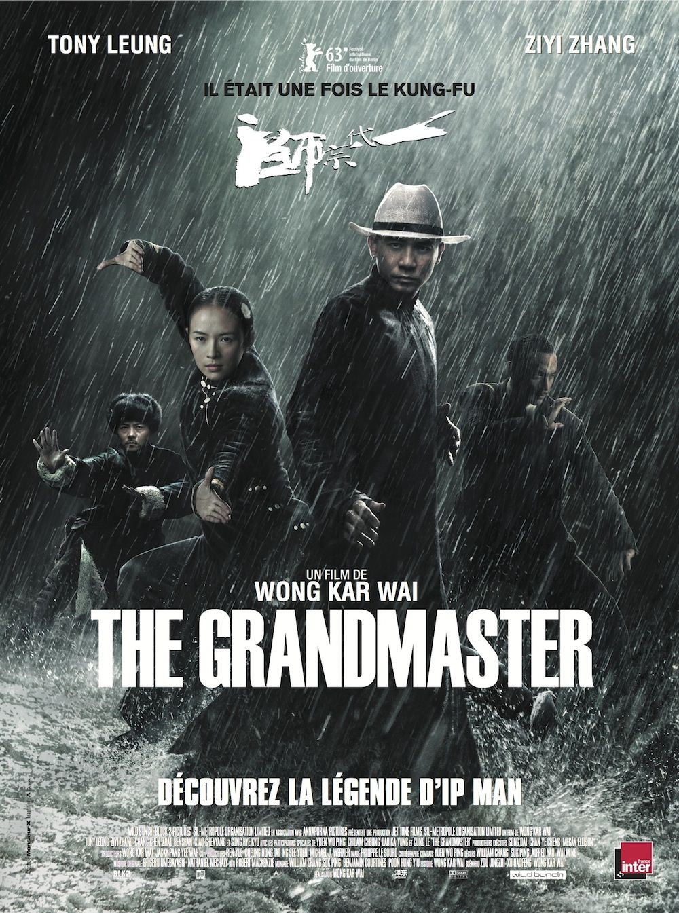
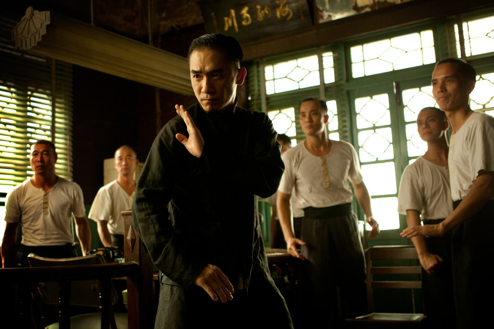
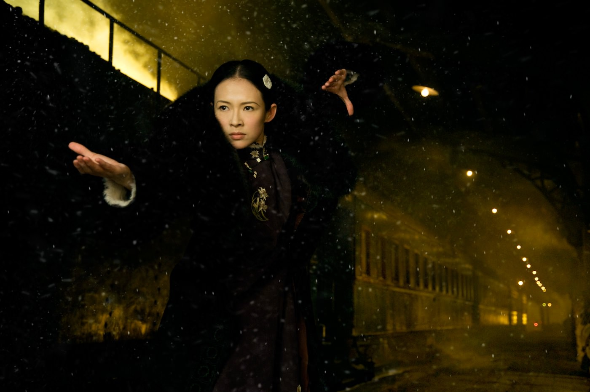

+++
titre = "The Grandmaster, Wong Kar-wai"
title = "The Grandmaster, Wong Kar-wai"
url = "/the-grandmaster-wong-kar-wai"
date = "2013-04-19T09:00:28"
Lastmod = "2013-04-19T18:22:54"
cover = "grandmaster-wong-kar-wai.jpg"
categorie = [ "À voir" ]
tag = [ "Famille", "Histoire", "Histoire vraie", "Kung-fu", "Mafia", "Société", "Vengeance", "Violence" ]
createur = [ "Wong Kar-wai" ]
acteur = [ "Chang Chen", "Qingxiang Wang", "Tony Leung Chiu Wai", "Zhang Ziyi" ]
annee = [ "2013" ]
weight = 2013
pays = [ "Chine", "France", "Hong-Kong" ]
original = "Yut doi jung si"

+++

« <em>Découvrez la légende d’Ip Man</em> » : si ce nom ne vous dit rien, vous ne remarquerez sans doute jamais que la dernière réalisation de Wong Kar-wai est un biopic. En effet, <em>The Grandmaster</em> est censé raconter l’histoire de ce <a href="http://fr.wikipedia.org/wiki/Ip_Man">maître du kung-fu</a> qui a vécu en Chine au début du XXe siècle et qui est célèbre, entre autres, pour avoir enseigné son art à Bruce Lee. C’est un personnage mythique pour tous les amateurs de kung-fu, mais Wong Kar-wai ne réalise absolument pas un biopic traditionnel. L’histoire de cet homme sert de prétexte au cinéaste hongkongais pour composer un film un peu fou et très stylisé. Inclassable, <em>The Grandmaster</em> raconte en partie l’histoire de la chine, mais aussi une histoire d’amour impossible… un film baroque et puissant. 

Trois ans de tournage, des années de préparation, plusieurs mois de tournage pour quelques scènes seulement… la réalisation de <em>The Grandmaster</em> a été pour le moins épique. Le film ouvre sur une séquence qui témoigne bien de l’effort nécessaire à sa réalisation : Wong Kar-wai commence par un impressionnant combat qui oppose Ip-Man à une dizaine d’hommes. Cette séquence assez longue se déroule dans l’obscurité, sous la pluie et d’emblée, c’est le soin esthétique du film qui saute aux yeux. Toute la séquence a été ralentie et ce combat à mains nues explose à l’écran, les chorégraphies signées par Woo-Ping Yuen que l’on avait déjà vu à l’œuvre que ce soit dans <a href="http://voiretmanger.fr/2011/01/02/trilogie-matrix-wachowski/" title="La trilogie Matrix, Andy et Larry Wachowski - À voir et à manger"><em>Matrix</em></a>, <a href="http://voiretmanger.fr/2012/05/12/kill-bill-tarantino/" title="Kill Bill, Quentin Tarantino - À voir et à manger"><em>Kill Bill</em></a> ou encore <em>Tigre et Dragon</em> sont aussi magnifiques que violentes. Le spectateur est projeté dans cet univers et ce premier contact avec le film est d’ailleurs un peu violent, on est vite déboussolé d’autant que Wong Kar-wai ne filme pas cette séquence pour en faciliter la lecture, comme dans les trois films cités précédemment, mais il opte pour une mise en scène qui valorise l’esthétique, quitte à en compliquer la compréhension. <em>The Grandmaster</em> se calme vite passée cette séquence introductive, mais ce choix de commencer avec une telle démonstration de force est significatif des objectifs du cinéaste pour ce projet qui lui tient à cœur depuis des années. 

L’histoire d’Ip-Man a déjà inspiré plusieurs cinéastes, mais ce n’est pas vraiment ce qui intéresse celui de <em>The Grandmaster</em>. Certes, le film se construit autour de l’histoire vraie de ce maître du kung-fu et il se déroule dans un contexte historique bien réel : des années 1930 aux années 1950, il raconte la fin d’une époque avec l’invasion du Japon en 1937 qui signe aussi la fin du kung-fu. Avant cela, on découvre un univers où les maîtres de cet art de combat règnent sur leurs écoles respectives, avec à chaque fois sa spécialité. Celle d’Ip-Man est le Wing Chun et c’est incontestablement le meilleur dans sa catégorie, comme la séquence d’introduction le prouve bien. Face à lui, le Grand maître Boesen est spécialiste d’une autre variante du kung-fu et il veut prendre sa retraite. Lui qui dirige l’Ordre des Arts Martiaux Chinois cherche un successeur et Ip-Man est pressenti comme candidat possible. Il doit prouver sa valeur avec plusieurs combats et c’est à cette occasion qu’il rencontre Gong Er, la fille du Grand maître qui est aussi une combattante hors pair, spécialiste du style Ba Gua et la seule qui connaît une figure mythique. <em>The Grandmaster</em> tisse à partir de cette rencontre une histoire d’amour, mais une histoire impossible dans l’esprit de <em>Roméo et Juliette</em>. Appartenant à deux familles différentes du kung-fu, ils ne peuvent s’aimer ouvertement, et la Guerre sino-japonaise vient de toute façon bouleverser leurs univers. 

Wong Kar-wai filme la fin d’une époque et le passage, pour la Chine, à une modernité. <em>The Grandmaster</em> se ferme sur des images de Hong-Kong dans les années 1950 : la ville est alors devenue une colonie anglaise, les voitures modernes se multiplient et on sent bien qu’une époque s’est terminée. D’ailleurs, si Ip-Man meurt dans les années 1970, le film s’interrompt bien avant, ce qui montre bien que le cinéaste ne s’intéresse pas à la fin de sa vie et encore moins à Bruce Lee qui n’a droit qu’à une citation juste avant le générique, en guise de clin d’œil. Non, ce qui motive le cinéaste, c’est de filmer la chute des maîtres du kung-fu, la fin de leur suprématie : avant l’arrivée des Japonais, ils sont les maîtres incontestés, ils sont invincibles et respectés. Dans l’esprit des mafias, ils sont organisés en clans qui s’opposent autour de variante de leur art, mais ce dernier les réunit aussi tous autour d’une même passion. <em>The Grandmaster</em> ne s’intéresse pas à la guerre proprement dite, évoquée simplement avec quelques images stylisées et des cartons explicatifs, mais le film se poursuit dans les années 1940. Les anciens maîtres sont devenus des hommes comme les autres, des hommes qui luttent pour leur survie. L’un des disciples de Boesen a collaboré avec l’ennemi après avoir trahi son maître et bénéficie d’une bonne position, les autres vivent en donnant des cours dans des écoles un peu miteuses. Ce contexte historique est toutefois relégué au second plan et Wong Kar-wai préfère accorder la première place dans son film à ses personnages. 

Si <em>The Grandmaster</em> n’est pas un biopic, c’est sans doute parce que seul Ip-Man est un personnage historique dans le film. Tous les autres personnages ont été inventés de toute pièce pour les besoins du film, à commencer par Gong Er autour de laquelle l’intrigue amoureuse se construit. De fait, Wong Kar-wai ne s’intéresse pas qu’à un seul homme, bien au contraire : son long-métrage ressemble plutôt à un film choral où plusieurs personnages sont aussi importants. Ip-Man est mis en avant, mais ce n’est pas nécessairement lui qui prend le plus de place à l’écran et Gong Er par exemple est elle aussi très présente, si ce n’est plus. De toute manière, <em>The Grandmaster</em> ne vous apprendra pas grand-chose sur ces personnages, ni même sur le contexte, ce n’est pas un film didactique, bien au contraire. On l’a dit, le cinéaste construit son récit sur un contexte historique qui n’est là que pour donner des repères, mais qui n’est jamais le sujet. Concrètement, cette fresque de deux heures fait la part belle à son histoire d’amour et s’avère, contre toute attente, plus romantique qu’épique ou violente. La sublime photographie, les multiples ralentis et le montage extrêmement travaillé font de la dernière réalisation de Wong Kar-wai une vraie œuvre d’art qui s’apprécie en tant que telle autant — voire peut-être plus — que pour l’histoire racontée. 

C’est sans doute ce qui gênera certains spectateurs : mieux vaut le savoir, <em>The Grandmaster</em> est un film lent, où les combats sont bien présents, certes, mais ne sont pas l’essentiel. Les plans oniriques sont nombreux et on regarde ce travail d’orfèvre comme on regarderait un tableau dans un musée. Le film n’est pas sans défaut, son maniérisme est parfois un petit peu lourd et on sent qu’il a fallu couper plus que de raison pour tenir deux heures seulement, mais Wong Kar-wai finit par tomber juste et toucher. La musique composée par Shigeru Umebayashi participe à cette émotion, mais on n’en dira pas autant des acteurs qui sont peut-être écrasés par le dispositif impressionnant du long-métrage et qui peinent un petit peu à s’imposer. Tony Leung Chiu Wai est malgré tout assez bon dans ce rôle totalement stoïque et son entraînement intensif au kung-fu a payé. À ses côtés ou face à lui, Zhang Ziyi s’en sort correctement, mais il faut bien dire que <em>The Grandmaster</em> ne lui accorde pas tout l’espace nécessaire pour qu’elle en fasse plus. 

À condition d’accepter de se laisser porter par ce film qui paraît un peu confus, de passer outre son maniérisme exacerbé, <em>The Grandmaster</em> se révèle comme une œuvre singulière et passionnante. Souvent magnifique, la dernière réalisation de Wong Kar-wai est moins complexe qu’elle n’y paraît, mais il ne faut pas s’attendre à un biopic traditionnel et encore moins à un film de kung-fu à l’ancienne. C’est un long-métrage poétique, tantôt violent, tantôt émouvant, très stylisé et en même temps touchant. À découvrir…

