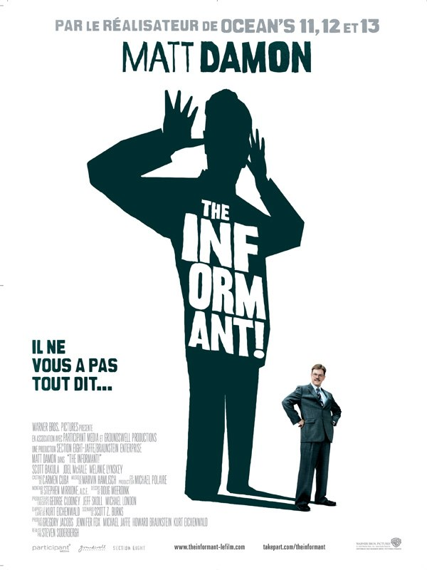
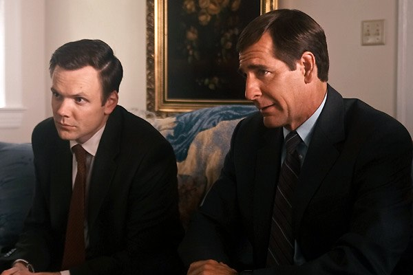

+++
titre = "The Informant, Steven Soderbergh"
title = "The Informant, Steven Soderbergh"
url = "/the-informant-soderbergh"
date = "2009-10-11T01:27:56"
Lastmod = "2010-02-07T12:09:06"
cover = "the-informant.jpg"
categorie = [ "À voir" ]
tag = [ "Capitalisme", "Comédie", "Société" ]
createur = [ "Steven Soderbergh" ]
annee = [ "2009" ]
weight = 2009
pays = [ "États-Unis" ]

+++

<em>The Informant</em>, le dernier film de Soderbergh est en apparence une petite comédie légère sur un gars apparemment incapable de dire la vérité. Mais derrière cette légèreté se cache une dénonciation efficace du capitalisme à outrance. Un film qui, en ces temps de crise, tombe plutôt bien.

<a href="http://www.allocine.fr/film/fichefilm_gen_cfilm=51101.html">

</a>

Mark est un cadre dirigeant haut place dans une entreprise agroalimentaire américaine au début des années 1990. Elle exploité le maïs pour produire les substances que l&rsquo;on retrouve dans tous les produits consommables aujourd&rsquo;hui, entre autres choses. Au début, Mark était un scientifique, un biochimiste, mais de promotion en promotion au sein de l&rsquo;entreprise, il est devenu financier et pourrait être sorti tout droit d&rsquo;une grande école de commerce. Le film commence avec une voix off — on comprend vite qu&rsquo;il s&rsquo;agit en fait de ses pensées — qui nous raconte tout ça et on sent sans peine la fierté poindre. On comprend aussi que cet homme est entièrement obnubilé par son travail, au point de ne parler que de maïs ce qui, reconnaissons-le, doit être rapidement gonflant.

Les affaires marchent cependant mal pour lui dans l&rsquo;entreprise, on apprend qu&rsquo;une très importante production ne démarre pas à cause de problèmes techniques et que l&rsquo;entreprise perd plusieurs millions par mois. Un ultimatum est donné : il faut que la production démarre, sinon… Et un beau matin, Mark débarque dans le bureau de son supérieur pour lui annoncer que si l&rsquo;entreprise a des problèmes, ça n&rsquo;est pas de sa faute, mais de celle des concurrents japonais qui paient un saboteur infiltre. On comprend vite qu&rsquo;il a élaboré un mensonge pour gagner du temps ou se dédouaner, mais c&rsquo;est trop tard, comme le deus ex machina classique, une succession infernale de problèmes va finir par l&rsquo;envoyer en prison, après avoir raconté des mensonges toujours plus énormes et embobinés le FBI et même le gouvernement américain.

Ce qui fait que <em>The Informant</em> est intéressant, c&rsquo;est justement que le film évite le deus ex machina qui dédouanerait Mark de ses torts. Ce dernier est au contraire montré comme le seul responsable de ses mensonges et même la psychanalyse ne lui viendra pas en aide. C&rsquo;est lui, et lui seul, qui invente mensonge sur mensonge, empilant des énormités toujours plus grosses qui trompent jusqu&rsquo;au gouvernement américain, mais aussi et d&rsquo;abord lui-même. L&rsquo;intérêt de la voix off/conscience de Mark est justement de montrer qu&rsquo;il ne sait pas ne pas mentir, que même en pensant il ment en permanence.

La force du film est de ne pas dévoiler tout cela dès les premières images, mais au contraire de patiemment tisser le réseau de mensonges du personnage. De ce fait, les spectateurs sont au même niveau que les interlocuteurs de Mark, ses victimes. Au début, on croit volontiers à sa sincérité, mais le doute s&rsquo;installe peu à peu. Le point d&rsquo;orgue est atteint quand on apprend que toute sa vie (la mort des parents, l&rsquo;adoption qui permet la réussite sociale) n&rsquo;était aussi qu&rsquo;un vaste mensonge initié à l&rsquo;université. On comprend alors que rien, mais rien du tout, n&rsquo;était vrai chez Mark.

Le comique du film vient évidemment du fait que le pouvoir au sens large, représenté ici par le FBI et le gouvernement américain, soit pris au piège. C&rsquo;est certes amusant (voire très drôle quand le FBI reste littéralement bouche bée d&rsquo;apprendre que toute l&rsquo;histoire n&rsquo;est qu&rsquo;une invention), mais c&rsquo;est aussi une dénonciation de ces instances, non pas face à l&rsquo;abus d&rsquo;un homme, mais plus face à l&rsquo;abus d&rsquo;un système qu&rsquo;incarne cet homme. Bon, n&rsquo;allons pas trop loin, Steven Soderbergh n&rsquo;est pas Ken Loach et ici le plaisir de la comédie prime sur tout. Mais quand même, cette énorme firme que l&rsquo;on suppose multinationale est aussi l&rsquo;entreprise de la crise actuelle en germe, celle qui favorise sur tout le reste l&rsquo;actionnariat et la rentabilité à très court terme, celle qui offre des salaires pharamineux payés en partie en pot-de-vin, bref c&rsquo;est l&rsquo;entreprise de la dérégulation. Et si le FBI mord si rapidement à l&rsquo;hameçon, c&rsquo;est sans doute par incompétence, mais aussi parce que cette histoire d&rsquo;entente entre concurrents est tout à fait crédible.

Ainsi, l&rsquo;air de rien, <em>The Informant</em> réussit à divertir tout en glissant une critique toujours (très) implicite du système. Il n&rsquo;en reste pas moins qu&rsquo;il s&rsquo;agit d&rsquo;abord d&rsquo;une comédie qui, à la manière de la série des <em>Oceans</em>, s&rsquo;assume totalement comme telle. La seule star du film est ici Matt Damon, et il est excellent en gars apparemment normal, mais en fait totalement barge. Je suis moins fan de l&rsquo;ambiance <em>seventies</em> qui décale le film par rapport à son contexte et n&rsquo;apporte rien (je veux bien y lire une référence à la crise et donc au début de la fin, mais ça devient tordu).

<em>The Informant</em> est le troisième film de Soderbergh sorti en 2009 et ce ne sera sûrement pas un chef-d&rsquo;œuvre. Néanmoins, j&rsquo;ai trouvé cette comédie fort sympathique, Matt Damon y est très bien, on rigole et en plus le film dit des choses intéressantes, à défaut d&rsquo;être originales sur les dérives du capitalisme débridé.

